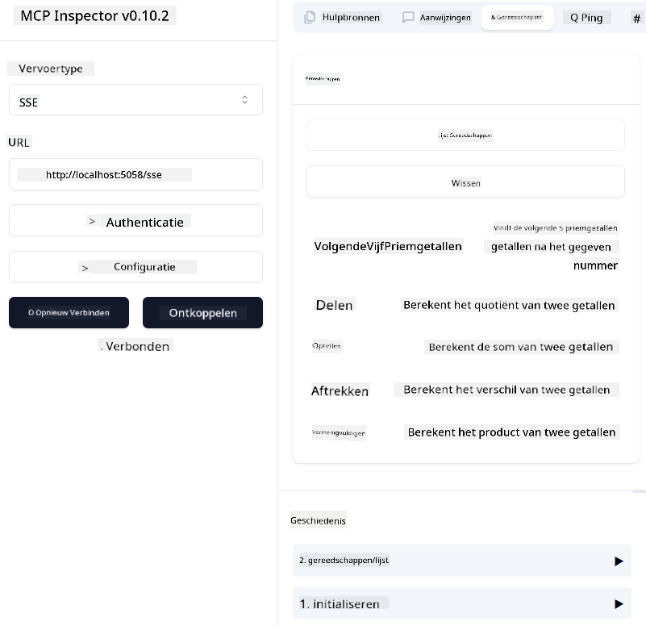
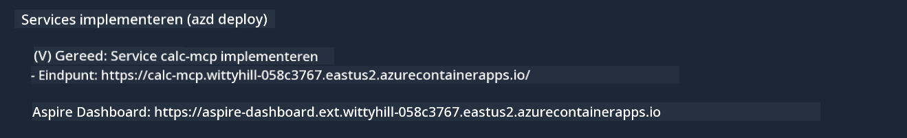

<!--
CO_OP_TRANSLATOR_METADATA:
{
  "original_hash": "5020a3e1a1c7f30c00f9e37f1fa208e3",
  "translation_date": "2025-05-17T14:10:03+00:00",
  "source_file": "04-PracticalImplementation/samples/csharp/README.md",
  "language_code": "nl"
}
-->
# Voorbeeld

Het vorige voorbeeld laat zien hoe je een lokaal .NET-project gebruikt met het type `sdio`. En hoe je de server lokaal in een container draait. Dit is een goede oplossing in veel situaties. Echter, het kan nuttig zijn om de server op afstand te laten draaien, zoals in een cloudomgeving. Hier komt het type `http` van pas.

Als je kijkt naar de oplossing in de map `04-PracticalImplementation`, lijkt het misschien veel complexer dan de vorige. Maar in werkelijkheid is dat niet zo. Als je goed kijkt naar het project `src/mcpserver/mcpserver.csproj`, zul je zien dat het grotendeels dezelfde code is als het vorige voorbeeld. Het enige verschil is dat we een andere bibliotheek `ModelContextProtocol.AspNetCore` gebruiken om de HTTP-verzoeken af te handelen. En we veranderen de methode `IsPrime` om het privé te maken, gewoon om te laten zien dat je privé-methoden in je code kunt hebben. De rest van de code is hetzelfde als voorheen.

De andere projecten zijn van [.NET Aspire](https://learn.microsoft.com/dotnet/aspire/get-started/aspire-overview). Het hebben van .NET Aspire in de oplossing zal de ervaring van de ontwikkelaar verbeteren tijdens het ontwikkelen en testen en helpt bij de zichtbaarheid. Het is niet vereist om de server te draaien, maar het is een goede praktijk om het in je oplossing te hebben.

## Start de server lokaal

1. Open vanuit VS Code (met de C# DevKit-extensie) de oplossing `04-PracticalImplementation\samples\csharp\src\Calculator-chap4.sln`.
2. Druk op `F5` om de server te starten. Er zou een webbrowser moeten openen met het .NET Aspire-dashboard.

of

1. Navigeer vanuit een terminal naar de map `04-PracticalImplementation\samples\csharp\src`
2. Voer het volgende commando uit om de server te starten:
   ```bash
    dotnet run --project .\AppHost
   ```

3. Noteer vanaf het Dashboard de URL `http`. Het zou iets moeten zijn als `http://localhost:5058/`.

## Test `SSE` met de ModelContext Protocol Inspector

Als je Node.js 22.7.5 of hoger hebt, kun je de ModelContext Protocol Inspector gebruiken om je server te testen.

Start de server en voer het volgende commando uit in een terminal:

```bash
npx @modelcontextprotocol/inspector@latest
```



- Selecteer de `SSE` as the Transport type. SSE stand for Server-Sent Events. 
- In the Url field, enter the URL of the server noted earlier,and append `/sse`. Het zou `http` moeten zijn (niet `https`) something like `http://localhost:5058/sse`.
- select the Connect button.

A nice thing about the Inspector is that it provide a nice visibility on what is happening.

- Try listing the availables tools
- Try some of them, it should works just like before.


## Test `SSE` with Github Copilot Chat in VS Code

To use the `SSE` transport with Github Copilot Chat, change the configuration of the `mcp-calc` server die eerder is gemaakt om er zo uit te zien:

```json
"mcp-calc": {
    "type": "sse",
    "url": "http://localhost:5058/sse"
}
```

Doe enkele tests:
- Vraag om de 3 priemgetallen na 6780. Let op hoe Copilot de nieuwe tools `NextFivePrimeNumbers` zal gebruiken en alleen de eerste 3 priemgetallen zal retourneren.
- Vraag om de 7 priemgetallen na 111, om te zien wat er gebeurt.

# De server naar Azure implementeren

Laten we de server naar Azure implementeren zodat meer mensen hem kunnen gebruiken.

Navigeer vanuit een terminal naar de map `04-PracticalImplementation\samples\csharp\src` en voer het volgende commando uit:

```bash
azd init
```

Dit zal een paar bestanden lokaal maken om de configuratie van Azure-resources en je infrastructuur als code (IaC) op te slaan.

Voer vervolgens het volgende commando uit om de server naar Azure te implementeren:

```bash
azd up
```

Zodra de implementatie is voltooid, zou je een bericht moeten zien zoals dit:



Navigeer naar het Aspire-dashboard en noteer de `HTTP` URL om deze te gebruiken in de MCP Inspector en in de Github Copilot Chat.

## Wat nu?

We proberen verschillende transporttypen en testtools en we implementeren ook onze MCP-server naar Azure. Maar wat als onze server toegang moet hebben tot privébronnen? Bijvoorbeeld, een database of een privé-API? In het volgende hoofdstuk zullen we zien hoe we de beveiliging van onze server kunnen verbeteren.

**Disclaimer**:
Dit document is vertaald met behulp van de AI-vertalingsdienst [Co-op Translator](https://github.com/Azure/co-op-translator). Hoewel we ons best doen voor nauwkeurigheid, houd er rekening mee dat geautomatiseerde vertalingen fouten of onnauwkeurigheden kunnen bevatten. Het originele document in zijn oorspronkelijke taal moet worden beschouwd als de gezaghebbende bron. Voor kritieke informatie wordt professionele menselijke vertaling aanbevolen. Wij zijn niet aansprakelijk voor eventuele misverstanden of misinterpretaties die voortvloeien uit het gebruik van deze vertaling.