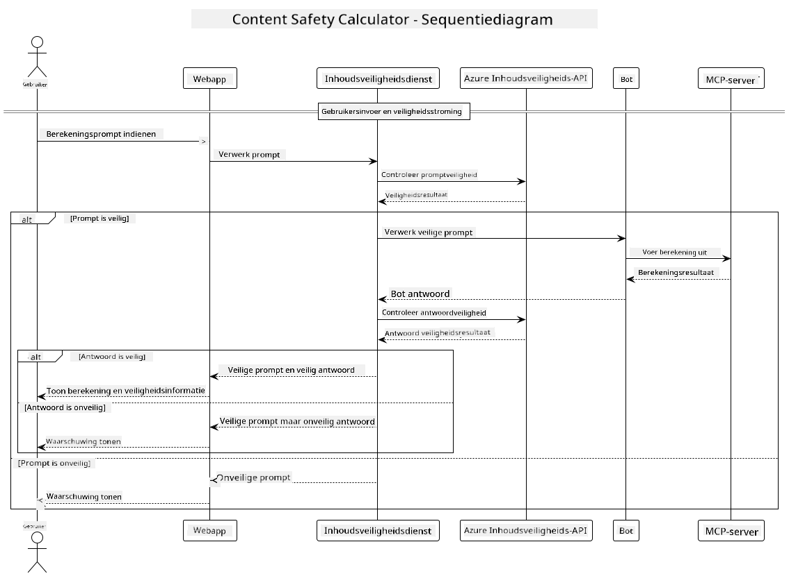

<!--
CO_OP_TRANSLATOR_METADATA:
{
  "original_hash": "e5ea5e7582f70008ea9bec3b3820f20a",
  "translation_date": "2025-05-17T14:28:37+00:00",
  "source_file": "04-PracticalImplementation/samples/java/containerapp/README.md",
  "language_code": "nl"
}
-->
## Systeemarchitectuur

Dit project demonstreert een webapplicatie die contentveiligheidscontrole gebruikt voordat gebruikersaanwijzingen naar een calculatorservice worden gestuurd via Model Context Protocol (MCP).



### Hoe Het Werkt

1. **Gebruikersinvoer**: De gebruiker voert een berekeningsaanwijzing in via de webinterface.
2. **Contentveiligheidsscreening (Invoer)**: De aanwijzing wordt geanalyseerd door de Azure Content Safety API.
3. **Veiligheidsbeslissing (Invoer)**:
   - Als de inhoud veilig is (ernst < 2 in alle categorieën), gaat het door naar de calculator.
   - Als de inhoud als potentieel schadelijk wordt aangemerkt, stopt het proces en wordt er een waarschuwing teruggegeven.
4. **Calculatorintegratie**: Veilige inhoud wordt verwerkt door LangChain4j, dat communiceert met de MCP-calculatorserver.
5. **Contentveiligheidsscreening (Uitvoer)**: De reactie van de bot wordt geanalyseerd door de Azure Content Safety API.
6. **Veiligheidsbeslissing (Uitvoer)**:
   - Als de reactie van de bot veilig is, wordt deze aan de gebruiker getoond.
   - Als de reactie van de bot als potentieel schadelijk wordt aangemerkt, wordt deze vervangen door een waarschuwing.
7. **Reactie**: Resultaten (als ze veilig zijn) worden aan de gebruiker getoond, samen met beide veiligheidsanalyses.

## Gebruik van Model Context Protocol (MCP) met Calculator Services

Dit project demonstreert hoe Model Context Protocol (MCP) kan worden gebruikt om calculator MCP-services aan te roepen vanuit LangChain4j. De implementatie gebruikt een lokale MCP-server die draait op poort 8080 om rekenkundige bewerkingen te bieden.

### Instellen van Azure Content Safety Service

Voordat je de contentveiligheidsfuncties gebruikt, moet je een Azure Content Safety servicebron maken:

1. Log in op het [Azure Portal](https://portal.azure.com)
2. Klik op "Een resource maken" en zoek naar "Content Safety"
3. Selecteer "Content Safety" en klik op "Maken"
4. Voer een unieke naam in voor je resource
5. Selecteer je abonnement en resourcegroep (of maak een nieuwe)
6. Kies een ondersteunde regio (bekijk [Beschikbaarheid regio](https://azure.microsoft.com/en-us/global-infrastructure/services/?products=cognitive-services) voor details)
7. Selecteer een geschikt prijsniveau
8. Klik op "Maken" om de resource te implementeren
9. Zodra de implementatie voltooid is, klik op "Ga naar resource"
10. In het linker paneel, onder "Resourcebeheer", selecteer "Sleutels en Eindpunt"
11. Kopieer een van de sleutels en de eindpunt-URL voor gebruik in de volgende stap

### Configureren van Omgevingsvariabelen

Stel de `GITHUB_TOKEN` omgevingsvariabele in voor GitHub modellen authenticatie:
```sh
export GITHUB_TOKEN=<your_github_token>
```

Voor contentveiligheidsfuncties, stel in:
```sh
export CONTENT_SAFETY_ENDPOINT=<your_content_safety_endpoint>
export CONTENT_SAFETY_KEY=<your_content_safety_key>
```

Deze omgevingsvariabelen worden door de applicatie gebruikt om te authenticeren bij de Azure Content Safety service. Als deze variabelen niet zijn ingesteld, zal de applicatie placeholderwaarden gebruiken voor demonstratiedoeleinden, maar de contentveiligheidsfuncties zullen niet goed werken.

### Starten van de Calculator MCP Server

Voordat je de client uitvoert, moet je de calculator MCP-server in SSE-modus starten op localhost:8080.

## Projectbeschrijving

Dit project demonstreert de integratie van Model Context Protocol (MCP) met LangChain4j om calculatorservices aan te roepen. Belangrijke kenmerken zijn:

- Gebruik van MCP om verbinding te maken met een calculatorservice voor basiswiskundige bewerkingen
- Tweelaagse contentveiligheidscontrole op zowel gebruikersaanwijzingen als botreacties
- Integratie met GitHub's gpt-4.1-nano model via LangChain4j
- Gebruik van Server-Sent Events (SSE) voor MCP-transport

## Integratie van Contentveiligheid

Het project omvat uitgebreide contentveiligheidsfuncties om ervoor te zorgen dat zowel gebruikersinvoer als systeemreacties vrij zijn van schadelijke inhoud:

1. **Invoerscreening**: Alle gebruikersaanwijzingen worden geanalyseerd op schadelijke inhoudscategorieën zoals haatzaaiende uitlatingen, geweld, zelfbeschadiging en seksuele inhoud voordat ze worden verwerkt.

2. **Uitvoerscreening**: Zelfs bij gebruik van potentieel ongecensureerde modellen controleert het systeem alle gegenereerde reacties via dezelfde contentveiligheidsfilters voordat ze aan de gebruiker worden getoond.

Deze tweelaagse aanpak zorgt ervoor dat het systeem veilig blijft, ongeacht welk AI-model wordt gebruikt, en beschermt gebruikers tegen zowel schadelijke invoer als potentieel problematische AI-gegenereerde uitvoer.

## Webclient

De applicatie bevat een gebruiksvriendelijke webinterface waarmee gebruikers kunnen communiceren met het Content Safety Calculator-systeem:

### Kenmerken van de Webinterface

- Eenvoudig, intuïtief formulier voor het invoeren van berekeningsaanwijzingen
- Tweelaagse contentveiligheidsvalidatie (invoer en uitvoer)
- Feedback in real-time over de veiligheid van aanwijzing en reactie
- Veiligheidsindicatoren met kleurcodering voor eenvoudige interpretatie
- Schone, responsieve ontwerp dat werkt op verschillende apparaten
- Voorbeeld van veilige aanwijzingen om gebruikers te begeleiden

### Gebruik van de Webclient

1. Start de applicatie:
   ```sh
   mvn spring-boot:run
   ```

2. Open je browser en navigeer naar `http://localhost:8087`

3. Voer een berekeningsaanwijzing in het verstrekte tekstvak in (bijv. "Bereken de som van 24,5 en 17,3")

4. Klik op "Verzenden" om je verzoek te verwerken

5. Bekijk de resultaten, die het volgende bevatten:
   - Contentveiligheidsanalyse van je aanwijzing
   - Het berekende resultaat (als de aanwijzing veilig was)
   - Contentveiligheidsanalyse van de reactie van de bot
   - Eventuele veiligheidswaarschuwingen als de invoer of uitvoer werd aangemerkt

De webclient behandelt automatisch beide processen van contentveiligheidsverificatie, waardoor alle interacties veilig en geschikt blijven, ongeacht welk AI-model wordt gebruikt.

**Disclaimer**:  
Dit document is vertaald met behulp van de AI-vertalingsservice [Co-op Translator](https://github.com/Azure/co-op-translator). Hoewel we ons best doen voor nauwkeurigheid, dient u zich ervan bewust te zijn dat geautomatiseerde vertalingen fouten of onnauwkeurigheden kunnen bevatten. Het originele document in zijn oorspronkelijke taal moet worden beschouwd als de gezaghebbende bron. Voor cruciale informatie wordt professionele menselijke vertaling aanbevolen. Wij zijn niet aansprakelijk voor eventuele misverstanden of misinterpretaties die voortvloeien uit het gebruik van deze vertaling.