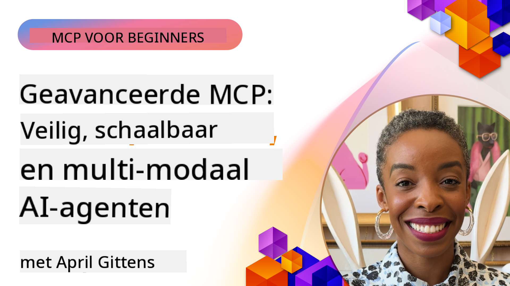

<!--
CO_OP_TRANSLATOR_METADATA:
{
  "original_hash": "d204bc94ea6027d06a703b21b711ca57",
  "translation_date": "2025-08-18T16:28:50+00:00",
  "source_file": "05-AdvancedTopics/README.md",
  "language_code": "nl"
}
-->
# Geavanceerde Onderwerpen in MCP

_(Klik op de afbeelding hierboven om de video van deze les te bekijken)_

Dit hoofdstuk behandelt een reeks geavanceerde onderwerpen in de implementatie van Model Context Protocol (MCP), waaronder multi-modale integratie, schaalbaarheid, beveiligingsrichtlijnen en integratie in bedrijfsomgevingen. Deze onderwerpen zijn cruciaal voor het bouwen van robuuste en productieklare MCP-toepassingen die voldoen aan de eisen van moderne AI-systemen.

## Overzicht

Deze les verkent geavanceerde concepten in de implementatie van Model Context Protocol, met de nadruk op multi-modale integratie, schaalbaarheid, beveiligingsrichtlijnen en integratie in bedrijfsomgevingen. Deze onderwerpen zijn essentieel voor het bouwen van productieklare MCP-toepassingen die complexe vereisten in bedrijfsomgevingen aankunnen.

## Leerdoelen

Aan het einde van deze les kun je:

- Multi-modale mogelijkheden implementeren binnen MCP-frameworks
- Schaalbare MCP-architecturen ontwerpen voor scenario's met hoge vraag
- Beveiligingsrichtlijnen toepassen die aansluiten bij de beveiligingsprincipes van MCP
- MCP integreren met bedrijfs-AI-systemen en frameworks
- Prestaties en betrouwbaarheid optimaliseren in productieomgevingen

## Lessen en voorbeeldprojecten

| Link | Titel | Beschrijving |
|------|-------|-------------|
| [5.1 Integratie met Azure](./mcp-integration/README.md) | Integreren met Azure | Leer hoe je je MCP-server op Azure kunt integreren |
| [5.2 Multi-modale voorbeelden](./mcp-multi-modality/README.md) | MCP Multi-modale voorbeelden | Voorbeelden voor audio, beeld en multi-modale respons |
| [5.3 MCP OAuth2 voorbeeld](../../../05-AdvancedTopics/mcp-oauth2-demo) | MCP OAuth2 Demo | Minimale Spring Boot-app die OAuth2 met MCP toont, zowel als autorisatie- en resource-server. Demonstreert veilige tokenuitgifte, beveiligde eindpunten, Azure Container Apps-implementatie en API Management-integratie. |
| [5.4 Root Contexts](./mcp-root-contexts/README.md) | Root Contexts | Leer meer over root contexts en hoe je ze implementeert |
| [5.5 Routing](./mcp-routing/README.md) | Routing | Leer verschillende soorten routing |
| [5.6 Sampling](./mcp-sampling/README.md) | Sampling | Leer hoe je met sampling werkt |
| [5.7 Schalen](./mcp-scaling/README.md) | Schalen | Leer meer over schalen |
| [5.8 Beveiliging](./mcp-security/README.md) | Beveiliging | Beveilig je MCP-server |
| [5.9 Web Search voorbeeld](./web-search-mcp/README.md) | Web Search MCP | Python MCP-server en -client die integreren met SerpAPI voor realtime web-, nieuws-, productzoekopdrachten en Q&A. Demonstreert multi-tool orkestratie, externe API-integratie en robuuste foutafhandeling. |
| [5.10 Realtime Streaming](./mcp-realtimestreaming/README.md) | Streaming | Realtime datastreaming is essentieel geworden in de huidige datagestuurde wereld, waar bedrijven en toepassingen onmiddellijke toegang tot informatie nodig hebben om tijdige beslissingen te nemen. |
| [5.11 Realtime Web Search](./mcp-realtimesearch/README.md) | Web Search | Realtime webzoekopdrachten laten zien hoe MCP realtime webzoekopdrachten transformeert door een gestandaardiseerde aanpak te bieden voor contextbeheer tussen AI-modellen, zoekmachines en toepassingen. |
| [5.12 Entra ID Authenticatie voor Model Context Protocol Servers](./mcp-security-entra/README.md) | Entra ID Authenticatie | Microsoft Entra ID biedt een robuuste cloudgebaseerde oplossing voor identiteits- en toegangsbeheer, die ervoor zorgt dat alleen geautoriseerde gebruikers en toepassingen met je MCP-server kunnen communiceren. |
| [5.13 Azure AI Foundry Agent Integratie](./mcp-foundry-agent-integration/README.md) | Azure AI Foundry Integratie | Leer hoe je Model Context Protocol-servers integreert met Azure AI Foundry-agenten, waardoor krachtige toolorkestratie en bedrijfs-AI-mogelijkheden mogelijk worden met gestandaardiseerde externe gegevensbronverbindingen. |
| [5.14 Context Engineering](./mcp-contextengineering/README.md) | Context Engineering | De toekomstige mogelijkheden van contextengineeringtechnieken voor MCP-servers, waaronder contextoptimalisatie, dynamisch contextbeheer en strategieën voor effectieve promptengineering binnen MCP-frameworks. |

## Aanvullende Referenties

Voor de meest actuele informatie over geavanceerde MCP-onderwerpen, raadpleeg:
- [MCP Documentatie](https://modelcontextprotocol.io/)
- [MCP Specificatie](https://spec.modelcontextprotocol.io/)
- [GitHub Repository](https://github.com/modelcontextprotocol)

## Belangrijke Punten

- Multi-modale MCP-implementaties breiden AI-mogelijkheden uit voorbij tekstverwerking
- Schaalbaarheid is essentieel voor bedrijfsimplementaties en kan worden aangepakt via horizontaal en verticaal schalen
- Uitgebreide beveiligingsmaatregelen beschermen gegevens en zorgen voor correcte toegangscontrole
- Integratie met platforms zoals Azure OpenAI en Microsoft AI Foundry versterkt MCP-mogelijkheden
- Geavanceerde MCP-implementaties profiteren van geoptimaliseerde architecturen en zorgvuldig resourcebeheer

## Oefening

Ontwerp een MCP-implementatie van bedrijfsniveau voor een specifieke use case:

1. Identificeer multi-modale vereisten voor je use case
2. Schets de beveiligingsmaatregelen die nodig zijn om gevoelige gegevens te beschermen
3. Ontwerp een schaalbare architectuur die variabele belasting aankan
4. Plan integratiepunten met bedrijfs-AI-systemen
5. Documenteer mogelijke prestatieknelpunten en strategieën om deze te mitigeren

## Aanvullende Bronnen

- [Azure OpenAI Documentatie](https://learn.microsoft.com/en-us/azure/ai-services/openai/)
- [Microsoft AI Foundry Documentatie](https://learn.microsoft.com/en-us/ai-services/)

---

## Wat komt hierna

- [5.1 MCP Integratie](./mcp-integration/README.md)

**Disclaimer**:  
Dit document is vertaald met behulp van de AI-vertalingsservice [Co-op Translator](https://github.com/Azure/co-op-translator). Hoewel we streven naar nauwkeurigheid, dient u zich ervan bewust te zijn dat geautomatiseerde vertalingen fouten of onnauwkeurigheden kunnen bevatten. Het originele document in de oorspronkelijke taal moet worden beschouwd als de gezaghebbende bron. Voor kritieke informatie wordt professionele menselijke vertaling aanbevolen. Wij zijn niet aansprakelijk voor misverstanden of verkeerde interpretaties die voortvloeien uit het gebruik van deze vertaling.