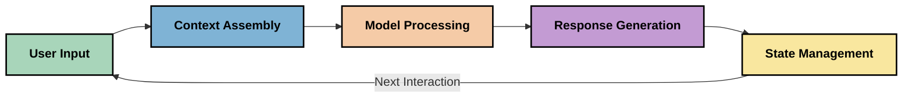
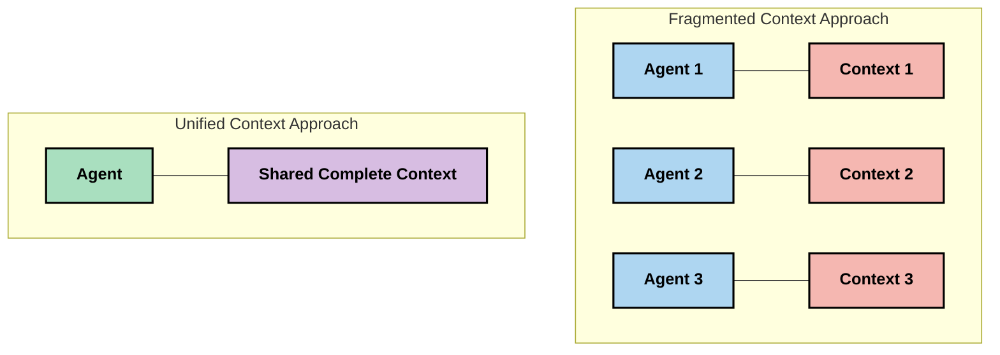
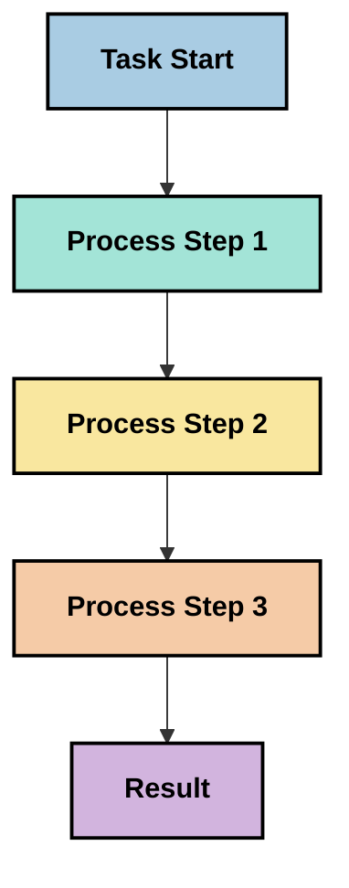
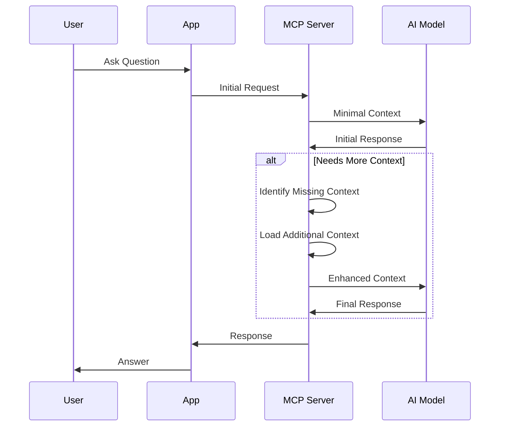
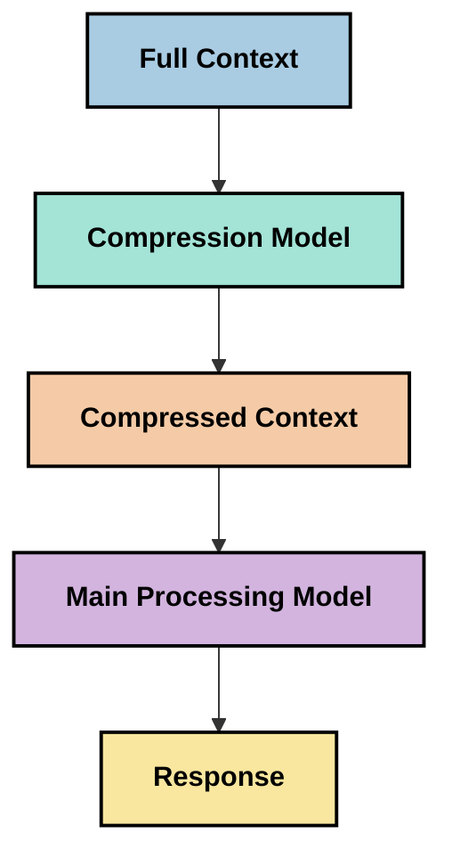
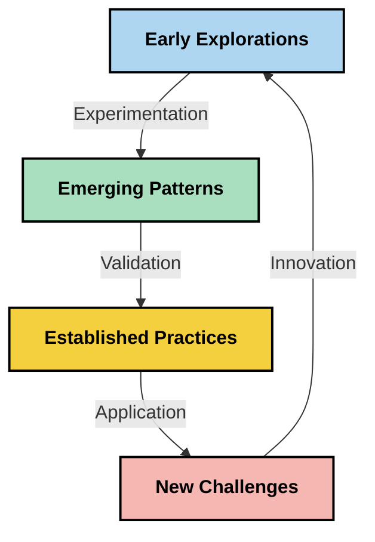

<!--
CO_OP_TRANSLATOR_METADATA:
{
  "original_hash": "fd169ca3071b81b5ee282e194bc823df",
  "translation_date": "2025-09-15T20:41:45+00:00",
  "source_file": "05-AdvancedTopics/mcp-contextengineering/README.md",
  "language_code": "nl"
}
-->
# Context Engineering: Een Opkomend Concept in het MCP-ecosysteem

## Overzicht

Context engineering is een opkomend concept binnen de AI-wereld dat onderzoekt hoe informatie wordt gestructureerd, geleverd en onderhouden tijdens interacties tussen klanten en AI-diensten. Naarmate het Model Context Protocol (MCP)-ecosysteem zich ontwikkelt, wordt het steeds belangrijker om te begrijpen hoe context effectief kan worden beheerd. Deze module introduceert het concept van context engineering en verkent de mogelijke toepassingen ervan in MCP-implementaties.

## Leerdoelen

Aan het einde van deze module kun je:

- Het opkomende concept van context engineering begrijpen en de mogelijke rol ervan in MCP-toepassingen identificeren
- Belangrijke uitdagingen in contextbeheer herkennen die door het MCP-protocolontwerp worden aangepakt
- Technieken verkennen om de prestaties van modellen te verbeteren door beter contextbeheer
- Benaderingen overwegen om de effectiviteit van context te meten en te evalueren
- Deze opkomende concepten toepassen om AI-ervaringen te verbeteren via het MCP-framework

## Introductie tot Context Engineering

Context engineering richt zich op het doelbewust ontwerpen en beheren van de informatiestroom tussen gebruikers, applicaties en AI-modellen. In tegenstelling tot gevestigde gebieden zoals prompt engineering, wordt context engineering nog steeds gedefinieerd door beoefenaars die werken aan het oplossen van de unieke uitdagingen van het voorzien van AI-modellen van de juiste informatie op het juiste moment.

Naarmate grote taalmodellen (LLMs) zich hebben ontwikkeld, is het belang van context steeds duidelijker geworden. De kwaliteit, relevantie en structuur van de context die we bieden, hebben directe invloed op de output van modellen. Context engineering onderzoekt deze relatie en streeft naar het ontwikkelen van principes voor effectief contextbeheer.

> "In 2025 zijn de modellen extreem intelligent. Maar zelfs de slimste mens kan zijn werk niet effectief doen zonder de context van wat hem wordt gevraagd... 'Context engineering' is het volgende niveau van prompt engineering. Het gaat erom dit automatisch te doen in een dynamisch systeem." — Walden Yan, Cognition AI

Context engineering kan omvatten:

1. **Contextselectie**: Bepalen welke informatie relevant is voor een bepaalde taak
2. **Contextstructurering**: Informatie organiseren om de modelbegrip te maximaliseren
3. **Contextlevering**: Optimaliseren hoe en wanneer informatie naar modellen wordt gestuurd
4. **Contextonderhoud**: Beheren van de staat en evolutie van context in de tijd
5. **Contextevaluatie**: Meten en verbeteren van de effectiviteit van context

Deze aandachtsgebieden zijn bijzonder relevant voor het MCP-ecosysteem, dat een gestandaardiseerde manier biedt voor applicaties om context te leveren aan LLMs.

## Het Perspectief van de Contextreis

Een manier om context engineering te visualiseren is door de reis te volgen die informatie aflegt binnen een MCP-systeem:



### Belangrijke Stadia in de Contextreis:

1. **Gebruikersinvoer**: Ruwe informatie van de gebruiker (tekst, afbeeldingen, documenten)
2. **Contextassemblage**: Het combineren van gebruikersinvoer met systeemcontext, gespreksgeschiedenis en andere opgehaalde informatie
3. **Modelverwerking**: Het AI-model verwerkt de samengestelde context
4. **Responsgeneratie**: Het model produceert output op basis van de verstrekte context
5. **Staatbeheer**: Het systeem werkt zijn interne staat bij op basis van de interactie

Dit perspectief benadrukt de dynamische aard van context in AI-systemen en roept belangrijke vragen op over hoe informatie het beste kan worden beheerd in elk stadium.

## Opkomende Principes in Context Engineering

Naarmate het veld van context engineering vorm krijgt, beginnen enkele vroege principes naar voren te komen uit de praktijk. Deze principes kunnen helpen bij het informeren van MCP-implementatiekeuzes:

### Principe 1: Deel Context Volledig

Context moet volledig worden gedeeld tussen alle componenten van een systeem in plaats van gefragmenteerd te zijn over meerdere agents of processen. Wanneer context wordt verdeeld, kunnen beslissingen die in één deel van het systeem worden genomen conflicteren met die elders.



In MCP-toepassingen suggereert dit het ontwerpen van systemen waarin context naadloos door de hele pijplijn stroomt in plaats van te worden opgesplitst.

### Principe 2: Erken Dat Acties Impliciete Beslissingen Bevatten

Elke actie die een model onderneemt, bevat impliciete beslissingen over hoe de context moet worden geïnterpreteerd. Wanneer meerdere componenten handelen op verschillende contexten, kunnen deze impliciete beslissingen conflicteren, wat leidt tot inconsistente resultaten.

Dit principe heeft belangrijke implicaties voor MCP-toepassingen:
- Geef de voorkeur aan lineaire verwerking van complexe taken boven parallelle uitvoering met gefragmenteerde context
- Zorg ervoor dat alle beslissingspunten toegang hebben tot dezelfde contextinformatie
- Ontwerp systemen waarin latere stappen de volledige context van eerdere beslissingen kunnen zien

### Principe 3: Balans Contextdiepte met Vensterbeperkingen

Naarmate gesprekken en processen langer worden, raken contextvensters uiteindelijk vol. Effectieve context engineering onderzoekt benaderingen om deze spanning tussen uitgebreide context en technische beperkingen te beheren.

Mogelijke benaderingen die worden verkend zijn:
- Contextcompressie die essentiële informatie behoudt terwijl het tokengebruik wordt verminderd
- Progressieve contextladen op basis van relevantie voor huidige behoeften
- Samenvatting van eerdere interacties terwijl belangrijke beslissingen en feiten worden behouden

## Contextuitdagingen en MCP Protocolontwerp

Het Model Context Protocol (MCP) is ontworpen met een bewustzijn van de unieke uitdagingen van contextbeheer. Het begrijpen van deze uitdagingen helpt bij het verklaren van belangrijke aspecten van het MCP-protocolontwerp:

### Uitdaging 1: Beperkingen van Contextvensters
De meeste AI-modellen hebben vaste contextvenstergroottes, wat beperkt hoeveel informatie ze tegelijkertijd kunnen verwerken.

**MCP Ontwerpreactie:** 
- Het protocol ondersteunt gestructureerde, resource-gebaseerde context die efficiënt kan worden geraadpleegd
- Resources kunnen worden gepagineerd en progressief worden geladen

### Uitdaging 2: Relevantiebepaling
Bepalen welke informatie het meest relevant is om in de context op te nemen, is moeilijk.

**MCP Ontwerpreactie:**
- Flexibele tools maken dynamisch ophalen van informatie mogelijk op basis van behoefte
- Gestructureerde prompts zorgen voor consistente contextorganisatie

### Uitdaging 3: Contextpersistentie
Het beheren van de staat over interacties heen vereist zorgvuldig bijhouden van context.

**MCP Ontwerpreactie:**
- Gestandaardiseerd sessiebeheer
- Duidelijk gedefinieerde interactiepatronen voor contextevolutie

### Uitdaging 4: Multi-Modale Context
Verschillende soorten gegevens (tekst, afbeeldingen, gestructureerde gegevens) vereisen verschillende verwerking.

**MCP Ontwerpreactie:**
- Protocolontwerp ondersteunt verschillende inhoudstypen
- Gestandaardiseerde representatie van multi-modale informatie

### Uitdaging 5: Veiligheid en Privacy
Context bevat vaak gevoelige informatie die moet worden beschermd.

**MCP Ontwerpreactie:**
- Duidelijke grenzen tussen verantwoordelijkheden van client en server
- Lokale verwerkingsopties om gegevensblootstelling te minimaliseren

Het begrijpen van deze uitdagingen en hoe MCP ze aanpakt, biedt een basis voor het verkennen van meer geavanceerde technieken voor context engineering.

## Opkomende Benaderingen in Context Engineering

Naarmate het veld van context engineering zich ontwikkelt, komen verschillende veelbelovende benaderingen naar voren. Deze vertegenwoordigen huidige inzichten in plaats van gevestigde best practices en zullen waarschijnlijk evolueren naarmate we meer ervaring opdoen met MCP-implementaties.

### 1. Single-Threaded Lineaire Verwerking

In tegenstelling tot multi-agent architecturen die context verdelen, ontdekken sommige beoefenaars dat single-threaded lineaire verwerking consistentere resultaten oplevert. Dit sluit aan bij het principe van het behouden van eenheid in context.



Hoewel deze aanpak minder efficiënt lijkt dan parallelle verwerking, levert het vaak meer samenhangende en betrouwbare resultaten op omdat elke stap voortbouwt op een volledig begrip van eerdere beslissingen.

### 2. Context Chunking en Prioritering

Grote contexten opdelen in beheersbare stukken en prioriteit geven aan wat het belangrijkst is.

```python
# Conceptual Example: Context Chunking and Prioritization
def process_with_chunked_context(documents, query):
    # 1. Break documents into smaller chunks
    chunks = chunk_documents(documents)
    
    # 2. Calculate relevance scores for each chunk
    scored_chunks = [(chunk, calculate_relevance(chunk, query)) for chunk in chunks]
    
    # 3. Sort chunks by relevance score
    sorted_chunks = sorted(scored_chunks, key=lambda x: x[1], reverse=True)
    
    # 4. Use the most relevant chunks as context
    context = create_context_from_chunks([chunk for chunk, score in sorted_chunks[:5]])
    
    # 5. Process with the prioritized context
    return generate_response(context, query)
```

Het bovenstaande concept illustreert hoe we grote documenten kunnen opdelen in beheersbare stukken en alleen de meest relevante delen voor context kunnen selecteren. Deze aanpak kan helpen om binnen de beperkingen van contextvensters te werken terwijl toch gebruik wordt gemaakt van grote kennisbases.

### 3. Progressieve Contextladen

Context progressief laden wanneer nodig in plaats van alles in één keer.



Progressieve contextladen begint met minimale context en breidt alleen uit wanneer nodig. Dit kan het tokengebruik aanzienlijk verminderen voor eenvoudige vragen terwijl de mogelijkheid behouden blijft om complexe vragen aan te pakken.

### 4. Contextcompressie en Samenvatting

Context verkleinen terwijl essentiële informatie behouden blijft.



Contextcompressie richt zich op:
- Het verwijderen van redundante informatie
- Het samenvatten van lange inhoud
- Het extraheren van belangrijke feiten en details
- Het behouden van kritieke contextelementen
- Het optimaliseren voor tokenefficiëntie

Deze aanpak kan bijzonder waardevol zijn voor het behouden van lange gesprekken binnen contextvensters of voor het efficiënt verwerken van grote documenten. Sommige beoefenaars gebruiken gespecialiseerde modellen specifiek voor contextcompressie en samenvatting van gespreksgeschiedenis.

## Verkennende Overwegingen in Context Engineering

Bij het verkennen van het opkomende veld van context engineering zijn er verschillende overwegingen die de moeite waard zijn om in gedachten te houden bij het werken met MCP-implementaties. Dit zijn geen voorschrijvende best practices, maar eerder gebieden van verkenning die verbeteringen kunnen opleveren voor jouw specifieke gebruikssituatie.

### Overweeg Je Contextdoelen

Voordat je complexe oplossingen voor contextbeheer implementeert, formuleer duidelijk wat je probeert te bereiken:
- Welke specifieke informatie heeft het model nodig om succesvol te zijn?
- Welke informatie is essentieel versus aanvullend?
- Wat zijn je prestatiebeperkingen (latentie, tokenlimieten, kosten)?

### Verken Gelaagde Contextbenaderingen

Sommige beoefenaars hebben succes met context die is gerangschikt in conceptuele lagen:
- **Kernlaag**: Essentiële informatie die het model altijd nodig heeft
- **Situationele Laag**: Context specifiek voor de huidige interactie
- **Ondersteunende Laag**: Aanvullende informatie die nuttig kan zijn
- **Fallback Laag**: Informatie die alleen wordt geraadpleegd wanneer nodig

### Onderzoek Retrievalstrategieën

De effectiviteit van je context hangt vaak af van hoe je informatie ophaalt:
- Semantische zoekopdrachten en embeddings om conceptueel relevante informatie te vinden
- Zoekopdrachten op basis van trefwoorden voor specifieke feitelijke details
- Hybride benaderingen die meerdere retrievalmethoden combineren
- Metadatafiltering om de scope te verkleinen op basis van categorieën, datums of bronnen

### Experimenteer met Contextcoherentie

De structuur en stroom van je context kunnen modelbegrip beïnvloeden:
- Gerelateerde informatie bij elkaar groeperen
- Consistente opmaak en organisatie gebruiken
- Logische of chronologische ordening behouden waar passend
- Tegenstrijdige informatie vermijden

### Weeg de Afwegingen van Multi-Agent Architecturen

Hoewel multi-agent architecturen populair zijn in veel AI-frameworks, brengen ze aanzienlijke uitdagingen met zich mee voor contextbeheer:
- Contextfragmentatie kan leiden tot inconsistente beslissingen tussen agents
- Parallelle verwerking kan conflicten introduceren die moeilijk te verzoenen zijn
- Communicatieoverhead tussen agents kan prestatievoordelen tenietdoen
- Complex staatbeheer is vereist om samenhang te behouden

In veel gevallen kan een single-agent aanpak met uitgebreid contextbeheer betrouwbaardere resultaten opleveren dan meerdere gespecialiseerde agents met gefragmenteerde context.

### Ontwikkel Evaluatiemethoden

Om context engineering in de loop van de tijd te verbeteren, overweeg hoe je succes zult meten:
- A/B-testen van verschillende contextstructuren
- Monitoring van tokengebruik en responstijden
- Bijhouden van gebruikerstevredenheid en taakvoltooiingspercentages
- Analyseren wanneer en waarom contextstrategieën falen

Deze overwegingen vertegenwoordigen actieve gebieden van verkenning in de context engineering ruimte. Naarmate het veld volwassen wordt, zullen waarschijnlijk meer definitieve patronen en praktijken ontstaan.

## Meten van Contexteffectiviteit: Een Evoluerend Framework

Naarmate context engineering opkomt als een concept, beginnen beoefenaars te onderzoeken hoe we de effectiviteit ervan kunnen meten. Er bestaat nog geen vastgesteld framework, maar verschillende metrics worden overwogen die kunnen helpen toekomstige werkzaamheden te sturen.

### Potentiële Meetdimensies

#### 1. Overwegingen over Inputefficiëntie

- **Context-tot-Responsverhouding**: Hoeveel context is nodig in verhouding tot de grootte van de respons?
- **Tokenbenutting**: Welk percentage van de verstrekte contexttokens lijkt invloed te hebben op de respons?
- **Contextreductie**: Hoe effectief kunnen we ruwe informatie comprimeren?

#### 2. Prestatieoverwegingen

- **Latentie-impact**: Hoe beïnvloedt contextbeheer de responstijd?
- **Tokeneconomie**: Optimaliseren we het tokengebruik effectief?
- **Retrievalprecisie**: Hoe relevant is de opgehaalde informatie?
- **Resourcebenutting**: Welke computermiddelen zijn vereist?

#### 3. Kwaliteitsoverwegingen

- **Responsrelevantie**: Hoe goed behandelt de respons de vraag?
- **Feitelijke nauwkeurigheid**: Verbetert contextbeheer de feitelijke juistheid?
- **Consistentie**: Zijn responsen consistent over vergelijkbare vragen?
- **Hallucinatiepercentage**: Vermindert betere context modelhallucinaties?

#### 4. Gebruikerservaringsoverwegingen

- **Follow-uppercentage**: Hoe vaak hebben gebruikers verduidelijking nodig?
- **Taakvoltooiing**: Slagen gebruikers erin hun doelen te bereiken?
- **Tevredenheidsindicatoren**: Hoe beoordelen gebruikers hun ervaring?

### Verkennende Benaderingen voor Meting

Bij het experimenteren met context engineering in MCP-implementaties, overweeg deze verkennende benaderingen:

1. **Baselinevergelijkingen**: Stel een basislijn vast met eenvoudige contextbenaderingen voordat je meer geavanceerde methoden test

2. **Incrementele Veranderingen**: Verander één aspect van contextbeheer tegelijk om de effecten ervan te isoleren

3. **Gebruikersgerichte Evaluatie**: Combineer kwantitatieve metrics met kwalitatieve gebruikersfeedback

4. **Foutanalyse**: Onderzoek gevallen waarin contextstrategieën falen om mogelijke verbeteringen te begrijpen

5. **Multidimensionale Beoordeling**: Overweeg afwegingen tussen efficiëntie, kwaliteit en gebruikerservaring

Deze experimentele, veelzijdige aanpak voor meting sluit aan bij de opkomende aard van context engineering.

## Slotgedachten

Context engineering is een opkomend gebied van verkenning dat mogelijk centraal staat in effectieve MCP-toepassingen. Door zorgvuldig te overwegen hoe informatie door je systeem stroomt, kun je mogelijk AI-ervaringen creëren die efficiënter, nauwkeuriger en waardevoller zijn voor gebruikers.

De technieken en benaderingen die in deze module worden beschreven, vertegenwoordigen vroege inzichten in dit gebied, geen gevestigde praktijken. Context engineering kan zich ontwikkelen tot een meer gedefinieerde discipline naarmate AI-capaciteiten evolueren en ons begrip verdiept. Voorlopig lijkt experimenteren in combinatie met zorgvuldige meting de meest productieve aanpak.

## Potentiële Toekomstige Richtingen

Het veld van context engineering bevindt zich nog in de beginfase, maar er komen verschillende veelbelovende richtingen naar voren:

- Principes van context engineering kunnen aanzienlijke invloed hebben op modelprestaties, efficiëntie, gebruikerservaring en betrouwbaarheid
- Single-threaded benaderingen met uitgebreid contextbeheer kunnen multi-agent architecturen overtreffen voor veel gebruikssituaties
- Gespecialiseerde contextcompressiemodellen kunnen standaardcomponenten worden in AI-pijplijnen
- De spanning tussen contextvolledigheid en tokenbeperkingen zal waarschijnlijk innovatie in contextbeheer stimuleren
- Naarmate modellen beter worden in efficiënte mensachtige communicatie, kan echte multi-agent samenwerking levensvatbaarder worden
- MCP-implementaties kunnen evolueren om contextbeheerpatronen te standaardiseren die voortkomen uit huidige experimenten



## Bronnen

### Officiële MCP-bronnen
- [Model Context Protocol Website](https://modelcontextprotocol.io/)
- [Model Context Protocol Specificatie](https://github.com/modelcontextprotocol/modelcontextprotocol)
- [MCP Documentatie](https://modelcontextprotocol.io/docs)
- [MCP C# SDK](https://github.com/modelcontextprotocol/csharp-sdk)
- [MCP Python SDK](https://github.com/modelcontextprotocol/python-sdk)
- [MCP TypeScript SDK](https://github.com/modelcontextprotocol/typescript-sdk)
- [MCP Inspector](https://github.com/modelcontextprotocol/inspector) - Visuele testtool voor MCP-servers

### Artikelen over Context Engineering
- [Bouw geen Multi-Agents: Principes van Context Engineering](https://cognition.ai/blog/dont-build-multi-agents) - Walden Yan's inzichten over principes van context engineering
- [Een Praktische Handleiding voor het Bouwen van Agents](https://cdn.openai.com/business-guides-and-resources/a-practical-guide-to-building-agents.pdf) - OpenAI's gids voor effectief agentontwerp
- [Effectieve Agents Bouwen](https://www.anthropic.com/engineering/building-effective-agents) - Anthropics aanpak voor agentontwikkeling

### Gerelateerd Onderzoek
- [Dynamische Retrieval Augmentatie voor Grote Taalmodellen](https://arxiv.org/abs/2310.01487) - Onderzoek naar dynamische retrieval-methoden
- [Verdwaald in het Midden: Hoe Taalmodellen Lange Contexten Gebruiken](https://arxiv.org/abs/2307.03172) - Belangrijk onderzoek naar contextverwerkingspatronen
- [Hiërarchische Tekst-geconditioneerde Beeldgeneratie met CLIP Latents](https://arxiv.org/abs/2204.06125) - DALL-E 2 paper met inzichten over contextstructurering
- [De Rol van Context in Architecturen van Grote Taalmodellen Verkennen](https://aclanthology.org/2023.findings-emnlp.124/) - Recent onderzoek naar contextverwerking
- [Samenwerking tussen Multi-Agents: Een Overzicht](https://arxiv.org/abs/2304.03442) - Onderzoek naar multi-agent systemen en hun uitdagingen

### Aanvullende Bronnen
- [Optimalisatietechnieken voor Contextvensters](https://learn.microsoft.com/en-us/azure/ai-services/openai/concepts/context-window)
- [Geavanceerde RAG-technieken](https://www.microsoft.com/en-us/research/blog/retrieval-augmented-generation-rag-and-frontier-models/)
- [Semantic Kernel Documentatie](https://github.com/microsoft/semantic-kernel)
- [AI Toolkit voor Contextbeheer](https://github.com/microsoft/aitoolkit)

## Wat komt hierna

- [5.15 MCP Custom Transport](../mcp-transport/README.md)

---

**Disclaimer**:  
Dit document is vertaald met behulp van de AI-vertalingsservice [Co-op Translator](https://github.com/Azure/co-op-translator). Hoewel we streven naar nauwkeurigheid, dient u zich ervan bewust te zijn dat geautomatiseerde vertalingen fouten of onnauwkeurigheden kunnen bevatten. Het originele document in zijn oorspronkelijke taal moet worden beschouwd als de gezaghebbende bron. Voor cruciale informatie wordt professionele menselijke vertaling aanbevolen. Wij zijn niet aansprakelijk voor eventuele misverstanden of verkeerde interpretaties die voortvloeien uit het gebruik van deze vertaling.