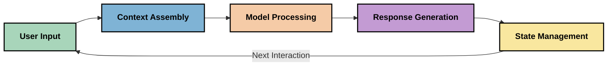
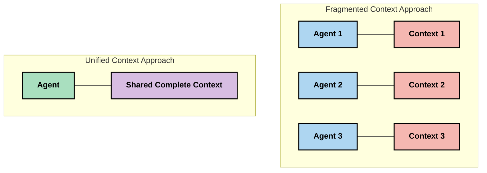
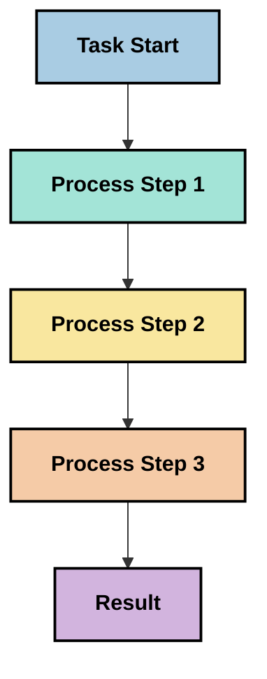
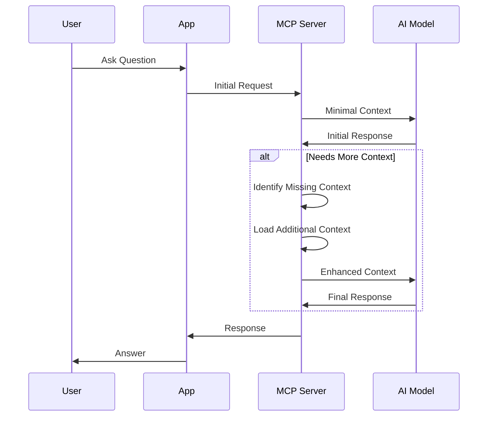
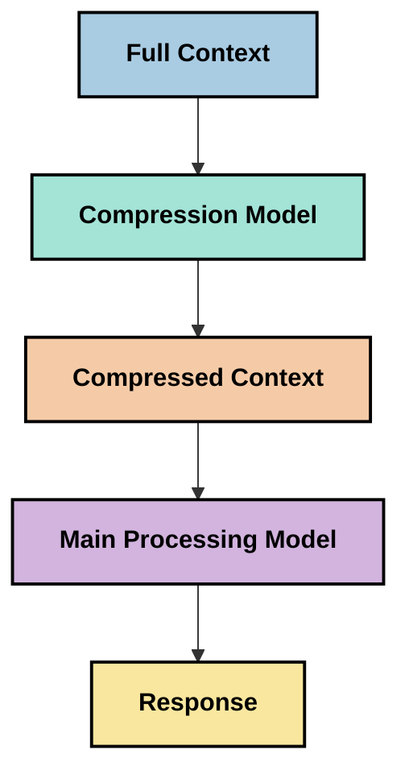
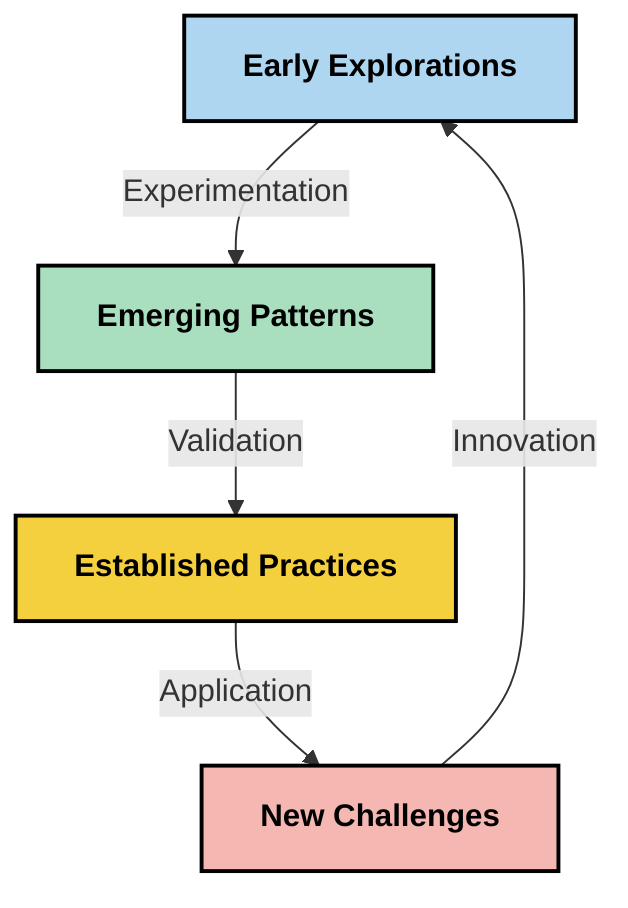

<!--
CO_OP_TRANSLATOR_METADATA:
{
  "original_hash": "5762e8e74dd99d8b7dbb31e69a82561e",
  "translation_date": "2025-07-17T08:37:20+00:00",
  "source_file": "05-AdvancedTopics/mcp-contextengineering/README.md",
  "language_code": "nl"
}
-->
# Context Engineering: Een Opkomend Concept in het MCP-ecosysteem

## Overzicht

Context engineering is een opkomend concept binnen de AI-wereld dat onderzoekt hoe informatie wordt gestructureerd, geleverd en beheerd tijdens interacties tussen cliënten en AI-diensten. Naarmate het Model Context Protocol (MCP)-ecosysteem zich ontwikkelt, wordt het steeds belangrijker om te begrijpen hoe context effectief beheerd kan worden. Deze module introduceert het concept context engineering en verkent de mogelijke toepassingen ervan binnen MCP-implementaties.

## Leerdoelen

Aan het einde van deze module kun je:

- Het opkomende concept van context engineering begrijpen en de mogelijke rol ervan in MCP-toepassingen
- Belangrijke uitdagingen in contextbeheer identificeren die het MCP-protocolontwerp aanpakt
- Technieken verkennen om modelprestaties te verbeteren door beter contextbeheer
- Benaderingen overwegen om de effectiviteit van context te meten en evalueren
- Deze opkomende concepten toepassen om AI-ervaringen te verbeteren via het MCP-framework

## Introductie tot Context Engineering

Context engineering is een opkomend concept dat zich richt op het doelbewust ontwerpen en beheren van de informatiestroom tussen gebruikers, applicaties en AI-modellen. In tegenstelling tot gevestigde vakgebieden zoals prompt engineering, wordt context engineering nog gedefinieerd door praktijkmensen die werken aan het oplossen van de unieke uitdagingen om AI-modellen op het juiste moment van de juiste informatie te voorzien.

Naarmate grote taalmodellen (LLM's) zich hebben ontwikkeld, is het belang van context steeds duidelijker geworden. De kwaliteit, relevantie en structuur van de context die we bieden, beïnvloeden direct de output van het model. Context engineering onderzoekt deze relatie en streeft ernaar principes te ontwikkelen voor effectief contextbeheer.

> "In 2025 zijn de modellen buitengewoon intelligent. Maar zelfs de slimste mens kan zijn werk niet effectief doen zonder de context van wat er gevraagd wordt... 'Context engineering' is het volgende niveau van prompt engineering. Het gaat erom dit automatisch te doen in een dynamisch systeem." — Walden Yan, Cognition AI

Context engineering kan onder meer omvatten:

1. **Contextselectie**: Bepalen welke informatie relevant is voor een bepaalde taak
2. **Contextstructurering**: Informatie organiseren om het begrip van het model te maximaliseren
3. **Contextlevering**: Optimaliseren hoe en wanneer informatie aan modellen wordt aangeboden
4. **Contextonderhoud**: Beheren van de staat en evolutie van context in de tijd
5. **Contextevaluatie**: Meten en verbeteren van de effectiviteit van context

Deze aandachtsgebieden zijn bijzonder relevant voor het MCP-ecosysteem, dat een gestandaardiseerde manier biedt voor applicaties om context aan LLM's te leveren.

## Het Perspectief van de Contextreis

Een manier om context engineering te visualiseren is door de reis te volgen die informatie aflegt binnen een MCP-systeem:



### Belangrijke Fasen in de Contextreis:

1. **Gebruikersinvoer**: Ruwe informatie van de gebruiker (tekst, afbeeldingen, documenten)
2. **Contextsamenstelling**: Combineren van gebruikersinvoer met systeemcontext, gespreksgeschiedenis en andere opgehaalde informatie
3. **Modelverwerking**: Het AI-model verwerkt de samengestelde context
4. **Responsgeneratie**: Het model produceert output op basis van de geleverde context
5. **Statusbeheer**: Het systeem werkt zijn interne status bij op basis van de interactie

Dit perspectief benadrukt de dynamische aard van context in AI-systemen en roept belangrijke vragen op over hoe informatie in elke fase het beste kan worden beheerd.

## Opkomende Principes in Context Engineering

Naarmate het vakgebied context engineering vorm krijgt, beginnen enkele vroege principes te ontstaan vanuit de praktijk. Deze principes kunnen helpen bij het informeren van keuzes in MCP-implementaties:

### Principe 1: Deel Context Volledig

Context moet volledig gedeeld worden tussen alle componenten van een systeem in plaats van gefragmenteerd over meerdere agenten of processen. Wanneer context verspreid is, kunnen beslissingen in het ene deel van het systeem conflicteren met beslissingen elders.



In MCP-toepassingen suggereert dit het ontwerpen van systemen waarbij context naadloos door de hele pijplijn stroomt in plaats van opgesplitst te zijn.

### Principe 2: Erken Dat Acties Impliciete Beslissingen Bevatten

Elke actie die een model onderneemt, bevat impliciete beslissingen over hoe de context geïnterpreteerd wordt. Wanneer meerdere componenten handelen op basis van verschillende contexten, kunnen deze impliciete beslissingen conflicteren, wat leidt tot inconsistente uitkomsten.

Dit principe heeft belangrijke implicaties voor MCP-toepassingen:
- Geef de voorkeur aan lineaire verwerking van complexe taken boven parallelle uitvoering met gefragmenteerde context
- Zorg dat alle beslissingspunten toegang hebben tot dezelfde contextuele informatie
- Ontwerp systemen waarbij latere stappen de volledige context van eerdere beslissingen kunnen inzien

### Principe 3: Balanceer Contextdiepte met Vensterbeperkingen

Naarmate gesprekken en processen langer worden, raken contextvensters uiteindelijk vol. Effectieve context engineering onderzoekt manieren om deze spanning tussen uitgebreide context en technische beperkingen te beheersen.

Mogelijke benaderingen die worden onderzocht zijn onder andere:
- Contextcompressie die essentiële informatie behoudt terwijl het tokengebruik wordt verminderd
- Progressief laden van context op basis van relevantie voor de huidige behoeften
- Samenvatten van eerdere interacties met behoud van belangrijke beslissingen en feiten

## Contextuitdagingen en MCP Protocolontwerp

Het Model Context Protocol (MCP) is ontworpen met bewustzijn van de unieke uitdagingen van contextbeheer. Inzicht in deze uitdagingen helpt om belangrijke aspecten van het MCP-protocolontwerp te verklaren:

### Uitdaging 1: Beperkingen van het Contextvenster
De meeste AI-modellen hebben vaste contextvenstergroottes, wat beperkt hoeveel informatie ze tegelijk kunnen verwerken.

**MCP Ontwerp Reactie:**  
- Het protocol ondersteunt gestructureerde, op bronnen gebaseerde context die efficiënt kan worden geraadpleegd  
- Bronnen kunnen worden gepagineerd en progressief geladen

### Uitdaging 2: Bepalen van Relevantie
Het bepalen welke informatie het meest relevant is om in de context op te nemen, is lastig.

**MCP Ontwerp Reactie:**  
- Flexibele tools maken dynamische informatieopvraging op basis van behoefte mogelijk  
- Gestructureerde prompts zorgen voor consistente contextorganisatie

### Uitdaging 3: Contextpersistentie
Het beheren van de staat over interacties heen vereist zorgvuldige tracking van context.

**MCP Ontwerp Reactie:**  
- Gestandaardiseerd sessiebeheer  
- Duidelijk gedefinieerde interactiepatronen voor contextontwikkeling

### Uitdaging 4: Multi-modale Context
Verschillende soorten data (tekst, afbeeldingen, gestructureerde data) vereisen verschillende behandelingen.

**MCP Ontwerp Reactie:**  
- Protocolontwerp ondersteunt diverse contenttypes  
- Gestandaardiseerde representatie van multi-modale informatie

### Uitdaging 5: Beveiliging en Privacy
Context bevat vaak gevoelige informatie die beschermd moet worden.

**MCP Ontwerp Reactie:**  
- Duidelijke scheiding tussen verantwoordelijkheden van client en server  
- Lokale verwerkingsopties om datalekken te minimaliseren

Inzicht in deze uitdagingen en hoe MCP ze aanpakt, vormt een basis om meer geavanceerde context engineering-technieken te verkennen.

## Opkomende Benaderingen in Context Engineering

Naarmate het vakgebied context engineering zich ontwikkelt, ontstaan er verschillende veelbelovende benaderingen. Deze vertegenwoordigen de huidige denkrichting en zijn nog geen gevestigde best practices; ze zullen waarschijnlijk evolueren naarmate we meer ervaring opdoen met MCP-implementaties.

### 1. Enkelvoudige Lineaire Verwerking

In tegenstelling tot multi-agent architecturen die context verspreiden, ontdekken sommige praktijkmensen dat enkelvoudige lineaire verwerking consistentere resultaten oplevert. Dit sluit aan bij het principe van het behouden van een uniforme context.



Hoewel deze aanpak minder efficiënt lijkt dan parallelle verwerking, levert het vaak coherente en betrouwbare resultaten op omdat elke stap voortbouwt op een volledig begrip van eerdere beslissingen.

### 2. Context Opsplitsen en Prioriteren

Grote contexten opdelen in beheersbare stukken en prioriteit geven aan het belangrijkste.

```python
# Conceptual Example: Context Chunking and Prioritization
def process_with_chunked_context(documents, query):
    # 1. Break documents into smaller chunks
    chunks = chunk_documents(documents)
    
    # 2. Calculate relevance scores for each chunk
    scored_chunks = [(chunk, calculate_relevance(chunk, query)) for chunk in chunks]
    
    # 3. Sort chunks by relevance score
    sorted_chunks = sorted(scored_chunks, key=lambda x: x[1], reverse=True)
    
    # 4. Use the most relevant chunks as context
    context = create_context_from_chunks([chunk for chunk, score in sorted_chunks[:5]])
    
    # 5. Process with the prioritized context
    return generate_response(context, query)
```

Het bovenstaande concept illustreert hoe we grote documenten kunnen opdelen in hanteerbare delen en alleen de meest relevante stukken selecteren voor context. Deze aanpak helpt om binnen de beperkingen van contextvensters te werken terwijl grote kennisbases benut blijven.

### 3. Progressief Context Laden

Context geleidelijk laden wanneer nodig in plaats van alles in één keer.



Progressief context laden begint met minimale context en breidt alleen uit wanneer dat nodig is. Dit kan het tokengebruik aanzienlijk verminderen bij eenvoudige vragen, terwijl het toch complexe vragen aankan.

### 4. Contextcompressie en Samenvatting

De contextgrootte verkleinen terwijl essentiële informatie behouden blijft.



Contextcompressie richt zich op:  
- Het verwijderen van overbodige informatie  
- Het samenvatten van lange inhoud  
- Het extraheren van belangrijke feiten en details  
- Het behouden van kritieke contextelementen  
- Optimalisatie voor token-efficiëntie

Deze aanpak is vooral waardevol voor het onderhouden van lange gesprekken binnen contextvensters of voor het efficiënt verwerken van grote documenten. Sommige praktijkmensen gebruiken gespecialiseerde modellen specifiek voor contextcompressie en samenvatting van gespreksgeschiedenis.

## Overwegingen bij Exploratief Context Engineering

Terwijl we het opkomende vakgebied context engineering verkennen, zijn er enkele overwegingen die het waard zijn om in gedachten te houden bij het werken met MCP-implementaties. Dit zijn geen voorschrijvende best practices, maar eerder gebieden van verkenning die mogelijk verbeteringen opleveren in jouw specifieke situatie.

### Overweeg Je Contextdoelen

Formuleer duidelijk wat je wilt bereiken voordat je complexe contextbeheersoplossingen implementeert:  
- Welke specifieke informatie heeft het model nodig om succesvol te zijn?  
- Welke informatie is essentieel versus aanvullend?  
- Wat zijn je prestatiebeperkingen (latentie, tokenlimieten, kosten)?

### Verken Gelaagde Contextbenaderingen

Sommige praktijkmensen vinden succes met context die in conceptuele lagen is georganiseerd:  
- **Kernlaag**: Essentiële informatie die het model altijd nodig heeft  
- **Situationele Laag**: Context specifiek voor de huidige interactie  
- **Ondersteunende Laag**: Aanvullende informatie die nuttig kan zijn  
- **Fallback Laag**: Informatie die alleen wordt geraadpleegd wanneer nodig

### Onderzoek Opvraagstrategieën

De effectiviteit van je context hangt vaak af van hoe je informatie opvraagt:  
- Semantische zoekopdrachten en embeddings om conceptueel relevante informatie te vinden  
- Zoekopdrachten op basis van trefwoorden voor specifieke feitelijke details  
- Hybride benaderingen die meerdere opvraagmethoden combineren  
- Metadatafiltering om de scope te beperken op basis van categorieën, data of bronnen

### Experimenteer met Contextcoherentie

De structuur en flow van je context kunnen het begrip van het model beïnvloeden:  
- Gerelateerde informatie groeperen  
- Consistente opmaak en organisatie gebruiken  
- Logische of chronologische volgorde aanhouden waar passend  
- Tegenstrijdige informatie vermijden

### Weeg de Afwegingen van Multi-Agent Architecturen

Hoewel multi-agent architecturen populair zijn in veel AI-frameworks, brengen ze aanzienlijke uitdagingen met zich mee voor contextbeheer:  
- Contextfragmentatie kan leiden tot inconsistente beslissingen tussen agenten  
- Parallelle verwerking kan conflicten veroorzaken die moeilijk te verzoenen zijn  
- Communicatie-overhead tussen agenten kan prestatievoordelen tenietdoen  
- Complex statusbeheer is nodig om coherentie te behouden

In veel gevallen kan een single-agent aanpak met uitgebreid contextbeheer betrouwbaardere resultaten opleveren dan meerdere gespecialiseerde agenten met gefragmenteerde context.

### Ontwikkel Evaluatiemethoden

Om context engineering in de loop van de tijd te verbeteren, overweeg hoe je succes gaat meten:  
- A/B-testen van verschillende contextstructuren  
- Monitoren van tokengebruik en responstijden  
- Bijhouden van gebruikers tevredenheid en taakvoltooiingspercentages  
- Analyseren wanneer en waarom contextstrategieën falen

Deze overwegingen vertegenwoordigen actieve verkenningsgebieden binnen context engineering. Naarmate het vakgebied volwassen wordt, zullen waarschijnlijk meer definitieve patronen en praktijken ontstaan.

## Het Meten van Context Effectiviteit: Een Evoluerend Kader

Naarmate context engineering zich ontwikkelt, beginnen praktijkmensen te onderzoeken hoe we de effectiviteit ervan kunnen meten. Er bestaat nog geen vastgesteld kader, maar verschillende meetbare aspecten worden overwogen die toekomstige ontwikkelingen kunnen sturen.

### Potentiële Meetdimensies

#### 1. Overwegingen voor Inputefficiëntie

- **Context-naar-Respons Verhouding**: Hoeveel context is nodig ten opzichte van de grootte van de respons?  
- **Tokenbenutting**: Welk percentage van de geleverde contexttokens beïnvloedt de respons?  
- **Contextreductie**: Hoe effectief kunnen we ruwe informatie comprimeren?

#### 2. Prestatieoverwegingen

- **Latentie-impact**: Hoe beïnvloedt contextbeheer de responstijd?  
- **Token-economie**: Optimaliseren we het tokengebruik effectief?  
- **Precisie van Opvraging**: Hoe relevant is de opgehaalde informatie?  
- **Resourcegebruik**: Welke computationele middelen zijn vereist?

#### 3. Kwaliteitsoverwegingen

- **Relevantie van Respons**: Hoe goed beantwoordt de respons de vraag?  
- **Feitelijke Nauwkeurigheid**: Verbetert contextbeheer de feitelijke correctheid?  
- **Consistentie**: Zijn de antwoorden consistent bij vergelijkbare vragen?  
- **Hallucinatiepercentage**: Vermindert betere context modelhallucinaties?

#### 4. Gebruikerservaringsoverwegingen

- **Follow-up Frequentie**: Hoe vaak hebben gebruikers verduidelijking nodig?  
- **Taakvoltooiing**: Slagen gebruikers erin hun doelen te bereiken?  
- **Tevredenheidsindicatoren**: Hoe beoordelen gebruikers hun ervaring?

### Exploratieve Meetbenaderingen

Bij experimenteren met context engineering in MCP-implementaties, overweeg deze exploratieve methoden:

1. **Baseline Vergelijkingen**: Stel een basislijn vast met eenvoudige contextbenaderingen voordat je geavanceerdere methoden test  
2. **Incrementele Wijzigingen**: Verander één aspect van contextbeheer tegelijk om de effecten te isoleren  
3. **Gebruikersgerichte Evaluatie**: Combineer kwantitatieve metrics met kwalitatieve gebruikersfeedback  
4. **Faalanalyse**: Onderzoek gevallen waarin contextstrategieën falen om mogelijke verbeteringen te begrijpen  
5. **Multidimensionale Beoordeling**: Weeg afwegingen tussen efficiëntie, kwaliteit en gebruikerservaring

Deze experimentele, veelzijdige benadering van meten sluit aan bij het opkomende karakter van context engineering.

## Slotgedachten

Context engineering is een opkomend onderzoeksgebied dat mogelijk centraal staat in effectieve MCP-toepassingen. Door zorgvuldig na te denken over hoe informatie door je systeem stroomt, kun je AI-ervaringen creëren die efficiënter, nauwkeuriger en waardevoller zijn voor gebruikers.

De technieken en benaderingen die in deze module worden beschreven, vertegenwoordigen vroege denkrichtingen in dit vakgebied, geen gevestigde praktijken. Context engineering kan zich ontwikkelen tot een meer gedefinieerde discipline naarmate AI-capaciteiten groeien en ons begrip verdiept. Voor nu lijkt experimenteren in combinatie met zorgvuldige meting de meest productieve aanpak.

## Mogelijke Toekomstige Richtingen

Het vakgebied context engineering bevindt zich nog in een vroeg stadium, maar er tekenen zich enkele veelbelovende richtingen af:

- Principes van context engineering kunnen een grote impact hebben op modelprestaties, efficiëntie, gebruikerservaring en betrouwbaarheid  
- Enkelvoudige, lineaire benaderingen met uitgebreid contextbeheer kunnen multi-agent architecturen overtreffen voor veel toepassingen  
- Gespecialiseerde modellen voor contextcompressie kunnen standaardonderdelen worden in AI-pijplijnen  
- De spanning tussen contextvolledigheid en tokenlimieten zal waarschijnlijk innovatie in contextbeheer stimuleren  
- Naarmate modellen beter worden in efficiënte, mensachtige communicatie, kan echte multi-agent samenwerking haalbaarder worden  
- MCP-implementaties kunnen zich ontwikkelen om contextbeheerpatronen te standaardiseren die voortkomen uit huidige experimenten



## Bronnen

### Officiële MCP-bronnen
- [Model Context Protocol Website](https://modelcontextprotocol.io/)
- [Model Context Protocol Specification](https://github.com/modelcontextprotocol/modelcontextprotocol)
- [MCP Documentation](https://modelcontextprotocol.io/docs)
- [MCP C# SDK](https://github.com/modelcontextprotocol/csharp-sdk)
- [MCP Python SDK](https://github.com/modelcontextprotocol/python-sdk)
- [MCP TypeScript SDK](https://github.com/modelcontextprotocol/typescript-sdk)
- [MCP Inspector](https://github.com/modelcontextprotocol/inspector) - Visuele testtool voor MCP-servers

### Artikelen over Context Engineering
- [Don't Build Multi-Agents: Principles of Context Engineering](https://cognition.ai/blog/dont-build-multi-agents) - Walden Yan's inzichten over principes van context engineering
- [A Practical Guide to Building Agents](https://cdn.openai.com/business-guides-and-resources/a-practical-guide-to-building-agents.pdf) - OpenAI's gids voor effectief agentontwerp
- [Building Effective Agents](https://www.anthropic.com/engineering/building-effective-agents) - Anthropic's aanpak voor agentontwikkeling

### Gerelateerd Onderzoek
- [Dynamic Retrieval Augmentation for Large Language Models](https://arxiv.org/abs/2310.01487) - Onderzoek naar dynamische retrieval-methoden
- [Lost in the Middle: How Language Models Use Long Contexts](https://arxiv.org/abs/2307.03172) - Belangrijk onderzoek naar patronen in contextverwerking
- [Hierarchical Text-Conditioned Image Generation with CLIP Latents](https://arxiv.org/abs/2204.06125) - DALL-E 2 paper met inzichten over contextstructurering
- [Exploring the Role of Context in Large Language Model Architectures](https://aclanthology.org/2023.findings-emnlp.124/) - Recent onderzoek naar contextafhandeling
- [Multi-Agent Collaboration: A Survey](https://arxiv.org/abs/2304.03442) - Onderzoek naar multi-agent systemen en hun uitdagingen

### Aanvullende Bronnen
- [Context Window Optimization Techniques](https://learn.microsoft.com/en-us/azure/ai-services/openai/concepts/context-window)
- [Advanced RAG Techniques](https://www.microsoft.com/en-us/research/blog/retrieval-augmented-generation-rag-and-frontier-models/)
- [Semantic Kernel Documentation](https://github.com/microsoft/semantic-kernel)
- [AI Toolkit for Context Management](https://github.com/microsoft/aitoolkit)

## Wat Nu?
- [6. Community Contributions](../../06-CommunityContributions/README.md)

**Disclaimer**:  
Dit document is vertaald met behulp van de AI-vertalingsdienst [Co-op Translator](https://github.com/Azure/co-op-translator). Hoewel we streven naar nauwkeurigheid, dient u er rekening mee te houden dat geautomatiseerde vertalingen fouten of onnauwkeurigheden kunnen bevatten. Het originele document in de oorspronkelijke taal moet als de gezaghebbende bron worden beschouwd. Voor cruciale informatie wordt professionele menselijke vertaling aanbevolen. Wij zijn niet aansprakelijk voor eventuele misverstanden of verkeerde interpretaties die voortvloeien uit het gebruik van deze vertaling.