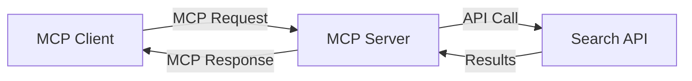
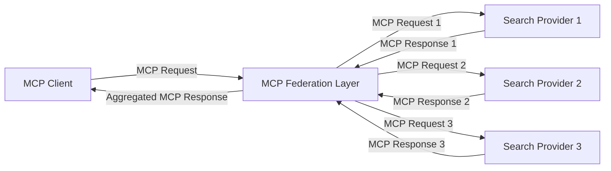
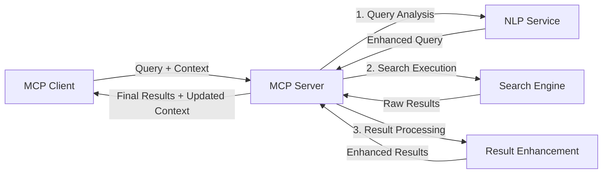

<!--
CO_OP_TRANSLATOR_METADATA:
{
  "original_hash": "16bef2c93c6a86d4ca6a8ce9e120e384",
  "translation_date": "2025-06-13T02:52:40+00:00",
  "source_file": "05-AdvancedTopics/mcp-realtimesearch/README.md",
  "language_code": "nl"
}
-->
## Disclaimer bij Codevoorbeelden

> **Belangrijke Opmerking**: De onderstaande codevoorbeelden laten zien hoe het Model Context Protocol (MCP) geïntegreerd kan worden met webzoekfunctionaliteit. Hoewel ze de patronen en structuren van de officiële MCP SDK's volgen, zijn ze vereenvoudigd voor educatieve doeleinden.
> 
> Deze voorbeelden tonen:
> 
> 1. **Python-implementatie**: Een FastMCP-server die een webzoektool aanbiedt en verbinding maakt met een externe zoek-API. Dit voorbeeld laat zien hoe je de levensduur goed beheert, context afhandelt en tools implementeert volgens de patronen van de [officiële MCP Python SDK](https://github.com/modelcontextprotocol/python-sdk). De server gebruikt de aanbevolen Streamable HTTP-transport, die de oudere SSE-transport heeft vervangen voor productieomgevingen.
> 
> 2. **JavaScript-implementatie**: Een TypeScript/JavaScript-implementatie met het FastMCP-patroon uit de [officiële MCP TypeScript SDK](https://github.com/modelcontextprotocol/typescript-sdk) om een zoekserver te maken met correcte tooldefinities en clientverbindingen. Dit volgt de nieuwste aanbevolen patronen voor sessiebeheer en contextbehoud.
> 
> Voor productiegebruik zijn extra foutafhandeling, authenticatie en specifieke API-integratie nodig. De getoonde zoek-API-eindpunten (`https://api.search-service.example/search`) zijn placeholders en moeten vervangen worden door echte zoekservice-eindpunten.
> 
> Voor volledige implementatiedetails en de meest actuele methoden, raadpleeg de [officiële MCP-specificatie](https://spec.modelcontextprotocol.io/) en SDK-documentatie.

## Kernconcepten

### Het Model Context Protocol (MCP) Framework

In de kern biedt het Model Context Protocol een gestandaardiseerde manier voor AI-modellen, applicaties en services om context uit te wisselen. In real-time websearch is dit framework essentieel voor het creëren van samenhangende zoekervaringen met meerdere interacties. Belangrijke onderdelen zijn:

1. **Client-Server Architectuur**: MCP maakt een duidelijke scheiding tussen zoekclients (aanvragers) en zoekservers (aanbieders), wat flexibele implementatiemodellen mogelijk maakt.

2. **JSON-RPC Communicatie**: Het protocol gebruikt JSON-RPC voor berichtuitwisseling, waardoor het compatibel is met webtechnologieën en eenvoudig te implementeren op verschillende platforms.

3. **Contextbeheer**: MCP definieert gestructureerde methoden om zoekcontext te behouden, bij te werken en te benutten over meerdere interacties heen.

4. **Tooldefinities**: Zoekfunctionaliteiten worden aangeboden als gestandaardiseerde tools met duidelijk gedefinieerde parameters en retourwaarden.

5. **Streaming Ondersteuning**: Het protocol ondersteunt streaming van resultaten, essentieel voor real-time zoektoepassingen waarbij resultaten geleidelijk binnenkomen.

### Integratiepatronen voor Websearch

Bij het integreren van MCP met websearch komen verschillende patronen naar voren:

#### 1. Directe Integratie met Zoekprovider

In dit patroon communiceert de MCP-server rechtstreeks met één of meerdere zoek-API’s, waarbij MCP-aanvragen vertaald worden naar API-specifieke oproepen en de resultaten geformatteerd worden als MCP-antwoorden.

#### 2. Gefedereerde Zoekopdrachten met Contextbehoud

Dit patroon verdeelt zoekopdrachten over meerdere MCP-compatibele zoekproviders, die elk kunnen specialiseren in verschillende soorten content of zoekmogelijkheden, terwijl een uniforme context behouden blijft.

#### 3. Context-verrijkte Zoekketen

Hier wordt het zoekproces opgesplitst in meerdere fasen, waarbij de context bij elke stap wordt verrijkt, wat leidt tot steeds relevantere resultaten.

### Componenten van Zoekcontext

In MCP-gebaseerde websearch omvat context doorgaans:

- **Querygeschiedenis**: Vorige zoekopdrachten binnen de sessie
- **Gebruikersvoorkeuren**: Taal, regio, veilige zoekinstellingen
- **Interactiegeschiedenis**: Welke resultaten werden aangeklikt, tijd besteed aan resultaten
- **Zoekparameters**: Filters, sorteervolgorde en andere zoekmodificaties
- **Domeinkennis**: Specifieke context relevant voor het onderwerp van de zoekopdracht
- **Tijdgebonden Context**: Relevantie gebaseerd op tijd
- **Bronvoorkeuren**: Vertrouwde of geprefereerde informatiebronnen

## Gebruiksscenario's en Toepassingen

### Onderzoek en Informatie Vergaring

MCP verbetert onderzoeksworkflows door:

- Onderzoekscontext te behouden over meerdere zoeksessies
- Geavanceerdere en contextueel relevante zoekopdrachten mogelijk te maken
- Ondersteuning van multi-source zoekfederatie
- Het vergemakkelijken van kennisextractie uit zoekresultaten

### Real-Time Nieuws- en Trendmonitoring

MCP-gestuurde zoekoplossingen bieden voordelen voor nieuwsmonitoring:

- Bijna realtime ontdekking van opkomende nieuwsverhalen
- Contextuele filtering van relevante informatie
- Volgen van onderwerpen en entiteiten over meerdere bronnen
- Gepersonaliseerde nieuwsalerts gebaseerd op gebruikerscontext

### AI-ondersteund Browsen en Onderzoek

MCP opent nieuwe mogelijkheden voor AI-ondersteund browsen:

- Contextuele zoeksuggesties op basis van de huidige browseractiviteit
- Naadloze integratie van websearch met LLM-gestuurde assistenten
- Meerdere zoekrondes met behoud van context
- Verbeterde fact-checking en informatieverificatie

## Toekomstige Trends en Innovaties

### Ontwikkeling van MCP in Websearch

Vooruitkijkend verwachten we dat MCP zich ontwikkelt om:

- **Multimodale Zoekopdrachten**: Integratie van tekst, beeld, audio en video met behouden context
- **Gedecentraliseerde Zoekoplossingen**: Ondersteuning van gedistribueerde en gefedereerde zoekecosystemen
- **Zoekprivacy**: Contextbewuste privacybeschermende zoekmechanismen
- **Querybegrip**: Diepgaande semantische analyse van natuurlijke taal zoekopdrachten

### Potentiële Technologische Vooruitgang

Opkomende technologieën die de toekomst van MCP-zoekoplossingen zullen bepalen:

1. **Neurale Zoekarchitecturen**: Op embeddings gebaseerde zoeksystemen geoptimaliseerd voor MCP
2. **Gepersonaliseerde Zoekcontext**: Het leren van individuele zoekpatronen van gebruikers in de tijd
3. **Integratie van Kennisgrafen**: Contextuele zoekoplossingen versterkt met domeinspecifieke kennisgrafen
4. **Cross-Modal Context**: Context behouden over verschillende zoekmodaliteiten heen

## Praktische Oefeningen

### Oefening 1: Basis MCP Zoekpipeline Opzetten

In deze oefening leer je:

- Een basis MCP-zoekomgeving configureren
- Contexthandlers implementeren voor websearch
- Contextbehoud testen en valideren over meerdere zoekrondes

### Oefening 2: Onderzoeksassistent Bouwen met MCP Search

Maak een volledige applicatie die:

- Natuurlijke taal onderzoeksvragen verwerkt
- Contextbewuste webzoekopdrachten uitvoert
- Informatie uit meerdere bronnen syntheseert
- Georganiseerde onderzoeksresultaten presenteert

### Oefening 3: Multi-Source Zoekfederatie Implementeren met MCP

Geavanceerde oefening over:

- Contextbewuste queryverdeling naar meerdere zoekmachines
- Resultaten rangschikken en aggregeren
- Contextuele deduplicatie van zoekresultaten
- Afhandelen van bron-specifieke metadata

## Extra Bronnen

- [Model Context Protocol Specificatie](https://spec.modelcontextprotocol.io/) - Officiële MCP-specificatie en gedetailleerde protocoldocumentatie
- [Model Context Protocol Documentatie](https://modelcontextprotocol.io/) - Uitgebreide tutorials en implementatiehandleidingen
- [MCP Python SDK](https://github.com/modelcontextprotocol/python-sdk) - Officiële Python-implementatie van het MCP-protocol
- [MCP TypeScript SDK](https://github.com/modelcontextprotocol/typescript-sdk) - Officiële TypeScript-implementatie van het MCP-protocol
- [MCP Referentieservers](https://github.com/modelcontextprotocol/servers) - Referentie-implementaties van MCP-servers
- [Bing Web Search API Documentatie](https://learn.microsoft.com/en-us/bing/search-apis/bing-web-search/overview) - Microsoft’s websearch-API
- [Google Custom Search JSON API](https://developers.google.com/custom-search/v1/overview) - Google’s programmeerbare zoekmachine
- [SerpAPI Documentatie](https://serpapi.com/search-api) - API voor zoekresultaatpagina’s
- [Meilisearch Documentatie](https://www.meilisearch.com/docs) - Open-source zoekmachine
- [Elasticsearch Documentatie](https://www.elastic.co/guide/index.html) - Gedistribueerde zoek- en analysemotor
- [LangChain Documentatie](https://python.langchain.com/docs/get_started/introduction) - Applicaties bouwen met LLM’s

## Leerresultaten

Na afronding van deze module kun je:

- De basisprincipes van real-time websearch en de bijbehorende uitdagingen uitleggen
- Beschrijven hoe het Model Context Protocol (MCP) real-time websearch verbetert
- MCP-gebaseerde zoekoplossingen implementeren met populaire frameworks en API’s
- Schaalbare, hoogpresterende zoekarchitecturen ontwerpen en implementeren met MCP
- MCP-concepten toepassen op uiteenlopende use cases zoals semantische zoekopdrachten, onderzoeksassistentie en AI-ondersteund browsen
- Opkomende trends en toekomstige innovaties in MCP-gebaseerde zoektechnologieën beoordelen

### Vertrouwens- en Veiligheidsoverwegingen

Bij het implementeren van MCP-gebaseerde websearchoplossingen, houd rekening met deze belangrijke principes uit de MCP-specificatie:

1. **Toestemming en Controle van Gebruikers**: Gebruikers moeten expliciet toestemming geven en begrijpen welke data wordt geraadpleegd en welke handelingen worden uitgevoerd. Dit is vooral belangrijk bij websearch-implementaties die externe databronnen benaderen.

2. **Privacy van Gegevens**: Zorg voor een passende omgang met zoekopdrachten en resultaten, vooral als deze gevoelige informatie bevatten. Implementeer passende toegangscontroles om gebruikersdata te beschermen.

3. **Veiligheid van Tools**: Zorg voor goede autorisatie en validatie van zoektools, aangezien deze een beveiligingsrisico kunnen vormen door willekeurige code-uitvoering. Beschrijvingen van toolgedrag moeten als onbetrouwbaar worden beschouwd tenzij afkomstig van een vertrouwde server.

4. **Duidelijke Documentatie**: Lever heldere documentatie over mogelijkheden, beperkingen en veiligheidsaspecten van je MCP-gebaseerde zoekimplementatie, volgens de richtlijnen uit de MCP-specificatie.

5. **Robuuste Toestemmingsflows**: Bouw robuuste toestemmings- en autorisatiestromen die duidelijk uitleggen wat elke tool doet voordat gebruik wordt toegestaan, vooral voor tools die communiceren met externe webbronnen.

Voor volledige details over MCP-beveiliging en vertrouwens- en veiligheidsaspecten, zie de [officiële documentatie](https://modelcontextprotocol.io/specification/2025-03-26#security-and-trust-%26-safety).

## Wat nu?

- [6. Community Contributions](../../06-CommunityContributions/README.md)

**Disclaimer**:  
Dit document is vertaald met behulp van de AI-vertalingsdienst [Co-op Translator](https://github.com/Azure/co-op-translator). Hoewel we streven naar nauwkeurigheid, dient u er rekening mee te houden dat geautomatiseerde vertalingen fouten of onnauwkeurigheden kunnen bevatten. Het oorspronkelijke document in de oorspronkelijke taal moet als de gezaghebbende bron worden beschouwd. Voor kritieke informatie wordt professionele menselijke vertaling aanbevolen. Wij zijn niet aansprakelijk voor eventuele misverstanden of verkeerde interpretaties die voortvloeien uit het gebruik van deze vertaling.