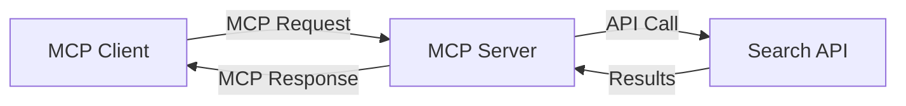
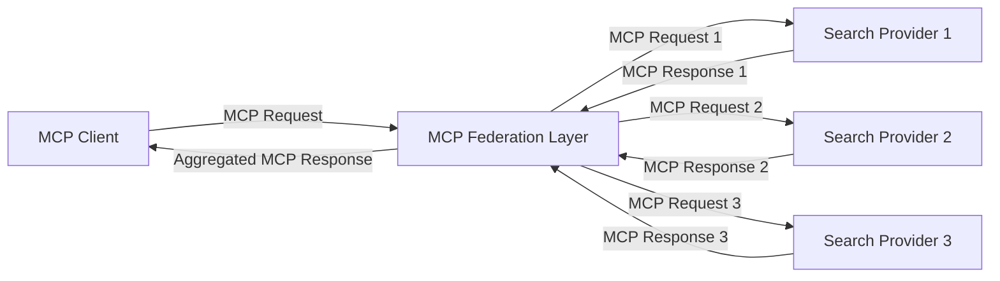
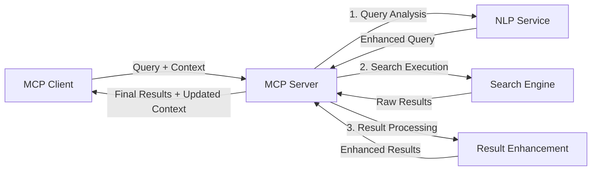

<!--
CO_OP_TRANSLATOR_METADATA:
{
  "original_hash": "eb12652eb7bd17f2193b835a344425c6",
  "translation_date": "2025-06-26T14:09:33+00:00",
  "source_file": "05-AdvancedTopics/mcp-realtimesearch/README.md",
  "language_code": "nl"
}
-->
## Disclaimer bij Codevoorbeelden

> **Belangrijke Opmerking**: De onderstaande codevoorbeelden laten zien hoe het Model Context Protocol (MCP) geïntegreerd kan worden met webzoekfunctionaliteit. Hoewel ze de patronen en structuren van de officiële MCP SDK’s volgen, zijn ze vereenvoudigd voor educatieve doeleinden.
> 
> Deze voorbeelden tonen:
> 
> 1. **Python-implementatie**: Een FastMCP-serverimplementatie die een webzoektool aanbiedt en verbinding maakt met een externe zoek-API. Dit voorbeeld demonstreert correct levensduurbeheer, contextafhandeling en toolimplementatie volgens de patronen van de [officiële MCP Python SDK](https://github.com/modelcontextprotocol/python-sdk). De server gebruikt de aanbevolen Streamable HTTP-transport, die de oudere SSE-transport heeft vervangen voor productieomgevingen.
> 
> 2. **JavaScript-implementatie**: Een TypeScript/JavaScript-implementatie volgens het FastMCP-patroon uit de [officiële MCP TypeScript SDK](https://github.com/modelcontextprotocol/typescript-sdk) om een zoekserver te creëren met correcte tooldefinities en clientverbindingen. Dit volgt de nieuwste aanbevolen patronen voor sessiebeheer en contextbehoud.
> 
> Voor productiegebruik vereisen deze voorbeelden aanvullende foutafhandeling, authenticatie en specifieke API-integratiecode. De getoonde zoek-API-eindpunten (`https://api.search-service.example/search`) zijn plaatsaanduidingen en moeten worden vervangen door daadwerkelijke zoekservice-eindpunten.
> 
> Raadpleeg voor volledige implementatiedetails en de meest actuele benaderingen de [officiële MCP-specificatie](https://spec.modelcontextprotocol.io/) en SDK-documentatie.

## Kernconcepten

### Het Model Context Protocol (MCP) Framework

Het Model Context Protocol biedt een gestandaardiseerde manier voor AI-modellen, applicaties en diensten om context uit te wisselen. In real-time websearch is dit framework essentieel voor het creëren van samenhangende zoekervaringen met meerdere interacties. Belangrijke componenten zijn:

1. **Client-Server Architectuur**: MCP maakt een duidelijke scheiding tussen zoekclients (aanvragers) en zoekservers (aanbieders), wat flexibele implementatiemodellen mogelijk maakt.

2. **JSON-RPC Communicatie**: Het protocol gebruikt JSON-RPC voor berichtuitwisseling, wat compatibel is met webtechnologieën en eenvoudig te implementeren op verschillende platforms.

3. **Contextbeheer**: MCP definieert gestructureerde methoden om zoekcontext te onderhouden, bij te werken en te benutten over meerdere interacties.

4. **Tooldefinities**: Zoekfunctionaliteiten worden aangeboden als gestandaardiseerde tools met duidelijk omschreven parameters en retourwaarden.

5. **Streamingondersteuning**: Het protocol ondersteunt het streamen van resultaten, essentieel voor real-time zoekopdrachten waarbij resultaten geleidelijk binnenkomen.

### Integratiepatronen voor Websearch

Bij het integreren van MCP met websearch ontstaan verschillende patronen:

#### 1. Directe Integratie met Zoekproviders

In dit patroon koppelt de MCP-server rechtstreeks aan een of meerdere zoek-API’s, vertaalt MCP-verzoeken naar API-specifieke calls en formatteert de resultaten als MCP-responses.

#### 2. Gefedereerde Zoekopdrachten met Contextbehoud

Dit patroon verdeelt zoekopdrachten over meerdere MCP-compatibele zoekproviders, die elk gespecialiseerd kunnen zijn in verschillende soorten content of zoekmogelijkheden, terwijl een eenduidige context behouden blijft.

#### 3. Contextverrijkte Zoekketen

In dit patroon is het zoekproces opgesplitst in meerdere stappen, waarbij de context in elke stap wordt verrijkt, wat leidt tot steeds relevantere resultaten.

### Componenten van Zoekcontext

In MCP-gebaseerde websearch omvat context doorgaans:

- **Zoekgeschiedenis**: Vorige zoekopdrachten in de sessie
- **Gebruikersvoorkeuren**: Taal, regio, veilige zoekinstellingen
- **Interactieverleden**: Welke resultaten zijn aangeklikt, tijd besteed aan resultaten
- **Zoekparameters**: Filters, sorteervolgorde en andere zoekmodificaties
- **Domeinkennis**: Specifieke context relevant voor het onderwerp van de zoekopdracht
- **Tijdgebonden Context**: Relevantiefactoren gebaseerd op tijd
- **Bronvoorkeuren**: Vertrouwde of geprefereerde informatiebronnen

## Toepassingen en Use Cases

### Onderzoek en Informatie Verzameling

MCP verbetert onderzoeksworkflows door:

- Onderzoekscontext te behouden over meerdere zoeksessies
- Geavanceerdere en contextueel relevantere zoekopdrachten mogelijk te maken
- Ondersteuning voor multi-source zoekfederatie
- Kennisextractie uit zoekresultaten te faciliteren

### Real-Time Nieuws- en Trendmonitoring

MCP-gestuurde zoekoplossingen bieden voordelen voor nieuwsmonitoring:

- Bijna real-time ontdekking van opkomende nieuwsverhalen
- Contextuele filtering van relevante informatie
- Volgen van onderwerpen en entiteiten over meerdere bronnen
- Gepersonaliseerde nieuwsalerts op basis van gebruikerscontext

### AI-ondersteund Browsen en Onderzoek

MCP opent nieuwe mogelijkheden voor AI-ondersteund browsen:

- Contextuele zoeksuggesties gebaseerd op huidige browseractiviteit
- Naadloze integratie van websearch met door LLM aangedreven assistenten
- Zoekverfijning over meerdere interacties met behoud van context
- Verbeterde feitcontrole en informatieverificatie

## Toekomstige Trends en Innovaties

### Ontwikkeling van MCP in Websearch

Vooruitkijkend verwachten we dat MCP zich zal ontwikkelen om te ondersteunen:

- **Multimodale Zoekopdrachten**: Integratie van tekst-, beeld-, audio- en videozoekopdrachten met contextbehoud
- **Gedecentraliseerde Zoekopdrachten**: Ondersteuning voor gedistribueerde en gefedereerde zoekecosystemen
- **Zoekprivacy**: Contextbewuste privacybeschermende zoekmechanismen
- **Querybegrip**: Diepe semantische analyse van natuurlijke taal zoekopdrachten

### Mogelijke Technologische Vooruitgangen

Nieuwe technologieën die de toekomst van MCP-zoekopdrachten zullen vormen:

1. **Neurale Zoekarchitecturen**: Embedding-gebaseerde zoeksystemen geoptimaliseerd voor MCP
2. **Gepersonaliseerde Zoekcontext**: Leren van individuele zoekpatronen van gebruikers in de tijd
3. **Integratie van Kennisgrafen**: Contextuele zoekopdrachten verrijkt met domeinspecifieke kennisgrafen
4. **Cross-Modale Context**: Context behouden over verschillende zoekmodaliteiten heen

## Praktische Oefeningen

### Oefening 1: Basis MCP Zoekpijplijn Opzetten

In deze oefening leer je hoe je:

- Een basis MCP-zoekomgeving configureert
- Contexthandlers implementeert voor websearch
- Contextbehoud test en valideert over zoekinteracties heen

### Oefening 2: Onderzoeksassistent Bouwen met MCP Search

Maak een volledige applicatie die:

- Natuurlijke taal onderzoeksvragen verwerkt
- Contextbewuste websearch uitvoert
- Informatie uit meerdere bronnen synthesizeert
- Georganiseerde onderzoeksresultaten presenteert

### Oefening 3: Multi-Source Zoekfederatie Implementeren met MCP

Geavanceerde oefening over:

- Contextbewuste queryversturing naar meerdere zoekmachines
- Resultaatrangschikking en aggregatie
- Contextuele deduplicatie van zoekresultaten
- Afhandeling van bron-specifieke metadata

## Aanvullende Bronnen

- [Model Context Protocol Specificatie](https://spec.modelcontextprotocol.io/) - Officiële MCP-specificatie en gedetailleerde protocoldocumentatie
- [Model Context Protocol Documentatie](https://modelcontextprotocol.io/) - Uitgebreide tutorials en implementatiehandleidingen
- [MCP Python SDK](https://github.com/modelcontextprotocol/python-sdk) - Officiële Python-implementatie van het MCP-protocol
- [MCP TypeScript SDK](https://github.com/modelcontextprotocol/typescript-sdk) - Officiële TypeScript-implementatie van het MCP-protocol
- [MCP Referentieservers](https://github.com/modelcontextprotocol/servers) - Referentie-implementaties van MCP-servers
- [Bing Web Search API Documentatie](https://learn.microsoft.com/en-us/bing/search-apis/bing-web-search/overview) - Microsoft’s websearch API
- [Google Custom Search JSON API](https://developers.google.com/custom-search/v1/overview) - Google’s programmeerbare zoekmachine
- [SerpAPI Documentatie](https://serpapi.com/search-api) - API voor zoekmachine-resultaatpagina’s
- [Meilisearch Documentatie](https://www.meilisearch.com/docs) - Open-source zoekmachine
- [Elasticsearch Documentatie](https://www.elastic.co/guide/index.html) - Gedistribueerde zoek- en analysemotor
- [LangChain Documentatie](https://python.langchain.com/docs/get_started/introduction) - Applicaties bouwen met LLM’s

## Leerresultaten

Na het voltooien van deze module kun je:

- De basisprincipes van real-time websearch en de bijbehorende uitdagingen begrijpen
- Uitleggen hoe het Model Context Protocol (MCP) real-time websearchmogelijkheden verbetert
- MCP-gebaseerde zoekoplossingen implementeren met populaire frameworks en API’s
- Schaalbare, hoogpresterende zoekarchitecturen ontwerpen en uitrollen met MCP
- MCP-concepten toepassen op diverse use cases, waaronder semantisch zoeken, onderzoeksassistentie en AI-ondersteund browsen
- Opkomende trends en toekomstige innovaties in MCP-gebaseerde zoektechnologieën evalueren

### Overwegingen rond Vertrouwen en Veiligheid

Bij het implementeren van MCP-gebaseerde websearchoplossingen, houd rekening met de volgende belangrijke principes uit de MCP-specificatie:

1. **Toestemming en Controle van Gebruikers**: Gebruikers moeten expliciet toestemming geven en volledig begrijpen welke data wordt geraadpleegd en welke acties worden uitgevoerd. Dit is vooral belangrijk bij websearchimplementaties die externe databronnen benaderen.

2. **Privacy van Gegevens**: Zorg voor passende omgang met zoekopdrachten en resultaten, vooral wanneer deze gevoelige informatie kunnen bevatten. Implementeer adequate toegangscontrole om gebruikersgegevens te beschermen.

3. **Veiligheid van Tools**: Zorg voor correcte autorisatie en validatie van zoektools, aangezien ze potentiële beveiligingsrisico’s kunnen vormen door willekeurige code-uitvoering. Beschrijvingen van toolgedrag moeten als onbetrouwbaar worden beschouwd tenzij ze afkomstig zijn van een vertrouwde server.

4. **Duidelijke Documentatie**: Bied heldere documentatie over de mogelijkheden, beperkingen en beveiligingsoverwegingen van jouw MCP-gebaseerde zoekimplementatie, conform de richtlijnen uit de MCP-specificatie.

5. **Robuuste Toestemmingsstromen**: Bouw robuuste toestemmings- en autorisatiestromen die duidelijk uitleggen wat elke tool doet voordat het gebruik wordt toegestaan, vooral voor tools die externe webbronnen aanspreken.

Voor volledige details over MCP-beveiliging en vertrouwen- & veiligheidsaspecten, zie de [officiële documentatie](https://modelcontextprotocol.io/specification/2025-03-26#security-and-trust-%26-safety).

## Wat Nu?

- [5.11 Entra ID Authenticatie voor Model Context Protocol Servers](../mcp-security-entra/README.md)

**Disclaimer**:  
Dit document is vertaald met behulp van de AI-vertalingsdienst [Co-op Translator](https://github.com/Azure/co-op-translator). Hoewel we streven naar nauwkeurigheid, dient u er rekening mee te houden dat automatische vertalingen fouten of onnauwkeurigheden kunnen bevatten. Het originele document in de oorspronkelijke taal moet worden beschouwd als de gezaghebbende bron. Voor cruciale informatie wordt professionele menselijke vertaling aanbevolen. Wij zijn niet aansprakelijk voor misverstanden of verkeerde interpretaties die voortvloeien uit het gebruik van deze vertaling.