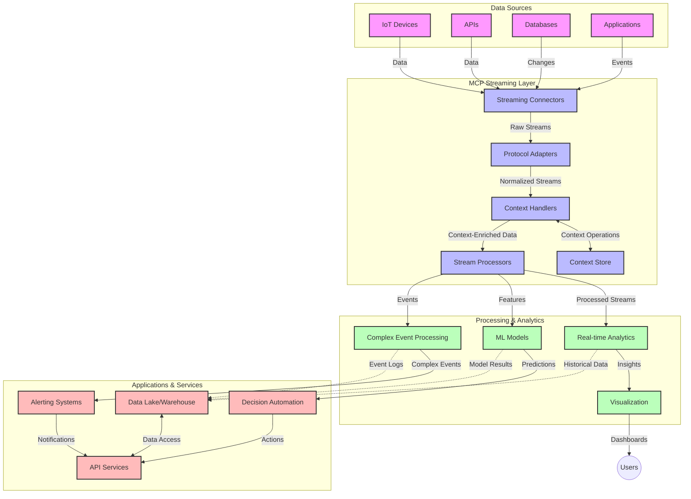

<!--
CO_OP_TRANSLATOR_METADATA:
{
  "original_hash": "195f7287638b77a549acadd96c8f981c",
  "translation_date": "2025-06-13T00:19:46+00:00",
  "source_file": "05-AdvancedTopics/mcp-realtimestreaming/README.md",
  "language_code": "nl"
}
-->
# Model Context Protocol voor Real-Time Data Streaming

## Overzicht

Real-time data streaming is tegenwoordig essentieel in een wereld die steeds meer door data wordt aangedreven, waarbij bedrijven en applicaties directe toegang tot informatie nodig hebben om tijdig beslissingen te kunnen nemen. Het Model Context Protocol (MCP) vormt een belangrijke stap voorwaarts in het optimaliseren van deze real-time streamingprocessen, door de efficiëntie van dataverwerking te verbeteren, de contextuele integriteit te waarborgen en de algehele systeemprestaties te verhogen.

In deze module wordt onderzocht hoe MCP real-time data streaming transformeert door een gestandaardiseerde aanpak te bieden voor contextbeheer tussen AI-modellen, streamingplatforms en applicaties.

## Introductie tot Real-Time Data Streaming

Real-time data streaming is een technologische benadering die continue overdracht, verwerking en analyse van data mogelijk maakt zodra deze wordt gegenereerd, waardoor systemen direct kunnen reageren op nieuwe informatie. In tegenstelling tot traditionele batchverwerking, die werkt met statische datasets, verwerkt streaming data terwijl deze binnenkomt, wat inzichten en acties met minimale vertraging oplevert.

### Kernconcepten van Real-Time Data Streaming:

- **Continue Dataflow**: Data wordt verwerkt als een ononderbroken stroom van gebeurtenissen of records.
- **Lage Latentie Verwerking**: Systemen zijn ontworpen om de tijd tussen datageneratie en verwerking zo kort mogelijk te houden.
- **Schaalbaarheid**: Streamingarchitecturen moeten omgaan met variabele datavolumes en -snelheden.
- **Fouttolerantie**: Systemen moeten bestand zijn tegen storingen om een ononderbroken datastroom te garanderen.
- **Stateful Verwerking**: Het behouden van context over gebeurtenissen heen is cruciaal voor zinvolle analyses.

### Het Model Context Protocol en Real-Time Streaming

Het Model Context Protocol (MCP) pakt verschillende belangrijke uitdagingen aan in real-time streamingomgevingen:

1. **Contextuele Continuïteit**: MCP standaardiseert hoe context wordt behouden over gedistribueerde streamingcomponenten, zodat AI-modellen en verwerkingsnodes toegang hebben tot relevante historische en omgevingscontext.

2. **Efficiënt State Management**: Door gestructureerde mechanismen voor contextoverdracht te bieden, vermindert MCP de overhead van statebeheer in streaming pipelines.

3. **Interoperabiliteit**: MCP creëert een gemeenschappelijke taal voor contextdeling tussen diverse streamingtechnologieën en AI-modellen, wat flexibelere en uitbreidbare architecturen mogelijk maakt.

4. **Streaming-Geoptimaliseerde Context**: MCP-implementaties kunnen prioriteren welke contextelementen het meest relevant zijn voor realtime besluitvorming, met optimalisatie voor zowel prestaties als nauwkeurigheid.

5. **Adaptieve Verwerking**: Met goed contextbeheer via MCP kunnen streaming systemen hun verwerking dynamisch aanpassen aan veranderende omstandigheden en patronen in de data.

In moderne toepassingen, van IoT-sensornetwerken tot financiële handelsplatformen, maakt de integratie van MCP met streamingtechnologieën intelligentere, contextbewuste verwerking mogelijk die adequaat kan reageren op complexe en veranderende situaties in real time.

## Leerdoelen

Aan het einde van deze les kun je:

- De basisprincipes van real-time data streaming en de bijbehorende uitdagingen begrijpen
- Uitleggen hoe het Model Context Protocol (MCP) real-time data streaming verbetert
- MCP-gebaseerde streamingoplossingen implementeren met populaire frameworks zoals Kafka en Pulsar
- Fouttolerante, hoogpresterende streamingarchitecturen ontwerpen en implementeren met MCP
- MCP-concepten toepassen op IoT-, financiële handels- en AI-gedreven analysetoepassingen
- Opkomende trends en toekomstige innovaties in MCP-gebaseerde streamingtechnologieën evalueren

### Definitie en Belang

Real-time data streaming houdt in dat data continu wordt gegenereerd, verwerkt en geleverd met minimale vertraging. In tegenstelling tot batchverwerking, waarbij data in groepen wordt verzameld en verwerkt, wordt streamingdata stapsgewijs verwerkt zodra het binnenkomt, wat onmiddellijke inzichten en acties mogelijk maakt.

Belangrijke kenmerken van real-time data streaming zijn:

- **Lage Latentie**: Data wordt binnen milliseconden tot seconden verwerkt en geanalyseerd
- **Continue Stroom**: Ononderbroken datastromen van diverse bronnen
- **Onmiddellijke Verwerking**: Data wordt geanalyseerd zodra het binnenkomt, niet in batches
- **Event-Driven Architectuur**: Reactie op gebeurtenissen zodra deze plaatsvinden

### Uitdagingen bij Traditionele Data Streaming

Traditionele streamingmethoden kennen verschillende beperkingen:

1. **Contextverlies**: Moeilijkheden bij het behouden van context over gedistribueerde systemen heen
2. **Schaalbaarheidsproblemen**: Moeilijkheden bij het opschalen voor hoge volumes en snelheden van data
3. **Integratiecomplexiteit**: Problemen met interoperabiliteit tussen verschillende systemen
4. **Latentiebeheer**: Balanceren tussen doorvoer en verwerkingstijd
5. **Dataconsistentie**: Waarborgen van nauwkeurigheid en volledigheid van data over de hele stroom

## Begrip van Model Context Protocol (MCP)

### Wat is MCP?

Het Model Context Protocol (MCP) is een gestandaardiseerd communicatieprotocol dat efficiënte interactie tussen AI-modellen en applicaties mogelijk maakt. In de context van real-time data streaming biedt MCP een raamwerk voor:

- Het behouden van context door de hele datapijplijn heen
- Het standaardiseren van data-uitwisselingsformaten
- Het optimaliseren van de overdracht van grote datasets
- Het verbeteren van communicatie tussen model-to-model en model-to-applicatie

### Kerncomponenten en Architectuur

De MCP-architectuur voor real-time streaming bestaat uit verschillende belangrijke componenten:

1. **Context Handlers**: Beheren en onderhouden contextuele informatie door de streaming pipeline
2. **Stream Processors**: Verwerken binnenkomende datastromen met contextbewuste technieken
3. **Protocol Adapters**: Converteren tussen verschillende streamingprotocollen terwijl context behouden blijft
4. **Context Store**: Efficiënt opslaan en ophalen van contextuele informatie
5. **Streaming Connectors**: Verbinden met diverse streamingplatforms (Kafka, Pulsar, Kinesis, enz.)



### Hoe MCP de Real-Time Data Verwerking Verbeterd

MCP pakt traditionele streaminguitdagingen aan door:

- **Contextuele Integriteit**: Het behouden van relaties tussen datapoints over de hele pijplijn
- **Geoptimaliseerde Overdracht**: Verminderen van redundantie in data-uitwisseling door intelligent contextbeheer
- **Gestandaardiseerde Interfaces**: Bieden van consistente API’s voor streamingcomponenten
- **Verminderde Latentie**: Minimaliseren van verwerkingsbelasting door efficiënt contextbeheer
- **Verbeterde Schaaltbaarheid**: Ondersteunen van horizontale schaalbaarheid terwijl context behouden blijft

## Integratie en Implementatie

Real-time data streaming systemen vereisen een zorgvuldige architecturale aanpak en implementatie om zowel prestaties als contextuele integriteit te waarborgen. Het Model Context Protocol biedt een gestandaardiseerde manier om AI-modellen en streamingtechnologieën te integreren, wat geavanceerdere, contextbewuste verwerkingspipelines mogelijk maakt.

### Overzicht van MCP-integratie in Streaming Architecturen

Het implementeren van MCP in real-time streamingomgevingen omvat verschillende belangrijke aandachtspunten:

1. **Contextserialisatie en Transport**: MCP biedt efficiënte mechanismen om contextuele informatie te coderen binnen streamingdatapakketten, zodat essentiële context de data door de hele pijplijn volgt. Dit omvat gestandaardiseerde serialisatieformaten die geoptimaliseerd zijn voor streamingtransport.

2. **Stateful Stream Processing**: MCP maakt intelligentere stateful verwerking mogelijk door consistente contextrepresentatie over verwerkingsnodes te behouden. Dit is vooral waardevol in gedistribueerde streamingarchitecturen waar statebeheer traditioneel lastig is.

3. **Event-Tijd vs. Verwerkingstijd**: MCP-implementaties in streaming systemen moeten het onderscheid maken tussen wanneer gebeurtenissen plaatsvonden en wanneer ze worden verwerkt. Het protocol kan temporele context bevatten die event-time semantiek bewaart.

4. **Backpressure Management**: Door contextbeheer te standaardiseren helpt MCP bij het managen van backpressure in streaming systemen, waardoor componenten hun verwerkingscapaciteit kunnen communiceren en de datastroom kunnen aanpassen.

5. **Context Windowing en Aggregatie**: MCP faciliteert geavanceerdere windowing-operaties door gestructureerde representaties van temporele en relationele context te bieden, wat zinvolle aggregaties over eventstromen mogelijk maakt.

6. **Exactly-Once Processing**: In streaming systemen die exactly-once semantiek vereisen, kan MCP verwerkingsmetadata bevatten om de verwerkingsstatus over gedistribueerde componenten te volgen en te verifiëren.

De implementatie van MCP over verschillende streamingtechnologieën creëert een uniforme aanpak voor contextbeheer, vermindert de noodzaak voor maatwerk integratiecode en versterkt het vermogen van het systeem om betekenisvolle context te behouden terwijl data door de pijplijn stroomt.

### MCP in Diverse Data Streaming Frameworks

Deze voorbeelden volgen de huidige MCP-specificatie die zich richt op een JSON-RPC gebaseerd protocol met verschillende transportmechanismen. De code laat zien hoe je aangepaste transports kunt implementeren die streamingplatforms zoals Kafka en Pulsar integreren, terwijl volledige compatibiliteit met het MCP-protocol behouden blijft.

De voorbeelden zijn bedoeld om te laten zien hoe streamingplatforms met MCP geïntegreerd kunnen worden voor real-time dataverwerking, terwijl de contextuele bewustwording die centraal staat in MCP behouden blijft. Deze aanpak zorgt ervoor dat de codevoorbeelden nauwkeurig de huidige stand van de MCP-specificatie per juni 2025 weerspiegelen.

MCP kan geïntegreerd worden met populaire streaming frameworks zoals:

#### Apache Kafka Integratie

```python
import asyncio
import json
from typing import Dict, Any, Optional
from confluent_kafka import Consumer, Producer, KafkaError
from mcp.client import Client, ClientCapabilities
from mcp.core.message import JsonRpcMessage
from mcp.core.transports import Transport

# Custom transport class to bridge MCP with Kafka
class KafkaMCPTransport(Transport):
    def __init__(self, bootstrap_servers: str, input_topic: str, output_topic: str):
        self.bootstrap_servers = bootstrap_servers
        self.input_topic = input_topic
        self.output_topic = output_topic
        self.producer = Producer({'bootstrap.servers': bootstrap_servers})
        self.consumer = Consumer({
            'bootstrap.servers': bootstrap_servers,
            'group.id': 'mcp-client-group',
            'auto.offset.reset': 'earliest'
        })
        self.message_queue = asyncio.Queue()
        self.running = False
        self.consumer_task = None
        
    async def connect(self):
        """Connect to Kafka and start consuming messages"""
        self.consumer.subscribe([self.input_topic])
        self.running = True
        self.consumer_task = asyncio.create_task(self._consume_messages())
        return self
        
    async def _consume_messages(self):
        """Background task to consume messages from Kafka and queue them for processing"""
        while self.running:
            try:
                msg = self.consumer.poll(1.0)
                if msg is None:
                    await asyncio.sleep(0.1)
                    continue
                
                if msg.error():
                    if msg.error().code() == KafkaError._PARTITION_EOF:
                        continue
                    print(f"Consumer error: {msg.error()}")
                    continue
                
                # Parse the message value as JSON-RPC
                try:
                    message_str = msg.value().decode('utf-8')
                    message_data = json.loads(message_str)
                    mcp_message = JsonRpcMessage.from_dict(message_data)
                    await self.message_queue.put(mcp_message)
                except Exception as e:
                    print(f"Error parsing message: {e}")
            except Exception as e:
                print(f"Error in consumer loop: {e}")
                await asyncio.sleep(1)
    
    async def read(self) -> Optional[JsonRpcMessage]:
        """Read the next message from the queue"""
        try:
            message = await self.message_queue.get()
            return message
        except Exception as e:
            print(f"Error reading message: {e}")
            return None
    
    async def write(self, message: JsonRpcMessage) -> None:
        """Write a message to the Kafka output topic"""
        try:
            message_json = json.dumps(message.to_dict())
            self.producer.produce(
                self.output_topic,
                message_json.encode('utf-8'),
                callback=self._delivery_report
            )
            self.producer.poll(0)  # Trigger callbacks
        except Exception as e:
            print(f"Error writing message: {e}")
    
    def _delivery_report(self, err, msg):
        """Kafka producer delivery callback"""
        if err is not None:
            print(f'Message delivery failed: {err}')
        else:
            print(f'Message delivered to {msg.topic()} [{msg.partition()}]')
    
    async def close(self) -> None:
        """Close the transport"""
        self.running = False
        if self.consumer_task:
            self.consumer_task.cancel()
            try:
                await self.consumer_task
            except asyncio.CancelledError:
                pass
        self.consumer.close()
        self.producer.flush()

# Example usage of the Kafka MCP transport
async def kafka_mcp_example():
    # Create MCP client with Kafka transport
    client = Client(
        {"name": "kafka-mcp-client", "version": "1.0.0"},
        ClientCapabilities({})
    )
    
    # Create and connect the Kafka transport
    transport = KafkaMCPTransport(
        bootstrap_servers="localhost:9092",
        input_topic="mcp-responses",
        output_topic="mcp-requests"
    )
    
    await client.connect(transport)
    
    try:
        # Initialize the MCP session
        await client.initialize()
        
        # Example of executing a tool via MCP
        response = await client.execute_tool(
            "process_data",
            {
                "data": "sample data",
                "metadata": {
                    "source": "sensor-1",
                    "timestamp": "2025-06-12T10:30:00Z"
                }
            }
        )
        
        print(f"Tool execution response: {response}")
        
        # Clean shutdown
        await client.shutdown()
    finally:
        await transport.close()

# Run the example
if __name__ == "__main__":
    asyncio.run(kafka_mcp_example())
```

#### Apache Pulsar Implementatie

```python
import asyncio
import json
import pulsar
from typing import Dict, Any, Optional
from mcp.core.message import JsonRpcMessage
from mcp.core.transports import Transport
from mcp.server import Server, ServerOptions
from mcp.server.tools import Tool, ToolExecutionContext, ToolMetadata

# Create a custom MCP transport that uses Pulsar
class PulsarMCPTransport(Transport):
    def __init__(self, service_url: str, request_topic: str, response_topic: str):
        self.service_url = service_url
        self.request_topic = request_topic
        self.response_topic = response_topic
        self.client = pulsar.Client(service_url)
        self.producer = self.client.create_producer(response_topic)
        self.consumer = self.client.subscribe(
            request_topic,
            "mcp-server-subscription",
            consumer_type=pulsar.ConsumerType.Shared
        )
        self.message_queue = asyncio.Queue()
        self.running = False
        self.consumer_task = None
    
    async def connect(self):
        """Connect to Pulsar and start consuming messages"""
        self.running = True
        self.consumer_task = asyncio.create_task(self._consume_messages())
        return self
    
    async def _consume_messages(self):
        """Background task to consume messages from Pulsar and queue them for processing"""
        while self.running:
            try:
                # Non-blocking receive with timeout
                msg = self.consumer.receive(timeout_millis=500)
                
                # Process the message
                try:
                    message_str = msg.data().decode('utf-8')
                    message_data = json.loads(message_str)
                    mcp_message = JsonRpcMessage.from_dict(message_data)
                    await self.message_queue.put(mcp_message)
                    
                    # Acknowledge the message
                    self.consumer.acknowledge(msg)
                except Exception as e:
                    print(f"Error processing message: {e}")
                    # Negative acknowledge if there was an error
                    self.consumer.negative_acknowledge(msg)
            except Exception as e:
                # Handle timeout or other exceptions
                await asyncio.sleep(0.1)
    
    async def read(self) -> Optional[JsonRpcMessage]:
        """Read the next message from the queue"""
        try:
            message = await self.message_queue.get()
            return message
        except Exception as e:
            print(f"Error reading message: {e}")
            return None
    
    async def write(self, message: JsonRpcMessage) -> None:
        """Write a message to the Pulsar output topic"""
        try:
            message_json = json.dumps(message.to_dict())
            self.producer.send(message_json.encode('utf-8'))
        except Exception as e:
            print(f"Error writing message: {e}")
    
    async def close(self) -> None:
        """Close the transport"""
        self.running = False
        if self.consumer_task:
            self.consumer_task.cancel()
            try:
                await self.consumer_task
            except asyncio.CancelledError:
                pass
        self.consumer.close()
        self.producer.close()
        self.client.close()

# Define a sample MCP tool that processes streaming data
@Tool(
    name="process_streaming_data",
    description="Process streaming data with context preservation",
    metadata=ToolMetadata(
        required_capabilities=["streaming"]
    )
)
async def process_streaming_data(
    ctx: ToolExecutionContext,
    data: str,
    source: str,
    priority: str = "medium"
) -> Dict[str, Any]:
    """
    Process streaming data while preserving context
    
    Args:
        ctx: Tool execution context
        data: The data to process
        source: The source of the data
        priority: Priority level (low, medium, high)
        
    Returns:
        Dict containing processed results and context information
    """
    # Example processing that leverages MCP context
    print(f"Processing data from {source} with priority {priority}")
    
    # Access conversation context from MCP
    conversation_id = ctx.conversation_id if hasattr(ctx, 'conversation_id') else "unknown"
    
    # Return results with enhanced context
    return {
        "processed_data": f"Processed: {data}",
        "context": {
            "conversation_id": conversation_id,
            "source": source,
            "priority": priority,
            "processing_timestamp": ctx.get_current_time_iso()
        }
    }

# Example MCP server implementation using Pulsar transport
async def run_mcp_server_with_pulsar():
    # Create MCP server
    server = Server(
        {"name": "pulsar-mcp-server", "version": "1.0.0"},
        ServerOptions(
            capabilities={"streaming": True}
        )
    )
    
    # Register our tool
    server.register_tool(process_streaming_data)
    
    # Create and connect Pulsar transport
    transport = PulsarMCPTransport(
        service_url="pulsar://localhost:6650",
        request_topic="mcp-requests",
        response_topic="mcp-responses"
    )
    
    try:
        # Start the server with the Pulsar transport
        await server.run(transport)
    finally:
        await transport.close()

# Run the server
if __name__ == "__main__":
    asyncio.run(run_mcp_server_with_pulsar())
```

### Best Practices voor Implementatie

Bij het implementeren van MCP voor real-time streaming:

1. **Ontwerp voor Fouttolerantie**:
   - Implementeer goede foutafhandeling
   - Gebruik dead-letter queues voor mislukte berichten
   - Ontwerp idempotente processors

2. **Optimaliseer voor Prestaties**:
   - Stel geschikte buffergroottes in
   - Gebruik batching waar passend
   - Implementeer backpressure-mechanismen

3. **Monitor en Observeer**:
   - Volg metrics van streamverwerking
   - Houd contextpropagatie in de gaten
   - Stel waarschuwingen in voor afwijkingen

4. **Beveilig je Streams**:
   - Implementeer encryptie voor gevoelige data
   - Gebruik authenticatie en autorisatie
   - Pas juiste toegangscontrole toe

### MCP in IoT en Edge Computing

MCP verbetert IoT-streaming door:

- Het behouden van device-context door de verwerkingspijplijn heen
- Efficiënte edge-to-cloud data streaming mogelijk te maken
- Real-time analytics op IoT-datastromen te ondersteunen
- Device-to-device communicatie met context te faciliteren

Voorbeeld: Smart City Sensor Netwerken  
```
Sensors → Edge Gateways → MCP Stream Processors → Real-time Analytics → Automated Responses
```

### Rol in Financiële Transacties en High-Frequency Trading

MCP biedt aanzienlijke voordelen voor financiële datastreaming:

- Ultra-lage latentie verwerking voor handelsbeslissingen
- Behoud van transactiecontext gedurende de verwerking
- Ondersteuning van complexe eventverwerking met contextbewustzijn
- Waarborgen van dataconsistentie over gedistribueerde handelssystemen

### Verbetering van AI-gedreven Data-analyse

MCP opent nieuwe mogelijkheden voor streaming analytics:

- Real-time modeltraining en inferentie
- Continu leren van streamingdata
- Contextbewuste feature-extractie
- Multi-model inferentie pipelines met behouden context

## Toekomstige Trends en Innovaties

### Evolutie van MCP in Real-Time Omgevingen

Vooruitkijkend verwachten we dat MCP zich ontwikkelt om:

- **Integratie met Quantum Computing**: Voorbereiden op quantum-gebaseerde streamingsystemen
- **Edge-Native Verwerking**: Meer contextbewuste verwerking naar edge devices verplaatsen
- **Autonoom Streambeheer**: Zelfoptimaliserende streaming pipelines
- **Federated Streaming**: Gedistribueerde verwerking met behoud van privacy

### Potentiële Technologische Ontwikkelingen

Opkomende technologieën die de toekomst van MCP-streaming zullen vormen:

1. **AI-Geoptimaliseerde Streamingprotocollen**: Maatwerkprotocollen speciaal ontworpen voor AI workloads
2. **Neuromorfe Computing Integratie**: Hersengeïnspireerde computing voor streamverwerking
3. **Serverless Streaming**: Event-driven, schaalbare streaming zonder infrastructuurbeheer
4. **Gedistribueerde Context Stores**: Wereldwijd verspreid maar zeer consistente contextbeheer

## Praktische Oefeningen

### Oefening 1: Opzetten van een Basis MCP Streaming Pipeline

In deze oefening leer je hoe je:

- Een basis MCP streamingomgeving configureert
- Context handlers implementeert voor streamverwerking
- Contextbehoud test en valideert

### Oefening 2: Bouwen van een Real-Time Analytics Dashboard

Maak een complete applicatie die:

- Streamingdata binnenhaalt via MCP
- De stream verwerkt met behoud van context
- Resultaten in real-time visualiseert

### Oefening 3: Implementeren van Complex Event Processing met MCP

Geavanceerde oefening die behandelt:

- Patroonherkenning in streams
- Contextuele correlatie over meerdere streams
- Genereren van complexe events met behouden context

## Aanvullende Bronnen

- [Model Context Protocol Specification](https://github.com/modelcontextprotocol) - Officiële MCP-specificatie en documentatie
- [Apache Kafka Documentation](https://kafka.apache.org/documentation/) - Leer over Kafka voor streamverwerking
- [Apache Pulsar](https://pulsar.apache.org/) - Geünificeerd messaging- en streamingplatform
- [Streaming Systems: The What, Where, When, and How of Large-Scale Data Processing](https://www.oreilly.com/library/view/streaming-systems/9781491983867/) - Uitgebreid boek over streamingarchitecturen
- [Microsoft Azure Event Hubs](https://learn.microsoft.com/azure/event-hubs/event-hubs-about) - Beheerde event streaming service
- [MLflow Documentation](https://mlflow.org/docs/latest/index.html) - Voor ML model tracking en deployment
- [Real-Time Analytics with Apache Storm](https://storm.apache.org/releases/current/index.html) - Verwerkingsframework voor real-time berekeningen
- [Flink ML](https://nightlies.apache.org/flink/flink-ml-docs-master/) - Machine learning bibliotheek voor Apache Flink
- [LangChain Documentation](https://python.langchain.com/docs/get_started/introduction) - Applicaties bouwen met LLMs

## Leerresultaten

Na het voltooien van deze module kun je:

- De basisprincipes van real-time data streaming en de uitdagingen ervan begrijpen
- Uitleggen hoe het Model Context Protocol (MCP) real-time data streaming verbetert
- MCP-gebaseerde streamingoplossingen implementeren met populaire frameworks zoals Kafka en Pulsar
- Fouttolerante, hoogpresterende streamingarchitecturen ontwerpen en implementeren met MCP
- MCP-concepten toepassen op IoT-, financiële handels- en AI-gedreven analysetoepassingen
- Opkomende trends en toekomstige innovaties in MCP-gebaseerde streamingtechnologieën evalueren

## Wat nu?

- [5.11 Realtime Search](../mcp-realtimesearch/README.md)

**Disclaimer**:  
Dit document is vertaald met behulp van de AI-vertalingsdienst [Co-op Translator](https://github.com/Azure/co-op-translator). Hoewel we streven naar nauwkeurigheid, dient u er rekening mee te houden dat automatische vertalingen fouten of onnauwkeurigheden kunnen bevatten. Het oorspronkelijke document in de oorspronkelijke taal moet als de gezaghebbende bron worden beschouwd. Voor belangrijke informatie wordt professionele menselijke vertaling aanbevolen. Wij zijn niet aansprakelijk voor eventuele misverstanden of verkeerde interpretaties die voortvloeien uit het gebruik van deze vertaling.