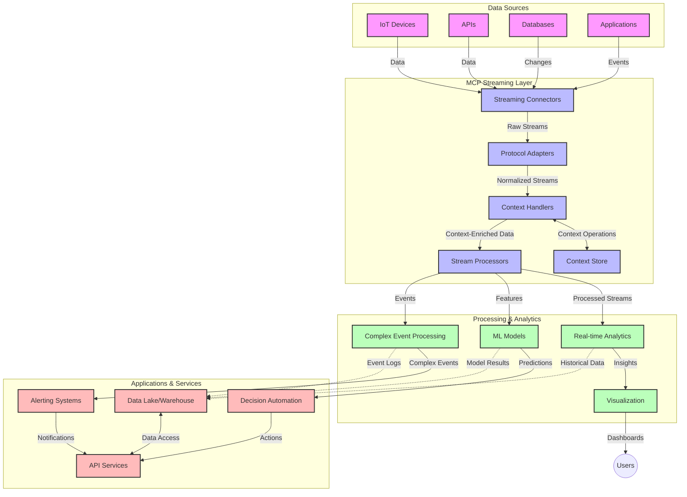

<!--
CO_OP_TRANSLATOR_METADATA:
{
  "original_hash": "68c518dbff8a3b127ed2aa934054c56c",
  "translation_date": "2025-06-11T17:21:56+00:00",
  "source_file": "05-AdvancedTopics/mcp-realtimestreaming/README.md",
  "language_code": "nl"
}
-->
# Model Context Protocol voor Real-Time Data Streaming

## Overzicht

Real-time data streaming is onmisbaar geworden in de huidige datagedreven wereld, waar bedrijven en applicaties directe toegang tot informatie nodig hebben om tijdige beslissingen te nemen. Het Model Context Protocol (MCP) vertegenwoordigt een belangrijke vooruitgang in het optimaliseren van deze real-time streamingprocessen, door de efficiëntie van dataverwerking te verbeteren, de contextuele integriteit te waarborgen en de algehele systeemprestaties te verhogen.

Deze module onderzoekt hoe MCP real-time data streaming transformeert door een gestandaardiseerde aanpak te bieden voor contextbeheer tussen AI-modellen, streamingplatformen en applicaties.

## Introductie tot Real-Time Data Streaming

Real-time data streaming is een technologisch paradigma dat het mogelijk maakt om data continu over te dragen, verwerken en analyseren zodra deze wordt gegenereerd, waardoor systemen direct kunnen reageren op nieuwe informatie. In tegenstelling tot traditionele batchverwerking, die werkt met statische datasets, verwerkt streaming data terwijl deze in beweging is en levert inzichten en acties met minimale vertraging.

### Kernconcepten van Real-Time Data Streaming:

- **Continue Datastroom**: Data wordt verwerkt als een continue, nooit eindigende stroom van gebeurtenissen of records.
- **Lage Latentie Verwerking**: Systemen zijn ontworpen om de tijd tussen datageneratie en verwerking te minimaliseren.
- **Schaalbaarheid**: Streamingarchitecturen moeten variabele datavolumes en -snelheden aankunnen.
- **Fouttolerantie**: Systemen moeten bestand zijn tegen storingen om ononderbroken datastromen te garanderen.
- **Stateful Verwerking**: Het behouden van context over gebeurtenissen heen is cruciaal voor zinvolle analyses.

### Het Model Context Protocol en Real-Time Streaming

Het Model Context Protocol (MCP) pakt verschillende belangrijke uitdagingen aan in real-time streamingomgevingen:

1. **Contextuele Continuïteit**: MCP standaardiseert hoe context wordt behouden over gedistribueerde streamingcomponenten, zodat AI-modellen en verwerkingsknooppunten toegang hebben tot relevante historische en omgevingscontext.

2. **Efficiënt Statebeheer**: Door gestructureerde mechanismen voor contextoverdracht te bieden, vermindert MCP de overhead van statebeheer in streamingpipelines.

3. **Interoperabiliteit**: MCP creëert een gemeenschappelijke taal voor contextdeling tussen diverse streamingtechnologieën en AI-modellen, wat flexibelere en uitbreidbare architecturen mogelijk maakt.

4. **Streaming-geoptimaliseerde Context**: MCP-implementaties kunnen prioriteit geven aan de meest relevante contextelementen voor realtime besluitvorming, waardoor zowel prestaties als nauwkeurigheid worden geoptimaliseerd.

5. **Adaptieve Verwerking**: Met goed contextbeheer via MCP kunnen streamingsystemen dynamisch hun verwerking aanpassen op basis van veranderende omstandigheden en patronen in de data.

In moderne toepassingen, van IoT-sensornetwerken tot financiële handelsplatformen, maakt de integratie van MCP met streamingtechnologieën intelligentere, contextbewuste verwerking mogelijk die adequaat kan reageren op complexe, evoluerende situaties in realtime.

## Leerdoelen

Aan het einde van deze les kun je:

- De basisprincipes van real-time data streaming en de bijbehorende uitdagingen begrijpen
- Uitleggen hoe het Model Context Protocol (MCP) real-time data streaming verbetert
- MCP-gebaseerde streamingoplossingen implementeren met populaire frameworks zoals Kafka en Pulsar
- Fouttolerante, hoogpresterende streamingarchitecturen ontwerpen en implementeren met MCP
- MCP-concepten toepassen op use cases in IoT, financiële handel en AI-gedreven analytics
- Opkomende trends en toekomstige innovaties in MCP-gebaseerde streamingtechnologieën evalueren

### Definitie en Belang

Real-time data streaming omvat de continue generatie, verwerking en levering van data met minimale vertraging. In tegenstelling tot batchverwerking, waarbij data wordt verzameld en in groepen verwerkt, wordt streamingdata incrementeel verwerkt zodra het binnenkomt, wat onmiddellijke inzichten en acties mogelijk maakt.

Belangrijke kenmerken van real-time data streaming zijn:

- **Lage Latentie**: Data verwerken en analyseren binnen milliseconden tot seconden
- **Continue Stroom**: Ononderbroken datastromen van diverse bronnen
- **Directe Verwerking**: Data analyseren zodra het binnenkomt, in plaats van in batches
- **Event-Driven Architectuur**: Reageren op gebeurtenissen zodra ze plaatsvinden

### Uitdagingen bij Traditionele Data Streaming

Traditionele benaderingen van data streaming kennen diverse beperkingen:

1. **Contextverlies**: Moeilijkheden bij het behouden van context over gedistribueerde systemen
2. **Schaalbaarheidsproblemen**: Uitdagingen bij het opschalen om hoge volumes en snelheden aan te kunnen
3. **Integratiecomplexiteit**: Problemen met interoperabiliteit tussen verschillende systemen
4. **Latentiebeheer**: Balanceren tussen doorvoer en verwerkingstijd
5. **Dataconsistentie**: Zekerstellen van nauwkeurigheid en volledigheid van data over de hele stroom

## Inzicht in Model Context Protocol (MCP)

### Wat is MCP?

Het Model Context Protocol (MCP) is een gestandaardiseerd communicatieprotocol dat is ontworpen om efficiënte interactie tussen AI-modellen en applicaties mogelijk te maken. In de context van real-time data streaming biedt MCP een raamwerk voor:

- Het behouden van context door de gehele datapijplijn heen
- Het standaardiseren van data-uitwisselingsformaten
- Het optimaliseren van de overdracht van grote datasets
- Het verbeteren van communicatie tussen model en model, en tussen model en applicatie

### Kerncomponenten en Architectuur

De MCP-architectuur voor real-time streaming bestaat uit verschillende belangrijke componenten:

1. **Context Handlers**: Beheren en onderhouden contextuele informatie door de streamingpijplijn heen
2. **Stream Processors**: Verwerken binnenkomende datastromen met contextbewuste technieken
3. **Protocol Adapters**: Converteren tussen verschillende streamingprotocollen terwijl context behouden blijft
4. **Context Store**: Efficiënt opslaan en ophalen van contextuele informatie
5. **Streaming Connectors**: Verbinden met diverse streamingplatformen (Kafka, Pulsar, Kinesis, etc.)



### Hoe MCP Real-Time Data Verwerking Verbeterd

MCP pakt traditionele streaminguitdagingen aan door:

- **Contextuele Integriteit**: Relaties tussen datapunten behouden over de hele pijplijn
- **Geoptimaliseerde Overdracht**: Redundantie in data-uitwisseling verminderen via intelligent contextbeheer
- **Gestandaardiseerde Interfaces**: Consistente API's bieden voor streamingcomponenten
- **Verminderde Latentie**: Verwerkingskosten minimaliseren door efficiënte contextafhandeling
- **Verbeterde Schaalbaarheid**: Horizontaal schalen ondersteunen terwijl context behouden blijft

## Integratie en Implementatie

Real-time data streaming systemen vereisen een zorgvuldige architecturale opzet en implementatie om zowel prestaties als contextuele integriteit te waarborgen. Het Model Context Protocol biedt een gestandaardiseerde aanpak voor het integreren van AI-modellen en streamingtechnologieën, waardoor geavanceerdere, contextbewuste verwerkingspipelines mogelijk worden.

### Overzicht van MCP Integratie in Streaming Architecturen

Het implementeren van MCP in real-time streamingomgevingen brengt verschillende belangrijke aandachtspunten met zich mee:

1. **Contextserialisatie en Transport**: MCP biedt efficiënte mechanismen voor het coderen van contextuele informatie binnen streamingdatapakketten, zodat essentiële context meereist door de verwerkingspijplijn. Dit omvat gestandaardiseerde serialisatieformaten die geoptimaliseerd zijn voor streamingtransport.

2. **Stateful Stream Processing**: MCP maakt intelligentere stateful verwerking mogelijk door consistente contextrepresentatie over verwerkingsknooppunten heen te behouden. Dit is vooral waardevol in gedistribueerde streamingarchitecturen waar statebeheer traditioneel lastig is.

3. **Event-Tijd versus Verwerkingstijd**: MCP-implementaties in streaming systemen moeten de veelvoorkomende uitdaging aanpakken om te onderscheiden wanneer gebeurtenissen plaatsvonden en wanneer ze worden verwerkt. Het protocol kan temporele context bevatten die event-tijdsemantiek behoudt.

4. **Backpressure Management**: Door contextafhandeling te standaardiseren helpt MCP bij het managen van backpressure in streaming systemen, waardoor componenten hun verwerkingscapaciteit kunnen communiceren en de stroom kunnen aanpassen.

5. **Context Windowing en Aggregatie**: MCP faciliteert geavanceerdere windowing-operaties door gestructureerde representaties van temporele en relationele context te bieden, wat betekenisvollere aggregaties over eventstromen mogelijk maakt.

6. **Exactly-Once Verwerking**: In streaming systemen die exactly-once semantiek vereisen, kan MCP verwerkingsmetadata opnemen om de status van verwerking over gedistribueerde componenten te volgen en te verifiëren.

De implementatie van MCP over verschillende streamingtechnologieën creëert een uniforme aanpak voor contextbeheer, waardoor de noodzaak voor maatwerk integratiecode afneemt en het systeem beter in staat is om zinvolle context te behouden terwijl data door de pijplijn stroomt.

### MCP in Diverse Data Streaming Frameworks

MCP kan worden geïntegreerd met populaire streamingframeworks zoals:

#### Apache Kafka Integratie

```python
from mcp_streaming import MCPKafkaConnector

# Initialize MCP Kafka connector
connector = MCPKafkaConnector(
    bootstrap_servers='localhost:9092',
    context_preservation=True
)

# Create a context-aware consumer
consumer = connector.create_consumer('input-topic')

# Process streaming data with context
for message in consumer:
    context = message.get_context()
    data = message.get_value()
    
    # Process with context awareness
    result = process_with_context(data, context)
    
    # Produce output with preserved context
    connector.produce('output-topic', result, context=context)
```

#### Apache Pulsar Implementatie

```python
from mcp_streaming import MCPPulsarClient

# Initialize MCP Pulsar client
client = MCPPulsarClient('pulsar://localhost:6650')

# Subscribe with context awareness
consumer = client.subscribe('input-topic', 'subscription-name', 
                           context_enabled=True)

# Process messages with context preservation
while True:
    message = consumer.receive()
    context = message.get_context()
    
    # Process with context
    result = process_with_context(message.data(), context)
    
    # Acknowledge the message
    consumer.acknowledge(message)
    
    # Send result with preserved context
    producer = client.create_producer('output-topic')
    producer.send(result, context=context)
```

### Best Practices voor Implementatie

Bij het implementeren van MCP voor real-time streaming:

1. **Ontwerp voor Fouttolerantie**:
   - Zorg voor juiste foutafhandeling
   - Gebruik dead-letter queues voor mislukte berichten
   - Ontwerp idempotente processors

2. **Optimaliseer voor Prestaties**:
   - Stel passende bufferformaties in
   - Pas batching toe waar geschikt
   - Implementeer backpressure-mechanismen

3. **Monitor en Observeer**:
   - Volg streamverwerkingsstatistieken
   - Houd contextpropagatie in de gaten
   - Stel meldingen in bij afwijkingen

4. **Beveilig je Streams**:
   - Implementeer encryptie voor gevoelige data
   - Gebruik authenticatie en autorisatie
   - Pas juiste toegangscontrole toe

### MCP in IoT en Edge Computing

MCP verbetert IoT-streaming door:

- Het behouden van apparaatcontext door de verwerkingspijplijn heen
- Efficiënte edge-to-cloud datastreaming mogelijk te maken
- Real-time analytics op IoT-datastromen te ondersteunen
- Apparaten onderling te laten communiceren met context

Voorbeeld: Smart City Sensor Netwerken  
```
Sensors → Edge Gateways → MCP Stream Processors → Real-time Analytics → Automated Responses
```

### Rol in Financiële Transacties en High-Frequency Trading

MCP biedt belangrijke voordelen voor financiële datastreaming:

- Ultra-lage latentie verwerking voor handelsbeslissingen
- Behoud van transactiecontext gedurende de verwerking
- Ondersteuning van complexe event processing met contextbewustzijn
- Zekerstellen van dataconsistentie over gedistribueerde handelssystemen

### Verbetering van AI-gedreven Data Analytics

MCP opent nieuwe mogelijkheden voor streaming analytics:

- Real-time modeltraining en inferentie
- Continue learning vanuit streamingdata
- Contextbewuste feature-extractie
- Multi-model inferentiepipelines met behouden context

## Toekomstige Trends en Innovaties

### Evolutie van MCP in Real-Time Omgevingen

Vooruitkijkend verwachten we dat MCP zich zal ontwikkelen om:

- **Quantum Computing Integratie**: Voorbereiden op quantum-gebaseerde streaming systemen
- **Edge-Native Verwerking**: Meer contextbewuste verwerking naar edge-apparaten brengen
- **Autonoom Streambeheer**: Zelfoptimaliserende streamingpijplijnen
- **Gefedereerde Streaming**: Gedistribueerde verwerking met behoud van privacy

### Potentiële Technologische Vooruitgang

Opkomende technologieën die de toekomst van MCP-streaming zullen vormgeven:

1. **AI-Geoptimaliseerde Streamingprotocollen**: Speciaal ontworpen protocollen voor AI-workloads
2. **Neuromorfe Computing Integratie**: Hersengeïnspireerde computing voor streamverwerking
3. **Serverless Streaming**: Event-driven, schaalbare streaming zonder infrastructuurbeheer
4. **Gedistribueerde Context Stores**: Wereldwijd verspreid maar toch zeer consistente contextbeheer

## Praktische Oefeningen

### Oefening 1: Een Basis MCP Streaming Pipeline Opzetten

In deze oefening leer je:

- Een basis MCP streamingomgeving configureren
- Context handlers implementeren voor streamverwerking
- Contextbehoud testen en valideren

### Oefening 2: Een Real-Time Analytics Dashboard Bouwen

Maak een complete applicatie die:

- Streamingdata binnenhaalt met MCP
- De stream verwerkt met behoud van context
- Resultaten realtime visualiseert

### Oefening 3: Complexe Event Processing Implementeren met MCP

Geavanceerde oefening over:

- Patronendetectie in streams
- Contextuele correlatie over meerdere streams
- Genereren van complexe events met behouden context

## Aanvullende Bronnen

- [Model Context Protocol Specification](https://github.com/microsoft/model-context-protocol) - Officiële MCP-specificatie en documentatie  
- [Apache Kafka Documentation](https://kafka.apache.org/documentation/) - Leer over Kafka voor streamverwerking  
- [Apache Pulsar](https://pulsar.apache.org/) - Geünificeerde messaging- en streamingplatform  
- [Streaming Systems: The What, Where, When, and How of Large-Scale Data Processing](https://www.oreilly.com/library/view/streaming-systems/9781491983867/) - Uitgebreid boek over streamingarchitecturen  
- [Microsoft Azure Event Hubs](https://learn.microsoft.com/en-us/azure/event-hubs/event-hubs-about) - Beheerde event streaming service  
- [MLflow Documentation](https://mlflow.org/docs/latest/index.html) - Voor ML-modeltracking en deployment  
- [Real-Time Analytics with Apache Storm](https://storm.apache.org/releases/current/index.html) - Verwerkingsframework voor realtime berekeningen  
- [Flink ML](https://nightlies.apache.org/flink/flink-ml-docs-master/) - Machine learning bibliotheek voor Apache Flink  
- [LangChain Documentation](https://python.langchain.com/docs/get_started/introduction) - Applicaties bouwen met LLMs

## Leerresultaten

Na het voltooien van deze module kun je:

- De basisprincipes van real-time data streaming en de uitdagingen begrijpen  
- Uitleggen hoe het Model Context Protocol (MCP) real-time data streaming verbetert  
- MCP-gebaseerde streamingoplossingen implementeren met populaire frameworks zoals Kafka en Pulsar  
- Fouttolerante, hoogpresterende streamingarchitecturen ontwerpen en implementeren met MCP  
- MCP-concepten toepassen op IoT, financiële handel en AI-gedreven analytics use cases  
- Opkomende trends en toekomstige innovaties in MCP-gebaseerde streamingtechnologieën evalueren

## Wat is de volgende stap

- [6. Community Contributions](../../06-CommunityContributions/README.md)

**Disclaimer**:  
Dit document is vertaald met behulp van de AI-vertalingsdienst [Co-op Translator](https://github.com/Azure/co-op-translator). Hoewel we streven naar nauwkeurigheid, dient u er rekening mee te houden dat automatische vertalingen fouten of onnauwkeurigheden kunnen bevatten. Het originele document in de oorspronkelijke taal moet als de gezaghebbende bron worden beschouwd. Voor belangrijke informatie wordt professionele menselijke vertaling aanbevolen. Wij zijn niet aansprakelijk voor eventuele misverstanden of verkeerde interpretaties die voortvloeien uit het gebruik van deze vertaling.