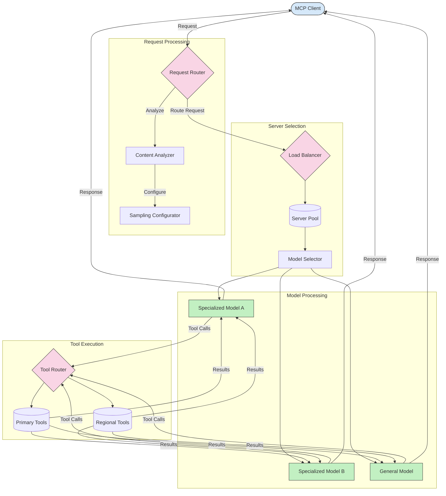

<!--
CO_OP_TRANSLATOR_METADATA:
{
  "original_hash": "2f1b473818b5a6cc9a9bbf777fffa6d4",
  "translation_date": "2025-07-14T21:48:59+00:00",
  "source_file": "05-AdvancedTopics/mcp-routing/README.md",
  "language_code": "nl"
}
-->
## Sampling en Routing Architectuur in MCP

Sampling is een cruciaal onderdeel van het Model Context Protocol (MCP) dat zorgt voor efficiënte verwerking en routering van verzoeken. Het houdt in dat binnenkomende verzoeken worden geanalyseerd om te bepalen welk model of welke service het beste geschikt is om ze af te handelen, op basis van verschillende criteria zoals het type inhoud, gebruikerscontext en systeembelasting.

Sampling en routing kunnen worden gecombineerd om een robuuste architectuur te creëren die het gebruik van middelen optimaliseert en hoge beschikbaarheid garandeert. Het samplingproces kan worden gebruikt om verzoeken te classificeren, terwijl routing ze naar de juiste modellen of services leidt.

De onderstaande afbeelding illustreert hoe sampling en routing samenwerken in een uitgebreide MCP-architectuur:

## Wat volgt

- [5.6 Sampling](../mcp-sampling/README.md)

**Disclaimer**:  
Dit document is vertaald met behulp van de AI-vertalingsdienst [Co-op Translator](https://github.com/Azure/co-op-translator). Hoewel we streven naar nauwkeurigheid, dient u er rekening mee te houden dat geautomatiseerde vertalingen fouten of onnauwkeurigheden kunnen bevatten. Het originele document in de oorspronkelijke taal moet als de gezaghebbende bron worden beschouwd. Voor cruciale informatie wordt professionele menselijke vertaling aanbevolen. Wij zijn niet aansprakelijk voor eventuele misverstanden of verkeerde interpretaties die voortvloeien uit het gebruik van deze vertaling.