<!--
CO_OP_TRANSLATOR_METADATA:
{
  "original_hash": "6e562d7e5a77c8982da4aa8f762ad1d8",
  "translation_date": "2025-07-14T03:08:27+00:00",
  "source_file": "05-AdvancedTopics/mcp-security-entra/README.md",
  "language_code": "nl"
}
-->
# Beveiliging van AI-workflows: Entra ID-authenticatie voor Model Context Protocol-servers

## Inleiding
Het beveiligen van je Model Context Protocol (MCP)-server is net zo belangrijk als het op slot doen van de voordeur van je huis. Als je je MCP-server openlaat, stel je je tools en data bloot aan onbevoegde toegang, wat kan leiden tot beveiligingsproblemen. Microsoft Entra ID biedt een krachtige cloudgebaseerde oplossing voor identiteits- en toegangsbeheer, waarmee je ervoor zorgt dat alleen geautoriseerde gebruikers en applicaties met je MCP-server kunnen communiceren. In deze sectie leer je hoe je je AI-workflows beschermt met Entra ID-authenticatie.

## Leerdoelen
Aan het einde van deze sectie kun je:

- Het belang van het beveiligen van MCP-servers uitleggen.
- De basisprincipes van Microsoft Entra ID en OAuth 2.0-authenticatie beschrijven.
- Het verschil tussen publieke en vertrouwelijke clients herkennen.
- Entra ID-authenticatie implementeren in zowel lokale (publieke client) als externe (vertrouwelijke client) MCP-server scenario’s.
- Beveiligingsbest practices toepassen bij het ontwikkelen van AI-workflows.

## Beveiliging en MCP

Net zoals je de voordeur van je huis niet open zou laten, moet je je MCP-server niet voor iedereen toegankelijk maken. Het beveiligen van je AI-workflows is essentieel om robuuste, betrouwbare en veilige applicaties te bouwen. Dit hoofdstuk introduceert het gebruik van Microsoft Entra ID om je MCP-servers te beveiligen, zodat alleen geautoriseerde gebruikers en applicaties toegang hebben tot je tools en data.

## Waarom beveiliging belangrijk is voor MCP-servers

Stel je voor dat je MCP-server een tool heeft die e-mails kan versturen of toegang heeft tot een klantenbestand. Een onbeveiligde server betekent dat iedereen die tool kan gebruiken, wat kan leiden tot ongeautoriseerde toegang tot data, spam of andere kwaadaardige activiteiten.

Door authenticatie toe te passen, zorg je ervoor dat elke aanvraag aan je server wordt geverifieerd, waarbij de identiteit van de gebruiker of applicatie die de aanvraag doet wordt bevestigd. Dit is de eerste en belangrijkste stap in het beveiligen van je AI-workflows.

## Introductie tot Microsoft Entra ID

[**Microsoft Entra ID**](https://adoption.microsoft.com/microsoft-security/entra/) is een cloudgebaseerde dienst voor identiteits- en toegangsbeheer. Zie het als een universele beveiligingsbeveiliger voor je applicaties. Het regelt het complexe proces van het verifiëren van gebruikersidentiteiten (authenticatie) en bepaalt wat ze mogen doen (autorisatie).

Met Entra ID kun je:

- Veilige aanmeldingen voor gebruikers mogelijk maken.
- API’s en services beschermen.
- Toegangsbeleid centraal beheren.

Voor MCP-servers biedt Entra ID een robuuste en breed vertrouwde oplossing om te beheren wie toegang heeft tot de mogelijkheden van je server.

---

## De magie begrijpen: hoe Entra ID-authenticatie werkt

Entra ID gebruikt open standaarden zoals **OAuth 2.0** voor authenticatie. Hoewel de details complex kunnen zijn, is het kernconcept eenvoudig en goed te begrijpen met een analogie.

### Een eenvoudige introductie tot OAuth 2.0: de valet-sleutel

Denk aan OAuth 2.0 als een valet-service voor je auto. Wanneer je bij een restaurant aankomt, geef je de valet niet je hoofdsleutel. In plaats daarvan geef je een **valet-sleutel** die beperkte rechten heeft — hij kan de auto starten en de deuren vergrendelen, maar niet de kofferbak of het handschoenenkastje openen.

In deze analogie:

- **Jij** bent de **Gebruiker**.
- **Je auto** is de **MCP-server** met zijn waardevolle tools en data.
- De **Valet** is **Microsoft Entra ID**.
- De **Parkeerwachter** is de **MCP-client** (de applicatie die toegang probeert te krijgen tot de server).
- De **Valet-sleutel** is het **Access Token**.

Het access token is een beveiligde tekststring die de MCP-client van Entra ID ontvangt nadat je bent ingelogd. De client toont dit token bij elke aanvraag aan de MCP-server. De server kan het token verifiëren om te controleren of de aanvraag legitiem is en of de client de juiste rechten heeft, zonder dat je echte inloggegevens (zoals je wachtwoord) ooit worden gedeeld.

### De authenticatiestroom

Zo werkt het proces in de praktijk:

```mermaid
sequenceDiagram
    actor User as 👤 User
    participant Client as 🖥️ MCP Client
    participant Entra as 🔐 Microsoft Entra ID
    participant Server as 🔧 MCP Server

    Client->>+User: Please sign in to continue.
    User->>+Entra: Enters credentials (username/password).
    Entra-->>Client: Here is your access token.
    User-->>-Client: (Returns to the application)

    Client->>+Server: I need to use a tool. Here is my access token.
    Server->>+Entra: Is this access token valid?
    Entra-->>-Server: Yes, it is.
    Server-->>-Client: Token is valid. Here is the result of the tool.
```



### Introductie van de Microsoft Authentication Library (MSAL)

Voordat we in de code duiken, is het belangrijk om een belangrijk onderdeel te introduceren dat je in de voorbeelden zult zien: de **Microsoft Authentication Library (MSAL)**.

MSAL is een door Microsoft ontwikkelde bibliotheek die het voor ontwikkelaars veel eenvoudiger maakt om authenticatie te regelen. In plaats van zelf alle complexe code te schrijven om beveiligingstokens te beheren, aanmeldingen te regelen en sessies te vernieuwen, neemt MSAL dit zware werk uit handen.

Het gebruik van een bibliotheek als MSAL wordt sterk aanbevolen omdat:

- **Het is veilig:** Het implementeert industrienormen en beveiligingsbest practices, waardoor de kans op kwetsbaarheden in je code afneemt.
- **Het vereenvoudigt ontwikkeling:** Het verbergt de complexiteit van de OAuth 2.0- en OpenID Connect-protocollen, zodat je met slechts een paar regels code robuuste authenticatie aan je applicatie kunt toevoegen.
- **Het wordt onderhouden:** Microsoft onderhoudt en update MSAL actief om nieuwe beveiligingsdreigingen en platformwijzigingen aan te pakken.

MSAL ondersteunt een breed scala aan talen en applicatieframeworks, waaronder .NET, JavaScript/TypeScript, Python, Java, Go en mobiele platforms zoals iOS en Android. Dit betekent dat je dezelfde consistente authenticatiepatronen kunt gebruiken in je hele technologie-stack.

Meer informatie over MSAL vind je in de officiële [MSAL-overzichtdocumentatie](https://learn.microsoft.com/entra/identity-platform/msal-overview).

---

## Je MCP-server beveiligen met Entra ID: een stapsgewijze handleiding

Laten we nu bekijken hoe je een lokale MCP-server (die communiceert via `stdio`) beveiligt met Entra ID. Dit voorbeeld gebruikt een **publieke client**, wat geschikt is voor applicaties die op de machine van een gebruiker draaien, zoals een desktop-app of een lokale ontwikkelserver.

### Scenario 1: Een lokale MCP-server beveiligen (met een publieke client)

In dit scenario bekijken we een MCP-server die lokaal draait, communiceert via `stdio` en Entra ID gebruikt om de gebruiker te authenticeren voordat toegang tot de tools wordt verleend. De server heeft één tool die de profielinformatie van de gebruiker ophaalt via de Microsoft Graph API.

#### 1. De applicatie registreren in Entra ID

Voordat je code schrijft, moet je je applicatie registreren in Microsoft Entra ID. Dit vertelt Entra ID over je applicatie en geeft toestemming om de authenticatiedienst te gebruiken.

1. Ga naar het **[Microsoft Entra-portaal](https://entra.microsoft.com/)**.
2. Ga naar **App-registraties** en klik op **Nieuwe registratie**.
3. Geef je applicatie een naam (bijv. "Mijn lokale MCP-server").
4. Kies bij **Ondersteunde accounttypen** voor **Accounts in deze organisatorische directory alleen**.
5. Laat de **Redirect URI** leeg voor dit voorbeeld.
6. Klik op **Registreren**.

Noteer na registratie de **Applicatie (client) ID** en **Directory (tenant) ID**. Deze heb je nodig in je code.

#### 2. De code: een overzicht

Laten we de belangrijkste onderdelen van de code bekijken die authenticatie afhandelen. De volledige code van dit voorbeeld is beschikbaar in de [Entra ID - Local - WAM](https://github.com/Azure-Samples/mcp-auth-servers/tree/main/src/entra-id-local-wam) map van de [mcp-auth-servers GitHub-repository](https://github.com/Azure-Samples/mcp-auth-servers).

**`AuthenticationService.cs`**

Deze klasse is verantwoordelijk voor de interactie met Entra ID.

- **`CreateAsync`**: Deze methode initialiseert de `PublicClientApplication` van MSAL (Microsoft Authentication Library). Deze wordt geconfigureerd met de `clientId` en `tenantId` van je applicatie.
- **`WithBroker`**: Hiermee wordt het gebruik van een broker ingeschakeld (zoals de Windows Web Account Manager), wat zorgt voor een veiligere en soepelere single sign-on ervaring.
- **`AcquireTokenAsync`**: Dit is de kernmethode. Eerst probeert het een token stilletjes te verkrijgen (zodat de gebruiker niet opnieuw hoeft in te loggen als er al een geldige sessie is). Als dat niet lukt, wordt de gebruiker gevraagd om interactief in te loggen.

```csharp
// Simplified for clarity
public static async Task<AuthenticationService> CreateAsync(ILogger<AuthenticationService> logger)
{
    var msalClient = PublicClientApplicationBuilder
        .Create(_clientId) // Your Application (client) ID
        .WithAuthority(AadAuthorityAudience.AzureAdMyOrg)
        .WithTenantId(_tenantId) // Your Directory (tenant) ID
        .WithBroker(new BrokerOptions(BrokerOptions.OperatingSystems.Windows))
        .Build();

    // ... cache registration ...

    return new AuthenticationService(logger, msalClient);
}

public async Task<string> AcquireTokenAsync()
{
    try
    {
        // Try silent authentication first
        var accounts = await _msalClient.GetAccountsAsync();
        var account = accounts.FirstOrDefault();

        AuthenticationResult? result = null;

        if (account != null)
        {
            result = await _msalClient.AcquireTokenSilent(_scopes, account).ExecuteAsync();
        }
        else
        {
            // If no account, or silent fails, go interactive
            result = await _msalClient.AcquireTokenInteractive(_scopes).ExecuteAsync();
        }

        return result.AccessToken;
    }
    catch (Exception ex)
    {
        _logger.LogError(ex, "An error occurred while acquiring the token.");
        throw; // Optionally rethrow the exception for higher-level handling
    }
}
```

**`Program.cs`**

Hier wordt de MCP-server opgezet en de authenticatieservice geïntegreerd.

- **`AddSingleton<AuthenticationService>`**: Hiermee wordt de `AuthenticationService` geregistreerd in de dependency injection-container, zodat andere delen van de applicatie (zoals onze tool) deze kunnen gebruiken.
- **`GetUserDetailsFromGraph` tool**: Deze tool heeft een instantie van `AuthenticationService` nodig. Voordat het iets doet, roept het `authService.AcquireTokenAsync()` aan om een geldig access token te verkrijgen. Als authenticatie slaagt, gebruikt het token om de Microsoft Graph API aan te roepen en de gebruikersgegevens op te halen.

```csharp
// Simplified for clarity
[McpServerTool(Name = "GetUserDetailsFromGraph")]
public static async Task<string> GetUserDetailsFromGraph(
    AuthenticationService authService)
{
    try
    {
        // This will trigger the authentication flow
        var accessToken = await authService.AcquireTokenAsync();

        // Use the token to create a GraphServiceClient
        var graphClient = new GraphServiceClient(
            new BaseBearerTokenAuthenticationProvider(new TokenProvider(authService)));

        var user = await graphClient.Me.GetAsync();

        return System.Text.Json.JsonSerializer.Serialize(user);
    }
    catch (Exception ex)
    {
        return $"Error: {ex.Message}";
    }
}
```

#### 3. Hoe het geheel samenwerkt

1. Wanneer de MCP-client de `GetUserDetailsFromGraph` tool wil gebruiken, roept de tool eerst `AcquireTokenAsync` aan.
2. `AcquireTokenAsync` laat de MSAL-bibliotheek controleren of er een geldig token is.
3. Als er geen token is, vraagt MSAL via de broker de gebruiker om in te loggen met zijn Entra ID-account.
4. Nadat de gebruiker is ingelogd, geeft Entra ID een access token uit.
5. De tool ontvangt het token en gebruikt het om een beveiligde oproep te doen naar de Microsoft Graph API.
6. De gebruikersgegevens worden teruggegeven aan de MCP-client.

Dit proces zorgt ervoor dat alleen geauthenticeerde gebruikers de tool kunnen gebruiken, waardoor je lokale MCP-server effectief wordt beveiligd.

### Scenario 2: Een externe MCP-server beveiligen (met een vertrouwelijke client)

Wanneer je MCP-server op een externe machine draait (zoals een cloudserver) en communiceert via een protocol zoals HTTP Streaming, zijn de beveiligingseisen anders. In dit geval gebruik je een **vertrouwelijke client** en de **Authorization Code Flow**. Dit is een veiligere methode omdat de geheimen van de applicatie nooit aan de browser worden blootgesteld.

Dit voorbeeld gebruikt een TypeScript-gebaseerde MCP-server die Express.js gebruikt om HTTP-verzoeken af te handelen.

#### 1. De applicatie registreren in Entra ID

De registratie in Entra ID lijkt op die van de publieke client, maar met één belangrijk verschil: je moet een **client secret** aanmaken.

1. Ga naar het **[Microsoft Entra-portaal](https://entra.microsoft.com/)**.
2. Ga in je app-registratie naar het tabblad **Certificaten & geheimen**.
3. Klik op **Nieuwe clientgeheim**, geef het een omschrijving en klik op **Toevoegen**.
4. **Belangrijk:** Kopieer de geheime waarde direct. Je kunt deze later niet meer zien.
5. Je moet ook een **Redirect URI** configureren. Ga naar het tabblad **Authenticatie**, klik op **Platform toevoegen**, selecteer **Web** en voer de redirect URI van je applicatie in (bijv. `http://localhost:3001/auth/callback`).

> **⚠️ Belangrijke beveiligingsopmerking:** Voor productieapplicaties raadt Microsoft sterk aan om **secretless authenticatie** te gebruiken, zoals **Managed Identity** of **Workload Identity Federation**, in plaats van client secrets. Client secrets brengen beveiligingsrisico’s met zich mee omdat ze kunnen worden blootgesteld of gecompromitteerd. Managed identities bieden een veiliger aanpak doordat je geen inloggegevens in je code of configuratie hoeft op te slaan.
>
> Meer informatie over managed identities en hoe je ze implementeert, vind je in het [Overzicht van managed identities voor Azure-resources](https://learn.microsoft.com/entra/identity/managed-identities-azure-resources/overview).

#### 2. De code: een overzicht

Dit voorbeeld gebruikt een sessiegebaseerde aanpak. Wanneer de gebruiker zich authenticeren, slaat de server het access token en refresh token op in een sessie en geeft de gebruiker een sessietoken. Dit sessietoken wordt vervolgens gebruikt voor volgende aanvragen. De volledige code van dit voorbeeld is beschikbaar in de [Entra ID - Confidential client](https://github.com/Azure-Samples/mcp-auth-servers/tree/main/src/entra-id-cca-session) map van de [mcp-auth-servers GitHub-repository](https://github.com/Azure-Samples/mcp-auth-servers).

**`Server.ts`**

Dit bestand zet de Express-server en de MCP-transportlaag op.

- **`requireBearerAuth`**: Dit is middleware die de `/sse` en `/message` endpoints beschermt. Het controleert op een geldig bearer token in de `Authorization` header van het verzoek.
- **`EntraIdServerAuthProvider`**: Dit is een aangepaste klasse die de interface `McpServerAuthorizationProvider` implementeert. Het handelt de OAuth 2.0-flow af.
- **`/auth/callback`**: Dit endpoint verwerkt de redirect van Entra ID nadat de gebruiker is geauthenticeerd. Het wisselt de autorisatiecode in voor een access token en een refresh token.

```typescript
// Simplified for clarity
const app = express();
const { server } = createServer();
const provider = new EntraIdServerAuthProvider();

// Protect the SSE endpoint
app.get("/sse", requireBearerAuth({
  provider,
  requiredScopes: ["User.Read"]
}), async (req, res) => {
  // ... connect to the transport ...
});

// Protect the message endpoint
app.post("/message", requireBearerAuth({
  provider,
  requiredScopes: ["User.Read"]
}), async (req, res) => {
  // ... handle the message ...
});

// Handle the OAuth 2.0 callback
app.get("/auth/callback", (req, res) => {
  provider.handleCallback(req.query.code, req.query.state)
    .then(result => {
      // ... handle success or failure ...
    });
});
```

**`Tools.ts`**

Dit bestand definieert de tools die de MCP-server aanbiedt. De `getUserDetails` tool lijkt op die uit het vorige voorbeeld, maar haalt het access token uit de sessie.

```typescript
// Simplified for clarity
server.setRequestHandler(CallToolRequestSchema, async (request) => {
  const { name } = request.params;
  const context = request.params?.context as { token?: string } | undefined;
  const sessionToken = context?.token;

  if (name === ToolName.GET_USER_DETAILS) {
    if (!sessionToken) {
      throw new AuthenticationError("Authentication token is missing or invalid. Ensure the token is provided in the request context.");
    }

    // Get the Entra ID token from the session store
    const tokenData = tokenStore.getToken(sessionToken);
    const entraIdToken = tokenData.accessToken;

    const graphClient = Client.init({
      authProvider: (done) => {
        done(null, entraIdToken);
      }
    });

    const user = await graphClient.api('/me').get();

    // ... return user details ...
  }
});
```

**`auth/EntraIdServerAuthProvider.ts`**

Deze klasse regelt:

- Het doorsturen van de gebruiker naar de Entra ID-aanmeldpagina.
- Het wisselen van de autorisatiecode voor een access token.
- Het opslaan van de tokens in de `tokenStore`.
- Het vernieuwen van het access token wanneer het verloopt.

#### 3. Hoe het geheel samenwerkt

1. Wanneer een gebruiker voor het eerst verbinding probeert te maken met de MCP-server, ziet de `requireBearerAuth` middleware dat er geen geldige sessie is en wordt de gebruiker doorgestuurd naar de Entra ID-aanmeldpagina.
2. De gebruiker logt in met zijn Entra ID-account.
3. Entra ID stuurt de gebruiker terug naar het `/auth/callback` endpoint met een autorisatiecode.
4. De server wisselt de code in voor een access token en een refresh token, slaat deze op en maakt een sessietoken aan dat naar de client wordt gestuurd.  
5. De client kan dit sessietoken nu gebruiken in de `Authorization` header voor alle toekomstige verzoeken aan de MCP-server.  
6. Wanneer de `getUserDetails` tool wordt aangeroepen, gebruikt deze het sessietoken om het Entra ID access token op te zoeken en gebruikt dat vervolgens om de Microsoft Graph API aan te roepen.

Deze flow is complexer dan de public client flow, maar is noodzakelijk voor internetgerichte endpoints. Omdat externe MCP-servers via het openbare internet toegankelijk zijn, zijn strengere beveiligingsmaatregelen nodig om ongeautoriseerde toegang en mogelijke aanvallen te voorkomen.


## Security Best Practices

- **Gebruik altijd HTTPS**: Versleutel de communicatie tussen client en server om te voorkomen dat tokens onderschept worden.  
- **Implementeer Role-Based Access Control (RBAC)**: Controleer niet alleen *of* een gebruiker is geverifieerd, maar ook *wat* hij of zij mag doen. Je kunt rollen definiëren in Entra ID en deze controleren in je MCP-server.  
- **Monitor en audit**: Log alle authenticatiegebeurtenissen zodat je verdachte activiteiten kunt detecteren en erop kunt reageren.  
- **Beheer rate limiting en throttling**: Microsoft Graph en andere API’s hanteren rate limiting om misbruik te voorkomen. Implementeer exponential backoff en retry-logica in je MCP-server om netjes om te gaan met HTTP 429 (Too Many Requests) responses. Overweeg het cachen van vaak opgevraagde data om API-aanroepen te verminderen.  
- **Veilige tokenopslag**: Sla access tokens en refresh tokens veilig op. Voor lokale applicaties gebruik je de beveiligde opslagmechanismen van het systeem. Voor serverapplicaties kun je versleutelde opslag of beveiligde sleutelbeheeroplossingen zoals Azure Key Vault overwegen.  
- **Omgaan met tokenverval**: Access tokens hebben een beperkte geldigheidsduur. Implementeer automatische tokenverversing met refresh tokens om een naadloze gebruikerservaring te behouden zonder dat opnieuw ingelogd hoeft te worden.  
- **Overweeg Azure API Management te gebruiken**: Hoewel het direct implementeren van beveiliging in je MCP-server je fijne controle geeft, kunnen API Gateways zoals Azure API Management veel van deze beveiligingsaspecten automatisch afhandelen, inclusief authenticatie, autorisatie, rate limiting en monitoring. Ze bieden een gecentraliseerde beveiligingslaag tussen je clients en MCP-servers. Voor meer informatie over het gebruik van API Gateways met MCP, zie onze [Azure API Management Your Auth Gateway For MCP Servers](https://techcommunity.microsoft.com/blog/integrationsonazureblog/azure-api-management-your-auth-gateway-for-mcp-servers/4402690).


## Key Takeaways

- Het beveiligen van je MCP-server is cruciaal om je data en tools te beschermen.  
- Microsoft Entra ID biedt een robuuste en schaalbare oplossing voor authenticatie en autorisatie.  
- Gebruik een **public client** voor lokale applicaties en een **confidential client** voor externe servers.  
- De **Authorization Code Flow** is de veiligste optie voor webapplicaties.


## Oefening

1. Denk na over een MCP-server die je zou kunnen bouwen. Zou dit een lokale server of een externe server zijn?  
2. Op basis van je antwoord, zou je een public of confidential client gebruiken?  
3. Welke permissie zou jouw MCP-server aanvragen om acties uit te voeren tegen Microsoft Graph?


## Hands-on Oefeningen

### Oefening 1: Registreer een applicatie in Entra ID  
Ga naar het Microsoft Entra-portaal.  
Registreer een nieuwe applicatie voor je MCP-server.  
Noteer de Application (client) ID en Directory (tenant) ID.

### Oefening 2: Beveilig een lokale MCP-server (Public Client)  
- Volg het codevoorbeeld om MSAL (Microsoft Authentication Library) te integreren voor gebruikersauthenticatie.  
- Test de authenticatiestroom door de MCP-tool aan te roepen die gebruikersgegevens ophaalt uit Microsoft Graph.

### Oefening 3: Beveilig een externe MCP-server (Confidential Client)  
- Registreer een confidential client in Entra ID en maak een client secret aan.  
- Configureer je Express.js MCP-server om de Authorization Code Flow te gebruiken.  
- Test de beveiligde endpoints en bevestig toegang op basis van tokens.

### Oefening 4: Pas beveiligingsbest practices toe  
- Schakel HTTPS in voor je lokale of externe server.  
- Implementeer role-based access control (RBAC) in je serverlogica.  
- Voeg tokenvervalafhandeling en veilige tokenopslag toe.

## Bronnen

1. **MSAL Overview Documentation**  
   Leer hoe de Microsoft Authentication Library (MSAL) veilige tokenverwerving over verschillende platforms mogelijk maakt:  
   [MSAL Overview on Microsoft Learn](https://learn.microsoft.com/en-gb/entra/msal/overview)

2. **Azure-Samples/mcp-auth-servers GitHub Repository**  
   Referentie-implementaties van MCP-servers die authenticatiestromen demonstreren:  
   [Azure-Samples/mcp-auth-servers on GitHub](https://github.com/Azure-Samples/mcp-auth-servers)

3. **Managed Identities for Azure Resources Overview**  
   Begrijp hoe je geheimen kunt elimineren door gebruik te maken van systeem- of gebruikers-toegewezen managed identities:  
   [Managed Identities Overview on Microsoft Learn](https://learn.microsoft.com/en-us/entra/identity/managed-identities-azure-resources/)

4. **Azure API Management: Your Auth Gateway for MCP Servers**  
   Een diepgaande uitleg over het gebruik van APIM als een veilige OAuth2-gateway voor MCP-servers:  
   [Azure API Management Your Auth Gateway For MCP Servers](https://techcommunity.microsoft.com/blog/integrationsonazureblog/azure-api-management-your-auth-gateway-for-mcp-servers/4402690)

5. **Microsoft Graph Permissions Reference**  
   Uitgebreide lijst van gedelegeerde en applicatiepermissies voor Microsoft Graph:  
   [Microsoft Graph Permissions Reference](https://learn.microsoft.com/zh-tw/graph/permissions-reference)


## Leerdoelen  
Na het voltooien van deze sectie kun je:

- Uitleggen waarom authenticatie cruciaal is voor MCP-servers en AI-workflows.  
- Entra ID-authenticatie instellen en configureren voor zowel lokale als externe MCP-server scenario’s.  
- Het juiste type client kiezen (public of confidential) op basis van de implementatie van je server.  
- Veilige programmeerpraktijken toepassen, inclusief tokenopslag en rolgebaseerde autorisatie.  
- Je MCP-server en bijbehorende tools met vertrouwen beschermen tegen ongeautoriseerde toegang.

## Wat volgt

- [5.13 Model Context Protocol (MCP) Integration with Azure AI Foundry](../mcp-foundry-agent-integration/README.md)

**Disclaimer**:  
Dit document is vertaald met behulp van de AI-vertalingsdienst [Co-op Translator](https://github.com/Azure/co-op-translator). Hoewel we streven naar nauwkeurigheid, dient u er rekening mee te houden dat geautomatiseerde vertalingen fouten of onnauwkeurigheden kunnen bevatten. Het originele document in de oorspronkelijke taal moet als de gezaghebbende bron worden beschouwd. Voor cruciale informatie wordt professionele menselijke vertaling aanbevolen. Wij zijn niet aansprakelijk voor eventuele misverstanden of verkeerde interpretaties die voortvloeien uit het gebruik van deze vertaling.