<!--
CO_OP_TRANSLATOR_METADATA:
{
  "original_hash": "9abe1d303ab126f9a8b87f03cebe5213",
  "translation_date": "2025-06-26T14:52:17+00:00",
  "source_file": "05-AdvancedTopics/mcp-security-entra/README.md",
  "language_code": "nl"
}
-->
# Beveiligen van AI-workflows: Entra ID-authenticatie voor Model Context Protocol-servers

## Inleiding  
Het beveiligen van je Model Context Protocol (MCP) server is net zo belangrijk als het op slot doen van de voordeur van je huis. Een open MCP-server stelt je tools en data bloot aan onbevoegde toegang, wat kan leiden tot beveiligingsproblemen. Microsoft Entra ID biedt een krachtige cloudgebaseerde oplossing voor identiteits- en toegangsbeheer, waarmee je ervoor zorgt dat alleen geautoriseerde gebruikers en applicaties met je MCP-server kunnen communiceren. In deze sectie leer je hoe je je AI-workflows beschermt met Entra ID-authenticatie.

## Leerdoelen  
Aan het einde van deze sectie kun je:

- Het belang van het beveiligen van MCP-servers uitleggen.  
- De basis van Microsoft Entra ID en OAuth 2.0-authenticatie beschrijven.  
- Het verschil tussen publieke en vertrouwelijke clients herkennen.  
- Entra ID-authenticatie implementeren in zowel lokale (publieke client) als externe (vertrouwelijke client) MCP-server scenario’s.  
- Veiligheidsrichtlijnen toepassen bij het ontwikkelen van AI-workflows.  

# Beveiligen van AI-workflows: Entra ID-authenticatie voor Model Context Protocol-servers

Net zoals je de voordeur van je huis niet open zou laten staan, moet je je MCP-server niet voor iedereen toegankelijk maken. Het beveiligen van je AI-workflows is essentieel om robuuste, betrouwbare en veilige toepassingen te bouwen. Dit hoofdstuk introduceert het gebruik van Microsoft Entra ID om je MCP-servers te beveiligen, zodat alleen geautoriseerde gebruikers en applicaties toegang hebben tot je tools en data.

## Waarom beveiliging belangrijk is voor MCP-servers

Stel je voor dat je MCP-server een tool heeft die e-mails kan versturen of toegang heeft tot een klantendatabase. Een onbeveiligde server betekent dat iedereen die tool kan gebruiken, wat kan leiden tot ongeoorloofde toegang tot data, spam of andere kwaadaardige activiteiten.

Door authenticatie te implementeren, zorg je ervoor dat elke aanvraag aan je server wordt geverifieerd en dat de identiteit van de gebruiker of applicatie wordt bevestigd. Dit is de eerste en belangrijkste stap om je AI-workflows te beveiligen.

## Introductie tot Microsoft Entra ID

**Microsoft Entra ID** is een cloudgebaseerde dienst voor identiteits- en toegangsbeheer. Zie het als een universele beveiligingsbeveiliger voor je applicaties. Het regelt het complexe proces van het verifiëren van gebruikersidentiteiten (authenticatie) en het bepalen wat zij mogen doen (autorisatie).

Met Entra ID kun je:

- Veilige aanmeldingen voor gebruikers mogelijk maken.  
- API’s en diensten beschermen.  
- Toegangsbeleid centraal beheren.

Voor MCP-servers biedt Entra ID een krachtige en algemeen vertrouwde oplossing om te beheren wie toegang heeft tot de functionaliteiten van je server.

---

## Het magische proces begrijpen: Hoe Entra ID-authenticatie werkt

Entra ID gebruikt open standaarden zoals **OAuth 2.0** voor authenticatie. Hoewel de details complex kunnen zijn, is het kernconcept eenvoudig en goed te begrijpen met een vergelijking.

### Een eenvoudige uitleg van OAuth 2.0: De valet-sleutel

Denk aan OAuth 2.0 als een valet-service voor je auto. Wanneer je bij een restaurant aankomt, geef je de valet niet je hoofdsleutel. In plaats daarvan geef je een **valet-sleutel** die beperkte rechten heeft — deze kan de auto starten en de deuren op slot doen, maar niet de kofferbak of het handschoenenkastje openen.

In deze vergelijking:

- **Jij** bent de **Gebruiker**.  
- **Je auto** is de **MCP-server** met waardevolle tools en data.  
- De **Valet** is **Microsoft Entra ID**.  
- De **Parkeerwachter** is de **MCP-client** (de applicatie die toegang probeert te krijgen tot de server).  
- De **Valet-sleutel** is het **Access Token**.

Het access token is een veilige tekststring die de MCP-client van Entra ID krijgt nadat je bent ingelogd. De client stuurt dit token mee bij elke aanvraag aan de MCP-server. De server kan het token verifiëren om zeker te zijn dat de aanvraag legitiem is en dat de client de juiste rechten heeft, zonder ooit je daadwerkelijke inloggegevens (zoals je wachtwoord) te hoeven verwerken.

### De authenticatiestroom

Zo werkt het proces in de praktijk:

```mermaid
sequenceDiagram
    actor User as 👤 User
    participant Client as 🖥️ MCP Client
    participant Entra as 🔐 Microsoft Entra ID
    participant Server as 🔧 MCP Server

    Client->>+User: Please sign in to continue.
    User->>+Entra: Enters credentials (username/password).
    Entra-->>Client: Here is your access token.
    User-->>-Client: (Returns to the application)

    Client->>+Server: I need to use a tool. Here is my access token.
    Server->>+Entra: Is this access token valid?
    Entra-->>-Server: Yes, it is.
    Server-->>-Client: Token is valid. Here is the result of the tool.
```



### Introductie van de Microsoft Authentication Library (MSAL)

Voordat we in de code duiken, is het belangrijk om een belangrijk onderdeel te introduceren dat je in de voorbeelden zult zien: de **Microsoft Authentication Library (MSAL)**.

MSAL is een door Microsoft ontwikkelde bibliotheek die het voor ontwikkelaars veel eenvoudiger maakt om authenticatie te regelen. In plaats van zelf alle complexe code te schrijven voor het afhandelen van beveiligingstokens, aanmeldingen en sessieverversingen, regelt MSAL dat voor je.

Het gebruik van een bibliotheek als MSAL wordt sterk aanbevolen omdat:

- **Het veilig is:** Het implementeert industriestandaard protocollen en best practices, waardoor de kans op kwetsbaarheden in je code afneemt.  
- **Het ontwikkelt eenvoudiger:** Het abstraheert de complexiteit van OAuth 2.0 en OpenID Connect, zodat je met een paar regels code robuuste authenticatie toevoegt aan je applicatie.  
- **Het wordt onderhouden:** Microsoft onderhoudt en update MSAL actief om nieuwe beveiligingsbedreigingen en platformwijzigingen te adresseren.

MSAL ondersteunt een breed scala aan talen en applicatieframeworks, waaronder .NET, JavaScript/TypeScript, Python, Java, Go en mobiele platforms zoals iOS en Android. Zo kun je dezelfde consistente authenticatiepatronen gebruiken binnen je volledige technologie-stack.

Wil je meer weten over MSAL? Bekijk dan de officiële [MSAL overzichtsdokumentatie](https://learn.microsoft.com/entra/identity-platform/msal-overview).

---

## Je MCP-server beveiligen met Entra ID: een stapsgewijze handleiding

Laten we nu bekijken hoe je een lokale MCP-server beveiligt (een die communiceert via `stdio`) using Entra ID. This example uses a **public client**, which is suitable for applications running on a user's machine, like a desktop app or a local development server.

### Scenario 1: Securing a Local MCP Server (with a Public Client)

In this scenario, we'll look at an MCP server that runs locally, communicates over `stdio`, and uses Entra ID to authenticate the user before allowing access to its tools. The server will have a single tool that fetches the user's profile information from the Microsoft Graph API.

#### 1. Setting Up the Application in Entra ID

Before writing any code, you need to register your application in Microsoft Entra ID. This tells Entra ID about your application and grants it permission to use the authentication service.

1. Navigate to the **[Microsoft Entra portal](https://entra.microsoft.com/)**.
2. Go to **App registrations** and click **New registration**.
3. Give your application a name (e.g., "My Local MCP Server").
4. For **Supported account types**, select **Accounts in this organizational directory only**.
5. You can leave the **Redirect URI** blank for this example.
6. Click **Register**.

Once registered, take note of the **Application (client) ID** and **Directory (tenant) ID**. You'll need these in your code.

#### 2. The Code: A Breakdown

Let's look at the key parts of the code that handle authentication. The full code for this example is available in the [Entra ID - Local - WAM](https://github.com/Azure-Samples/mcp-auth-servers/tree/main/src/entra-id-local-wam) folder of the [mcp-auth-servers GitHub repository](https://github.com/Azure-Samples/mcp-auth-servers).

**`AuthenticationService.cs`**

This class is responsible for handling the interaction with Entra ID.

- **`CreateAsync`**: This method initializes the `PublicClientApplication` from the MSAL (Microsoft Authentication Library). It's configured with your application's `clientId` and `tenantId`.
- **`WithBroker`**: This enables the use of a broker (like the Windows Web Account Manager), which provides a more secure and seamless single sign-on experience.
- **`AcquireTokenAsync`**: Dit is de kernmethode. Eerst probeert deze een token stilletjes te verkrijgen (zodat de gebruiker niet opnieuw hoeft in te loggen als er al een geldige sessie is). Als dat niet lukt, vraagt het de gebruiker om interactief in te loggen.

```csharp
// Simplified for clarity
public static async Task<AuthenticationService> CreateAsync(ILogger<AuthenticationService> logger)
{
    var msalClient = PublicClientApplicationBuilder
        .Create(_clientId) // Your Application (client) ID
        .WithAuthority(AadAuthorityAudience.AzureAdMyOrg)
        .WithTenantId(_tenantId) // Your Directory (tenant) ID
        .WithBroker(new BrokerOptions(BrokerOptions.OperatingSystems.Windows))
        .Build();

    // ... cache registration ...

    return new AuthenticationService(logger, msalClient);
}

public async Task<string> AcquireTokenAsync()
{
    try
    {
        // Try silent authentication first
        var accounts = await _msalClient.GetAccountsAsync();
        var account = accounts.FirstOrDefault();

        AuthenticationResult? result = null;

        if (account != null)
        {
            result = await _msalClient.AcquireTokenSilent(_scopes, account).ExecuteAsync();
        }
        else
        {
            // If no account, or silent fails, go interactive
            result = await _msalClient.AcquireTokenInteractive(_scopes).ExecuteAsync();
        }

        return result.AccessToken;
    }
    catch (Exception ex)
    {
        _logger.LogError(ex, "An error occurred while acquiring the token.");
        throw; // Optionally rethrow the exception for higher-level handling
    }
}
```

**`Program.cs`**

This is where the MCP server is set up and the authentication service is integrated.

- **`AddSingleton<AuthenticationService>`**: This registers the `AuthenticationService` with the dependency injection container, so it can be used by other parts of the application (like our tool).
- **`GetUserDetailsFromGraph` tool**: This tool requires an instance of `AuthenticationService`. Before it does anything, it calls `authService.AcquireTokenAsync()`** om een geldig access token te verkrijgen. Als authenticatie slaagt, gebruikt het token om de Microsoft Graph API aan te roepen en de gegevens van de gebruiker op te halen.

```csharp
// Simplified for clarity
[McpServerTool(Name = "GetUserDetailsFromGraph")]
public static async Task<string> GetUserDetailsFromGraph(
    AuthenticationService authService)
{
    try
    {
        // This will trigger the authentication flow
        var accessToken = await authService.AcquireTokenAsync();

        // Use the token to create a GraphServiceClient
        var graphClient = new GraphServiceClient(
            new BaseBearerTokenAuthenticationProvider(new TokenProvider(authService)));

        var user = await graphClient.Me.GetAsync();

        return System.Text.Json.JsonSerializer.Serialize(user);
    }
    catch (Exception ex)
    {
        return $"Error: {ex.Message}";
    }
}
```

#### 3. Hoe alles samenwerkt

1. Wanneer de MCP-client de `GetUserDetailsFromGraph` tool, the tool first calls `AcquireTokenAsync`.
2. `AcquireTokenAsync` triggers the MSAL library to check for a valid token.
3. If no token is found, MSAL, through the broker, will prompt the user to sign in with their Entra ID account.
4. Once the user signs in, Entra ID issues an access token.
5. The tool receives the token and uses it to make a secure call to the Microsoft Graph API.
6. The user's details are returned to the MCP client.

This process ensures that only authenticated users can use the tool, effectively securing your local MCP server.

### Scenario 2: Securing a Remote MCP Server (with a Confidential Client)

When your MCP server is running on a remote machine (like a cloud server) and communicates over a protocol like HTTP Streaming, the security requirements are different. In this case, you should use a **confidential client** and the **Authorization Code Flow**. This is a more secure method because the application's secrets are never exposed to the browser.

This example uses a TypeScript-based MCP server that uses Express.js to handle HTTP requests.

#### 1. Setting Up the Application in Entra ID

The setup in Entra ID is similar to the public client, but with one key difference: you need to create a **client secret**.

1. Navigate to the **[Microsoft Entra portal](https://entra.microsoft.com/)**.
2. In your app registration, go to the **Certificates & secrets** tab.
3. Click **New client secret**, give it a description, and click **Add**.
4. **Important:** Copy the secret value immediately. You will not be able to see it again.
5. You also need to configure a **Redirect URI**. Go to the **Authentication** tab, click **Add a platform**, select **Web**, and enter the redirect URI for your application (e.g., `http://localhost:3001/auth/callback`).

> **⚠️ Important Security Note:** For production applications, Microsoft strongly recommends using **secretless authentication** methods such as **Managed Identity** or **Workload Identity Federation** instead of client secrets. Client secrets pose security risks as they can be exposed or compromised. Managed identities provide a more secure approach by eliminating the need to store credentials in your code or configuration.
>
> For more information about managed identities and how to implement them, see the [Managed identities for Azure resources overview](https://learn.microsoft.com/entra/identity/managed-identities-azure-resources/overview).

#### 2. The Code: A Breakdown

This example uses a session-based approach. When the user authenticates, the server stores the access token and refresh token in a session and gives the user a session token. This session token is then used for subsequent requests. The full code for this example is available in the [Entra ID - Confidential client](https://github.com/Azure-Samples/mcp-auth-servers/tree/main/src/entra-id-cca-session) folder of the [mcp-auth-servers GitHub repository](https://github.com/Azure-Samples/mcp-auth-servers).

**`Server.ts`**

This file sets up the Express server and the MCP transport layer.

- **`requireBearerAuth`**: This is middleware that protects the `/sse` and `/message` endpoints. It checks for a valid bearer token in the `Authorization` header of the request.
- **`EntraIdServerAuthProvider`**: This is a custom class that implements the `McpServerAuthorizationProvider` interface. It's responsible for handling the OAuth 2.0 flow.
- **`/auth/callback`** aanroept: deze endpoint verwerkt de redirect van Entra ID nadat de gebruiker is ingelogd. Het wisselt de autorisatiecode in voor een access token en een refresh token.

```typescript
// Simplified for clarity
const app = express();
const { server } = createServer();
const provider = new EntraIdServerAuthProvider();

// Protect the SSE endpoint
app.get("/sse", requireBearerAuth({
  provider,
  requiredScopes: ["User.Read"]
}), async (req, res) => {
  // ... connect to the transport ...
});

// Protect the message endpoint
app.post("/message", requireBearerAuth({
  provider,
  requiredScopes: ["User.Read"]
}), async (req, res) => {
  // ... handle the message ...
});

// Handle the OAuth 2.0 callback
app.get("/auth/callback", (req, res) => {
  provider.handleCallback(req.query.code, req.query.state)
    .then(result => {
      // ... handle success or failure ...
    });
});
```

**`Tools.ts`**

This file defines the tools that the MCP server provides. The `getUserDetails`** tool is vergelijkbaar met die in het vorige voorbeeld, maar haalt het access token uit de sessie.

```typescript
// Simplified for clarity
server.setRequestHandler(CallToolRequestSchema, async (request) => {
  const { name } = request.params;
  const context = request.params?.context as { token?: string } | undefined;
  const sessionToken = context?.token;

  if (name === ToolName.GET_USER_DETAILS) {
    if (!sessionToken) {
      throw new AuthenticationError("Authentication token is missing or invalid. Ensure the token is provided in the request context.");
    }

    // Get the Entra ID token from the session store
    const tokenData = tokenStore.getToken(sessionToken);
    const entraIdToken = tokenData.accessToken;

    const graphClient = Client.init({
      authProvider: (done) => {
        done(null, entraIdToken);
      }
    });

    const user = await graphClient.api('/me').get();

    // ... return user details ...
  }
});
```

**`auth/EntraIdServerAuthProvider.ts`**

This class handles the logic for:

- Redirecting the user to the Entra ID sign-in page.
- Exchanging the authorization code for an access token.
- Storing the tokens in the `tokenStore`.
- Refreshing the access token when it expires.

#### 3. How It All Works Together

1. When a user first tries to connect to the MCP server, the `requireBearerAuth` middleware will see that they don't have a valid session and will redirect them to the Entra ID sign-in page.
2. The user signs in with their Entra ID account.
3. Entra ID redirects the user back to the `/auth/callback` endpoint with an authorization code.
4. The server exchanges the code for an access token and a refresh token, stores them, and creates a session token which is sent to the client.
5. The client can now use this session token in the `Authorization` header for all future requests to the MCP server.
6. When the `getUserDetails`** tool wordt aangeroepen, gebruikt het sessietoken om het Entra ID access token op te zoeken en gebruikt dat om de Microsoft Graph API aan te roepen.

Deze flow is complexer dan die van de publieke client, maar is noodzakelijk voor endpoints die via internet toegankelijk zijn. Omdat externe MCP-servers via het openbare internet bereikbaar zijn, hebben ze sterkere beveiligingsmaatregelen nodig om ongeoorloofde toegang en mogelijke aanvallen te voorkomen.

## Veiligheidsrichtlijnen

- **Gebruik altijd HTTPS:** Versleutel de communicatie tussen client en server om te voorkomen dat tokens onderschept worden.  
- **Implementeer rolgebaseerde toegangscontrole (RBAC):** Controleer niet alleen *of* een gebruiker is geverifieerd, maar ook *wat* hij of zij mag doen. Je kunt rollen definiëren in Entra ID en deze in je MCP-server controleren.  
- **Monitor en audit:** Log alle authenticatiegebeurtenissen om verdachte activiteiten te detecteren en erop te reageren.  
- **Beheer rate limiting en throttling:** Microsoft Graph en andere API’s hanteren limieten om misbruik te voorkomen. Implementeer exponentiële backoff en retry-logica in je MCP-server om netjes om te gaan met HTTP 429 (Too Many Requests) reacties. Overweeg caching van veelgevraagde data om API-aanroepen te verminderen.  
- **Veilige tokenopslag:** Bewaar access tokens en refresh tokens op een veilige manier. Voor lokale applicaties gebruik je de beveiligde opslagmechanismen van het systeem. Voor serverapplicaties kun je versleutelde opslag of beveiligde sleutelbeheeroplossingen zoals Azure Key Vault gebruiken.  
- **Afhandeling van tokenverval:** Access tokens zijn slechts tijdelijk geldig. Implementeer automatische tokenverversing met refresh tokens om een naadloze gebruikerservaring te behouden zonder dat opnieuw ingelogd hoeft te worden.  
- **Overweeg Azure API Management te gebruiken:** Hoewel het direct implementeren van beveiliging in je MCP-server fijnmazige controle geeft, kunnen API-gateways zoals Azure API Management veel van deze beveiligingsaspecten automatisch afhandelen, inclusief authenticatie, autorisatie, rate limiting en monitoring. Ze vormen een gecentraliseerde beveiligingslaag tussen je clients en MCP-servers. Voor meer informatie over het gebruik van API-gateways met MCP, zie onze [Azure API Management Your Auth Gateway For MCP Servers](https://techcommunity.microsoft.com/blog/integrationsonazureblog/azure-api-management-your-auth-gateway-for-mcp-servers/4402690).

## Belangrijkste punten

- Het beveiligen van je MCP-server is cruciaal om je data en tools te beschermen.  
- Microsoft Entra ID biedt een robuuste en schaalbare oplossing voor authenticatie en autorisatie.  
- Gebruik een **publieke client** voor lokale applicaties en een **vertrouwelijke client** voor externe servers.  
- De **Authorization Code Flow** is de veiligste optie voor webapplicaties.  

## Oefening

1. Denk na over een MCP-server die je zou kunnen bouwen. Zou dit een lokale server zijn of een externe?  
2. Op basis van je antwoord, zou je een publieke of vertrouwelijke client gebruiken?  
3. Welke machtiging zou je MCP-server aanvragen om acties uit te voeren tegen Microsoft Graph?

## Praktische oefeningen

### Oefening 1: Registreer een applicatie in Entra ID  
Ga naar het Microsoft Entra-portaal.  
Registreer een nieuwe applicatie voor je MCP-server.  
Noteer de Application (client) ID en Directory (tenant) ID.

### Oefening 2: Beveilig een lokale MCP-server (publieke client)  
Volg het codevoorbeeld om MSAL (Microsoft Authentication Library) te integreren voor gebruikersauthenticatie.  
Test de authenticatiestroom door de MCP-tool aan te roepen die gebruikersgegevens van Microsoft Graph ophaalt.

### Oefening 3: Beveilig een externe MCP-server (vertrouwelijke client)  
Registreer een vertrouwelijke client in Entra ID en maak een clientsecret aan.  
Configureer je Express.js MCP-server om de Authorization Code Flow te gebruiken.  
Test de beveiligde endpoints en bevestig toegang op basis van tokens.

### Oefening 4: Pas beveiligingsrichtlijnen toe  
Schakel HTTPS in voor je lokale of externe server.  
Implementeer rolgebaseerde toegangscontrole (RBAC) in je serverlogica.  
Voeg afhandeling van tokenverval en veilige tokenopslag toe.

## Bronnen

1. **MSAL Overzicht Dokumentatie**  
   Leer hoe de Microsoft Authentication Library (MSAL) veilige tokenacquisitie over verschillende platformen mogelijk maakt:  
   [MSAL Overzicht op Microsoft Learn](https://learn.microsoft.com/en-gb/entra/msal/overview)

2. **Azure-Samples/mcp-auth-servers GitHub-repository**  
   Referentie-implementaties van MCP-servers die authenticatiestromen demonstreren:  
   [Azure-Samples/mcp-auth-servers op GitHub](https://github.com/Azure-Samples/mcp-auth-servers)

3. **Managed Identities voor Azure Resources Overzicht**  
   Begrijp hoe je geheimen kunt vermijden door gebruik te maken van systeem- of gebruikers toegewezen beheerde identiteiten:  
   [Managed Identities Overzicht op Microsoft Learn](https://learn.microsoft.com/en-us/entra/identity/managed-identities-azure-resources/)

4. **Azure API Management: Your Auth Gateway for MCP Servers**  
   Een diepgaande uitleg over het gebruik van APIM als een veilige OAuth2-gateway voor MCP-servers:  
   [Azure API Management Your Auth Gateway For MCP Servers](https://techcommunity.microsoft.com/blog/integrationsonazureblog/azure-api-management-your-auth-gateway-for-mcp-servers/4402690)

5. **Microsoft Graph Permissions Reference**  
   Uitgebreide lijst van gedelegeerde en applicatiemachtigingen voor Microsoft Graph:  
   [Microsoft Graph Permissions Reference](https://learn.microsoft.com/zh-tw/graph/permissions-reference)

## Leerresultaten  
Na het voltooien van deze sectie kun je:

- Uitleggen waarom authenticatie cruciaal is voor MCP-servers en AI-workflows.  
- Entra ID-authenticatie opzetten en configureren voor zowel lokale als externe MCP-server scenario’s.  
- Het juiste type client kiezen (publiek of vertrouwelijk) op basis van de inzet van je server.  
- Veilige programmeerpraktijken toepassen, inclusief tokenopslag en rolgebaseerde autorisatie.  
- Met vertrouwen je MCP-server en bijbehorende tools beschermen tegen onbevoegde toegang.

## Wat volgt

- [6. Communitybijdragen](../../06-CommunityContributions/README.md)

**Disclaimer**:  
Dit document is vertaald met behulp van de AI-vertalingsdienst [Co-op Translator](https://github.com/Azure/co-op-translator). Hoewel we streven naar nauwkeurigheid, dient u er rekening mee te houden dat geautomatiseerde vertalingen fouten of onnauwkeurigheden kunnen bevatten. Het oorspronkelijke document in de oorspronkelijke taal moet worden beschouwd als de gezaghebbende bron. Voor cruciale informatie wordt professionele menselijke vertaling aanbevolen. Wij zijn niet aansprakelijk voor eventuele misverstanden of verkeerde interpretaties die voortvloeien uit het gebruik van deze vertaling.