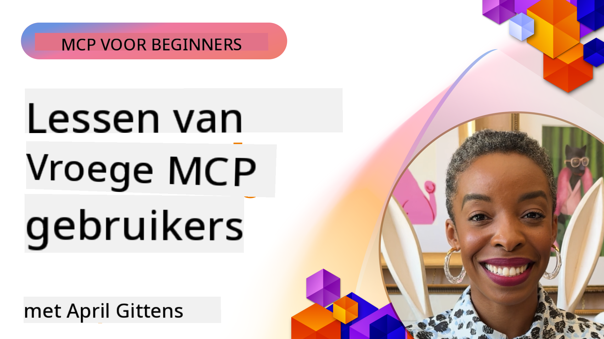

<!--
CO_OP_TRANSLATOR_METADATA:
{
  "original_hash": "41f16dac486d2086a53bc644a01cbe42",
  "translation_date": "2025-08-18T16:25:54+00:00",
  "source_file": "07-LessonsfromEarlyAdoption/README.md",
  "language_code": "nl"
}
-->
# 🌟 Lessen van Vroege Gebruikers

[](https://youtu.be/jds7dSmNptE)

_(Klik op de afbeelding hierboven om de video van deze les te bekijken)_

## 🎯 Wat Deze Module Behandelt

Deze module onderzoekt hoe echte organisaties en ontwikkelaars het Model Context Protocol (MCP) gebruiken om praktische uitdagingen op te lossen en innovatie te stimuleren. Door middel van gedetailleerde casestudies en praktische projecten ontdek je hoe MCP veilige, schaalbare AI-integratie mogelijk maakt die taalmodellen, tools en bedrijfsdata verbindt.

### 📚 Zie MCP in Actie

Wil je zien hoe deze principes worden toegepast in productieklare tools? Bekijk onze [**10 Microsoft MCP Servers Die de Productiviteit van Ontwikkelaars Transformeren**](microsoft-mcp-servers.md), waarin echte Microsoft MCP-servers worden getoond die je vandaag kunt gebruiken.

## Overzicht

Deze les onderzoekt hoe vroege gebruikers het Model Context Protocol (MCP) hebben ingezet om uitdagingen in de echte wereld op te lossen en innovatie in verschillende industrieën te stimuleren. Door middel van gedetailleerde casestudies en praktische projecten leer je hoe MCP gestandaardiseerde, veilige en schaalbare AI-integratie mogelijk maakt—grote taalmodellen, tools en bedrijfsdata worden verbonden in een uniform framework. Je krijgt praktische ervaring met het ontwerpen en bouwen van MCP-gebaseerde oplossingen, leert van bewezen implementatiepatronen en ontdekt best practices voor het inzetten van MCP in productieomgevingen. De les belicht ook opkomende trends, toekomstige richtingen en open-source bronnen om je te helpen aan de top te blijven van MCP-technologie en het evoluerende ecosysteem.

## Leerdoelen

- Analyseer echte MCP-implementaties in verschillende industrieën
- Ontwerp en bouw complete MCP-gebaseerde applicaties
- Verken opkomende trends en toekomstige richtingen in MCP-technologie
- Pas best practices toe in daadwerkelijke ontwikkelscenario's

## Echte MCP-Implementaties

### Casestudy 1: Automatisering van Klantenservice voor Bedrijven

Een multinationale onderneming implementeerde een MCP-gebaseerde oplossing om AI-interacties in hun klantenservicesystemen te standaardiseren. Dit stelde hen in staat om:

- Een uniforme interface te creëren voor meerdere LLM-providers
- Consistent promptbeheer te handhaven tussen afdelingen
- Robuuste beveiligings- en compliancecontroles te implementeren
- Gemakkelijk te schakelen tussen verschillende AI-modellen op basis van specifieke behoeften

**Technische Implementatie:**

```python
# Python MCP server implementation for customer support
import logging
import asyncio
from modelcontextprotocol import create_server, ServerConfig
from modelcontextprotocol.server import MCPServer
from modelcontextprotocol.transports import create_http_transport
from modelcontextprotocol.resources import ResourceDefinition
from modelcontextprotocol.prompts import PromptDefinition
from modelcontextprotocol.tool import ToolDefinition

# Configure logging
logging.basicConfig(level=logging.INFO)

async def main():
    # Create server configuration
    config = ServerConfig(
        name="Enterprise Customer Support Server",
        version="1.0.0",
        description="MCP server for handling customer support inquiries"
    )
    
    # Initialize MCP server
    server = create_server(config)
    
    # Register knowledge base resources
    server.resources.register(
        ResourceDefinition(
            name="customer_kb",
            description="Customer knowledge base documentation"
        ),
        lambda params: get_customer_documentation(params)
    )
    
    # Register prompt templates
    server.prompts.register(
        PromptDefinition(
            name="support_template",
            description="Templates for customer support responses"
        ),
        lambda params: get_support_templates(params)
    )
    
    # Register support tools
    server.tools.register(
        ToolDefinition(
            name="ticketing",
            description="Create and update support tickets"
        ),
        handle_ticketing_operations
    )
    
    # Start server with HTTP transport
    transport = create_http_transport(port=8080)
    await server.run(transport)

if __name__ == "__main__":
    asyncio.run(main())
```

**Resultaten:** 30% reductie in modelkosten, 45% verbetering in responsconsistentie en verbeterde compliance in wereldwijde operaties.

### Casestudy 2: Diagnostische Assistent voor de Gezondheidszorg

Een zorgverlener ontwikkelde een MCP-infrastructuur om meerdere gespecialiseerde medische AI-modellen te integreren, terwijl gevoelige patiëntgegevens beschermd bleven:

- Naadloos schakelen tussen generalistische en specialistische medische modellen
- Strikte privacycontroles en audit trails
- Integratie met bestaande Elektronische Patiëntendossiers (EHR)
- Consistente prompt-engineering voor medische terminologie

**Technische Implementatie:**

```csharp
// C# MCP host application implementation in healthcare application
using Microsoft.Extensions.DependencyInjection;
using ModelContextProtocol.SDK.Client;
using ModelContextProtocol.SDK.Security;
using ModelContextProtocol.SDK.Resources;

public class DiagnosticAssistant
{
    private readonly MCPHostClient _mcpClient;
    private readonly PatientContext _patientContext;
    
    public DiagnosticAssistant(PatientContext patientContext)
    {
        _patientContext = patientContext;
        
        // Configure MCP client with healthcare-specific settings
        var clientOptions = new ClientOptions
        {
            Name = "Healthcare Diagnostic Assistant",
            Version = "1.0.0",
            Security = new SecurityOptions
            {
                Encryption = EncryptionLevel.Medical,
                AuditEnabled = true
            }
        };
        
        _mcpClient = new MCPHostClientBuilder()
            .WithOptions(clientOptions)
            .WithTransport(new HttpTransport("https://healthcare-mcp.example.org"))
            .WithAuthentication(new HIPAACompliantAuthProvider())
            .Build();
    }
    
    public async Task<DiagnosticSuggestion> GetDiagnosticAssistance(
        string symptoms, string patientHistory)
    {
        // Create request with appropriate resources and tool access
        var resourceRequest = new ResourceRequest
        {
            Name = "patient_records",
            Parameters = new Dictionary<string, object>
            {
                ["patientId"] = _patientContext.PatientId,
                ["requestingProvider"] = _patientContext.ProviderId
            }
        };
        
        // Request diagnostic assistance using appropriate prompt
        var response = await _mcpClient.SendPromptRequestAsync(
            promptName: "diagnostic_assistance",
            parameters: new Dictionary<string, object>
            {
                ["symptoms"] = symptoms,
                patientHistory = patientHistory,
                relevantGuidelines = _patientContext.GetRelevantGuidelines()
            });
            
        return DiagnosticSuggestion.FromMCPResponse(response);
    }
}
```

**Resultaten:** Verbeterde diagnostische suggesties voor artsen, volledige naleving van HIPAA en significante vermindering van contextwisselingen tussen systemen.

### Casestudy 3: Risicoanalyse in Financiële Diensten

Een financiële instelling implementeerde MCP om hun risicoanalyseprocessen te standaardiseren tussen verschillende afdelingen:

- Een uniforme interface gecreëerd voor kredietrisico, fraudedetectie en investeringsrisicomodellen
- Strikte toegangscontroles en modelversiebeheer geïmplementeerd
- Auditbaarheid van alle AI-aanbevelingen gewaarborgd
- Consistente dataformattering gehandhaafd tussen diverse systemen

**Technische Implementatie:**

```java
// Java MCP server for financial risk assessment
import org.mcp.server.*;
import org.mcp.security.*;

public class FinancialRiskMCPServer {
    public static void main(String[] args) {
        // Create MCP server with financial compliance features
        MCPServer server = new MCPServerBuilder()
            .withModelProviders(
                new ModelProvider("risk-assessment-primary", new AzureOpenAIProvider()),
                new ModelProvider("risk-assessment-audit", new LocalLlamaProvider())
            )
            .withPromptTemplateDirectory("./compliance/templates")
            .withAccessControls(new SOCCompliantAccessControl())
            .withDataEncryption(EncryptionStandard.FINANCIAL_GRADE)
            .withVersionControl(true)
            .withAuditLogging(new DatabaseAuditLogger())
            .build();
            
        server.addRequestValidator(new FinancialDataValidator());
        server.addResponseFilter(new PII_RedactionFilter());
        
        server.start(9000);
        
        System.out.println("Financial Risk MCP Server running on port 9000");
    }
}
```

**Resultaten:** Verbeterde naleving van regelgeving, 40% snellere modelimplementatiecycli en verbeterde consistentie in risicoanalyse tussen afdelingen.

### Casestudy 4: Microsoft Playwright MCP Server voor Browserautomatisering

Microsoft ontwikkelde de [Playwright MCP-server](https://github.com/microsoft/playwright-mcp) om veilige, gestandaardiseerde browserautomatisering mogelijk te maken via het Model Context Protocol. Deze productieklare server stelt AI-agenten en LLM's in staat om gecontroleerd, controleerbaar en uitbreidbaar met webbrowsers te communiceren—voor toepassingen zoals geautomatiseerd webtesten, data-extractie en end-to-end workflows.

> **🎯 Productieklaar Hulpmiddel**
> 
> Deze casestudy toont een echte MCP-server die je vandaag kunt gebruiken! Lees meer over de Playwright MCP Server en 9 andere productieklare Microsoft MCP-servers in onze [**Microsoft MCP Servers Gids**](microsoft-mcp-servers.md#8--playwright-mcp-server).

**Belangrijkste Kenmerken:**
- Biedt browserautomatiseringsmogelijkheden (navigatie, formulierinvulling, schermafbeeldingen, etc.) als MCP-tools
- Implementeert strikte toegangscontroles en sandboxing om ongeautoriseerde acties te voorkomen
- Levert gedetailleerde auditlogs voor alle browserinteracties
- Ondersteunt integratie met Azure OpenAI en andere LLM-providers voor agentgestuurde automatisering
- Voedt GitHub Copilot's Coding Agent met webbrowsermogelijkheden

**Technische Implementatie:**

```typescript
// TypeScript: Registering Playwright browser automation tools in an MCP server
import { createServer, ToolDefinition } from 'modelcontextprotocol';
import { launch } from 'playwright';

const server = createServer({
  name: 'Playwright MCP Server',
  version: '1.0.0',
  description: 'MCP server for browser automation using Playwright'
});

// Register a tool for navigating to a URL and capturing a screenshot
server.tools.register(
  new ToolDefinition({
    name: 'navigate_and_screenshot',
    description: 'Navigate to a URL and capture a screenshot',
    parameters: {
      url: { type: 'string', description: 'The URL to visit' }
    }
  }),
  async ({ url }) => {
    const browser = await launch();
    const page = await browser.newPage();
    await page.goto(url);
    const screenshot = await page.screenshot();
    await browser.close();
    return { screenshot };
  }
);

// Start the MCP server
server.listen(8080);
```

**Resultaten:**

- Veilige, programmatische browserautomatisering mogelijk gemaakt voor AI-agenten en LLM's
- Verminderde handmatige testinspanning en verbeterde testdekking voor webapplicaties
- Een herbruikbaar, uitbreidbaar framework geleverd voor browsergebaseerde toolintegratie in bedrijfsomgevingen
- Voedt GitHub Copilot's webbrowsermogelijkheden

**Referenties:**

- [Playwright MCP Server GitHub Repository](https://github.com/microsoft/playwright-mcp)
- [Microsoft AI en Automatiseringsoplossingen](https://azure.microsoft.com/en-us/products/ai-services/)

### Casestudy 5: Azure MCP – Enterprise-Grade Model Context Protocol als een Service

Azure MCP Server ([https://aka.ms/azmcp](https://aka.ms/azmcp)) is Microsoft’s beheerde, enterprise-grade implementatie van het Model Context Protocol, ontworpen om schaalbare, veilige en conforme MCP-servermogelijkheden als een clouddienst te bieden. Azure MCP stelt organisaties in staat om MCP-servers snel te implementeren, beheren en integreren met Azure AI, data en beveiligingsdiensten, waardoor operationele overhead wordt verminderd en AI-adoptie wordt versneld.

> **🎯 Productieklaar Hulpmiddel**
> 
> Dit is een echte MCP-server die je vandaag kunt gebruiken! Lees meer over de Azure AI Foundry MCP Server in onze [**Microsoft MCP Servers Gids**](microsoft-mcp-servers.md).

- Volledig beheerde MCP-serverhosting met ingebouwde schaalbaarheid, monitoring en beveiliging
- Native integratie met Azure OpenAI, Azure AI Search en andere Azure-diensten
- Enterprise-authenticatie en -autorisatie via Microsoft Entra ID
- Ondersteuning voor aangepaste tools, prompttemplates en resourceconnectors
- Naleving van bedrijfsbeveiliging en regelgevingsvereisten

**Technische Implementatie:**

```yaml
# Example: Azure MCP server deployment configuration (YAML)
apiVersion: mcp.microsoft.com/v1
kind: McpServer
metadata:
  name: enterprise-mcp-server
spec:
  modelProviders:
    - name: azure-openai
      type: AzureOpenAI
      endpoint: https://<your-openai-resource>.openai.azure.com/
      apiKeySecret: <your-azure-keyvault-secret>
  tools:
    - name: document_search
      type: AzureAISearch
      endpoint: https://<your-search-resource>.search.windows.net/
      apiKeySecret: <your-azure-keyvault-secret>
  authentication:
    type: EntraID
    tenantId: <your-tenant-id>
  monitoring:
    enabled: true
    logAnalyticsWorkspace: <your-log-analytics-id>
```

**Resultaten:**  
- Verminderde time-to-value voor bedrijfs-AI-projecten door een kant-en-klare, conforme MCP-serverplatform te bieden  
- Vereenvoudigde integratie van LLM's, tools en bedrijfsdatabronnen  
- Verbeterde beveiliging, observatie en operationele efficiëntie voor MCP-werkbelastingen  
- Verbeterde codekwaliteit met Azure SDK best practices en actuele authenticatiepatronen  

**Referenties:**  
- [Azure MCP Documentatie](https://aka.ms/azmcp)  
- [Azure MCP Server GitHub Repository](https://github.com/Azure/azure-mcp)  
- [Azure AI Services](https://azure.microsoft.com/en-us/products/ai-services/)  
- [Microsoft MCP Center](https://mcp.azure.com)

### Casestudy 6: NLWeb

MCP (Model Context Protocol) is een opkomend protocol voor chatbots en AI-assistenten om met tools te communiceren. Elke NLWeb-instantie is ook een MCP-server, die één kernmethode ondersteunt, ask, waarmee een website een vraag in natuurlijke taal kan worden gesteld. Het geretourneerde antwoord maakt gebruik van schema.org, een veelgebruikte vocabulaire voor het beschrijven van webdata. Vrijwel gesproken is MCP voor NLWeb wat Http is voor HTML. NLWeb combineert protocollen, Schema.org-formaten en voorbeeldcode om sites snel te helpen deze eindpunten te creëren, wat zowel mensen via conversatie-interfaces als machines via natuurlijke agent-naar-agent interactie ten goede komt.

Er zijn twee onderscheidende componenten van NLWeb:
- Een protocol, zeer eenvoudig om mee te beginnen, om met een site in natuurlijke taal te communiceren en een formaat, gebruikmakend van json en schema.org voor het geretourneerde antwoord. Zie de documentatie over de REST API voor meer details.
- Een eenvoudige implementatie van (1) die gebruik maakt van bestaande markup, voor sites die kunnen worden geabstraheerd als lijsten van items (producten, recepten, attracties, beoordelingen, etc.). Samen met een set gebruikersinterface-widgets kunnen sites gemakkelijk conversatie-interfaces bieden voor hun inhoud. Zie de documentatie over Life of a chat query voor meer details over hoe dit werkt.

**Referenties:**  
- [Azure MCP Documentatie](https://aka.ms/azmcp)  
- [NLWeb](https://github.com/microsoft/NlWeb)

### Casestudy 7: Azure AI Foundry MCP Server – Integratie van Enterprise AI Agenten

Azure AI Foundry MCP-servers demonstreren hoe MCP kan worden gebruikt om AI-agenten en workflows in bedrijfsomgevingen te orkestreren en beheren. Door MCP te integreren met Azure AI Foundry kunnen organisaties agentinteracties standaardiseren, gebruik maken van Foundry's workflowbeheer en zorgen voor veilige, schaalbare implementaties.

> **🎯 Productieklaar Hulpmiddel**
> 
> Dit is een echte MCP-server die je vandaag kunt gebruiken! Lees meer over de Azure AI Foundry MCP Server in onze [**Microsoft MCP Servers Gids**](microsoft-mcp-servers.md#9--azure-ai-foundry-mcp-server).

**Belangrijkste Kenmerken:**
- Uitgebreide toegang tot Azure's AI-ecosysteem, inclusief modelcatalogi en implementatiebeheer
- Kennisindexering met Azure AI Search voor RAG-toepassingen
- Evaluatietools voor AI-modelprestaties en kwaliteitsborging
- Integratie met Azure AI Foundry Catalog en Labs voor geavanceerde onderzoeksmodellen
- Agentbeheer en evaluatiemogelijkheden voor productieomgevingen

**Resultaten:**
- Snelle prototyping en robuuste monitoring van AI-agentworkflows
- Naadloze integratie met Azure AI-diensten voor geavanceerde scenario's
- Uniforme interface voor het bouwen, implementeren en monitoren van agentpipelines
- Verbeterde beveiliging, compliance en operationele efficiëntie voor bedrijven
- Versnelde AI-adoptie terwijl controle over complexe agentgestuurde processen behouden blijft

**Referenties:**
- [Azure AI Foundry MCP Server GitHub Repository](https://github.com/azure-ai-foundry/mcp-foundry)
- [Integratie van Azure AI Agenten met MCP (Microsoft Foundry Blog)](https://devblogs.microsoft.com/foundry/integrating-azure-ai-agents-mcp/)

### Casestudy 8: Foundry MCP Playground – Experimenteren en Prototypen

De Foundry MCP Playground biedt een kant-en-klare omgeving voor het experimenteren met MCP-servers en Azure AI Foundry-integraties. Ontwikkelaars kunnen snel AI-modellen en agentworkflows prototypen, testen en evalueren met behulp van bronnen uit de Azure AI Foundry Catalog en Labs. De playground vereenvoudigt de setup, biedt voorbeeldprojecten en ondersteunt collaboratieve ontwikkeling, waardoor het gemakkelijk wordt om best practices en nieuwe scenario's te verkennen met minimale overhead. Het is vooral nuttig voor teams die ideeën willen valideren, experimenten willen delen en leren willen versnellen zonder complexe infrastructuur. Door de drempel te verlagen, helpt de playground innovatie en communitybijdragen in het MCP- en Azure AI Foundry-ecosysteem te bevorderen.

**Referenties:**

- [Foundry MCP Playground GitHub Repository](https://github.com/azure-ai-foundry/foundry-mcp-playground)

### Casestudy 9: Microsoft Learn Docs MCP Server – AI-gestuurde Documentatietoegang

De Microsoft Learn Docs MCP Server is een cloud-gehoste service die AI-assistenten real-time toegang biedt tot officiële Microsoft-documentatie via het Model Context Protocol. Deze productieklare server verbindt met het uitgebreide Microsoft Learn-ecosysteem en maakt semantisch zoeken mogelijk in alle officiële Microsoft-bronnen.
> **🎯 Productieklaar hulpmiddel**  
>  
> Dit is een echte MCP-server die je vandaag nog kunt gebruiken! Lees meer over de Microsoft Learn Docs MCP Server in onze [**Microsoft MCP Servers Gids**](microsoft-mcp-servers.md#1--microsoft-learn-docs-mcp-server).
**Belangrijke Kenmerken:**
- Directe toegang tot officiële Microsoft-documentatie, Azure-documentatie en Microsoft 365-documentatie
- Geavanceerde semantische zoekmogelijkheden die context en intentie begrijpen
- Altijd actuele informatie zodra Microsoft Learn-inhoud wordt gepubliceerd
- Uitgebreide dekking van Microsoft Learn, Azure-documentatie en Microsoft 365-bronnen
- Levert tot 10 hoogwaardige inhoudsfragmenten met artikelkoppen en URL's

**Waarom Het Cruciaal Is:**
- Lost het probleem van "verouderde AI-kennis" op voor Microsoft-technologieën
- Zorgt ervoor dat AI-assistenten toegang hebben tot de nieuwste .NET-, C#-, Azure- en Microsoft 365-functies
- Biedt gezaghebbende, eerstelijnsinformatie voor nauwkeurige codegeneratie
- Essentieel voor ontwikkelaars die werken met snel evoluerende Microsoft-technologieën

**Resultaten:**
- Dramatisch verbeterde nauwkeurigheid van AI-gegenereerde code voor Microsoft-technologieën
- Verminderde tijd besteed aan het zoeken naar actuele documentatie en best practices
- Verbeterde ontwikkelaarsproductiviteit met contextbewuste documentatieretrieval
- Naadloze integratie met ontwikkelworkflows zonder de IDE te verlaten

**Referenties:**
- [Microsoft Learn Docs MCP Server GitHub Repository](https://github.com/MicrosoftDocs/mcp)
- [Microsoft Learn Documentatie](https://learn.microsoft.com/)

## Praktische Projecten

### Project 1: Bouw een Multi-Provider MCP Server

**Doelstelling:** Maak een MCP-server die verzoeken kan routeren naar meerdere AI-modelproviders op basis van specifieke criteria.

**Vereisten:**

- Ondersteun ten minste drie verschillende modelproviders (bijv. OpenAI, Anthropic, lokale modellen)
- Implementeer een routeringsmechanisme op basis van metadata van verzoeken
- Maak een configuratiesysteem voor het beheren van providerreferenties
- Voeg caching toe om prestaties en kosten te optimaliseren
- Bouw een eenvoudig dashboard voor het monitoren van gebruik

**Implementatiestappen:**

1. Stel de basisinfrastructuur van de MCP-server in
2. Implementeer provideradapters voor elke AI-modelservice
3. Maak de routeringslogica op basis van verzoekattributen
4. Voeg cachingmechanismen toe voor veelvoorkomende verzoeken
5. Ontwikkel het monitoringsdashboard
6. Test met verschillende verzoekpatronen

**Technologieën:** Kies uit Python (.NET/Java/Python afhankelijk van je voorkeur), Redis voor caching en een eenvoudig webframework voor het dashboard.

### Project 2: Enterprise Prompt Management Systeem

**Doelstelling:** Ontwikkel een MCP-gebaseerd systeem voor het beheren, versiebeheer en implementeren van promptsjablonen binnen een organisatie.

**Vereisten:**

- Maak een gecentraliseerde repository voor promptsjablonen
- Implementeer versiebeheer- en goedkeuringsworkflows
- Bouw testmogelijkheden voor sjablonen met voorbeeldinvoer
- Ontwikkel op rollen gebaseerde toegangscontroles
- Maak een API voor het ophalen en implementeren van sjablonen

**Implementatiestappen:**

1. Ontwerp het databaseschema voor sjabloonopslag
2. Maak de kern-API voor CRUD-bewerkingen op sjablonen
3. Implementeer het versiebeheersysteem
4. Bouw de goedkeuringsworkflow
5. Ontwikkel het testframework
6. Maak een eenvoudige webinterface voor beheer
7. Integreer met een MCP-server

**Technologieën:** Je keuze van backendframework, SQL- of NoSQL-database en een frontendframework voor de beheerinterface.

### Project 3: MCP-gebaseerd Contentgeneratieplatform

**Doelstelling:** Bouw een contentgeneratieplatform dat MCP gebruikt om consistente resultaten te leveren voor verschillende contenttypen.

**Vereisten:**

- Ondersteun meerdere contentformaten (blogposts, sociale media, marketingteksten)
- Implementeer sjabloongebaseerde generatie met aanpassingsopties
- Maak een contentreview- en feedbacksysteem
- Volg prestatiestatistieken van content
- Ondersteun versiebeheer en iteratie van content

**Implementatiestappen:**

1. Stel de MCP-clientinfrastructuur in
2. Maak sjablonen voor verschillende contenttypen
3. Bouw de contentgeneratiepijplijn
4. Implementeer het reviewsysteem
5. Ontwikkel het statistiekensysteem
6. Maak een gebruikersinterface voor sjabloonbeheer en contentgeneratie

**Technologieën:** Je voorkeursprogrammeertaal, webframework en databasesysteem.

## Toekomstige Richtingen voor MCP-technologie

### Opkomende Trends

1. **Multi-Modale MCP**
   - Uitbreiding van MCP om interacties met beeld-, audio- en videomodellen te standaardiseren
   - Ontwikkeling van cross-modale redeneercapaciteiten
   - Gestandaardiseerde promptformaten voor verschillende modaliteiten

2. **Federatieve MCP-infrastructuur**
   - Gedistribueerde MCP-netwerken die middelen kunnen delen tussen organisaties
   - Gestandaardiseerde protocollen voor veilige modeldeling
   - Privacybeschermende rekentechnieken

3. **MCP-marktplaatsen**
   - Ecosystemen voor het delen en monetariseren van MCP-sjablonen en plug-ins
   - Kwaliteitsborging en certificeringsprocessen
   - Integratie met modelmarktplaatsen

4. **MCP voor Edge Computing**
   - Aanpassing van MCP-standaarden voor resourcebeperkte edge-apparaten
   - Geoptimaliseerde protocollen voor omgevingen met lage bandbreedte
   - Gespecialiseerde MCP-implementaties voor IoT-ecosystemen

5. **Regelgevingskaders**
   - Ontwikkeling van MCP-extensies voor naleving van regelgeving
   - Gestandaardiseerde audittrails en uitlegbaarheidsinterfaces
   - Integratie met opkomende AI-governancekaders

### MCP-oplossingen van Microsoft

Microsoft en Azure hebben verschillende open-source repositories ontwikkeld om ontwikkelaars te helpen MCP in verschillende scenario's te implementeren:

#### Microsoft Organisatie

1. [playwright-mcp](https://github.com/microsoft/playwright-mcp) - Een Playwright MCP-server voor browserautomatisering en testen
2. [files-mcp-server](https://github.com/microsoft/files-mcp-server) - Een OneDrive MCP-serverimplementatie voor lokaal testen en bijdragen van de gemeenschap
3. [NLWeb](https://github.com/microsoft/NlWeb) - NLWeb is een verzameling open protocollen en bijbehorende open source-tools. Het richt zich op het leggen van een fundamentele laag voor het AI-web

#### Azure-Samples Organisatie

1. [mcp](https://github.com/Azure-Samples/mcp) - Links naar voorbeelden, tools en bronnen voor het bouwen en integreren van MCP-servers op Azure met meerdere talen
2. [mcp-auth-servers](https://github.com/Azure-Samples/mcp-auth-servers) - Referentie MCP-servers die authenticatie demonstreren met de huidige Model Context Protocol-specificatie
3. [remote-mcp-functions](https://github.com/Azure-Samples/remote-mcp-functions) - Landingspagina voor Remote MCP Server-implementaties in Azure Functions met links naar taal specifieke repositories
4. [remote-mcp-functions-python](https://github.com/Azure-Samples/remote-mcp-functions-python) - Quickstart-sjabloon voor het bouwen en implementeren van aangepaste remote MCP-servers met Azure Functions en Python
5. [remote-mcp-functions-dotnet](https://github.com/Azure-Samples/remote-mcp-functions-dotnet) - Quickstart-sjabloon voor het bouwen en implementeren van aangepaste remote MCP-servers met Azure Functions en .NET/C#
6. [remote-mcp-functions-typescript](https://github.com/Azure-Samples/remote-mcp-functions-typescript) - Quickstart-sjabloon voor het bouwen en implementeren van aangepaste remote MCP-servers met Azure Functions en TypeScript
7. [remote-mcp-apim-functions-python](https://github.com/Azure-Samples/remote-mcp-apim-functions-python) - Azure API Management als AI Gateway naar Remote MCP-servers met Python
8. [AI-Gateway](https://github.com/Azure-Samples/AI-Gateway) - APIM ❤️ AI-experimenten inclusief MCP-mogelijkheden, integratie met Azure OpenAI en AI Foundry

Deze repositories bieden verschillende implementaties, sjablonen en bronnen voor het werken met het Model Context Protocol in verschillende programmeertalen en Azure-services. Ze bestrijken een reeks use-cases, van basisserverimplementaties tot authenticatie, cloudimplementatie en bedrijfsintegratiescenario's.

#### MCP Resources Directory

De [MCP Resources directory](https://github.com/microsoft/mcp/tree/main/Resources) in de officiële Microsoft MCP-repository biedt een samengestelde verzameling voorbeeldbronnen, promptsjablonen en tooldefinities voor gebruik met Model Context Protocol-servers. Deze directory is ontworpen om ontwikkelaars snel op weg te helpen met MCP door herbruikbare bouwstenen en best practice-voorbeelden te bieden voor:

- **Promptsjablonen:** Kant-en-klare promptsjablonen voor veelvoorkomende AI-taken en scenario's, die kunnen worden aangepast voor je eigen MCP-serverimplementaties.
- **Tooldefinities:** Voorbeeldtoolschema's en metadata om toolintegratie en -aanroep te standaardiseren tussen verschillende MCP-servers.
- **Bronvoorbeelden:** Voorbeeldbronnen voor verbinding met gegevensbronnen, API's en externe services binnen het MCP-framework.
- **Referentie-implementaties:** Praktische voorbeelden die laten zien hoe je bronnen, prompts en tools structureert en organiseert in real-world MCP-projecten.

Deze bronnen versnellen de ontwikkeling, bevorderen standaardisatie en helpen best practices te waarborgen bij het bouwen en implementeren van MCP-gebaseerde oplossingen.

#### MCP Resources Directory

- [MCP Resources (Voorbeeld Prompts, Tools en Brondefinities)](https://github.com/microsoft/mcp/tree/main/Resources)

### Onderzoeksmogelijkheden

- Efficiënte promptoptimalisatietechnieken binnen MCP-frameworks
- Beveiligingsmodellen voor multi-tenant MCP-implementaties
- Prestatiebenchmarking tussen verschillende MCP-implementaties
- Formele verificatiemethoden voor MCP-servers

## Conclusie

Het Model Context Protocol (MCP) vormt snel de toekomst van gestandaardiseerde, veilige en interoperabele AI-integratie in verschillende sectoren. Door de casestudy's en praktische projecten in deze les heb je gezien hoe vroege gebruikers—waaronder Microsoft en Azure—MCP benutten om echte uitdagingen op te lossen, AI-adoptie te versnellen en naleving, beveiliging en schaalbaarheid te waarborgen. De modulaire aanpak van MCP stelt organisaties in staat om grote taalmodellen, tools en bedrijfsgegevens te verbinden in een uniform, controleerbaar framework. Naarmate MCP zich blijft ontwikkelen, zal betrokkenheid bij de gemeenschap, het verkennen van open-sourcebronnen en het toepassen van best practices cruciaal zijn voor het bouwen van robuuste, toekomstbestendige AI-oplossingen.

## Aanvullende Bronnen

- [MCP Foundry GitHub Repository](https://github.com/azure-ai-foundry/mcp-foundry)
- [Foundry MCP Playground](https://github.com/azure-ai-foundry/foundry-mcp-playground)
- [Integrating Azure AI Agents with MCP (Microsoft Foundry Blog)](https://devblogs.microsoft.com/foundry/integrating-azure-ai-agents-mcp/)
- [MCP GitHub Repository (Microsoft)](https://github.com/microsoft/mcp)
- [MCP Resources Directory (Voorbeeld Prompts, Tools en Brondefinities)](https://github.com/microsoft/mcp/tree/main/Resources)
- [MCP Community & Documentation](https://modelcontextprotocol.io/introduction)
- [Azure MCP Documentatie](https://aka.ms/azmcp)
- [Playwright MCP Server GitHub Repository](https://github.com/microsoft/playwright-mcp)
- [Files MCP Server (OneDrive)](https://github.com/microsoft/files-mcp-server)
- [Azure-Samples MCP](https://github.com/Azure-Samples/mcp)
- [MCP Auth Servers (Azure-Samples)](https://github.com/Azure-Samples/mcp-auth-servers)
- [Remote MCP Functions (Azure-Samples)](https://github.com/Azure-Samples/remote-mcp-functions)
- [Remote MCP Functions Python (Azure-Samples)](https://github.com/Azure-Samples/remote-mcp-functions-python)
- [Remote MCP Functions .NET (Azure-Samples)](https://github.com/Azure-Samples/remote-mcp-functions-dotnet)
- [Remote MCP Functions TypeScript (Azure-Samples)](https://github.com/Azure-Samples/remote-mcp-functions-typescript)
- [Remote MCP APIM Functions Python (Azure-Samples)](https://github.com/Azure-Samples/remote-mcp-apim-functions-python)
- [AI-Gateway (Azure-Samples)](https://github.com/Azure-Samples/AI-Gateway)
- [Microsoft AI en Automatiseringsoplossingen](https://azure.microsoft.com/en-us/products/ai-services/)

## Oefeningen

1. Analyseer een van de casestudy's en stel een alternatieve implementatiebenadering voor.
2. Kies een van de projectideeën en maak een gedetailleerde technische specificatie.
3. Onderzoek een industrie die niet in de casestudy's is behandeld en schets hoe MCP specifieke uitdagingen kan aanpakken.
4. Verken een van de toekomstige richtingen en maak een concept voor een nieuwe MCP-extensie om deze te ondersteunen.

Volgende: [Microsoft MCP Server](../07-LessonsfromEarlyAdoption/microsoft-mcp-servers.md)

**Disclaimer**:  
Dit document is vertaald met behulp van de AI-vertalingsservice [Co-op Translator](https://github.com/Azure/co-op-translator). Hoewel we streven naar nauwkeurigheid, dient u zich ervan bewust te zijn dat geautomatiseerde vertalingen fouten of onnauwkeurigheden kunnen bevatten. Het originele document in de oorspronkelijke taal moet worden beschouwd als de gezaghebbende bron. Voor cruciale informatie wordt professionele menselijke vertaling aanbevolen. Wij zijn niet aansprakelijk voor eventuele misverstanden of verkeerde interpretaties die voortvloeien uit het gebruik van deze vertaling.