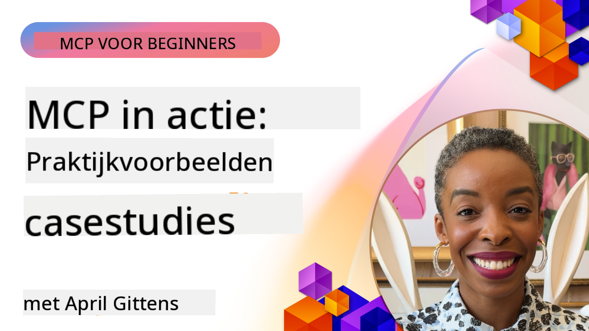

<!--
CO_OP_TRANSLATOR_METADATA:
{
  "original_hash": "1611dc5f6a2a35a789fc4c95fc5bfbe8",
  "translation_date": "2025-09-26T18:40:24+00:00",
  "source_file": "09-CaseStudy/README.md",
  "language_code": "nl"
}
-->
# MCP in Actie: Praktijkvoorbeelden uit de echte wereld

_(Klik op de afbeelding hierboven om de video van deze les te bekijken)_

Het Model Context Protocol (MCP) transformeert hoe AI-toepassingen omgaan met data, tools en diensten. In deze sectie worden praktijkvoorbeelden gepresenteerd die laten zien hoe MCP wordt toegepast in verschillende zakelijke scenario's.

## Overzicht

Deze sectie toont concrete voorbeelden van MCP-implementaties en benadrukt hoe organisaties dit protocol gebruiken om complexe zakelijke uitdagingen op te lossen. Door deze case studies te bestuderen, krijg je inzicht in de veelzijdigheid, schaalbaarheid en praktische voordelen van MCP in de praktijk.

## Belangrijke Leerdoelen

Door deze case studies te verkennen, leer je:

- Hoe MCP kan worden toegepast om specifieke zakelijke problemen op te lossen
- Verschillende integratiepatronen en architecturale benaderingen
- Best practices voor het implementeren van MCP in zakelijke omgevingen
- Inzichten in de uitdagingen en oplossingen die worden aangetroffen bij implementaties in de praktijk
- Mogelijkheden om vergelijkbare patronen toe te passen in je eigen projecten

## Uitgelichte Case Studies

### 1. [Azure AI Reisagenten – Referentie-implementatie](./travelagentsample.md)

Deze case study onderzoekt Microsoft's uitgebreide referentieoplossing die laat zien hoe je een multi-agent, AI-gestuurde reisplanningsapplicatie kunt bouwen met MCP, Azure OpenAI en Azure AI Search. Het project toont:

- Multi-agent orkestratie via MCP
- Integratie van bedrijfsdata met Azure AI Search
- Veilige, schaalbare architectuur met Azure-diensten
- Uitbreidbare tools met herbruikbare MCP-componenten
- Conversatiegerichte gebruikerservaring aangedreven door Azure OpenAI

De architectuur en implementatiedetails bieden waardevolle inzichten in het bouwen van complexe, multi-agent systemen met MCP als coördinatielaag.

### 2. [Azure DevOps-items bijwerken met YouTube-data](./UpdateADOItemsFromYT.md)

Deze case study laat een praktische toepassing van MCP zien voor het automatiseren van werkprocessen. Het toont hoe MCP-tools kunnen worden gebruikt om:

- Data te extraheren van online platforms (YouTube)
- Werkitems bij te werken in Azure DevOps-systemen
- Herhaalbare automatiseringsworkflows te creëren
- Data te integreren tussen verschillende systemen

Dit voorbeeld illustreert hoe zelfs relatief eenvoudige MCP-implementaties aanzienlijke efficiëntieverbeteringen kunnen opleveren door routinetaken te automatiseren en de dataconsistentie tussen systemen te verbeteren.

### 3. [Realtime documentatie ophalen met MCP](./docs-mcp/README.md)

Deze case study begeleidt je bij het verbinden van een Python-consoleclient met een Model Context Protocol (MCP)-server om realtime, contextbewuste Microsoft-documentatie op te halen en te loggen. Je leert hoe je:

- Verbinding maakt met een MCP-server met een Python-client en de officiële MCP SDK
- Streaming HTTP-clients gebruikt voor efficiënte, realtime data-ophaling
- Documentatietools op de server aanroept en reacties direct naar de console logt
- Actuele Microsoft-documentatie integreert in je workflow zonder de terminal te verlaten

Het hoofdstuk bevat een praktische opdracht, een minimaal werkend codevoorbeeld en links naar aanvullende bronnen voor verdere verdieping. Bekijk de volledige walkthrough en code in het gekoppelde hoofdstuk om te begrijpen hoe MCP documentatietoegang en ontwikkelaarsproductiviteit in console-gebaseerde omgevingen kan transformeren.

### 4. [Interactieve studieplangenerator webapp met MCP](./docs-mcp/README.md)

Deze case study laat zien hoe je een interactieve webapplicatie kunt bouwen met Chainlit en het Model Context Protocol (MCP) om gepersonaliseerde studieplannen te genereren voor elk onderwerp. Gebruikers kunnen een onderwerp specificeren (zoals "AI-900 certificering") en een studieduur (bijv. 8 weken), en de app biedt een week-tot-week overzicht van aanbevolen inhoud. Chainlit zorgt voor een conversatiegerichte chatinterface, waardoor de ervaring boeiend en adaptief is.

- Conversatiegerichte webapp aangedreven door Chainlit
- Gebruikersgestuurde prompts voor onderwerp en duur
- Week-tot-week inhoudsaanbevelingen met MCP
- Realtime, adaptieve reacties in een chatinterface

Het project illustreert hoe conversatie-AI en MCP kunnen worden gecombineerd om dynamische, gebruikersgestuurde educatieve tools te creëren in een moderne webomgeving.

### 5. [In-editor documentatie met MCP-server in VS Code](./docs-mcp/README.md)

Deze case study laat zien hoe je Microsoft Learn Docs direct in je VS Code-omgeving kunt brengen met de MCP-server—geen browsertabs meer wisselen! Je ziet hoe je:

- Direct documentatie kunt zoeken en lezen in VS Code via het MCP-paneel of de command palette
- Documentatie kunt refereren en links direct kunt invoegen in je README of cursus-markdownbestanden
- GitHub Copilot en MCP samen kunt gebruiken voor naadloze, AI-gestuurde documentatie- en codeworkflows
- Documentatie kunt valideren en verbeteren met realtime feedback en Microsoft-bronnen
- MCP kunt integreren met GitHub-workflows voor continue documentatievalidatie

De implementatie bevat:

- Een voorbeeld `.vscode/mcp.json` configuratie voor eenvoudige setup
- Walkthroughs op basis van screenshots van de in-editor ervaring
- Tips voor het combineren van Copilot en MCP voor maximale productiviteit

Dit scenario is ideaal voor cursusmakers, documentatieschrijvers en ontwikkelaars die gefocust willen blijven in hun editor terwijl ze werken met documentatie, Copilot en validatietools—allemaal aangedreven door MCP.

### 6. [APIM MCP-server maken](./apimsample.md)

Deze case study biedt een stapsgewijze handleiding voor het maken van een MCP-server met Azure API Management (APIM). Het behandelt:

- Het opzetten van een MCP-server in Azure API Management
- Het blootstellen van API-operaties als MCP-tools
- Het configureren van beleidsregels voor snelheidslimitering en beveiliging
- Het testen van de MCP-server met Visual Studio Code en GitHub Copilot

Dit voorbeeld illustreert hoe je de mogelijkheden van Azure kunt benutten om een robuuste MCP-server te creëren die in verschillende toepassingen kan worden gebruikt, waardoor de integratie van AI-systemen met bedrijfs-API's wordt verbeterd.

### 7. [GitHub MCP Registry — Versnelling van agentische integratie](https://github.com/mcp)

Deze case study onderzoekt hoe GitHub's MCP Registry, gelanceerd in september 2025, een cruciale uitdaging in het AI-ecosysteem aanpakt: de gefragmenteerde ontdekking en implementatie van Model Context Protocol (MCP)-servers.

#### Overzicht
De **MCP Registry** lost het groeiende probleem op van verspreide MCP-servers over repositories en registries, wat eerder integratie traag en foutgevoelig maakte. Deze servers stellen AI-agenten in staat om te communiceren met externe systemen zoals API's, databases en documentatiebronnen.

#### Probleemstelling
Ontwikkelaars die agentische workflows bouwen, stonden voor verschillende uitdagingen:
- **Slechte vindbaarheid** van MCP-servers op verschillende platforms
- **Overbodige setup-vragen** verspreid over forums en documentatie
- **Beveiligingsrisico's** door niet-geverifieerde en onbetrouwbare bronnen
- **Gebrek aan standaardisatie** in serverkwaliteit en compatibiliteit

#### Oplossingsarchitectuur
GitHub's MCP Registry centraliseert vertrouwde MCP-servers met belangrijke functies:
- **Eén-klik installatie** integratie via VS Code voor gestroomlijnde setup
- **Signal-over-noise sortering** op basis van sterren, activiteit en communityvalidatie
- **Directe integratie** met GitHub Copilot en andere MCP-compatibele tools
- **Open contributiemodel** dat zowel community- als zakelijke partners in staat stelt bij te dragen

#### Zakelijke Impact
Het register heeft meetbare verbeteringen opgeleverd:
- **Snellere onboarding** voor ontwikkelaars die tools zoals de Microsoft Learn MCP Server gebruiken, die officiële documentatie rechtstreeks in agenten streamt
- **Verbeterde productiviteit** via gespecialiseerde servers zoals `github-mcp-server`, die natuurlijke taal GitHub-automatisering mogelijk maken (PR-creatie, CI-heruitvoeringen, code-scanning)
- **Sterker ecosysteemvertrouwen** door gecureerde lijsten en transparante configuratiestandaarden

#### Strategische Waarde
Voor professionals die zich specialiseren in agent lifecycle management en reproduceerbare workflows biedt de MCP Registry:
- **Modulaire agentimplementatie** mogelijkheden met gestandaardiseerde componenten
- **Registry-ondersteunde evaluatiepijplijnen** voor consistente testen en validatie
- **Cross-tool interoperabiliteit** die naadloze integratie mogelijk maakt tussen verschillende AI-platforms

Deze case study laat zien dat de MCP Registry meer is dan alleen een directory—het is een fundamenteel platform voor schaalbare, praktische modelintegratie en agentische systeemimplementatie.

## Conclusie

Deze zeven uitgebreide case studies tonen de opmerkelijke veelzijdigheid en praktische toepassingen van het Model Context Protocol in diverse scenario's uit de echte wereld. Van complexe multi-agent reisplanningssystemen en zakelijke API-beheer tot gestroomlijnde documentatieworkflows en de revolutionaire GitHub MCP Registry, deze voorbeelden laten zien hoe MCP een gestandaardiseerde, schaalbare manier biedt om AI-systemen te verbinden met de tools, data en diensten die ze nodig hebben om uitzonderlijke waarde te leveren.

De case studies bestrijken meerdere dimensies van MCP-implementatie:
- **Zakelijke Integratie**: Azure API Management en Azure DevOps-automatisering
- **Multi-Agent Orkestratie**: Reisplanning met gecoördineerde AI-agenten
- **Ontwikkelaarsproductiviteit**: VS Code-integratie en realtime documentatietoegang
- **Ecosysteemontwikkeling**: GitHub's MCP Registry als fundamenteel platform
- **Educatieve Toepassingen**: Interactieve studieplangeneratoren en conversatieinterfaces

Door deze implementaties te bestuderen, krijg je cruciale inzichten in:
- **Architecturale patronen** voor verschillende schalen en gebruiksscenario's
- **Implementatiestrategieën** die functionaliteit en onderhoudbaarheid in balans brengen
- **Beveiligings- en schaalbaarheidsaspecten** voor productie-implementaties
- **Best practices** voor MCP-serverontwikkeling en clientintegratie
- **Ecosysteemdenken** voor het bouwen van onderling verbonden AI-oplossingen

Deze voorbeelden tonen gezamenlijk aan dat MCP niet slechts een theoretisch kader is, maar een volwassen, productieklare protocol dat praktische oplossingen biedt voor complexe zakelijke uitdagingen. Of je nu eenvoudige automatiseringstools bouwt of geavanceerde multi-agent systemen, de patronen en benaderingen die hier worden geïllustreerd bieden een solide basis voor je eigen MCP-projecten.

## Aanvullende Bronnen

- [Azure AI Reisagenten GitHub Repository](https://github.com/Azure-Samples/azure-ai-travel-agents)
- [Azure DevOps MCP Tool](https://github.com/microsoft/azure-devops-mcp)
- [Playwright MCP Tool](https://github.com/microsoft/playwright-mcp)
- [Microsoft Docs MCP Server](https://github.com/MicrosoftDocs/mcp)
- [GitHub MCP Registry — Versnelling van agentische integratie](https://github.com/mcp)
- [MCP Community Voorbeelden](https://github.com/microsoft/mcp)

Volgende: Hands-on Lab [AI Workflows stroomlijnen: Een MCP-server bouwen met AI Toolkit](../10-StreamliningAIWorkflowsBuildingAnMCPServerWithAIToolkit/README.md)

---

