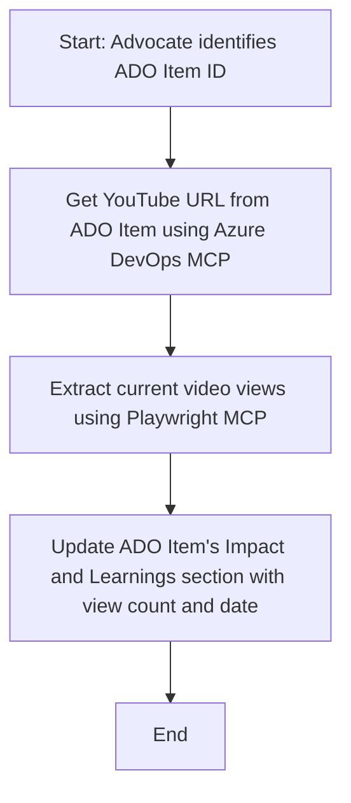

<!--
CO_OP_TRANSLATOR_METADATA:
{
  "original_hash": "14a2dfbea55ef735660a06bd6bdfe5f3",
  "translation_date": "2025-07-14T06:13:37+00:00",
  "source_file": "09-CaseStudy/UpdateADOItemsFromYT.md",
  "language_code": "nl"
}
-->
# Case Study: Azure DevOps-items bijwerken met YouTube-gegevens via MCP

> **Disclaimer:** Er bestaan al online tools en rapporten die het proces van het bijwerken van Azure DevOps-items met gegevens van platforms zoals YouTube kunnen automatiseren. Het volgende scenario wordt puur als voorbeeld gebruikt om te laten zien hoe MCP-tools kunnen worden ingezet voor automatisering en integratietaken.

## Overzicht

Deze case study laat zien hoe het Model Context Protocol (MCP) en de bijbehorende tools kunnen worden gebruikt om het proces van het bijwerken van Azure DevOps (ADO) work items met informatie van online platforms, zoals YouTube, te automatiseren. Het beschreven scenario is slechts één voorbeeld van de bredere mogelijkheden van deze tools, die kunnen worden aangepast aan veel vergelijkbare automatiseringsbehoeften.

In dit voorbeeld houdt een Advocate online sessies bij met ADO-items, waarbij elk item een YouTube-video-URL bevat. Door gebruik te maken van MCP-tools kan de Advocate de ADO-items automatisch en herhaalbaar up-to-date houden met de nieuwste videostatistieken, zoals het aantal weergaven. Deze aanpak is ook toepasbaar op andere situaties waarin informatie van online bronnen geïntegreerd moet worden in ADO of andere systemen.

## Scenario

Een Advocate is verantwoordelijk voor het bijhouden van de impact van online sessies en community-betrokkenheid. Elke sessie wordt vastgelegd als een ADO work item in het 'DevRel'-project, waarbij het work item een veld bevat voor de YouTube-video-URL. Om de reikwijdte van de sessie nauwkeurig te rapporteren, moet de Advocate het ADO-item bijwerken met het actuele aantal videoweergaven en de datum waarop deze informatie is opgehaald.

## Gebruikte Tools

- [Azure DevOps MCP](https://github.com/microsoft/azure-devops-mcp): Maakt programmatische toegang en updates van ADO work items mogelijk via MCP.
- [Playwright MCP](https://github.com/microsoft/playwright-mcp): Automatiseert browseracties om live data van webpagina’s te halen, zoals YouTube-video statistieken.

## Stapsgewijze Werkwijze

1. **Identificeer het ADO-item**: Begin met het ADO work item ID (bijv. 1234) in het 'DevRel'-project.
2. **Haal de YouTube-URL op**: Gebruik de Azure DevOps MCP-tool om de YouTube-URL uit het work item te halen.
3. **Extraheer het aantal weergaven**: Gebruik de Playwright MCP-tool om naar de YouTube-URL te navigeren en het actuele aantal weergaven te verzamelen.
4. **Werk het ADO-item bij**: Schrijf het nieuwste aantal weergaven en de datum van ophalen in de sectie 'Impact and Learnings' van het ADO work item met behulp van de Azure DevOps MCP-tool.

## Voorbeeld Prompt

```bash
- Work with the ADO Item ID: 1234
- The project is '2025-Awesome'
- Get the YouTube URL for the ADO item
- Use Playwright to get the current views from the YouTube video
- Update the ADO item with the current video views and the updated date of the information
```

## Mermaid Stroomschema



## Technische Implementatie

- **MCP Orkestratie**: De workflow wordt gecoördineerd door een MCP-server, die het gebruik van zowel Azure DevOps MCP als Playwright MCP-tools aanstuurt.
- **Automatisering**: Het proces kan handmatig worden gestart of gepland om op regelmatige tijdstippen te draaien, zodat ADO-items up-to-date blijven.
- **Uitbreidbaarheid**: Dit patroon kan worden uitgebreid om ADO-items bij te werken met andere online statistieken (bijv. likes, reacties) of van andere platforms.

## Resultaten en Impact

- **Efficiëntie**: Vermindert handmatig werk voor Advocates door het ophalen en bijwerken van videostatistieken te automatiseren.
- **Nauwkeurigheid**: Zorgt ervoor dat ADO-items de meest actuele gegevens van online bronnen bevatten.
- **Herhaalbaarheid**: Biedt een herbruikbare workflow voor vergelijkbare scenario’s met andere databronnen of statistieken.

## Referenties

- [Azure DevOps MCP](https://github.com/microsoft/azure-devops-mcp)
- [Playwright MCP](https://github.com/microsoft/playwright-mcp)
- [Model Context Protocol (MCP)](https://modelcontextprotocol.io/)

**Disclaimer**:  
Dit document is vertaald met behulp van de AI-vertalingsdienst [Co-op Translator](https://github.com/Azure/co-op-translator). Hoewel we streven naar nauwkeurigheid, dient u er rekening mee te houden dat geautomatiseerde vertalingen fouten of onnauwkeurigheden kunnen bevatten. Het originele document in de oorspronkelijke taal moet als de gezaghebbende bron worden beschouwd. Voor cruciale informatie wordt professionele menselijke vertaling aanbevolen. Wij zijn niet aansprakelijk voor eventuele misverstanden of verkeerde interpretaties die voortvloeien uit het gebruik van deze vertaling.