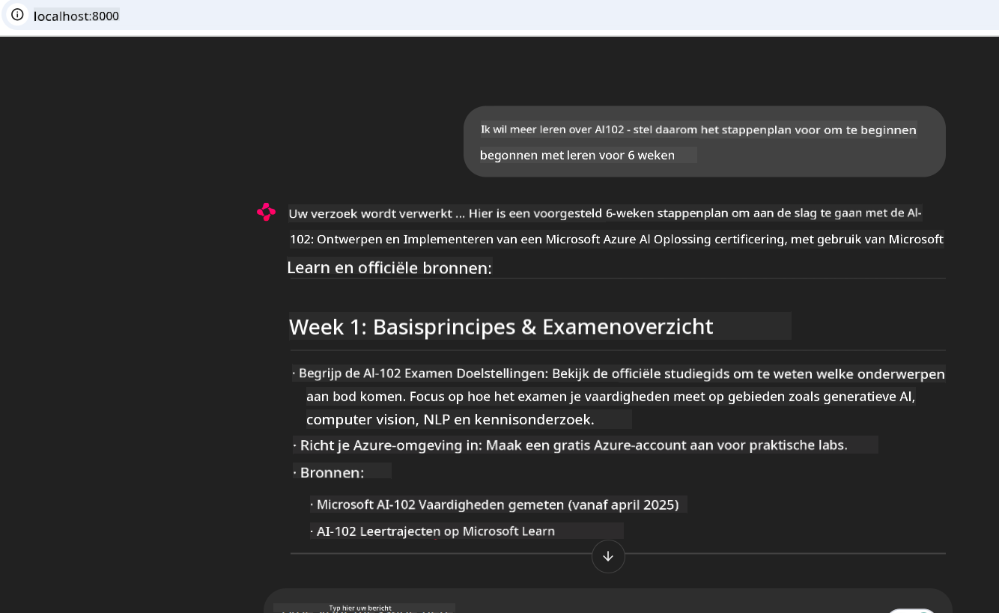

<!--
CO_OP_TRANSLATOR_METADATA:
{
  "original_hash": "4319d291c9d124ecafea52b3d04bfa0e",
  "translation_date": "2025-07-14T06:26:19+00:00",
  "source_file": "09-CaseStudy/docs-mcp/README.md",
  "language_code": "nl"
}
-->
# Case Study: Verbinden met de Microsoft Learn Docs MCP Server vanuit een Client

Heb je ooit gemerkt dat je heen en weer schakelt tussen documentatiesites, Stack Overflow en eindeloze zoekmachinetabs, terwijl je probeert een probleem in je code op te lossen? Misschien gebruik je een tweede monitor alleen voor documentatie, of wissel je constant tussen je IDE en een browser. Zou het niet handiger zijn als je de documentatie direct in je workflow kon integreren—ingebouwd in je apps, je IDE, of zelfs je eigen aangepaste tools? In deze case study onderzoeken we hoe je precies dat kunt doen door rechtstreeks verbinding te maken met de Microsoft Learn Docs MCP-server vanuit je eigen clientapplicatie.

## Overzicht

Modern ontwikkelen is meer dan alleen code schrijven—het gaat erom de juiste informatie op het juiste moment te vinden. Documentatie is overal, maar zelden daar waar je het het meest nodig hebt: binnen je tools en workflows. Door het ophalen van documentatie direct in je applicaties te integreren, bespaar je tijd, verminder je het wisselen van context en verhoog je je productiviteit. In dit hoofdstuk laten we zien hoe je een client verbindt met de Microsoft Learn Docs MCP-server, zodat je real-time, contextbewuste documentatie kunt raadplegen zonder je app te verlaten.

We lopen samen door het proces van het opzetten van een verbinding, het versturen van een verzoek en het efficiënt afhandelen van streaming responses. Deze aanpak stroomlijnt niet alleen je workflow, maar opent ook de deur naar het bouwen van slimmere, meer behulpzame ontwikkelaarstools.

## Leerdoelen

Waarom doen we dit? Omdat de beste ontwikkelaarservaringen die zijn waarbij frictie wordt weggenomen. Stel je een wereld voor waarin je code-editor, chatbot of webapp direct je documentatievragen kan beantwoorden, met de nieuwste inhoud van Microsoft Learn. Aan het einde van dit hoofdstuk weet je hoe je:

- De basis van MCP server-client communicatie voor documentatie begrijpt
- Een console- of webapplicatie implementeert die verbinding maakt met de Microsoft Learn Docs MCP-server
- Streaming HTTP-clients gebruikt voor real-time documentatie ophalen
- Documentatie responses logt en interpreteert in je applicatie

Je zult zien hoe deze vaardigheden je helpen tools te bouwen die niet alleen reactief zijn, maar echt interactief en contextbewust.

## Scenario 1 - Real-Time Documentatie Ophalen met MCP

In dit scenario laten we zien hoe je een client verbindt met de Microsoft Learn Docs MCP-server, zodat je real-time, contextbewuste documentatie kunt raadplegen zonder je app te verlaten.

Laten we dit in de praktijk brengen. Je taak is om een app te schrijven die verbinding maakt met de Microsoft Learn Docs MCP-server, het `microsoft_docs_search`-tool aanroept en de streaming response naar de console logt.

### Waarom deze aanpak?
Omdat het de basis vormt voor het bouwen van geavanceerdere integraties—of je nu een chatbot, een IDE-extensie of een webdashboard wilt aandrijven.

Je vindt de code en instructies voor dit scenario in de [`solution`](./solution/README.md) map binnen deze case study. De stappen begeleiden je bij het opzetten van de verbinding:
- Gebruik de officiële MCP SDK en een streamable HTTP-client voor de verbinding
- Roep het `microsoft_docs_search`-tool aan met een queryparameter om documentatie op te halen
- Implementeer correcte logging en foutafhandeling
- Maak een interactieve console-interface zodat gebruikers meerdere zoekopdrachten kunnen invoeren

Dit scenario laat zien hoe je:
- Verbindt met de Docs MCP-server
- Een query verstuurt
- De resultaten parseert en afdrukt

Zo zou het eruit kunnen zien als je de oplossing uitvoert:

```
Prompt> What is Azure Key Vault?
Answer> Azure Key Vault is a cloud service for securely storing and accessing secrets. ...
```

Hieronder staat een minimale voorbeeldoplossing. De volledige code en details zijn beschikbaar in de solution-map.

<details>
<summary>Python</summary>

```python
import asyncio
from mcp.client.streamable_http import streamablehttp_client
from mcp import ClientSession

async def main():
    async with streamablehttp_client("https://learn.microsoft.com/api/mcp") as (read_stream, write_stream, _):
        async with ClientSession(read_stream, write_stream) as session:
            await session.initialize()
            result = await session.call_tool("microsoft_docs_search", {"query": "Azure Functions best practices"})
            print(result.content)

if __name__ == "__main__":
    asyncio.run(main())
```

- Voor de volledige implementatie en logging, zie [`scenario1.py`](../../../../09-CaseStudy/docs-mcp/solution/python/scenario1.py).
- Voor installatie- en gebruiksinstructies, zie het [`README.md`](./solution/python/README.md) bestand in dezelfde map.
</details>

## Scenario 2 - Interactieve Studieplangenerator Webapp met MCP

In dit scenario leer je hoe je Docs MCP integreert in een webontwikkelingsproject. Het doel is om gebruikers in staat te stellen Microsoft Learn-documentatie direct vanuit een webinterface te doorzoeken, waardoor documentatie direct toegankelijk is binnen je app of site.

Je ziet hoe je:
- Een webapp opzet
- Verbindt met de Docs MCP-server
- Gebruikersinvoer verwerkt en resultaten toont

Zo zou het eruit kunnen zien als je de oplossing uitvoert:

```
User> I want to learn about AI102 - so suggest the roadmap to get it started from learn for 6 weeks

Assistant> Here’s a detailed 6-week roadmap to start your preparation for the AI-102: Designing and Implementing a Microsoft Azure AI Solution certification, using official Microsoft resources and focusing on exam skills areas:

---
## Week 1: Introduction & Fundamentals
- **Understand the Exam**: Review the [AI-102 exam skills outline](https://learn.microsoft.com/en-us/credentials/certifications/exams/ai-102/).
- **Set up Azure**: Sign up for a free Azure account if you don't have one.
- **Learning Path**: [Introduction to Azure AI services](https://learn.microsoft.com/en-us/training/modules/intro-to-azure-ai/)
- **Focus**: Get familiar with Azure portal, AI capabilities, and necessary tools.

....more weeks of the roadmap...

Let me know if you want module-specific recommendations or need more customized weekly tasks!
```

Hieronder staat een minimale voorbeeldoplossing. De volledige code en details zijn beschikbaar in de solution-map.



<details>
<summary>Python (Chainlit)</summary>

Chainlit is een framework voor het bouwen van conversatie-AI webapps. Het maakt het eenvoudig om interactieve chatbots en assistenten te creëren die MCP-tools kunnen aanroepen en resultaten in real time kunnen tonen. Ideaal voor snelle prototyping en gebruiksvriendelijke interfaces.

```python
import chainlit as cl
import requests

MCP_URL = "https://learn.microsoft.com/api/mcp"

@cl.on_message
def handle_message(message):
    query = {"question": message}
    response = requests.post(MCP_URL, json=query)
    if response.ok:
        result = response.json()
        cl.Message(content=result.get("answer", "No answer found.")).send()
    else:
        cl.Message(content="Error: " + response.text).send()
```

- Voor de volledige implementatie, zie [`scenario2.py`](../../../../09-CaseStudy/docs-mcp/solution/python/scenario2.py).
- Voor installatie- en gebruiksinstructies, zie het [`README.md`](./solution/python/README.md).
</details>

## Scenario 3: In-Editor Docs met MCP Server in VS Code

Als je Microsoft Learn Docs direct in VS Code wilt gebruiken (in plaats van te wisselen tussen browser tabs), kun je de MCP-server in je editor gebruiken. Hiermee kun je:
- Documentatie zoeken en lezen in VS Code zonder je programmeeromgeving te verlaten.
- Documentatie verwijzen en links direct invoegen in je README- of cursusbestanden.
- GitHub Copilot en MCP samen gebruiken voor een naadloze, AI-gestuurde documentatieworkflow.

**Je leert hoe je:**
- Een geldig `.vscode/mcp.json` bestand toevoegt aan de root van je workspace (zie voorbeeld hieronder).
- Het MCP-paneel opent of de commandopalet in VS Code gebruikt om documentatie te zoeken en in te voegen.
- Documentatie direct in je markdown-bestanden verwijst terwijl je werkt.
- Deze workflow combineert met GitHub Copilot voor nog meer productiviteit.

Hier is een voorbeeld van hoe je de MCP-server in VS Code instelt:

```json
{
  "servers": {
    "LearnDocsMCP": {
      "url": "https://learn.microsoft.com/api/mcp"
    }
  }
}
```

</details>

> Voor een gedetailleerde walkthrough met screenshots en stapsgewijze handleiding, zie [`README.md`](./solution/scenario3/README.md).


Deze aanpak is ideaal voor iedereen die technische cursussen bouwt, documentatie schrijft of code ontwikkelt met frequente referentiebehoeften.

## Belangrijkste Leerpunten

Documentatie direct in je tools integreren is niet alleen handig—het verandert de manier waarop je productief bent. Door verbinding te maken met de Microsoft Learn Docs MCP-server vanuit je client, kun je:

- Het wisselen van context tussen code en documentatie elimineren
- Up-to-date, contextbewuste documentatie in real time ophalen
- Slimmere, interactievere ontwikkelaarstools bouwen

Deze vaardigheden helpen je oplossingen te creëren die niet alleen efficiënt zijn, maar ook prettig in gebruik.

## Aanvullende Bronnen

Om je kennis te verdiepen, bekijk deze officiële bronnen:

- [Microsoft Learn Docs MCP Server (GitHub)](https://github.com/MicrosoftDocs/mcp)
- [Aan de slag met Azure MCP Server (mcp-python)](https://learn.microsoft.com/en-us/azure/developer/azure-mcp-server/get-started#create-the-python-app)
- [Wat is de Azure MCP Server?](https://learn.microsoft.com/en-us/azure/developer/azure-mcp-server/)
- [Model Context Protocol (MCP) Introductie](https://modelcontextprotocol.io/introduction)
- [Plugins toevoegen van een MCP Server (Python)](https://learn.microsoft.com/en-us/semantic-kernel/concepts/plugins/adding-mcp-plugins)

**Disclaimer**:  
Dit document is vertaald met behulp van de AI-vertalingsdienst [Co-op Translator](https://github.com/Azure/co-op-translator). Hoewel we streven naar nauwkeurigheid, dient u er rekening mee te houden dat geautomatiseerde vertalingen fouten of onnauwkeurigheden kunnen bevatten. Het originele document in de oorspronkelijke taal moet als de gezaghebbende bron worden beschouwd. Voor cruciale informatie wordt professionele menselijke vertaling aanbevolen. Wij zijn niet aansprakelijk voor eventuele misverstanden of verkeerde interpretaties die voortvloeien uit het gebruik van deze vertaling.