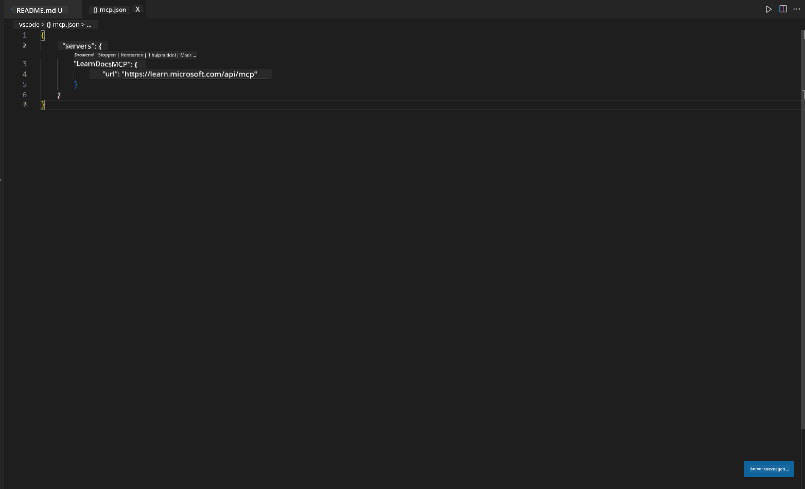
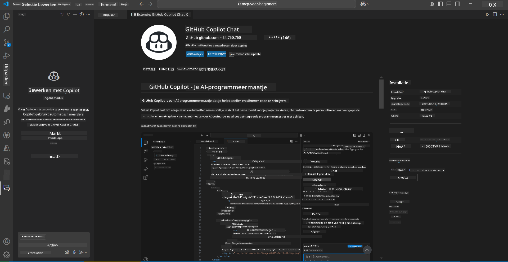
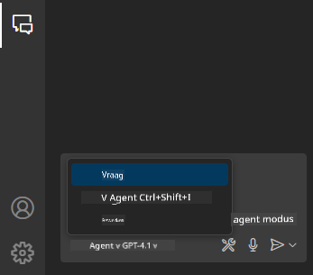
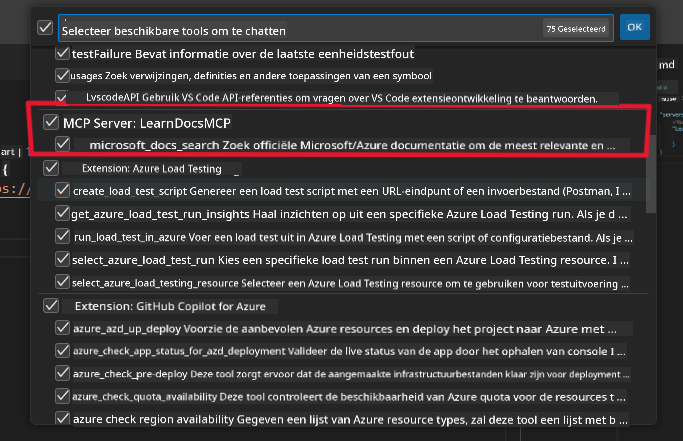
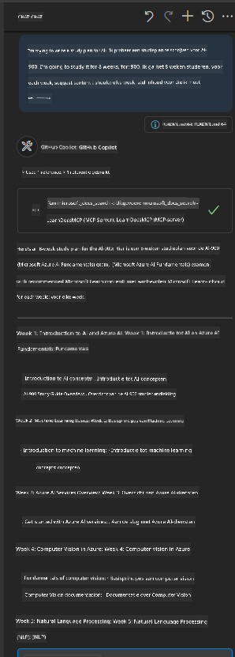
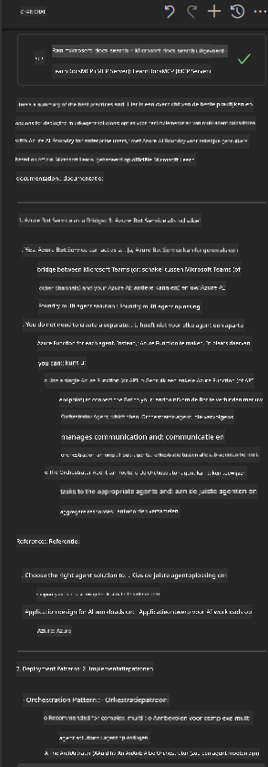

<!--
CO_OP_TRANSLATOR_METADATA:
{
  "original_hash": "db532b1ec386c9ce38c791653dc3c881",
  "translation_date": "2025-07-14T06:53:11+00:00",
  "source_file": "09-CaseStudy/docs-mcp/solution/scenario3/README.md",
  "language_code": "nl"
}
-->
# Scenario 3: In-Editor Docs met MCP Server in VS Code

## Overzicht

In dit scenario leer je hoe je Microsoft Learn Docs rechtstreeks in je Visual Studio Code-omgeving kunt brengen met behulp van de MCP-server. In plaats van steeds van browser-tabblad te wisselen om documentatie te zoeken, kun je officiële docs direct in je editor openen, doorzoeken en raadplegen. Deze aanpak stroomlijnt je workflow, houdt je gefocust en maakt naadloze integratie met tools zoals GitHub Copilot mogelijk.

- Zoek en lees documentatie binnen VS Code zonder je codeeromgeving te verlaten.
- Verwijs naar documentatie en voeg links direct toe aan je README of cursusbestanden.
- Gebruik GitHub Copilot en MCP samen voor een soepele, AI-gestuurde documentatieworkflow.

## Leerdoelen

Aan het einde van dit hoofdstuk weet je hoe je de MCP-server binnen VS Code instelt en gebruikt om je documentatie- en ontwikkelworkflow te verbeteren. Je kunt:

- Je werkruimte configureren om de MCP-server te gebruiken voor documentatie-opzoekingen.
- Documentatie direct vanuit VS Code zoeken en invoegen.
- De kracht van GitHub Copilot en MCP combineren voor een productievere, AI-ondersteunde workflow.

Deze vaardigheden helpen je gefocust te blijven, de kwaliteit van documentatie te verbeteren en je productiviteit te verhogen als ontwikkelaar of technisch schrijver.

## Oplossing

Om toegang tot documentatie binnen de editor te krijgen, volg je een reeks stappen die de MCP-server integreren met VS Code en GitHub Copilot. Deze oplossing is ideaal voor cursusmakers, documentatieschrijvers en ontwikkelaars die hun focus in de editor willen houden terwijl ze met docs en Copilot werken.

- Voeg snel referentielinks toe aan een README tijdens het schrijven van cursus- of projectdocumentatie.
- Gebruik Copilot om code te genereren en MCP om direct relevante documentatie te vinden en te citeren.
- Blijf gefocust in je editor en verhoog je productiviteit.

### Stapsgewijze handleiding

Volg deze stappen om aan de slag te gaan. Bij elke stap kun je een screenshot uit de assets-map toevoegen om het proces visueel te verduidelijken.

1. **Voeg de MCP-configuratie toe:**
   Maak in de hoofdmap van je project een bestand `.vscode/mcp.json` aan en voeg de volgende configuratie toe:
   ```json
   {
     "servers": {
       "LearnDocsMCP": {
         "url": "https://learn.microsoft.com/api/mcp"
       }
     }
   }
   ```
   Deze configuratie vertelt VS Code hoe verbinding te maken met de [`Microsoft Learn Docs MCP server`](https://github.com/MicrosoftDocs/mcp).
   
   
    
2. **Open het GitHub Copilot Chat-paneel:**
   Als je de GitHub Copilot-extensie nog niet hebt geïnstalleerd, ga dan naar het Extensions-venster in VS Code en installeer deze. Je kunt het direct downloaden van de [Visual Studio Code Marketplace](https://marketplace.visualstudio.com/items?itemName=GitHub.copilot-chat). Open vervolgens het Copilot Chat-paneel via de zijbalk.

   

3. **Schakel agentmodus in en controleer tools:**
   Schakel in het Copilot Chat-paneel de agentmodus in.

   

   Controleer na het inschakelen van agentmodus of de MCP-server wordt weergegeven als een van de beschikbare tools. Dit zorgt ervoor dat de Copilot-agent toegang heeft tot de documentatieserver om relevante informatie op te halen.
   
   
4. **Start een nieuw gesprek en stel de agent een vraag:**
   Open een nieuw gesprek in het Copilot Chat-paneel. Je kunt nu de agent vragen stellen over documentatie. De agent gebruikt de MCP-server om relevante Microsoft Learn-documentatie direct in je editor op te halen en weer te geven.

   - *"Ik probeer een studieplan te maken voor onderwerp X. Ik ga het 8 weken bestuderen, voor elke week, stel content voor die ik moet behandelen."*

   

5. **Live Query:**

   > Laten we een live vraag nemen uit de [#get-help](https://discord.gg/D6cRhjHWSC) sectie in Azure AI Foundry Discord ([origineel bericht bekijken](https://discord.com/channels/1113626258182504448/1385498306720829572)):
   
   *"Ik zoek antwoorden over hoe ik een multi-agent oplossing kan implementeren met AI-agents ontwikkeld op Azure AI Foundry. Ik zie dat er geen directe implementatiemethode is, zoals Copilot Studio-kanalen. Wat zijn de verschillende manieren om deze implementatie te doen zodat enterprise gebruikers kunnen samenwerken en het werk gedaan krijgen?
Er zijn veel artikelen/blogs die zeggen dat we Azure Bot service kunnen gebruiken als brug tussen MS Teams en Azure AI Foundry Agents. Werkt dit als ik een Azure bot opzet die via een Azure functie verbinding maakt met de Orchestrator Agent op Azure AI Foundry om de orkestratie uit te voeren, of moet ik voor elke AI-agent in de multi-agent oplossing een aparte Azure functie maken om de orkestratie in het Bot framework te regelen? Andere suggesties zijn ook welkom."*

   

   De agent zal reageren met relevante documentatielinks en samenvattingen, die je direct in je markdown-bestanden kunt invoegen of als referentie in je code kunt gebruiken.
   
### Voorbeeldvragen

Hier zijn enkele voorbeeldvragen die je kunt proberen. Deze vragen laten zien hoe de MCP-server en Copilot samenwerken om direct contextbewuste documentatie en referenties te bieden zonder VS Code te verlaten:

- "Laat me zien hoe ik Azure Functions triggers gebruik."
- "Voeg een link in naar de officiële documentatie voor Azure Key Vault."
- "Wat zijn de beste praktijken voor het beveiligen van Azure-resources?"
- "Vind een quickstart voor Azure AI-services."

Deze vragen tonen aan hoe de MCP-server en Copilot samenwerken om direct contextbewuste documentatie en referenties te bieden zonder VS Code te verlaten.

---

**Disclaimer**:  
Dit document is vertaald met behulp van de AI-vertalingsdienst [Co-op Translator](https://github.com/Azure/co-op-translator). Hoewel we streven naar nauwkeurigheid, dient u er rekening mee te houden dat geautomatiseerde vertalingen fouten of onnauwkeurigheden kunnen bevatten. Het originele document in de oorspronkelijke taal moet als de gezaghebbende bron worden beschouwd. Voor cruciale informatie wordt professionele menselijke vertaling aanbevolen. Wij zijn niet aansprakelijk voor eventuele misverstanden of verkeerde interpretaties die voortvloeien uit het gebruik van deze vertaling.