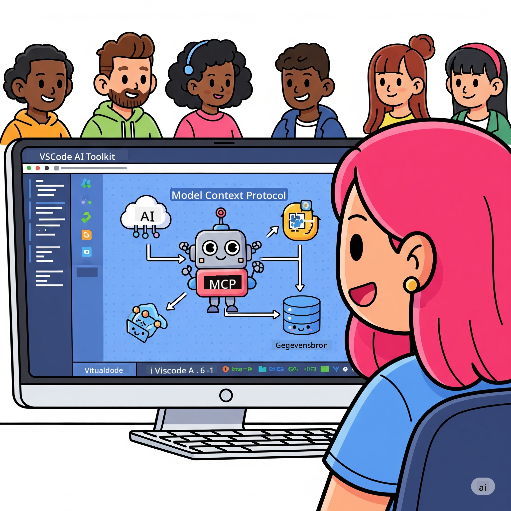
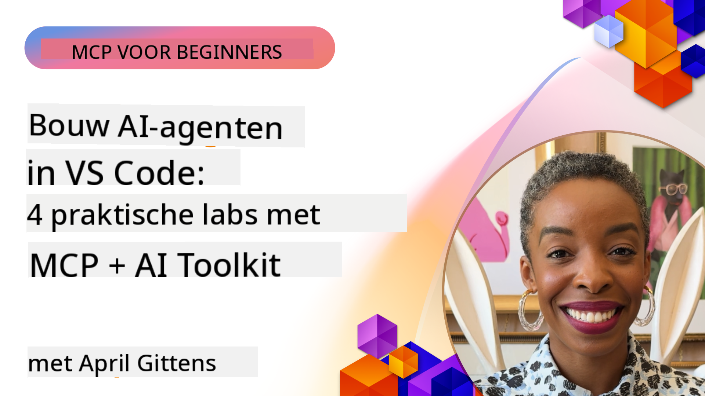

<!--
CO_OP_TRANSLATOR_METADATA:
{
  "original_hash": "1b000fd6e1b04c047578bfc5d07d54eb",
  "translation_date": "2025-08-18T16:40:14+00:00",
  "source_file": "10-StreamliningAIWorkflowsBuildingAnMCPServerWithAIToolkit/README.md",
  "language_code": "nl"
}
-->
# AI-Workflows Vereenvoudigen: Een MCP Server Bouwen met AI Toolkit

## 🎯 Overzicht

_(Klik op de afbeelding hierboven om de video van deze les te bekijken)_

Welkom bij de **Model Context Protocol (MCP) Workshop**! Deze uitgebreide, praktische workshop combineert twee baanbrekende technologieën om AI-applicatieontwikkeling te transformeren:

- **🔗 Model Context Protocol (MCP)**: Een open standaard voor naadloze integratie van AI-tools
- **🛠️ AI Toolkit voor Visual Studio Code (AITK)**: Microsofts krachtige extensie voor AI-ontwikkeling

### 🎓 Wat Je Gaat Leren

Aan het einde van deze workshop beheers je de kunst van het bouwen van intelligente applicaties die AI-modellen verbinden met tools en diensten uit de echte wereld. Van geautomatiseerd testen tot aangepaste API-integraties, je ontwikkelt praktische vaardigheden om complexe zakelijke uitdagingen op te lossen.

## 🏗️ Technologie Stack

### 🔌 Model Context Protocol (MCP)

MCP is de **"USB-C voor AI"** - een universele standaard die AI-modellen verbindt met externe tools en gegevensbronnen.

**✨ Belangrijkste Kenmerken:**

- 🔄 **Gestandaardiseerde Integratie**: Universele interface voor AI-toolverbindingen
- 🏛️ **Flexibele Architectuur**: Lokale en externe servers via stdio/SSE transport
- 🧰 **Rijk Ecosysteem**: Tools, prompts en bronnen in één protocol
- 🔒 **Enterprise-Klaar**: Ingebouwde beveiliging en betrouwbaarheid

**🎯 Waarom MCP Belangrijk Is:**
Net zoals USB-C kabelchaos heeft geëlimineerd, elimineert MCP de complexiteit van AI-integraties. Eén protocol, eindeloze mogelijkheden.

### 🤖 AI Toolkit voor Visual Studio Code (AITK)

Microsofts toonaangevende extensie voor AI-ontwikkeling die VS Code transformeert in een AI-krachtcentrale.

**🚀 Kernfunctionaliteiten:**

- 📦 **Modelcatalogus**: Toegang tot modellen van Azure AI, GitHub, Hugging Face, Ollama
- ⚡ **Lokale Inferentie**: ONNX-geoptimaliseerde CPU/GPU/NPU-uitvoering
- 🏗️ **Agent Builder**: Visuele ontwikkeling van AI-agents met MCP-integratie
- 🎭 **Multi-Modal**: Ondersteuning voor tekst, beeld en gestructureerde output

**💡 Voordelen voor Ontwikkelaars:**

- Geen configuratie nodig voor modelimplementatie
- Visuele prompt-engineering
- Real-time testomgeving
- Naadloze MCP-serverintegratie

## 📚 Leertraject

### [🚀 Module 1: Basisprincipes van AI Toolkit](./lab1/README.md)

**Duur**: 15 minuten

- 🛠️ Installeer en configureer AI Toolkit voor VS Code
- 🗂️ Verken de Modelcatalogus (100+ modellen van GitHub, ONNX, OpenAI, Anthropic, Google)
- 🎮 Beheers de Interactieve Playground voor real-time modeltesten
- 🤖 Bouw je eerste AI-agent met Agent Builder
- 📊 Evalueer modelprestaties met ingebouwde statistieken (F1, relevantie, gelijkenis, samenhang)
- ⚡ Leer batchverwerking en multi-modale ondersteuning

**🎯 Leerresultaat**: Creëer een functionele AI-agent met een uitgebreide kennis van de mogelijkheden van AITK

### [🌐 Module 2: MCP met AI Toolkit Basisprincipes](./lab2/README.md)

**Duur**: 20 minuten

- 🧠 Beheers de architectuur en concepten van Model Context Protocol (MCP)
- 🌐 Verken het MCP-serverecosysteem van Microsoft
- 🤖 Bouw een browserautomatiseringsagent met de Playwright MCP-server
- 🔧 Integreer MCP-servers met AI Toolkit Agent Builder
- 📊 Configureer en test MCP-tools binnen je agents
- 🚀 Exporteer en implementeer MCP-aangedreven agents voor productiegebruik

**🎯 Leerresultaat**: Implementeer een AI-agent die wordt versterkt met externe tools via MCP

### [🔧 Module 3: Geavanceerde MCP-ontwikkeling met AI Toolkit](./lab3/README.md)

**Duur**: 20 minuten

- 💻 Maak aangepaste MCP-servers met AI Toolkit
- 🐍 Configureer en gebruik de nieuwste MCP Python SDK (v1.9.3)
- 🔍 Stel MCP Inspector in en gebruik deze voor debugging
- 🛠️ Bouw een Weather MCP Server met professionele debugging-workflows
- 🧪 Debug MCP-servers in zowel Agent Builder- als Inspector-omgevingen

**🎯 Leerresultaat**: Ontwikkel en debug aangepaste MCP-servers met moderne tools

### [🐙 Module 4: Praktische MCP-ontwikkeling - Aangepaste GitHub Clone Server](./lab4/README.md)

**Duur**: 30 minuten

- 🏗️ Bouw een realistische GitHub Clone MCP Server voor ontwikkelingsworkflows
- 🔄 Implementeer slimme repository-cloning met validatie en foutafhandeling
- 📁 Creëer intelligente directorybeheer en VS Code-integratie
- 🤖 Gebruik GitHub Copilot Agent Mode met aangepaste MCP-tools
- 🛡️ Pas productieklare betrouwbaarheid en cross-platform compatibiliteit toe

**🎯 Leerresultaat**: Implementeer een productieklare MCP-server die ontwikkelingsworkflows stroomlijnt

## 💡 Toepassingen in de Praktijk & Impact

### 🏢 Gebruiksscenario's voor Bedrijven

#### 🔄 DevOps Automatisering

Transformeer je ontwikkelingsworkflow met intelligente automatisering:

- **Slim Beheer van Repositories**: AI-gestuurde codebeoordeling en merge-beslissingen
- **Intelligente CI/CD**: Geautomatiseerde optimalisatie van pipelines op basis van codewijzigingen
- **Issue Triage**: Automatische classificatie en toewijzing van bugs

#### 🧪 Revolutie in Kwaliteitsborging

Verhoog testkwaliteit met AI-gestuurde automatisering:

- **Slimme Testgeneratie**: Automatisch uitgebreide testsuites maken
- **Visuele Regressietests**: AI-gestuurde detectie van UI-wijzigingen
- **Prestatiemonitoring**: Proactieve identificatie en oplossing van problemen

#### 📊 Intelligentie in Datapijplijnen

Bouw slimmere workflows voor gegevensverwerking:

- **Adaptieve ETL-processen**: Zelfoptimaliserende datatransformaties
- **Anomaliedetectie**: Real-time monitoring van gegevenskwaliteit
- **Slimme Routering**: Intelligente gegevensstroombeheer

#### 🎧 Verbetering van Klantbeleving

Creëer uitzonderlijke klantinteracties:

- **Contextbewuste Ondersteuning**: AI-agents met toegang tot klantgeschiedenis
- **Proactieve Probleemoplossing**: Voorspellende klantenservice
- **Multi-Channel Integratie**: Geïntegreerde AI-ervaring over platforms

## 🛠️ Vereisten & Installatie

### 💻 Systeemeisen

| Component | Vereiste | Opmerkingen |
|-----------|----------|-------------|
| **Besturingssysteem** | Windows 10+, macOS 10.15+, Linux | Elk modern OS |
| **Visual Studio Code** | Laatste stabiele versie | Vereist voor AITK |
| **Node.js** | v18.0+ en npm | Voor MCP-serverontwikkeling |
| **Python** | 3.10+ | Optioneel voor Python MCP-servers |
| **Geheugen** | Minimaal 8GB RAM | 16GB aanbevolen voor lokale modellen |

### 🔧 Ontwikkelomgeving

#### Aanbevolen VS Code Extensies

- **AI Toolkit** (ms-windows-ai-studio.windows-ai-studio)
- **Python** (ms-python.python)
- **Python Debugger** (ms-python.debugpy)
- **GitHub Copilot** (GitHub.copilot) - Optioneel maar handig

#### Optionele Tools

- **uv**: Moderne Python package manager
- **MCP Inspector**: Visuele debugging-tool voor MCP-servers
- **Playwright**: Voor webautomatiseringsvoorbeelden

## 🎖️ Leerresultaten & Certificeringspad

### 🏆 Vaardigheden Checklist

Door deze workshop te voltooien, beheers je:

#### 🎯 Kerncompetenties

- [ ] **MCP Protocol Beheersing**: Diepgaande kennis van architectuur en implementatiepatronen
- [ ] **AITK Vaardigheid**: Expertgebruik van AI Toolkit voor snelle ontwikkeling
- [ ] **Aangepaste Serverontwikkeling**: Bouw, implementeer en onderhoud productie-MCP-servers
- [ ] **Toolintegratie**: Naadloze verbinding van AI met bestaande workflows
- [ ] **Probleemoplossing**: Toepassen van geleerde vaardigheden op zakelijke uitdagingen

#### 🔧 Technische Vaardigheden

- [ ] Installeer en configureer AI Toolkit in VS Code
- [ ] Ontwerp en implementeer aangepaste MCP-servers
- [ ] Integreer GitHub-modellen met MCP-architectuur
- [ ] Bouw geautomatiseerde testworkflows met Playwright
- [ ] Implementeer AI-agents voor productiegebruik
- [ ] Debug en optimaliseer MCP-serverprestaties

#### 🚀 Geavanceerde Mogelijkheden

- [ ] Ontwerp AI-integraties op ondernemingsschaal
- [ ] Implementeer beveiligingspraktijken voor AI-applicaties
- [ ] Ontwerp schaalbare MCP-serverarchitecturen
- [ ] Creëer aangepaste toolchains voor specifieke domeinen
- [ ] Begeleid anderen in AI-native ontwikkeling

## 📖 Aanvullende Bronnen

- [MCP Specificatie](https://modelcontextprotocol.io/docs)
- [AI Toolkit GitHub Repository](https://github.com/microsoft/vscode-ai-toolkit)
- [Voorbeeld MCP Servers Collectie](https://github.com/modelcontextprotocol/servers)
- [Best Practices Gids](https://modelcontextprotocol.io/docs/best-practices)

---

**🚀 Klaar om je AI-ontwikkelingsworkflow te transformeren?**

Laten we samen de toekomst van intelligente applicaties bouwen met MCP en AI Toolkit!

**Disclaimer**:  
Dit document is vertaald met behulp van de AI-vertalingsservice [Co-op Translator](https://github.com/Azure/co-op-translator). Hoewel we ons best doen voor nauwkeurigheid, dient u zich ervan bewust te zijn dat geautomatiseerde vertalingen fouten of onnauwkeurigheden kunnen bevatten. Het originele document in de oorspronkelijke taal moet worden beschouwd als de gezaghebbende bron. Voor cruciale informatie wordt professionele menselijke vertaling aanbevolen. Wij zijn niet aansprakelijk voor misverstanden of verkeerde interpretaties die voortvloeien uit het gebruik van deze vertaling.