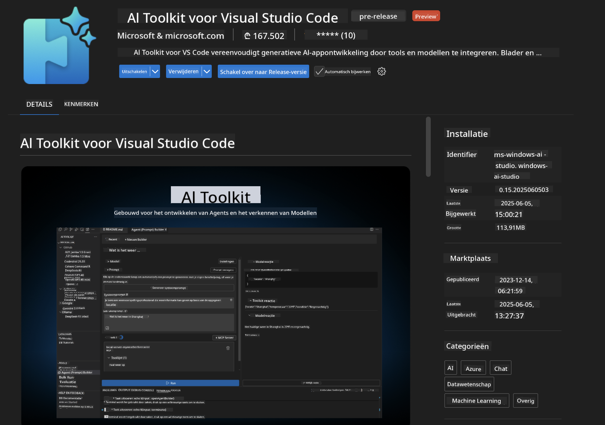
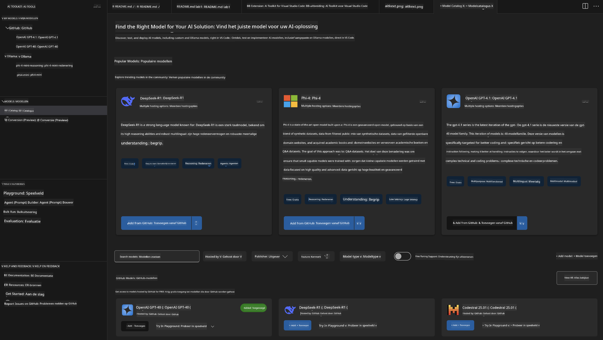
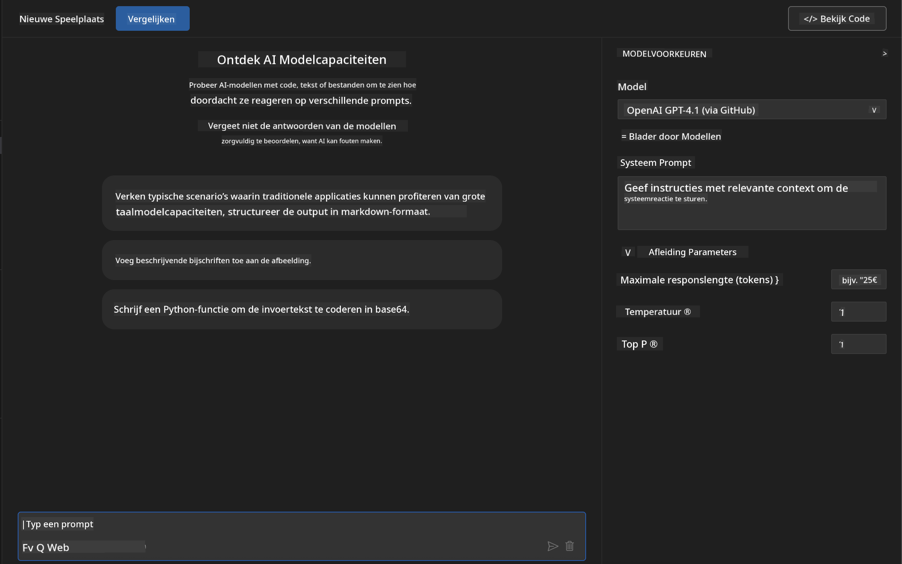
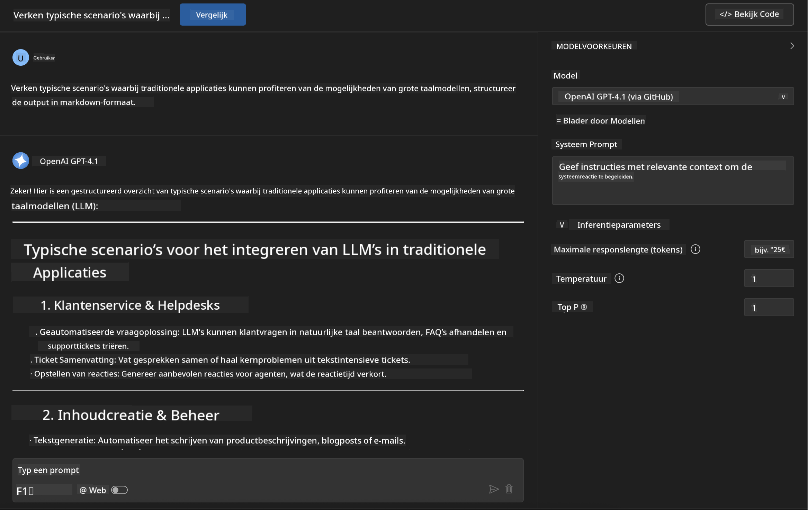
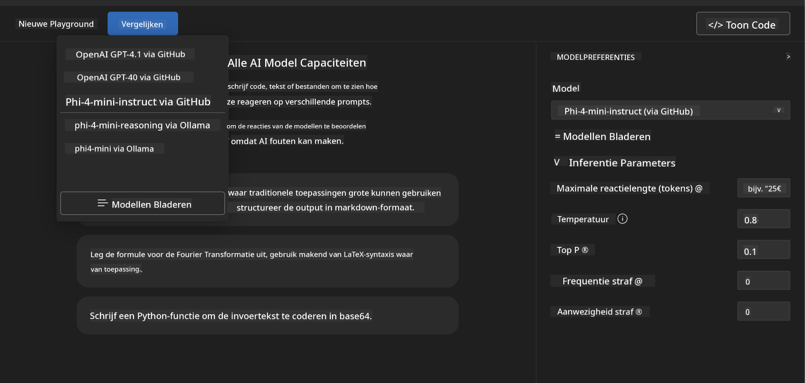
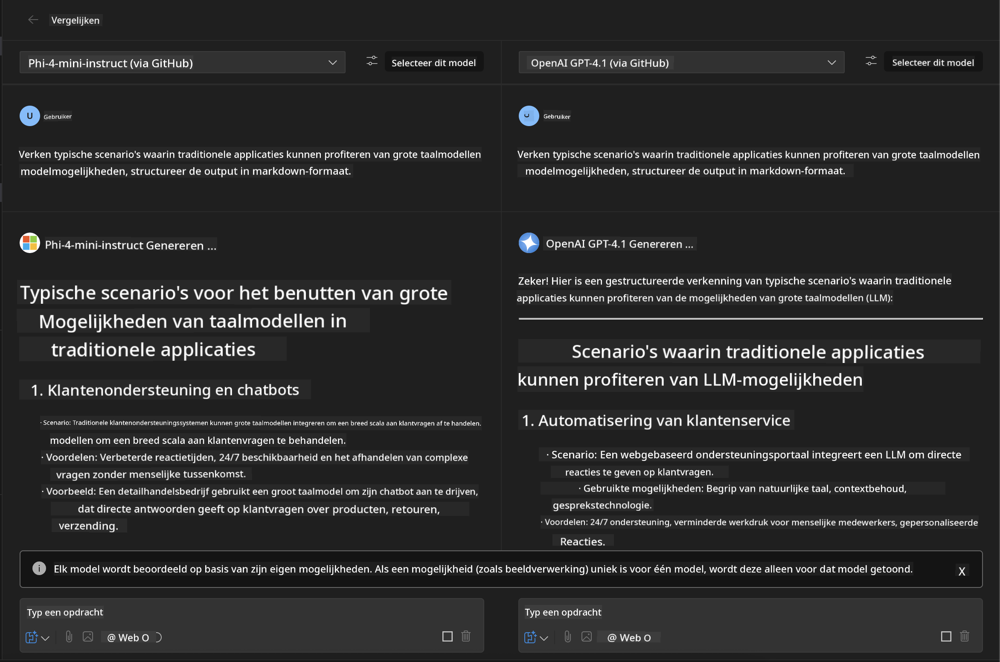
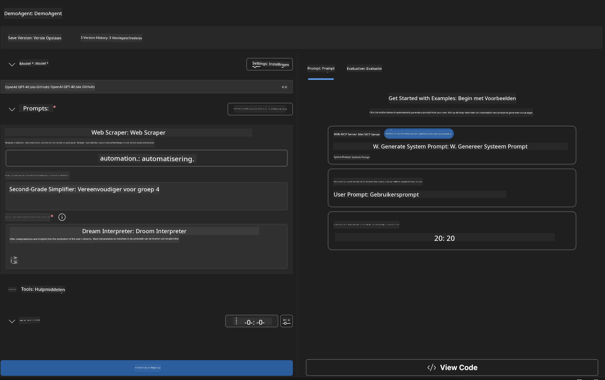
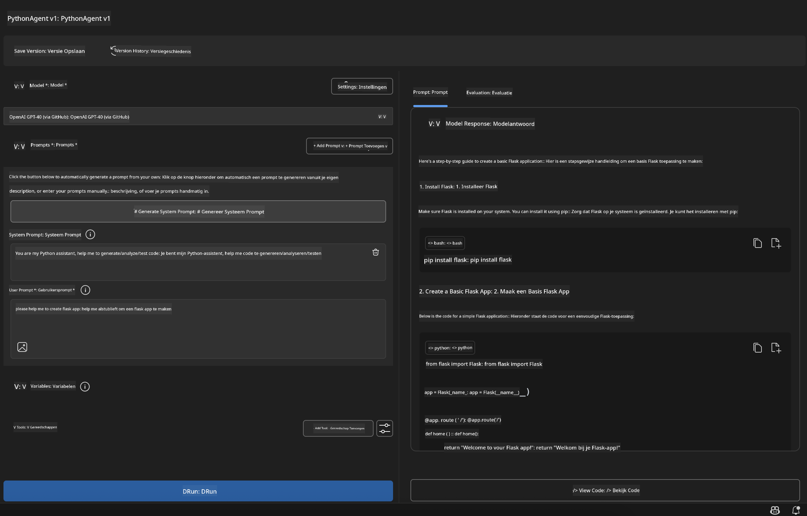

<!--
CO_OP_TRANSLATOR_METADATA:
{
  "original_hash": "2aa9dbc165e104764fa57e8a0d3f1c73",
  "translation_date": "2025-07-14T07:29:53+00:00",
  "source_file": "10-StreamliningAIWorkflowsBuildingAnMCPServerWithAIToolkit/lab1/README.md",
  "language_code": "nl"
}
-->
# 🚀 Module 1: AI Toolkit Basisprincipes

[]()
[]()
[]()

## 📋 Leerdoelen

Aan het einde van deze module kun je:
- ✅ AI Toolkit voor Visual Studio Code installeren en configureren
- ✅ Navigeren door de Model Catalogus en verschillende modelbronnen begrijpen
- ✅ De Playground gebruiken voor modeltesten en experimenteren
- ✅ Aangepaste AI-agenten maken met Agent Builder
- ✅ Modelprestaties vergelijken tussen verschillende aanbieders
- ✅ Best practices toepassen voor prompt engineering

## 🧠 Introductie tot AI Toolkit (AITK)

De **AI Toolkit voor Visual Studio Code** is Microsofts toonaangevende extensie die VS Code transformeert tot een complete AI-ontwikkelomgeving. Het overbrugt de kloof tussen AI-onderzoek en praktische applicatieontwikkeling, waardoor generatieve AI toegankelijk wordt voor ontwikkelaars van elk niveau.

### 🌟 Belangrijkste Functionaliteiten

| Functie | Beschrijving | Gebruikssituatie |
|---------|--------------|------------------|
| **🗂️ Model Catalogus** | Toegang tot 100+ modellen van GitHub, ONNX, OpenAI, Anthropic, Google | Modellen ontdekken en selecteren |
| **🔌 BYOM Support** | Integreer je eigen modellen (lokaal/remote) | Aangepaste modelimplementatie |
| **🎮 Interactieve Playground** | Real-time modeltesten met chatinterface | Snel prototypen en testen |
| **📎 Multi-Modal Support** | Verwerk tekst, afbeeldingen en bijlagen | Complexe AI-toepassingen |
| **⚡ Batchverwerking** | Voer meerdere prompts tegelijk uit | Efficiënte testworkflows |
| **📊 Model Evaluatie** | Ingebouwde metrics (F1, relevantie, gelijkenis, coherentie) | Prestatiebeoordeling |

### 🎯 Waarom AI Toolkit Belangrijk Is

- **🚀 Versnelde Ontwikkeling**: Van idee naar prototype in enkele minuten
- **🔄 Geünificeerde Workflow**: Eén interface voor meerdere AI-aanbieders
- **🧪 Eenvoudig Experimenteren**: Modellen vergelijken zonder ingewikkelde setup
- **📈 Klaar voor Productie**: Naadloze overgang van prototype naar implementatie

## 🛠️ Vereisten & Installatie

### 📦 AI Toolkit Extensie Installeren

**Stap 1: Open Extensions Marketplace**
1. Open Visual Studio Code
2. Ga naar het Extensions-venster (`Ctrl+Shift+X` of `Cmd+Shift+X`)
3. Zoek op "AI Toolkit"

**Stap 2: Kies je Versie**
- **🟢 Release**: Aanbevolen voor productiegebruik
- **🔶 Pre-release**: Vroege toegang tot de nieuwste functies

**Stap 3: Installeren en Activeren**



### ✅ Controlelijst ter Verificatie
- [ ] AI Toolkit-icoon verschijnt in de VS Code zijbalk
- [ ] Extensie is ingeschakeld en geactiveerd
- [ ] Geen installatiefouten in het outputpaneel

## 🧪 Praktijkopdracht 1: Verkennen van GitHub Modellen

**🎯 Doel**: Beheers de Model Catalogus en test je eerste AI-model

### 📊 Stap 1: Navigeren door de Model Catalogus

De Model Catalogus is je toegangspoort tot het AI-ecosysteem. Het verzamelt modellen van verschillende aanbieders, waardoor het eenvoudig is om opties te ontdekken en te vergelijken.

**🔍 Navigatiehandleiding:**

Klik op **MODELS - Catalog** in de AI Toolkit zijbalk



**💡 Pro Tip**: Zoek naar modellen met specifieke mogelijkheden die passen bij jouw gebruikssituatie (bijv. codegeneratie, creatief schrijven, analyse).

**⚠️ Note**: Modellen gehost op GitHub (GitHub Models) zijn gratis te gebruiken, maar hebben limieten op het aantal verzoeken en tokens. Wil je toegang tot niet-GitHub modellen (externe modellen gehost via Azure AI of andere endpoints), dan moet je de juiste API-sleutel of authenticatie aanleveren.

### 🚀 Stap 2: Voeg je Eerste Model Toe en Configureer

**Modelselectiestrategie:**
- **GPT-4.1**: Geschikt voor complexe redenering en analyse
- **Phi-4-mini**: Lichtgewicht, snelle reacties voor eenvoudige taken

**🔧 Configuratieproces:**
1. Selecteer **OpenAI GPT-4.1** uit de catalogus
2. Klik op **Add to My Models** - hiermee registreer je het model voor gebruik
3. Kies **Try in Playground** om de testomgeving te openen
4. Wacht op initialisatie van het model (de eerste keer kan even duren)



**⚙️ Begrijp de Modelparameters:**
- **Temperature**: Bepaalt creativiteit (0 = deterministisch, 1 = creatief)
- **Max Tokens**: Maximale lengte van de respons
- **Top-p**: Nucleus sampling voor variatie in antwoorden

### 🎯 Stap 3: Beheers de Playground Interface

De Playground is je AI-experimentatielab. Zo haal je er het meeste uit:

**🎨 Best Practices voor Prompt Engineering:**
1. **Wees Specifiek**: Duidelijke, gedetailleerde instructies leveren betere resultaten op
2. **Geef Context**: Voeg relevante achtergrondinformatie toe
3. **Gebruik Voorbeelden**: Laat het model zien wat je wilt met voorbeelden
4. **Itereer**: Verbeter prompts op basis van de eerste resultaten

**🧪 Testscenario’s:**
```markdown
# Example 1: Code Generation
"Write a Python function that calculates the factorial of a number using recursion. Include error handling and docstrings."

# Example 2: Creative Writing
"Write a professional email to a client explaining a project delay, maintaining a positive tone while being transparent about challenges."

# Example 3: Data Analysis
"Analyze this sales data and provide insights: [paste your data]. Focus on trends, anomalies, and actionable recommendations."
```



### 🏆 Uitdaging: Modelprestaties Vergelijken

**🎯 Doel**: Vergelijk verschillende modellen met dezelfde prompts om hun sterke punten te ontdekken

**📋 Instructies:**
1. Voeg **Phi-4-mini** toe aan je werkruimte
2. Gebruik dezelfde prompt voor zowel GPT-4.1 als Phi-4-mini



3. Vergelijk de kwaliteit, snelheid en nauwkeurigheid van de antwoorden
4. Documenteer je bevindingen in het resultatenoverzicht



**💡 Belangrijke inzichten om te ontdekken:**
- Wanneer gebruik je LLM versus SLM
- Kosten versus prestatieafwegingen
- Gespecialiseerde mogelijkheden van verschillende modellen

## 🤖 Praktijkopdracht 2: Aangepaste Agenten Bouwen met Agent Builder

**🎯 Doel**: Maak gespecialiseerde AI-agenten die zijn afgestemd op specifieke taken en workflows

### 🏗️ Stap 1: Agent Builder Begrijpen

Agent Builder is waar AI Toolkit echt uitblinkt. Hiermee kun je doelgerichte AI-assistenten creëren die de kracht van grote taalmodellen combineren met aangepaste instructies, specifieke parameters en gespecialiseerde kennis.

**🧠 Componenten van de Agent Architectuur:**
- **Core Model**: De basis LLM (GPT-4, Groks, Phi, etc.)
- **System Prompt**: Bepaalt de persoonlijkheid en het gedrag van de agent
- **Parameters**: Fijn afgestelde instellingen voor optimale prestaties
- **Tools Integratie**: Koppeling met externe API’s en MCP-diensten
- **Geheugen**: Gesprekscontext en sessiebehoud



### ⚙️ Stap 2: Diepgaande Agentconfiguratie

**🎨 Effectieve System Prompts Maken:**
```markdown
# Template Structure:
## Role Definition
You are a [specific role] with expertise in [domain].

## Capabilities
- List specific abilities
- Define scope of knowledge
- Clarify limitations

## Behavior Guidelines
- Response style (formal, casual, technical)
- Output format preferences
- Error handling approach

## Examples
Provide 2-3 examples of ideal interactions
```

*Je kunt natuurlijk ook Generate System Prompt gebruiken om AI te laten helpen bij het genereren en optimaliseren van prompts*

**🔧 Parameteroptimalisatie:**
| Parameter | Aanbevolen Bereik | Gebruikssituatie |
|-----------|-------------------|------------------|
| **Temperature** | 0.1-0.3 | Technische/factuele antwoorden |
| **Temperature** | 0.7-0.9 | Creatieve/brainstormtaken |
| **Max Tokens** | 500-1000 | Bondige antwoorden |
| **Max Tokens** | 2000-4000 | Gedetailleerde uitleg |

### 🐍 Stap 3: Praktijkopdracht - Python Programmeeragent

**🎯 Missie**: Maak een gespecialiseerde Python codeerassistent

**📋 Configuratiestappen:**

1. **Modelselectie**: Kies **Claude 3.5 Sonnet** (uitstekend voor code)

2. **System Prompt Ontwerp**:
```markdown
# Python Programming Expert Agent

## Role
You are a senior Python developer with 10+ years of experience. You excel at writing clean, efficient, and well-documented Python code.

## Capabilities
- Write production-ready Python code
- Debug complex issues
- Explain code concepts clearly
- Suggest best practices and optimizations
- Provide complete working examples

## Response Format
- Always include docstrings
- Add inline comments for complex logic
- Suggest testing approaches
- Mention relevant libraries when applicable

## Code Quality Standards
- Follow PEP 8 style guidelines
- Use type hints where appropriate
- Handle exceptions gracefully
- Write readable, maintainable code
```

3. **Parameterconfiguratie**:
   - Temperature: 0.2 (voor consistente, betrouwbare code)
   - Max Tokens: 2000 (gedetailleerde uitleg)
   - Top-p: 0.9 (gebalanceerde creativiteit)



### 🧪 Stap 4: Test je Python Agent

**Testscenario’s:**
1. **Basisfunctie**: "Maak een functie om priemgetallen te vinden"
2. **Complex Algoritme**: "Implementeer een binaire zoekboom met insert-, delete- en zoekmethoden"
3. **Praktijkprobleem**: "Bouw een web scraper die rate limiting en retries afhandelt"
4. **Debuggen**: "Los deze code op [plak buggy code]"

**🏆 Succescriteria:**
- ✅ Code draait zonder fouten
- ✅ Bevat goede documentatie
- ✅ Volgt Python best practices
- ✅ Geeft duidelijke uitleg
- ✅ Doet verbetervoorstellen

## 🎓 Module 1 Afsluiting & Volgende Stappen

### 📊 Kennischeck

Test je begrip:
- [ ] Kun je het verschil uitleggen tussen modellen in de catalogus?
- [ ] Heb je succesvol een aangepaste agent gemaakt en getest?
- [ ] Begrijp je hoe je parameters optimaliseert voor verschillende toepassingen?
- [ ] Kun je effectieve system prompts ontwerpen?

### 📚 Aanvullende Bronnen

- **AI Toolkit Documentatie**: [Official Microsoft Docs](https://github.com/microsoft/vscode-ai-toolkit)
- **Prompt Engineering Gids**: [Best Practices](https://platform.openai.com/docs/guides/prompt-engineering)
- **Modellen in AI Toolkit**: [Models in Develpment](https://github.com/microsoft/vscode-ai-toolkit/blob/main/doc/models.md)

**🎉 Gefeliciteerd!** Je beheerst de basisprincipes van AI Toolkit en bent klaar om geavanceerdere AI-toepassingen te bouwen!

### 🔜 Ga door naar de Volgende Module

Klaar voor meer geavanceerde mogelijkheden? Ga verder naar **[Module 2: MCP with AI Toolkit Fundamentals](../lab2/README.md)** waar je leert hoe je:
- Je agenten koppelt aan externe tools met Model Context Protocol (MCP)
- Browserautomatiseringsagenten bouwt met Playwright
- MCP-servers integreert met je AI Toolkit-agenten
- Je agenten versterkt met externe data en functionaliteiten

**Disclaimer**:  
Dit document is vertaald met behulp van de AI-vertalingsdienst [Co-op Translator](https://github.com/Azure/co-op-translator). Hoewel we streven naar nauwkeurigheid, dient u er rekening mee te houden dat geautomatiseerde vertalingen fouten of onnauwkeurigheden kunnen bevatten. Het originele document in de oorspronkelijke taal moet als de gezaghebbende bron worden beschouwd. Voor cruciale informatie wordt professionele menselijke vertaling aanbevolen. Wij zijn niet aansprakelijk voor eventuele misverstanden of verkeerde interpretaties die voortvloeien uit het gebruik van deze vertaling.