<!--
CO_OP_TRANSLATOR_METADATA:
{
  "original_hash": "a22b7dd11cd7690f99f9195877cafdc3",
  "translation_date": "2025-06-10T05:52:11+00:00",
  "source_file": "10-StreamliningAIWorkflowsBuildingAnMCPServerWithAIToolkit/lab2/README.md",
  "language_code": "nl"
}
-->
# 🌐 Module 2: MCP met AI Toolkit Basisprincipes

[]()
[]()
[]()

## 📋 Leerdoelen

Aan het einde van deze module kun je:
- ✅ De architectuur en voordelen van het Model Context Protocol (MCP) begrijpen
- ✅ Het MCP-serverecosysteem van Microsoft verkennen
- ✅ MCP-servers integreren met AI Toolkit Agent Builder
- ✅ Een functionele browserautomatiseringsagent bouwen met Playwright MCP
- ✅ MCP-tools configureren en testen binnen je agents
- ✅ MCP-aangedreven agents exporteren en implementeren voor productiegebruik

## 🎯 Voortbouwen op Module 1

In Module 1 hebben we de basis van AI Toolkit onder de knie gekregen en onze eerste Python Agent gemaakt. Nu gaan we je agents **krachtiger maken** door ze te verbinden met externe tools en services via het revolutionaire **Model Context Protocol (MCP)**.

Zie het als een upgrade van een eenvoudige rekenmachine naar een volledige computer - je AI-agents krijgen de mogelijkheid om:
- 🌐 Websites te bezoeken en ermee te interacteren
- 📁 Bestanden te openen en te bewerken
- 🔧 Te integreren met bedrijfsystemen
- 📊 Real-time data van API’s te verwerken

## 🧠 Wat is Model Context Protocol (MCP)?

### 🔍 Wat is MCP?

Model Context Protocol (MCP) is de **"USB-C voor AI-toepassingen"** – een revolutionaire open standaard die grote taalmodellen (LLM’s) koppelt aan externe tools, databronnen en services. Net zoals USB-C de wirwar aan kabels heeft vervangen door één universele aansluiting, vereenvoudigt MCP AI-integraties met één gestandaardiseerd protocol.

### 🎯 Het probleem dat MCP oplost

**Voor MCP:**
- 🔧 Maatwerk integraties voor elke tool
- 🔄 Vendor lock-in met eigen oplossingen
- 🔒 Beveiligingsrisico’s door ad-hoc verbindingen
- ⏱️ Maanden ontwikkeling voor basisintegraties

**Met MCP:**
- ⚡ Plug-and-play integratie van tools
- 🔄 Vendor-onafhankelijke architectuur
- 🛡️ Ingebouwde beveiligingsstandaarden
- 🚀 Minuten om nieuwe functionaliteiten toe te voegen

### 🏗️ Diepgaande MCP-architectuur

MCP volgt een **client-server architectuur** die een veilig en schaalbaar ecosysteem creëert:

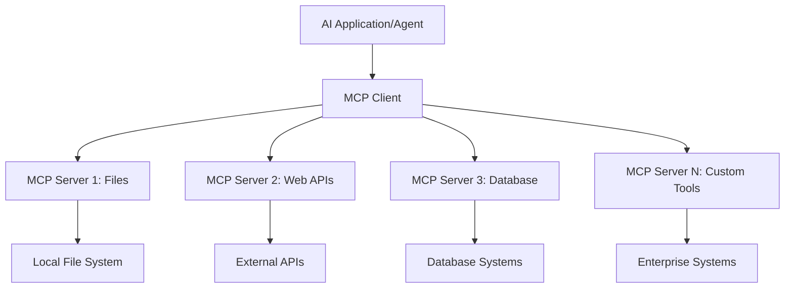

**🔧 Kerncomponenten:**

| Component | Rol | Voorbeelden |
|-----------|-----|-------------|
| **MCP Hosts** | Applicaties die MCP-diensten gebruiken | Claude Desktop, VS Code, AI Toolkit |
| **MCP Clients** | Protocol handlers (1:1 met servers) | Ingebouwd in hostapplicaties |
| **MCP Servers** | Bieden functionaliteiten via standaardprotocol | Playwright, Files, Azure, GitHub |
| **Transportlaag** | Communicatiemethoden | stdio, HTTP, WebSockets |

## 🏢 Het MCP Server Ecosysteem van Microsoft

Microsoft leidt het MCP-ecosysteem met een uitgebreide set enterprise-grade servers die echte zakelijke behoeften aanpakken.

### 🌟 Uitgelichte Microsoft MCP Servers

#### 1. ☁️ Azure MCP Server
**🔗 Repository**: [azure/azure-mcp](https://github.com/azure/azure-mcp)  
**🎯 Doel**: Uitgebreid beheer van Azure-resources met AI-integratie

**✨ Belangrijkste kenmerken:**
- Declaratieve infrastructuur provisioning
- Real-time monitoring van resources
- Aanbevelingen voor kostenoptimalisatie
- Controle op beveiligingscompliance

**🚀 Toepassingen:**
- Infrastructure-as-Code met AI-ondersteuning
- Geautomatiseerde schaalvergroting van resources
- Kostenoptimalisatie in de cloud
- Automatisering van DevOps-workflows

#### 2. 📊 Microsoft Dataverse MCP
**📚 Documentatie**: [Microsoft Dataverse Integration](https://go.microsoft.com/fwlink/?linkid=2320176)  
**🎯 Doel**: Natuurlijke taalinterface voor bedrijfsdata

**✨ Belangrijkste kenmerken:**
- Natuurlijke taal database queries
- Begrip van zakelijke context
- Aangepaste prompttemplates
- Enterprise data governance

**🚀 Toepassingen:**
- Rapportage voor business intelligence
- Analyse van klantgegevens
- Inzichten in sales pipelines
- Vragen over compliance data

#### 3. 🌐 Playwright MCP Server
**🔗 Repository**: [microsoft/playwright-mcp](https://github.com/microsoft/playwright-mcp)  
**🎯 Doel**: Browserautomatisering en webinteractie

**✨ Belangrijkste kenmerken:**
- Cross-browser automatisering (Chrome, Firefox, Safari)
- Intelligente elementdetectie
- Screenshot- en PDF-generatie
- Netwerkverkeer monitoring

**🚀 Toepassingen:**
- Geautomatiseerde testworkflows
- Web scraping en data-extractie
- UI/UX monitoring
- Automatisering van concurrentieanalyse

#### 4. 📁 Files MCP Server
**🔗 Repository**: [microsoft/files-mcp-server](https://github.com/microsoft/files-mcp-server)  
**🎯 Doel**: Intelligente bestandsbeheer operaties

**✨ Belangrijkste kenmerken:**
- Declaratief bestandsbeheer
- Content-synchronisatie
- Integratie met versiebeheer
- Metadata-extractie

**🚀 Toepassingen:**
- Documentatiebeheer
- Organisatie van code repositories
- Workflows voor contentpublicatie
- Bestandsbeheer in datapijplijnen

#### 5. 📝 MarkItDown MCP Server
**🔗 Repository**: [microsoft/markitdown](https://github.com/microsoft/markitdown)  
**🎯 Doel**: Geavanceerde Markdown verwerking en manipulatie

**✨ Belangrijkste kenmerken:**
- Rijke Markdown parsing
- Formaatconversie (MD ↔ HTML ↔ PDF)
- Analyse van contentstructuur
- Templateverwerking

**🚀 Toepassingen:**
- Technische documentatie workflows
- Contentmanagementsystemen
- Rapportagegeneratie
- Automatisering van kennisbanken

#### 6. 📈 Clarity MCP Server
**📦 Package**: [@microsoft/clarity-mcp-server](https://www.npmjs.com/package/@microsoft/clarity-mcp-server)  
**🎯 Doel**: Webanalyse en gebruikersgedrag inzichten

**✨ Belangrijkste kenmerken:**
- Heatmap data-analyse
- Opnames van gebruikerssessies
- Prestatiestatistieken
- Analyse van conversiefunnels

**🚀 Toepassingen:**
- Website-optimalisatie
- Onderzoek naar gebruikerservaring
- A/B-testanalyse
- Business intelligence dashboards

### 🌍 Community Ecosysteem

Naast de Microsoft-servers omvat het MCP-ecosysteem ook:
- **🐙 GitHub MCP**: Repositorybeheer en code-analyse
- **🗄️ Database MCP’s**: Integraties voor PostgreSQL, MySQL, MongoDB
- **☁️ Cloud Provider MCP’s**: Tools voor AWS, GCP, Digital Ocean
- **📧 Communicatie MCP’s**: Integraties met Slack, Teams, Email

## 🛠️ Praktijklab: Een Browserautomatiseringsagent bouwen

**🎯 Projectdoel**: Bouw een intelligente browserautomatiseringsagent met Playwright MCP-server die websites kan bezoeken, informatie kan extraheren en complexe webinteracties kan uitvoeren.

### 🚀 Fase 1: Agentbasis opzetten

#### Stap 1: Initialiseer je Agent
1. **Open AI Toolkit Agent Builder**
2. **Maak een nieuwe Agent aan** met de volgende configuratie:  
   - **Naam**: `BrowserAgent`
   - **Model**: Choose GPT-4o 

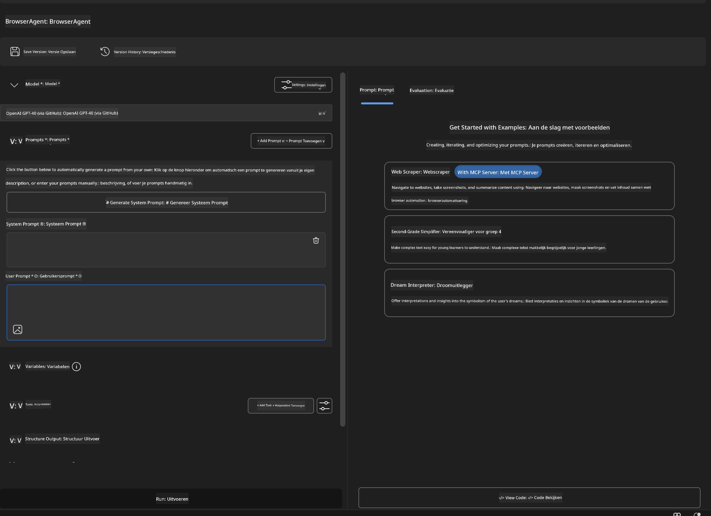


### 🔧 Phase 2: MCP Integration Workflow

#### Step 3: Add MCP Server Integration
1. **Navigate to Tools Section** in Agent Builder
2. **Click "Add Tool"** to open the integration menu
3. **Select "MCP Server"** from available options

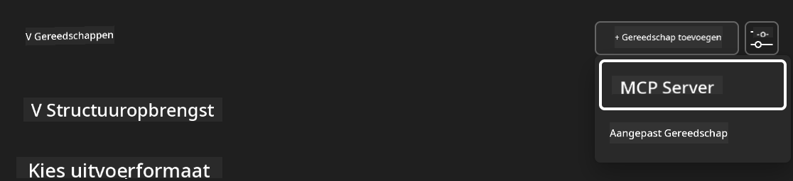

**🔍 Understanding Tool Types:**
- **Built-in Tools**: Pre-configured AI Toolkit functions
- **MCP Servers**: External service integrations
- **Custom APIs**: Your own service endpoints
- **Function Calling**: Direct model function access

#### Step 4: MCP Server Selection
1. **Choose "MCP Server"** option to proceed
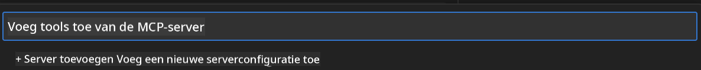

2. **Browse MCP Catalog** to explore available integrations
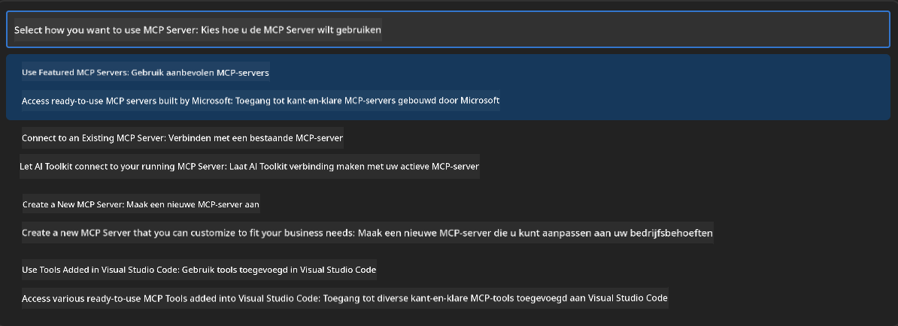


### 🎮 Phase 3: Playwright MCP Configuration

#### Step 5: Select and Configure Playwright
1. **Click "Use Featured MCP Servers"** to access Microsoft's verified servers
2. **Select "Playwright"** from the featured list
3. **Accept Default MCP ID** or customize for your environment

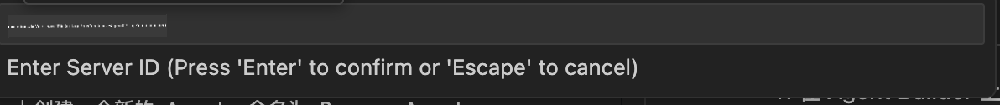

#### Step 6: Enable Playwright Capabilities
**🔑 Critical Step**: Select **ALL** available Playwright methods for maximum functionality

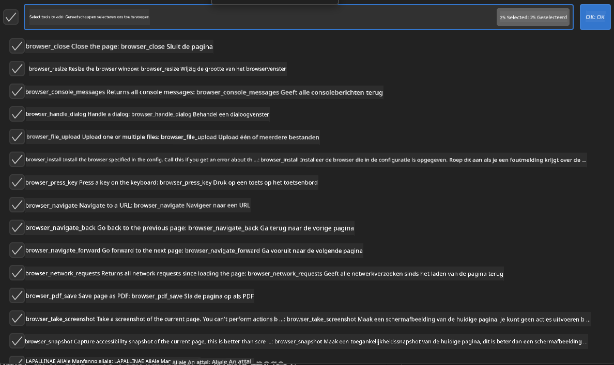

**🛠️ Essential Playwright Tools:**
- **Navigation**: `goto`, `goBack`, `goForward`, `reload`
- **Interaction**: `click`, `fill`, `press`, `hover`, `drag`
- **Extraction**: `textContent`, `innerHTML`, `getAttribute`
- **Validation**: `isVisible`, `isEnabled`, `waitForSelector`
- **Capture**: `screenshot`, `pdf`, `video`
- **Network**: `setExtraHTTPHeaders`, `route`, `waitForResponse`

#### Stap 7: Verifieer succesvolle integratie
**✅ Succesindicatoren:**
- Alle tools verschijnen in de Agent Builder interface
- Geen foutmeldingen in het integratiepaneel
- Playwright-server status toont "Connected"

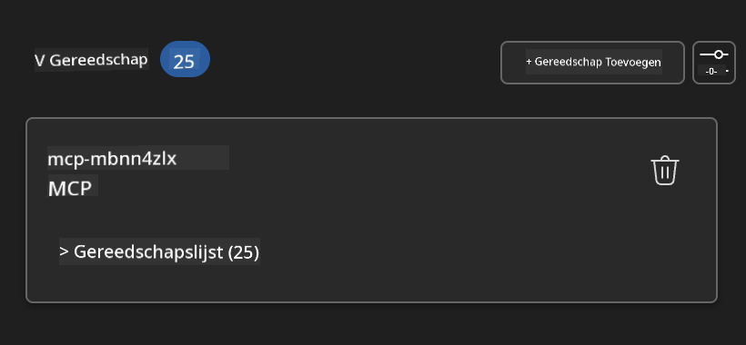

**🔧 Veelvoorkomende problemen oplossen:**
- **Verbinding mislukt**: Controleer internetverbinding en firewallinstellingen
- **Ontbrekende tools**: Zorg dat alle functionaliteiten tijdens setup geselecteerd zijn
- **Toestemmingsfouten**: Controleer of VS Code de benodigde systeemrechten heeft

### 🎯 Fase 4: Geavanceerde prompt engineering

#### Stap 8: Ontwerp intelligente systeem prompts
Maak geavanceerde prompts die de volledige mogelijkheden van Playwright benutten:

```markdown
# Web Automation Expert System Prompt

## Core Identity
You are an advanced web automation specialist with deep expertise in browser automation, web scraping, and user experience analysis. You have access to Playwright tools for comprehensive browser control.

## Capabilities & Approach
### Navigation Strategy
- Always start with screenshots to understand page layout
- Use semantic selectors (text content, labels) when possible
- Implement wait strategies for dynamic content
- Handle single-page applications (SPAs) effectively

### Error Handling
- Retry failed operations with exponential backoff
- Provide clear error descriptions and solutions
- Suggest alternative approaches when primary methods fail
- Always capture diagnostic screenshots on errors

### Data Extraction
- Extract structured data in JSON format when possible
- Provide confidence scores for extracted information
- Validate data completeness and accuracy
- Handle pagination and infinite scroll scenarios

### Reporting
- Include step-by-step execution logs
- Provide before/after screenshots for verification
- Suggest optimizations and alternative approaches
- Document any limitations or edge cases encountered

## Ethical Guidelines
- Respect robots.txt and rate limiting
- Avoid overloading target servers
- Only extract publicly available information
- Follow website terms of service
```

#### Stap 9: Maak dynamische gebruikersprompts
Ontwerp prompts die verschillende functionaliteiten demonstreren:

**🌐 Voorbeeld webanalyse:**
```markdown
Navigate to github.com/kinfey and provide a comprehensive analysis including:
1. Repository structure and organization
2. Recent activity and contribution patterns  
3. Documentation quality assessment
4. Technology stack identification
5. Community engagement metrics
6. Notable projects and their purposes

Include screenshots at key steps and provide actionable insights.
```

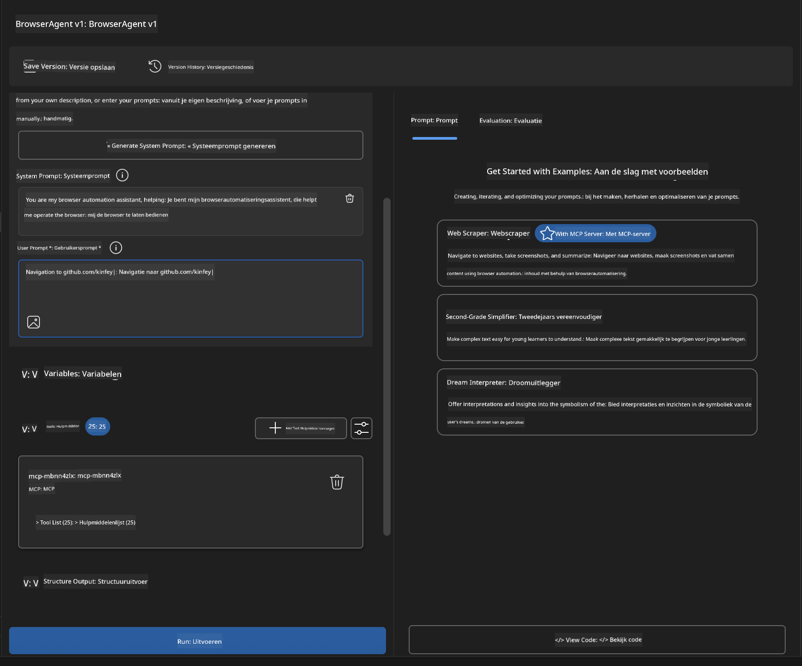

### 🚀 Fase 5: Uitvoering en testen

#### Stap 10: Voer je eerste automatisering uit
1. **Klik op "Run"** om de automatiseringsreeks te starten  
2. **Volg de uitvoering in real-time**:
   - Chrome-browser start automatisch
   - Agent navigeert naar de doelwebsite
   - Screenshots worden van elke belangrijke stap gemaakt
   - Analyse-resultaten worden in real-time weergegeven

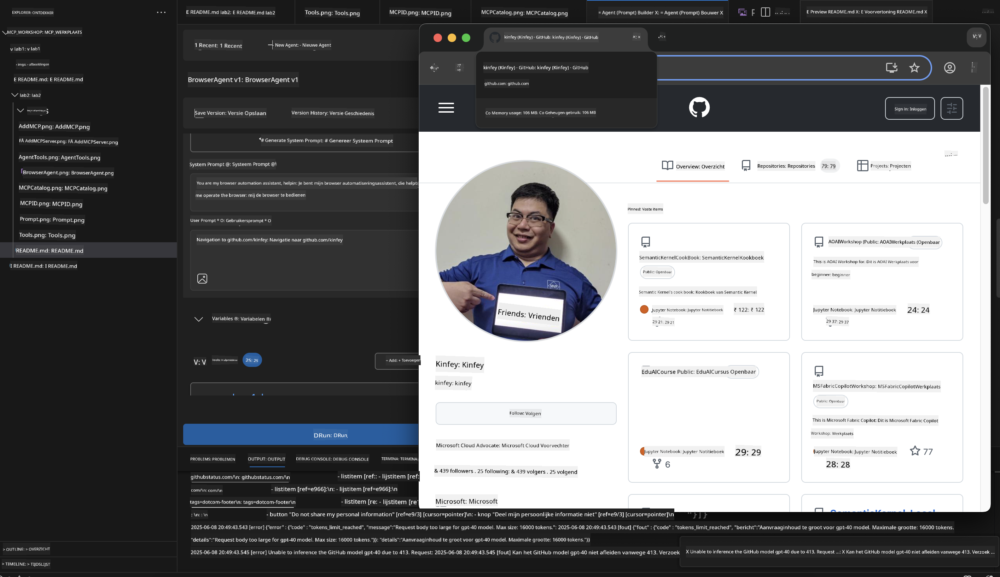

#### Stap 11: Analyseer resultaten en inzichten
Bekijk de uitgebreide analyse in de interface van Agent Builder:

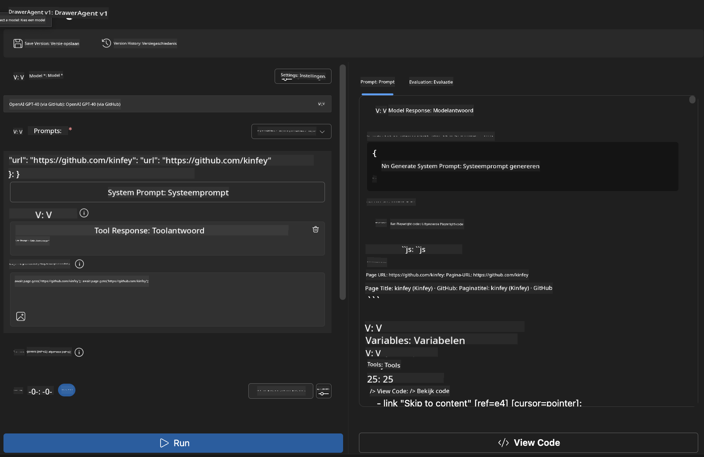

### 🌟 Fase 6: Geavanceerde functionaliteiten en implementatie

#### Stap 12: Exporteren en productie-implementatie
Agent Builder ondersteunt meerdere implementatie-opties:

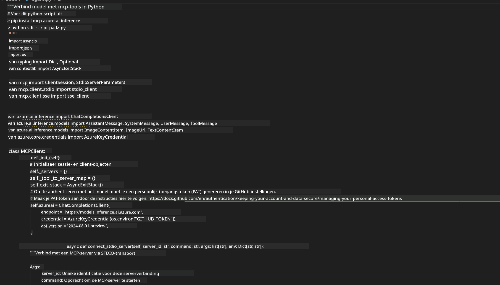

## 🎓 Samenvatting Module 2 & Volgende stappen

### 🏆 Behaald: MCP Integratie Meesterschap

**✅ Beheerde vaardigheden:**
- [ ] MCP-architectuur en voordelen begrijpen
- [ ] Navigeren door Microsofts MCP-serverecosysteem
- [ ] Playwright MCP integreren met AI Toolkit
- [ ] Geavanceerde browserautomatiseringsagents bouwen
- [ ] Geavanceerde prompt engineering voor webautomatisering

### 📚 Aanvullende bronnen

- **🔗 MCP Specificatie**: [Officiële Protocoldocumentatie](https://modelcontextprotocol.io/)
- **🛠️ Playwright API**: [Volledige methodereferentie](https://playwright.dev/docs/api/class-playwright)
- **🏢 Microsoft MCP Servers**: [Enterprise Integratiehandleiding](https://github.com/microsoft/mcp-servers)
- **🌍 Community Voorbeelden**: [MCP Server Galerij](https://github.com/modelcontextprotocol/servers)

**🎉 Gefeliciteerd!** Je beheerst nu MCP-integratie en kunt productieklare AI-agents bouwen met externe toolmogelijkheden!

### 🔜 Ga verder naar de volgende module

Klaar om je MCP-vaardigheden naar een hoger niveau te tillen? Ga verder naar **[Module 3: Geavanceerde MCP-ontwikkeling met AI Toolkit](../lab3/README.md)** waar je leert hoe je:
- Je eigen custom MCP-servers maakt
- De nieuwste MCP Python SDK configureert en gebruikt
- De MCP Inspector instelt voor debugging
- Geavanceerde MCP-server ontwikkelworkflows beheerst
- Een Weather MCP Server vanaf nul bouwt

**Disclaimer**:  
Dit document is vertaald met behulp van de AI-vertalingsdienst [Co-op Translator](https://github.com/Azure/co-op-translator). Hoewel we streven naar nauwkeurigheid, dient u er rekening mee te houden dat automatische vertalingen fouten of onnauwkeurigheden kunnen bevatten. Het oorspronkelijke document in de oorspronkelijke taal moet worden beschouwd als de gezaghebbende bron. Voor belangrijke informatie wordt professionele menselijke vertaling aanbevolen. Wij zijn niet aansprakelijk voor eventuele misverstanden of verkeerde interpretaties die voortvloeien uit het gebruik van deze vertaling.