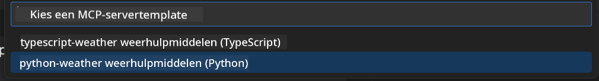
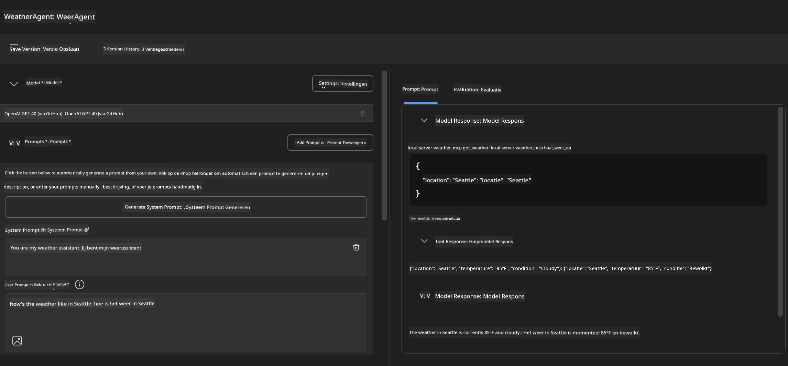
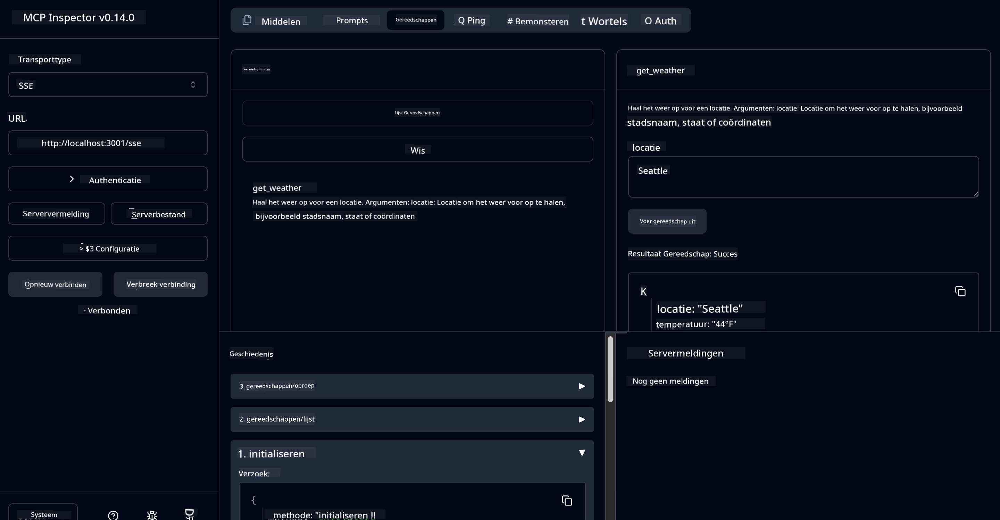

<!--
CO_OP_TRANSLATOR_METADATA:
{
  "original_hash": "dd8da3f75addcef453fe11f02a270217",
  "translation_date": "2025-07-14T08:15:59+00:00",
  "source_file": "10-StreamliningAIWorkflowsBuildingAnMCPServerWithAIToolkit/lab3/README.md",
  "language_code": "nl"
}
-->
# 🔧 Module 3: Geavanceerde MCP-ontwikkeling met AI Toolkit


## 🎯 Leerdoelen

Aan het einde van deze lab kun je:

- ✅ Eigen MCP-servers maken met behulp van de AI Toolkit
- ✅ De nieuwste MCP Python SDK (v1.9.3) configureren en gebruiken
- ✅ De MCP Inspector instellen en gebruiken voor debugging
- ✅ MCP-servers debuggen in zowel Agent Builder als Inspector omgevingen
- ✅ Geavanceerde workflows voor MCP-serverontwikkeling begrijpen

## 📋 Vereisten

- Lab 2 (MCP Fundamentals) voltooid
- VS Code met AI Toolkit extensie geïnstalleerd
- Python 3.10+ omgeving
- Node.js en npm voor het opzetten van Inspector

## 🏗️ Wat je gaat bouwen

In deze lab maak je een **Weather MCP Server** die laat zien:
- Eigen MCP-server implementatie
- Integratie met AI Toolkit Agent Builder
- Professionele debugging workflows
- Moderne MCP SDK gebruikspatronen

---

## 🔧 Overzicht Kerncomponenten

### 🐍 MCP Python SDK
De Model Context Protocol Python SDK vormt de basis voor het bouwen van eigen MCP-servers. Je gebruikt versie 1.9.3 met verbeterde debuggingmogelijkheden.

### 🔍 MCP Inspector
Een krachtig debuggingtool dat biedt:
- Real-time server monitoring
- Visualisatie van tool-uitvoering
- Inspectie van netwerkverzoeken/-antwoorden
- Interactieve testomgeving

---

## 📖 Stapsgewijze Implementatie

### Stap 1: Maak een WeatherAgent in Agent Builder

1. **Start Agent Builder** in VS Code via de AI Toolkit extensie
2. **Maak een nieuwe agent** met de volgende configuratie:
   - Agentnaam: `WeatherAgent`


### Stap 2: Initialiseer MCP Server Project

1. **Ga naar Tools** → **Add Tool** in Agent Builder
2. **Selecteer "MCP Server"** uit de beschikbare opties
3. **Kies "Create A new MCP Server"**
4. **Selecteer de `python-weather` template**
5. **Geef je server een naam:** `weather_mcp`



### Stap 3: Open en Bekijk het Project

1. **Open het gegenereerde project** in VS Code
2. **Bekijk de projectstructuur:**
   ```
   weather_mcp/
   ├── src/
   │   ├── __init__.py
   │   └── server.py
   ├── inspector/
   │   ├── package.json
   │   └── package-lock.json
   ├── .vscode/
   │   ├── launch.json
   │   └── tasks.json
   ├── pyproject.toml
   └── README.md
   ```

### Stap 4: Upgrade naar de nieuwste MCP SDK

> **🔍 Waarom upgraden?** We willen de nieuwste MCP SDK (v1.9.3) en Inspector service (0.14.0) gebruiken voor verbeterde functies en betere debugging.

#### 4a. Update Python-afhankelijkheden

**Bewerk `pyproject.toml`:** update [./code/weather_mcp/pyproject.toml](../../../../10-StreamliningAIWorkflowsBuildingAnMCPServerWithAIToolkit/lab3/code/weather_mcp/pyproject.toml)

#### 4b. Update Inspector Configuratie

**Bewerk `inspector/package.json`:** update [./code/weather_mcp/inspector/package.json](../../../../10-StreamliningAIWorkflowsBuildingAnMCPServerWithAIToolkit/lab3/code/weather_mcp/inspector/package.json)

#### 4c. Update Inspector Afhankelijkheden

**Bewerk `inspector/package-lock.json`:** update [./code/weather_mcp/inspector/package-lock.json](../../../../10-StreamliningAIWorkflowsBuildingAnMCPServerWithAIToolkit/lab3/code/weather_mcp/inspector/package-lock.json)

> **📝 Opmerking:** Dit bestand bevat uitgebreide afhankelijkheidsdefinities. Hieronder staat de essentiële structuur - de volledige inhoud zorgt voor correcte afhankelijkheidsresolutie.

> **⚡ Volledige Package Lock:** Het complete package-lock.json bevat ongeveer 3000 regels afhankelijkheidsdefinities. Bovenstaand toont de belangrijkste structuur - gebruik het meegeleverde bestand voor volledige afhankelijkheidsresolutie.

### Stap 5: Configureer VS Code Debugging

*Let op: kopieer het bestand op het opgegeven pad om het overeenkomstige lokale bestand te vervangen*

#### 5a. Update Launch Configuratie

**Bewerk `.vscode/launch.json`:**

```json
{
  "version": "0.2.0",
  "configurations": [
    {
      "name": "Attach to Local MCP",
      "type": "debugpy",
      "request": "attach",
      "connect": {
        "host": "localhost",
        "port": 5678
      },
      "presentation": {
        "hidden": true
      },
      "internalConsoleOptions": "neverOpen",
      "postDebugTask": "Terminate All Tasks"
    },
    {
      "name": "Launch Inspector (Edge)",
      "type": "msedge",
      "request": "launch",
      "url": "http://localhost:6274?timeout=60000&serverUrl=http://localhost:3001/sse#tools",
      "cascadeTerminateToConfigurations": [
        "Attach to Local MCP"
      ],
      "presentation": {
        "hidden": true
      },
      "internalConsoleOptions": "neverOpen"
    },
    {
      "name": "Launch Inspector (Chrome)",
      "type": "chrome",
      "request": "launch",
      "url": "http://localhost:6274?timeout=60000&serverUrl=http://localhost:3001/sse#tools",
      "cascadeTerminateToConfigurations": [
        "Attach to Local MCP"
      ],
      "presentation": {
        "hidden": true
      },
      "internalConsoleOptions": "neverOpen"
    }
  ],
  "compounds": [
    {
      "name": "Debug in Agent Builder",
      "configurations": [
        "Attach to Local MCP"
      ],
      "preLaunchTask": "Open Agent Builder",
    },
    {
      "name": "Debug in Inspector (Edge)",
      "configurations": [
        "Launch Inspector (Edge)",
        "Attach to Local MCP"
      ],
      "preLaunchTask": "Start MCP Inspector",
      "stopAll": true
    },
    {
      "name": "Debug in Inspector (Chrome)",
      "configurations": [
        "Launch Inspector (Chrome)",
        "Attach to Local MCP"
      ],
      "preLaunchTask": "Start MCP Inspector",
      "stopAll": true
    }
  ]
}
```

**Bewerk `.vscode/tasks.json`:**

```
{
  "version": "2.0.0",
  "tasks": [
    {
      "label": "Start MCP Server",
      "type": "shell",
      "command": "python -m debugpy --listen 127.0.0.1:5678 src/__init__.py sse",
      "isBackground": true,
      "options": {
        "cwd": "${workspaceFolder}",
        "env": {
          "PORT": "3001"
        }
      },
      "problemMatcher": {
        "pattern": [
          {
            "regexp": "^.*$",
            "file": 0,
            "location": 1,
            "message": 2
          }
        ],
        "background": {
          "activeOnStart": true,
          "beginsPattern": ".*",
          "endsPattern": "Application startup complete|running"
        }
      }
    },
    {
      "label": "Start MCP Inspector",
      "type": "shell",
      "command": "npm run dev:inspector",
      "isBackground": true,
      "options": {
        "cwd": "${workspaceFolder}/inspector",
        "env": {
          "CLIENT_PORT": "6274",
          "SERVER_PORT": "6277",
        }
      },
      "problemMatcher": {
        "pattern": [
          {
            "regexp": "^.*$",
            "file": 0,
            "location": 1,
            "message": 2
          }
        ],
        "background": {
          "activeOnStart": true,
          "beginsPattern": "Starting MCP inspector",
          "endsPattern": "Proxy server listening on port"
        }
      },
      "dependsOn": [
        "Start MCP Server"
      ]
    },
    {
      "label": "Open Agent Builder",
      "type": "shell",
      "command": "echo ${input:openAgentBuilder}",
      "presentation": {
        "reveal": "never"
      },
      "dependsOn": [
        "Start MCP Server"
      ],
    },
    {
      "label": "Terminate All Tasks",
      "command": "echo ${input:terminate}",
      "type": "shell",
      "problemMatcher": []
    }
  ],
  "inputs": [
    {
      "id": "openAgentBuilder",
      "type": "command",
      "command": "ai-mlstudio.agentBuilder",
      "args": {
        "initialMCPs": [ "local-server-weather_mcp" ],
        "triggeredFrom": "vsc-tasks"
      }
    },
    {
      "id": "terminate",
      "type": "command",
      "command": "workbench.action.tasks.terminate",
      "args": "terminateAll"
    }
  ]
}
```

---

## 🚀 Je MCP Server draaien en testen

### Stap 6: Installeer afhankelijkheden

Na het aanbrengen van de configuratiewijzigingen, voer je de volgende commando’s uit:

**Installeer Python-afhankelijkheden:**
```bash
uv sync
```

**Installeer Inspector-afhankelijkheden:**
```bash
cd inspector
npm install
```

### Stap 7: Debuggen met Agent Builder

1. **Druk op F5** of gebruik de **"Debug in Agent Builder"** configuratie
2. **Selecteer de samengestelde configuratie** in het debugpaneel
3. **Wacht tot de server is gestart** en Agent Builder opent
4. **Test je weather MCP server** met natuurlijke taalvragen

Voer een prompt in zoals deze

SYSTEM_PROMPT

```
You are my weather assistant
```

USER_PROMPT

```
How's the weather like in Seattle
```



### Stap 8: Debuggen met MCP Inspector

1. **Gebruik de "Debug in Inspector"** configuratie (Edge of Chrome)
2. **Open de Inspector interface** via `http://localhost:6274`
3. **Verken de interactieve testomgeving:**
   - Bekijk beschikbare tools
   - Test tool-uitvoering
   - Monitor netwerkverzoeken
   - Debug serverantwoorden



---

## 🎯 Belangrijkste Leerresultaten

Door deze lab te voltooien heb je:

- [x] **Een eigen MCP-server gemaakt** met AI Toolkit templates
- [x] **Geüpgraded naar de nieuwste MCP SDK** (v1.9.3) voor verbeterde functionaliteit
- [x] **Professionele debugging workflows geconfigureerd** voor zowel Agent Builder als Inspector
- [x] **De MCP Inspector opgezet** voor interactieve servertests
- [x] **VS Code debugging configuraties beheerst** voor MCP-ontwikkeling

## 🔧 Geavanceerde Functies Verkennen

| Functie | Beschrijving | Gebruikssituatie |
|---------|--------------|------------------|
| **MCP Python SDK v1.9.3** | Laatste protocolimplementatie | Moderne serverontwikkeling |
| **MCP Inspector 0.14.0** | Interactieve debuggingtool | Real-time servertesten |
| **VS Code Debugging** | Geïntegreerde ontwikkelomgeving | Professionele debugging workflow |
| **Agent Builder Integratie** | Directe AI Toolkit koppeling | End-to-end agenttesten |

## 📚 Aanvullende Bronnen

- [MCP Python SDK Documentatie](https://modelcontextprotocol.io/docs/sdk/python)
- [AI Toolkit Extensie Gids](https://code.visualstudio.com/docs/ai/ai-toolkit)
- [VS Code Debugging Documentatie](https://code.visualstudio.com/docs/editor/debugging)
- [Model Context Protocol Specificatie](https://modelcontextprotocol.io/docs/concepts/architecture)

---

**🎉 Gefeliciteerd!** Je hebt Lab 3 succesvol afgerond en kunt nu eigen MCP-servers maken, debuggen en uitrollen met professionele ontwikkelworkflows.

### 🔜 Ga door naar de volgende module

Klaar om je MCP-vaardigheden toe te passen in een echte ontwikkelworkflow? Ga verder naar **[Module 4: Praktische MCP-ontwikkeling - Custom GitHub Clone Server](../lab4/README.md)** waar je:
- Een productieklare MCP-server bouwt die GitHub repository-operaties automatiseert
- Functionaliteit voor het klonen van GitHub repositories via MCP implementeert
- Eigen MCP-servers integreert met VS Code en GitHub Copilot Agent Mode
- Eigen MCP-servers test en uitrolt in productieomgevingen
- Praktische workflowautomatisering voor ontwikkelaars leert

**Disclaimer**:  
Dit document is vertaald met behulp van de AI-vertalingsdienst [Co-op Translator](https://github.com/Azure/co-op-translator). Hoewel we streven naar nauwkeurigheid, dient u er rekening mee te houden dat geautomatiseerde vertalingen fouten of onnauwkeurigheden kunnen bevatten. Het originele document in de oorspronkelijke taal moet als de gezaghebbende bron worden beschouwd. Voor cruciale informatie wordt professionele menselijke vertaling aanbevolen. Wij zijn niet aansprakelijk voor eventuele misverstanden of verkeerde interpretaties die voortvloeien uit het gebruik van deze vertaling.