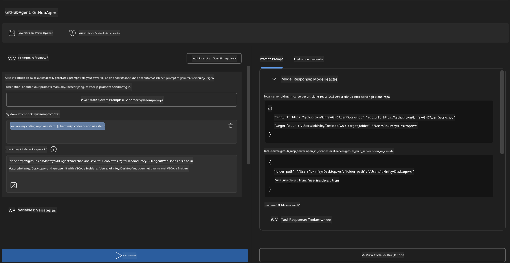
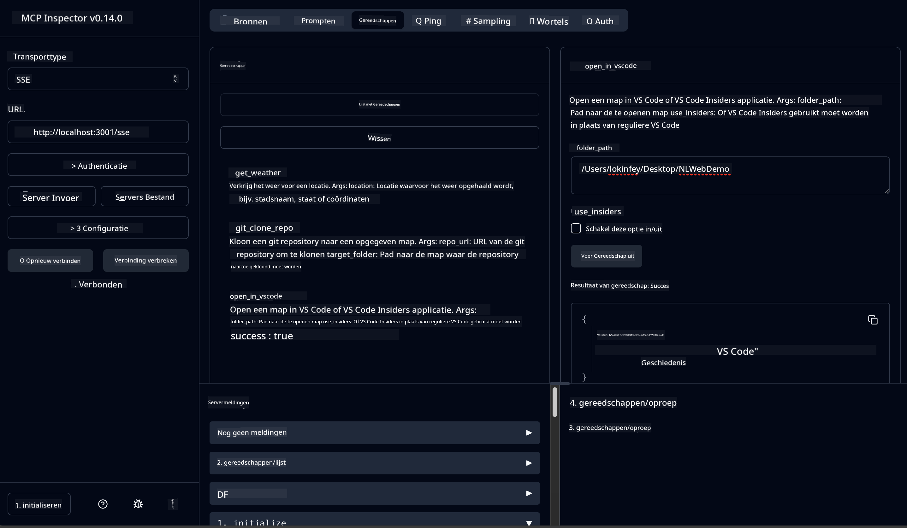

<!--
CO_OP_TRANSLATOR_METADATA:
{
  "original_hash": "f83bc722dc758efffd68667d6a1db470",
  "translation_date": "2025-07-14T08:44:14+00:00",
  "source_file": "10-StreamliningAIWorkflowsBuildingAnMCPServerWithAIToolkit/lab4/README.md",
  "language_code": "nl"
}
-->
# 🐙 Module 4: Praktische MCP-ontwikkeling - Aangepaste GitHub Clone Server


> **⚡ Snel aan de slag:** Bouw in slechts 30 minuten een productieklare MCP-server die het klonen van GitHub-repositories en de integratie met VS Code automatiseert!

## 🎯 Leerdoelen

Aan het einde van deze lab kun je:

- ✅ Een aangepaste MCP-server maken voor echte ontwikkelworkflows
- ✅ Functionaliteit voor het klonen van GitHub-repositories via MCP implementeren
- ✅ Aangepaste MCP-servers integreren met VS Code en Agent Builder
- ✅ GitHub Copilot Agent Mode gebruiken met aangepaste MCP-tools
- ✅ Aangepaste MCP-servers testen en uitrollen in productieomgevingen

## 📋 Vereisten

- Voltooiing van Labs 1-3 (MCP basisprincipes en gevorderde ontwikkeling)
- GitHub Copilot-abonnement ([gratis aanmelding beschikbaar](https://github.com/github-copilot/signup))
- VS Code met AI Toolkit en GitHub Copilot extensies
- Git CLI geïnstalleerd en geconfigureerd

## 🏗️ Projectoverzicht

### **Echte ontwikkeluitdaging**
Als ontwikkelaars gebruiken we vaak GitHub om repositories te klonen en deze te openen in VS Code of VS Code Insiders. Dit handmatige proces bestaat uit:
1. Terminal/command prompt openen
2. Navigeren naar de gewenste map
3. `git clone` commando uitvoeren
4. VS Code openen in de gekloonde map

**Onze MCP-oplossing maakt dit mogelijk met één slimme opdracht!**

### **Wat je gaat bouwen**
Een **GitHub Clone MCP Server** (`git_mcp_server`) die het volgende biedt:

| Functie | Beschrijving | Voordeel |
|---------|--------------|----------|
| 🔄 **Slim Repository Klonen** | GitHub-repos klonen met validatie | Geautomatiseerde foutcontrole |
| 📁 **Intelligent Mapbeheer** | Mappen veilig controleren en aanmaken | Voorkomt overschrijven |
| 🚀 **Cross-Platform VS Code Integratie** | Projecten openen in VS Code/Insiders | Naadloze workflowovergang |
| 🛡️ **Robuuste Foutafhandeling** | Omgaan met netwerk-, permissie- en padproblemen | Betrouwbaarheid voor productie |

---

## 📖 Stapsgewijze Implementatie

### Stap 1: Maak GitHub Agent aan in Agent Builder

1. **Start Agent Builder** via de AI Toolkit extensie
2. **Maak een nieuwe agent** met de volgende configuratie:
   ```
   Agent Name: GitHubAgent
   ```

3. **Initialiseer aangepaste MCP-server:**
   - Ga naar **Tools** → **Add Tool** → **MCP Server**
   - Kies **"Create A new MCP Server"**
   - Selecteer de **Python template** voor maximale flexibiliteit
   - **Servernaam:** `git_mcp_server`

### Stap 2: Configureer GitHub Copilot Agent Mode

1. **Open GitHub Copilot** in VS Code (Ctrl/Cmd + Shift + P → "GitHub Copilot: Open")
2. **Selecteer Agent Model** in de Copilot-interface
3. **Kies het Claude 3.7 model** voor verbeterde redeneercapaciteiten
4. **Schakel MCP-integratie in** voor toegang tot tools

> **💡 Pro Tip:** Claude 3.7 biedt een beter begrip van ontwikkelworkflows en foutafhandelingspatronen.

### Stap 3: Implementeer de kernfunctionaliteit van de MCP-server

**Gebruik de volgende gedetailleerde prompt met GitHub Copilot Agent Mode:**

```
Create two MCP tools with the following comprehensive requirements:

🔧 TOOL A: clone_repository
Requirements:
- Clone any GitHub repository to a specified local folder
- Return the absolute path of the successfully cloned project
- Implement comprehensive validation:
  ✓ Check if target directory already exists (return error if exists)
  ✓ Validate GitHub URL format (https://github.com/user/repo)
  ✓ Verify git command availability (prompt installation if missing)
  ✓ Handle network connectivity issues
  ✓ Provide clear error messages for all failure scenarios

🚀 TOOL B: open_in_vscode
Requirements:
- Open specified folder in VS Code or VS Code Insiders
- Cross-platform compatibility (Windows/Linux/macOS)
- Use direct application launch (not terminal commands)
- Auto-detect available VS Code installations
- Handle cases where VS Code is not installed
- Provide user-friendly error messages

Additional Requirements:
- Follow MCP 1.9.3 best practices
- Include proper type hints and documentation
- Implement logging for debugging purposes
- Add input validation for all parameters
- Include comprehensive error handling
```

### Stap 4: Test je MCP-server

#### 4a. Test in Agent Builder

1. **Start de debugconfiguratie** voor Agent Builder
2. **Configureer je agent met deze systeem-prompt:**

```
SYSTEM_PROMPT:
You are my intelligent coding repository assistant. You help developers efficiently clone GitHub repositories and set up their development environment. Always provide clear feedback about operations and handle errors gracefully.
```

3. **Test met realistische gebruikersscenario’s:**

```
USER_PROMPT EXAMPLES:

Scenario : Basic Clone and Open
"Clone {Your GitHub Repo link such as https://github.com/kinfey/GHCAgentWorkshop
 } and save to {The global path you specify}, then open it with VS Code Insiders"
```



**Verwachte resultaten:**
- ✅ Succesvol klonen met padbevestiging
- ✅ Automatisch starten van VS Code
- ✅ Duidelijke foutmeldingen bij ongeldige situaties
- ✅ Correcte afhandeling van randgevallen

#### 4b. Test in MCP Inspector



---

**🎉 Gefeliciteerd!** Je hebt met succes een praktische, productieklare MCP-server gemaakt die echte ontwikkelworkflow-uitdagingen oplost. Je aangepaste GitHub clone server laat zien hoe krachtig MCP is voor het automatiseren en verbeteren van de productiviteit van ontwikkelaars.

### 🏆 Behaalde prestaties:
- ✅ **MCP Developer** - Aangepaste MCP-server gemaakt
- ✅ **Workflow Automator** - Ontwikkelprocessen gestroomlijnd  
- ✅ **Integratie Expert** - Meerdere ontwikkeltools verbonden
- ✅ **Productieklaar** - Oplossingen gebouwd voor uitrol

---

## 🎓 Workshop voltooid: Jouw reis met Model Context Protocol

**Beste workshopdeelnemer,**

Gefeliciteerd met het afronden van alle vier modules van de Model Context Protocol-workshop! Je hebt een flinke weg afgelegd, van het begrijpen van basisconcepten van AI Toolkit tot het bouwen van productieklare MCP-servers die echte ontwikkeluitdagingen oplossen.

### 🚀 Overzicht van je leertraject:

**[Module 1](../lab1/README.md)**: Je begon met het verkennen van AI Toolkit basisprincipes, modeltesten en het maken van je eerste AI-agent.

**[Module 2](../lab2/README.md)**: Je leerde MCP-architectuur, integreerde Playwright MCP en bouwde je eerste browserautomatiseringsagent.

**[Module 3](../lab3/README.md)**: Je ging verder met aangepaste MCP-serverontwikkeling met de Weather MCP-server en beheerde debuggingtools.

**[Module 4](../lab4/README.md)**: Je hebt nu alles toegepast om een praktische workflow-automatiseringstool voor GitHub repositories te maken.

### 🌟 Wat je hebt beheerst:

- ✅ **AI Toolkit Ecosysteem**: Modellen, agents en integratiepatronen
- ✅ **MCP Architectuur**: Client-server ontwerp, transportprotocollen en beveiliging
- ✅ **Ontwikkeltools**: Van Playground tot Inspector tot productie-uitrol
- ✅ **Aangepaste ontwikkeling**: Bouwen, testen en uitrollen van eigen MCP-servers
- ✅ **Praktische toepassingen**: Echte workflow-uitdagingen oplossen met AI

### 🔮 Jouw volgende stappen:

1. **Bouw je eigen MCP-server**: Pas deze vaardigheden toe om je unieke workflows te automatiseren
2. **Word lid van de MCP-community**: Deel je creaties en leer van anderen
3. **Verken geavanceerde integratie**: Verbind MCP-servers met enterprise-systemen
4. **Draag bij aan open source**: Help MCP-tools en documentatie te verbeteren

Onthoud, deze workshop is slechts het begin. Het Model Context Protocol-ecosysteem ontwikkelt zich snel en jij bent nu klaar om voorop te lopen in AI-gedreven ontwikkeltools.

**Bedankt voor je deelname en je inzet om te leren!**

We hopen dat deze workshop ideeën heeft aangewakkerd die zullen transformeren hoe je AI-tools bouwt en gebruikt in je ontwikkeltraject.

**Veel programmeerplezier!**

---

**Disclaimer**:  
Dit document is vertaald met behulp van de AI-vertalingsdienst [Co-op Translator](https://github.com/Azure/co-op-translator). Hoewel we streven naar nauwkeurigheid, dient u er rekening mee te houden dat geautomatiseerde vertalingen fouten of onnauwkeurigheden kunnen bevatten. Het originele document in de oorspronkelijke taal moet als de gezaghebbende bron worden beschouwd. Voor cruciale informatie wordt professionele menselijke vertaling aanbevolen. Wij zijn niet aansprakelijk voor eventuele misverstanden of verkeerde interpretaties die voortvloeien uit het gebruik van deze vertaling.