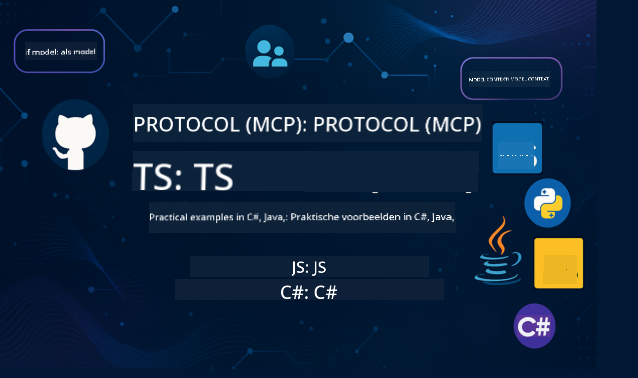

<!--
CO_OP_TRANSLATOR_METADATA:
{
  "original_hash": "866c8877136cb03e1efb9ad633a2f0a6",
  "translation_date": "2025-08-26T17:56:33+00:00",
  "source_file": "README.md",
  "language_code": "nl"
}
-->
 

Volg deze stappen om aan de slag te gaan met deze bronnen:
1. **Fork de repository**: Klik 
2. **Clone de repository**:   `git clone https://github.com/microsoft/mcp-for-beginners.git`
3. [**Word lid van de Azure AI Foundry Discord en ontmoet experts en mede-ontwikkelaars**](https://discord.com/invite/ByRwuEEgH4)

### 🌐 Ondersteuning voor meerdere talen

#### Ondersteund via GitHub Action (Automatisch & Altijd up-to-date)

 [Arabisch](../ar/README.md) | [Bengaals](../bn/README.md) | [Bulgaars](../bg/README.md) | [Birmaans (Myanmar)](../my/README.md) | [Chinees (Vereenvoudigd)](../zh/README.md) | [Chinees (Traditioneel, Hong Kong)](../hk/README.md) | [Chinees (Traditioneel, Macau)](../mo/README.md) | [Chinees (Traditioneel, Taiwan)](../tw/README.md) | [Kroatisch](../hr/README.md) | [Tsjechisch](../cs/README.md) | [Deens](../da/README.md) | [Nederlands](./README.md) | [Fins](../fi/README.md) | [Frans](../fr/README.md) | [Duits](../de/README.md) | [Grieks](../el/README.md) | [Hebreeuws](../he/README.md) | [Hindi](../hi/README.md) | [Hongaars](../hu/README.md) | [Indonesisch](../id/README.md) | [Italiaans](../it/README.md) | [Japans](../ja/README.md) | [Koreaans](../ko/README.md) | [Maleis](../ms/README.md) | [Marathi](../mr/README.md) | [Nepalees](../ne/README.md) | [Noors](../no/README.md) | [Perzisch (Farsi)](../fa/README.md) | [Pools](../pl/README.md) | [Portugees (Brazilië)](../br/README.md) | [Portugees (Portugal)](../pt/README.md) | [Punjabi (Gurmukhi)](../pa/README.md) | [Roemeens](../ro/README.md) | [Russisch](../ru/README.md) | [Servisch (Cyrillisch)](../sr/README.md) | [Slowaaks](../sk/README.md) | [Sloveens](../sl/README.md) | [Spaans](../es/README.md) | [Swahili](../sw/README.md) | [Zweeds](../sv/README.md) | [Tagalog (Filipino)](../tl/README.md) | [Thais](../th/README.md) | [Turks](../tr/README.md) | [Oekraïens](../uk/README.md) | [Urdu](../ur/README.md) | [Vietnamees](../vi/README.md)

# 🚀 Model Context Protocol (MCP) Curriculum voor Beginners

## **Leer MCP met praktische codevoorbeelden in C#, Java, JavaScript, Rust, Python en TypeScript**

## 🧠 Overzicht van de Model Context Protocol Curriculum

Het **Model Context Protocol (MCP)** is een geavanceerd framework dat is ontworpen om interacties tussen AI-modellen en clientapplicaties te standaardiseren. Deze open-source curriculum biedt een gestructureerd leerpad, compleet met praktische codevoorbeelden en real-world toepassingen, in populaire programmeertalen zoals C#, Java, JavaScript, TypeScript en Python.

Of je nu een AI-ontwikkelaar, systeemarchitect of software-engineer bent, deze gids is jouw uitgebreide bron om MCP-fundamenten en implementatiestrategieën onder de knie te krijgen.

## 🔗 Officiële MCP Bronnen

- 📘 [MCP Documentatie](https://modelcontextprotocol.io/) – Gedetailleerde tutorials en gebruikershandleidingen  
- 📜 [MCP Specificatie](https://modelcontextprotocol.io/docs/) – Protocolarchitectuur en technische referenties  
- 📜 [Originele MCP Specificatie](https://spec.modelcontextprotocol.io/) – Legacy technische referenties (kan aanvullende details bevatten)  
- 🧑‍💻 [MCP GitHub Repository](https://github.com/modelcontextprotocol) – Open-source SDK's, tools en codevoorbeelden
- 🌐 [MCP Community](https://github.com/orgs/modelcontextprotocol/discussions) – Neem deel aan discussies en draag bij aan de community

## 🧭 Overzicht van MCP Curriculum

### 📚 Volledige Curriculumstructuur

| Module | Onderwerp | Beschrijving | Link |
|--------|-----------|--------------|------|
| **Module 1-3: Basisprincipes** | | | |
| 00 | Introductie tot MCP | Overzicht van het Model Context Protocol en het belang ervan in AI-pipelines | [Lees meer](./00-Introduction/README.md) |
| 01 | Uitleg van kernconcepten | Diepgaande verkenning van kernconcepten van MCP | [Lees meer](./01-CoreConcepts/README.md) |
| 02 | Beveiliging in MCP | Beveiligingsrisico's en best practices | [Lees meer](./02-Security/README.md) |
| 03 | Aan de slag met MCP | Omgevingsinstellingen, basisservers/clients, integratie | [Lees meer](./03-GettingStarted/README.md) |
| **Module 3: Bouw je eerste server & client** | | | |
| 3.1 | Eerste server | Maak je eerste MCP-server | [Handleiding](./03-GettingStarted/01-first-server/README.md) |
| 3.2 | Eerste client | Ontwikkel een basis MCP-client | [Handleiding](./03-GettingStarted/02-client/README.md) |
| 3.3 | Client met LLM | Integreer grote taalmodellen | [Handleiding](./03-GettingStarted/03-llm-client/README.md) |
| 3.4 | VS Code-integratie | Gebruik MCP-servers in VS Code | [Handleiding](./03-GettingStarted/04-vscode/README.md) |
| 3.5 | stdio Server | Maak servers met stdio transport | [Handleiding](./03-GettingStarted/05-stdio-server/README.md) |
| 3.6 | HTTP Streaming | Implementeer HTTP-streaming in MCP | [Handleiding](./03-GettingStarted/06-http-streaming/README.md) |
| 3.7 | AI Toolkit | Gebruik AI Toolkit met MCP | [Handleiding](./03-GettingStarted/07-aitk/README.md) |
| 3.8 | Testen | Test je MCP-serverimplementatie | [Handleiding](./03-GettingStarted/08-testing/README.md) |
| 3.9 | Implementatie | Implementeer MCP-servers in productie | [Handleiding](./03-GettingStarted/09-deployment/README.md) |
| **Module 4-5: Praktisch & Geavanceerd** | | | |
| 04 | Praktische implementatie | SDK's, debugging, testen, herbruikbare prompttemplates | [Lees meer](./04-PracticalImplementation/README.md) |
| 05 | Geavanceerde onderwerpen in MCP | Multi-modale AI, schaalbaarheid, gebruik in ondernemingen | [Lees meer](./05-AdvancedTopics/README.md) |
| 5.1 | Azure-integratie | MCP-integratie met Azure | [Handleiding](./05-AdvancedTopics/mcp-integration/README.md) |
| 5.2 | Multi-modaliteit | Werken met meerdere modaliteiten | [Handleiding](./05-AdvancedTopics/mcp-multi-modality/README.md) |
| 5.3 | OAuth2 Demo | Implementeer OAuth2-authenticatie | [Handleiding](./05-AdvancedTopics/mcp-oauth2-demo/README.md) |
| 5.4 | Root Contexts | Begrijp en implementeer root contexts | [Handleiding](./05-AdvancedTopics/mcp-root-contexts/README.md) |
| 5.5 | Routing | MCP-routingstrategieën | [Handleiding](./05-AdvancedTopics/mcp-routing/README.md) |
| 5.6 | Sampling | Samplingtechnieken in MCP | [Handleiding](./05-AdvancedTopics/mcp-sampling/README.md) |
| 5.7 | Schaalbaarheid | Schaal MCP-implementaties | [Handleiding](./05-AdvancedTopics/mcp-scaling/README.md) |
| 5.8 | Beveiliging | Geavanceerde beveiligingsoverwegingen | [Handleiding](./05-AdvancedTopics/mcp-security/README.md) |
| 5.9 | Web Search | Implementeer webzoekfunctionaliteit | [Handleiding](./05-AdvancedTopics/web-search-mcp/README.md) |
| 5.10 | Realtime Streaming | Bouw realtime streamingfunctionaliteit | [Handleiding](./05-AdvancedTopics/mcp-realtimestreaming/README.md) |
| 5.11 | Realtime Search | Implementeer realtime zoekfunctionaliteit | [Handleiding](./05-AdvancedTopics/mcp-realtimesearch/README.md) |
| 5.12 | Entra ID Auth | Authenticatie met Microsoft Entra ID | [Handleiding](./05-AdvancedTopics/mcp-security-entra/README.md) |
| 5.13 | Foundry-integratie | Integreer met Azure AI Foundry | [Handleiding](./05-AdvancedTopics/mcp-foundry-agent-integration/README.md) |
| 5.14 | Context Engineering | Technieken voor effectieve context engineering | [Handleiding](./05-AdvancedTopics/mcp-contextengineering/README.md) |
| **Module 6-10: Community & Best Practices** | | | |
| 06 | Communitybijdragen | Hoe je kunt bijdragen aan het MCP-ecosysteem | [Handleiding](./06-CommunityContributions/README.md) |
| 07 | Inzichten uit vroege adoptie | Verhalen uit de praktijk | [Handleiding](./07-LessonsFromEarlyAdoption/README.md) |
| 08 | Best Practices voor MCP | Prestaties, fouttolerantie, veerkracht | [Handleiding](./08-BestPractices/README.md) |
| 09 | MCP Case Studies | Praktische implementatievoorbeelden | [Handleiding](./09-CaseStudy/README.md) |
| 10 | Hands-on Workshop | Bouw een MCP-server met AI Toolkit | [Lab](./10-StreamliningAIWorkflowsBuildingAnMCPServerWithAIToolkit/README.md) |

### 💻 Voorbeeldcodeprojecten

#### Basis MCP Calculator Voorbeelden

| Taal | Beschrijving | Link |
|------|--------------|------|
| C# | MCP Server Voorbeeld | [Bekijk Code](./03-GettingStarted/samples/csharp/README.md) |
| Java | MCP Calculator | [Bekijk Code](./03-GettingStarted/samples/java/calculator/README.md) |
| JavaScript | MCP Demo | [Bekijk Code](./03-GettingStarted/samples/javascript/README.md) |
| Python | MCP Server | [Bekijk Code](../../03-GettingStarted/samples/python/mcp_calculator_server.py) |
| TypeScript | MCP Voorbeeld | [Bekijk Code](./03-GettingStarted/samples/typescript/README.md) |
| Rust | MCP Voorbeeld | [Bekijk Code](./03-GettingStarted/samples/rust/README.md) |

#### Geavanceerde MCP Implementaties

| Taal | Beschrijving | Link |
|------|--------------|------|
| C# | Geavanceerd Voorbeeld | [Bekijk Code](./04-PracticalImplementation/samples/csharp/README.md) |
| Java met Spring | Container App Voorbeeld | [Bekijk Code](./04-PracticalImplementation/samples/java/containerapp/README.md) |
| JavaScript | Geavanceerd Voorbeeld | [Bekijk Code](./04-PracticalImplementation/samples/javascript/README.md) |
| Python | Complexe Implementatie | [Bekijk Code](../../04-PracticalImplementation/samples/python/READMEmd) |
| TypeScript | Container Voorbeeld | [Bekijk Code](./04-PracticalImplementation/samples/typescript/README.md) |

## 🎯 Vereisten voor het Leren van MCP

Om het meeste uit dit curriculum te halen, is het handig als je:

- Basiskennis hebt van programmeren in ten minste een van de volgende talen: C#, Java, JavaScript, Python of TypeScript
- Begrip hebt van het client-servermodel en APIs
- Bekend bent met REST- en HTTP-concepten
- (Optioneel) Achtergrond hebt in AI/ML-concepten

- Deelneemt aan onze community-discussies voor ondersteuning

## 📚 Studiegids & Bronnen

Deze repository bevat verschillende bronnen om je te helpen effectief te leren en navigeren:

### Studiegids

Een uitgebreide [Studiegids](./study_guide.md) is beschikbaar om je te helpen deze repository effectief te gebruiken. De gids bevat:

- Een visuele curriculumkaart met alle behandelde onderwerpen
- Gedetailleerde uitleg van elk onderdeel van de repository
- Richtlijnen voor het gebruik van voorbeeldprojecten
- Aanbevolen leerpaden voor verschillende vaardigheidsniveaus
- Aanvullende bronnen om je leertraject te ondersteunen

### Changelog

We houden een gedetailleerde [Changelog](./changelog.md) bij waarin alle belangrijke updates aan het curriculum worden bijgehouden, waaronder:

- Nieuwe inhoud
- Structurele wijzigingen
- Verbeteringen aan functies
- Documentatie-updates

## 🛠️ Hoe Gebruik Je Dit Curriculum Effectief

Elke les in deze gids bevat:

1. Heldere uitleg van MCP-concepten  
2. Live codevoorbeelden in meerdere talen  
3. Oefeningen om echte MCP-toepassingen te bouwen  
4. Extra bronnen voor gevorderde leerlingen

## Evenementen 

### [MCP Dev Days Juli 2025](https://developer.microsoft.com/en-us/reactor/series/S-1563/)
#### [➡️Bekijk On-Demand - MCP Dev Days](https://developer.microsoft.com/en-us/reactor/series/S-1563/)
Bereid je voor op twee dagen vol diepgaande technische inzichten, community-connectie en hands-on leren tijdens MCP Dev Days, een virtueel evenement gewijd aan het Model Context Protocol (MCP) — de opkomende standaard die AI-modellen en de tools waarop ze vertrouwen met elkaar verbindt.
Je kunt MCP Dev Days bekijken door je te registreren op onze evenementenpagina: https://aka.ms/mcpdevdays. 

#### [Dag 1: MCP Productiviteit, DevTools & Community:](https://developer.microsoft.com/en-us/reactor/series/S-1563/)

Deze dag draait om het in staat stellen van ontwikkelaars om MCP in hun workflow te gebruiken en het vieren van de geweldige MCP-community. We worden vergezeld door communityleden en partners zoals Arcade, Block, Okta en Neon om te zien hoe zij samenwerken met Microsoft om een open, uitbreidbaar MCP-ecosysteem vorm te geven.  
- Praktijkgerichte demo's in VS Code, Visual Studio, GitHub Copilot en populaire communitytools  
- Contextgestuurde ontwikkelworkflows  
- Community-geleide sessies en inzichten  
Of je nu net begint met MCP of er al mee bouwt, Dag 1 biedt inspiratie en praktische inzichten.

#### [Dag 2: Bouw MCP-Servers met Vertrouwen](https://developer.microsoft.com/en-us/reactor/series/S-1563/)

Deze dag is voor MCP-bouwers. We gaan diep in op implementatiestrategieën en best practices voor het creëren van MCP-servers en het integreren van MCP in je AI-workflows.

#### Onderwerpen zijn onder andere:

- Het bouwen van MCP-servers en deze integreren in agentervaringen  
- Promptgestuurde ontwikkeling  
- Beveiligingsbest practices  
- Het gebruik van bouwstenen zoals Functions, ACA en API Management  
- Registry-uitlijning en tooling (1P + 3P)  

Als je een ontwikkelaar, toolbouwer of AI-productstrateeg bent, zit deze dag boordevol inzichten die je nodig hebt om schaalbare, veilige en toekomstbestendige MCP-oplossingen te bouwen.

### MCP Boot Camp Augustus 2025
Leer in intensieve videosessies hoe je MCP-servers maakt, integreert met VS Code en professioneel implementeert op Azure, gebaseerd op inhoud uit het MCP voor Beginners-curriculum. Verwerf praktische vaardigheden in een technologie die al door grote bedrijven wordt gebruikt.

#### [➡️Bekijk On-Demand MCP Bootcamp | Engels](https://developer.microsoft.com/en-us/reactor/series/s-1568/)
#### [➡️Bekijk On-Demand MCP Bootcamp | Braziliaans](https://developer.microsoft.com/en-us/reactor/series/S-1566/)
#### [➡️Bekijk On-Demand MCP Bootcamp | Spaans](https://developer.microsoft.com/en-us/reactor/series/S-1567/)

## 🌟 Bedankt aan de Community

Dank aan Microsoft Valued Professional [Shivam Goyal](https://www.linkedin.com/in/shivam2003/) voor het bijdragen van belangrijke codevoorbeelden. 

## 📜 Licentie-informatie

Deze inhoud is gelicentieerd onder de **MIT-licentie**. Voor de voorwaarden, zie de [LICENSE](../../LICENSE).

## 🤝 Richtlijnen voor Bijdragen

Dit project verwelkomt bijdragen en suggesties. De meeste bijdragen vereisen dat je akkoord gaat met een
Contributor License Agreement (CLA) waarin je verklaart dat je het recht hebt om, en daadwerkelijk doet, ons de rechten te geven om je bijdrage te gebruiken. Voor details, bezoek 
<https://cla.opensource.microsoft.com>.

Wanneer je een pull request indient, zal een CLA-bot automatisch bepalen of je een CLA moet indienen en de PR dienovereenkomstig markeren (bijv. statuscontrole, opmerking). Volg gewoon de instructies van de bot. Dit hoef je slechts één keer te doen voor alle repositories die onze CLA gebruiken.

Dit project heeft de [Microsoft Open Source Code of Conduct](https://opensource.microsoft.com/codeofconduct/) aangenomen.
Voor meer informatie, zie de [Code of Conduct FAQ](https://opensource.microsoft.com/codeofconduct/faq/) of neem contact op met [opencode@microsoft.com](mailto:opencode@microsoft.com) voor aanvullende vragen of opmerkingen.

## 📂 Repositorystructuur

De repository is als volgt georganiseerd:

- **Core Curriculum (00-10)**: De hoofdinhoud georganiseerd in tien opeenvolgende modules  
- **images/**: Diagrammen en illustraties die door het curriculum worden gebruikt  
- **translations/**: Meertalige ondersteuning met geautomatiseerde vertalingen  
- **translated_images/**: Gelokaliseerde versies van diagrammen en illustraties  
- **study_guide.md**: Uitgebreide gids voor het navigeren door de repository  
- **changelog.md**: Overzicht van alle belangrijke wijzigingen in het curriculum  
- **mcp.json**: Configuratiebestand voor MCP-specificatie  
- **CODE_OF_CONDUCT.md, LICENSE, SECURITY.md, SUPPORT.md**: Documenten voor projectbeheer  

## 🎒 Andere Cursussen
Ons team produceert ook andere cursussen! Bekijk:

- [AI Agents Voor Beginners](https://github.com/microsoft/ai-agents-for-beginners?WT.mc_id=academic-105485-koreyst)  
- [Generatieve AI voor Beginners met .NET](https://github.com/microsoft/Generative-AI-for-beginners-dotnet?WT.mc_id=academic-105485-koreyst)  
- [Generatieve AI voor Beginners met JavaScript](https://github.com/microsoft/generative-ai-with-javascript?WT.mc_id=academic-105485-koreyst)  
- [Generatieve AI voor Beginners](https://github.com/microsoft/generative-ai-for-beginners?WT.mc_id=academic-105485-koreyst)  
- [Generatieve AI voor Beginners met Java](https://github.com/microsoft/generative-ai-for-beginners-java?WT.mc_id=academic-105485-koreyst)  
- [ML voor Beginners](https://aka.ms/ml-beginners?WT.mc_id=academic-105485-koreyst)  
- [Data Science voor Beginners](https://aka.ms/datascience-beginners?WT.mc_id=academic-105485-koreyst)  
- [AI voor Beginners](https://aka.ms/ai-beginners?WT.mc_id=academic-105485-koreyst)  
- [Cybersecurity voor Beginners](https://github.com/microsoft/Security-101?WT.mc_id=academic-96948-sayoung)  
- [Webontwikkeling voor Beginners](https://aka.ms/webdev-beginners?WT.mc_id=academic-105485-koreyst)  
- [IoT voor Beginners](https://aka.ms/iot-beginners?WT.mc_id=academic-105485-koreyst)  
- [XR Ontwikkeling voor Beginners](https://github.com/microsoft/xr-development-for-beginners?WT.mc_id=academic-105485-koreyst)  
- [Mastering GitHub Copilot voor AI Pair Programming](https://aka.ms/GitHubCopilotAI?WT.mc_id=academic-105485-koreyst)  
- [Mastering GitHub Copilot voor C#/.NET Ontwikkelaars](https://github.com/microsoft/mastering-github-copilot-for-dotnet-csharp-developers?WT.mc_id=academic-105485-koreyst)  
- [Kies Je Eigen Copilot Avontuur](https://github.com/microsoft/CopilotAdventures?WT.mc_id=academic-105485-koreyst)  

## ™️ Handelsmerkverklaring

Dit project kan handelsmerken of logo's bevatten voor projecten, producten of diensten. Geautoriseerd gebruik van Microsoft-handelsmerken of logo's is onderworpen aan en moet voldoen aan de [Microsoft Trademark & Brand Guidelines](https://www.microsoft.com/legal/intellectualproperty/trademarks/usage/general). Gebruik van Microsoft-handelsmerken of logo's in gewijzigde versies van dit project mag geen verwarring veroorzaken of impliceren dat Microsoft sponsor is. Elk gebruik van handelsmerken of logo's van derden is onderworpen aan het beleid van die derden.

---

**Disclaimer**:  
Dit document is vertaald met behulp van de AI-vertalingsservice [Co-op Translator](https://github.com/Azure/co-op-translator). Hoewel we streven naar nauwkeurigheid, dient u zich ervan bewust te zijn dat geautomatiseerde vertalingen fouten of onnauwkeurigheden kunnen bevatten. Het originele document in zijn oorspronkelijke taal moet worden beschouwd als de gezaghebbende bron. Voor cruciale informatie wordt professionele menselijke vertaling aanbevolen. Wij zijn niet aansprakelijk voor eventuele misverstanden of verkeerde interpretaties die voortvloeien uit het gebruik van deze vertaling.