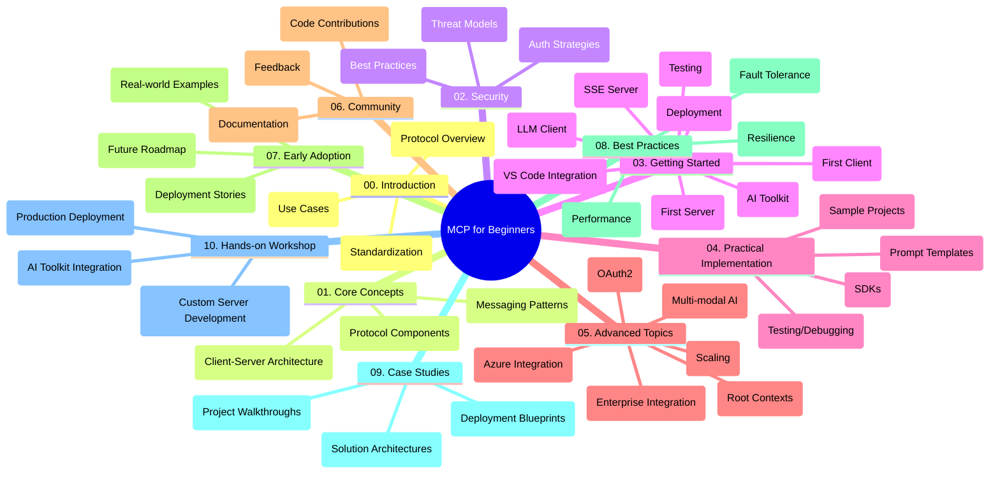

<!--
CO_OP_TRANSLATOR_METADATA:
{
  "original_hash": "a607d4febc94caee9a12b77795f7fc9a",
  "translation_date": "2025-06-11T16:46:36+00:00",
  "source_file": "study_guide.md",
  "language_code": "nl"
}
-->
# Model Context Protocol (MCP) voor Beginners - Studiegids

Deze studiegids geeft een overzicht van de structuur en inhoud van de repository voor de "Model Context Protocol (MCP) voor Beginners" cursus. Gebruik deze gids om efficiënt door de repository te navigeren en optimaal gebruik te maken van de beschikbare bronnen.

## Overzicht van de Repository

Het Model Context Protocol (MCP) is een gestandaardiseerd kader voor interacties tussen AI-modellen en clientapplicaties. Deze repository biedt een uitgebreide cursus met praktische codevoorbeelden in C#, Java, JavaScript, Python en TypeScript, ontworpen voor AI-ontwikkelaars, systeemarchitecten en software-engineers.

## Visuele Cursuskaart

## Structuur van de Repository

De repository is ingedeeld in tien hoofdsecties, elk gericht op verschillende aspecten van MCP:

1. **Introductie (00-Introduction/)**
   - Overzicht van het Model Context Protocol
   - Waarom standaardisatie belangrijk is in AI-pijplijnen
   - Praktische toepassingen en voordelen

2. **Kernconcepten (01-CoreConcepts/)**
   - Client-server architectuur
   - Belangrijke protocolcomponenten
   - Messagingpatronen in MCP

3. **Beveiliging (02-Security/)**
   - Beveiligingsrisico’s in MCP-gebaseerde systemen
   - Best practices voor veilige implementaties
   - Authenticatie- en autorisatiestrategieën

4. **Aan de Slag (03-GettingStarted/)**
   - Omgevingsinstellingen en configuratie
   - Het maken van basis MCP-servers en clients
   - Integratie met bestaande applicaties
   - Subsecties voor eerste server, eerste client, LLM-client, VS Code-integratie, SSE-server, AI Toolkit, testen en deployment

5. **Praktische Implementatie (04-PracticalImplementation/)**
   - Gebruik van SDK’s in verschillende programmeertalen
   - Debuggen, testen en validatietechnieken
   - Het maken van herbruikbare prompttemplates en workflows
   - Voorbeeldprojecten met implementatievoorbeelden

6. **Geavanceerde Onderwerpen (05-AdvancedTopics/)**
   - Multimodale AI-workflows en uitbreidbaarheid
   - Veilige schaalstrategieën
   - MCP in enterprise-ecosystemen
   - Speciale onderwerpen zoals Azure-integratie, multimodaliteit, OAuth2, root contexts, routing, sampling, scaling, security, web search integratie en streaming.

7. **Communitybijdragen (06-CommunityContributions/)**
   - Hoe code en documentatie bij te dragen
   - Samenwerken via GitHub
   - Community-gedreven verbeteringen en feedback

8. **Lessen uit Vroege Adoptie (07-LessonsfromEarlyAdoption/)**
   - Praktische implementaties en succesverhalen
   - Bouwen en uitrollen van MCP-gebaseerde oplossingen
   - Trends en toekomstige roadmap

9. **Best Practices (08-BestPractices/)**
   - Prestatieoptimalisatie en tuning
   - Ontwerpen van fouttolerante MCP-systemen
   - Test- en veerkrachtstrategieën

10. **Case Studies (09-CaseStudy/)**
    - Diepgaande analyses van MCP-oplossingsarchitecturen
    - Deployment blauwdrukken en integratietips
    - Toegelichte diagrammen en project walkthroughs

11. **Hands-on Workshop (10-StreamliningAIWorkflowsBuildingAnMCPServerWithAIToolkit/)**
    - Uitgebreide hands-on workshop die MCP combineert met Microsoft’s AI Toolkit voor VS Code
    - Bouwen van intelligente applicaties die AI-modellen koppelen aan real-world tools
    - Praktische modules over basisprincipes, custom server ontwikkeling en productie deployment strategieën

## Voorbeeldprojecten

De repository bevat diverse voorbeeldprojecten die MCP-implementaties in verschillende programmeertalen laten zien:

### Basis MCP Calculator Voorbeelden
- C# MCP Server Voorbeeld
- Java MCP Calculator
- JavaScript MCP Demo
- Python MCP Server
- TypeScript MCP Voorbeeld

### Geavanceerde MCP Calculator Projecten
- Geavanceerd C# Voorbeeld
- Java Container App Voorbeeld
- JavaScript Geavanceerd Voorbeeld
- Python Complexe Implementatie
- TypeScript Container Voorbeeld

## Aanvullende Bronnen

De repository bevat ondersteunende bronnen:

- **Afbeeldingen map**: Bevat diagrammen en illustraties die door de cursus heen gebruikt worden
- **Vertalingen**: Meertalige ondersteuning met automatische vertalingen van documentatie
- **Officiële MCP Bronnen**:
  - [MCP Documentatie](https://modelcontextprotocol.io/)
  - [MCP Specificatie](https://spec.modelcontextprotocol.io/)
  - [MCP GitHub Repository](https://github.com/modelcontextprotocol)

## Hoe Gebruik Je Deze Repository

1. **Geleidelijk Leren**: Volg de hoofdstukken op volgorde (00 tot en met 10) voor een gestructureerde leerervaring.
2. **Taalgerichte Focus**: Als je geïnteresseerd bent in een specifieke programmeertaal, bekijk dan de voorbeeldmappen voor implementaties in jouw favoriete taal.
3. **Praktische Implementatie**: Begin met de sectie "Aan de Slag" om je omgeving op te zetten en je eerste MCP-server en client te maken.
4. **Geavanceerde Verkenning**: Zodra je de basis beheerst, duik je in de geavanceerde onderwerpen om je kennis uit te breiden.
5. **Community Deelname**: Word lid van de [Azure AI Foundry Discord](https://discord.com/invite/ByRwuEEgH4) om in contact te komen met experts en mede-ontwikkelaars.

## Bijdragen

Deze repository verwelkomt bijdragen vanuit de community. Zie de sectie Communitybijdragen voor richtlijnen over hoe je kunt bijdragen.

---

*Deze studiegids is gemaakt op 11 juni 2025 en geeft een overzicht van de repository tot die datum. De inhoud van de repository kan sindsdien zijn bijgewerkt.*

**Disclaimer**:  
Dit document is vertaald met behulp van de AI-vertalingsdienst [Co-op Translator](https://github.com/Azure/co-op-translator). Hoewel we streven naar nauwkeurigheid, dient u er rekening mee te houden dat geautomatiseerde vertalingen fouten of onnauwkeurigheden kunnen bevatten. Het originele document in de oorspronkelijke taal moet als de gezaghebbende bron worden beschouwd. Voor belangrijke informatie wordt professionele menselijke vertaling aanbevolen. Wij zijn niet aansprakelijk voor eventuele misverstanden of verkeerde interpretaties die voortvloeien uit het gebruik van deze vertaling.