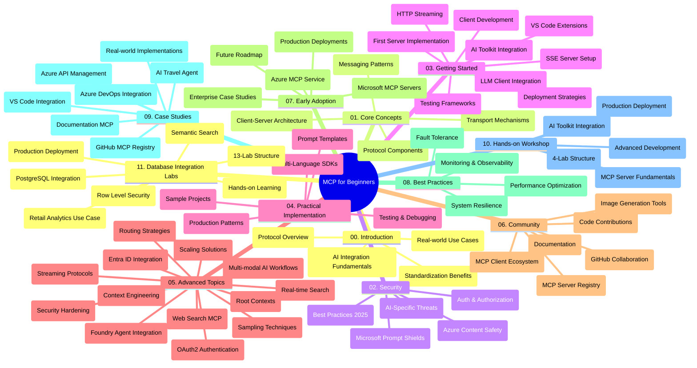

<!--
CO_OP_TRANSLATOR_METADATA:
{
  "original_hash": "aa1ce97bc694b08faf3018bab6d275b9",
  "translation_date": "2025-09-30T19:13:23+00:00",
  "source_file": "study_guide.md",
  "language_code": "nl"
}
-->
# Model Context Protocol (MCP) voor Beginners - Studiegids

Deze studiegids biedt een overzicht van de structuur en inhoud van de repository voor het curriculum "Model Context Protocol (MCP) voor Beginners". Gebruik deze gids om de repository efficiënt te navigeren en optimaal gebruik te maken van de beschikbare bronnen.

## Overzicht van de Repository

Het Model Context Protocol (MCP) is een gestandaardiseerd raamwerk voor interacties tussen AI-modellen en clienttoepassingen. Oorspronkelijk ontwikkeld door Anthropic, wordt MCP nu onderhouden door de bredere MCP-community via de officiële GitHub-organisatie. Deze repository biedt een uitgebreid curriculum met praktische codevoorbeelden in C#, Java, JavaScript, Python en TypeScript, ontworpen voor AI-ontwikkelaars, systeemarchitecten en software-engineers.

## Visuele Curriculumkaart

## Structuur van de Repository

De repository is georganiseerd in elf hoofdsecties, elk gericht op verschillende aspecten van MCP:

1. **Introductie (00-Introduction/)**
   - Overzicht van het Model Context Protocol
   - Waarom standaardisatie belangrijk is in AI-pijplijnen
   - Praktische toepassingen en voordelen

2. **Kernconcepten (01-CoreConcepts/)**
   - Client-serverarchitectuur
   - Belangrijke protocolcomponenten
   - Messagingpatronen in MCP

3. **Beveiliging (02-Security/)**
   - Beveiligingsrisico's in MCP-gebaseerde systemen
   - Best practices voor het beveiligen van implementaties
   - Authenticatie- en autorisatiestrategieën
   - **Uitgebreide Beveiligingsdocumentatie**:
     - MCP Security Best Practices 2025
     - Azure Content Safety Implementation Guide
     - MCP Security Controls and Techniques
     - MCP Best Practices Quick Reference
   - **Belangrijke Beveiligingsthema's**:
     - Prompt injection en tool poisoning aanvallen
     - Sessiekaping en confused deputy problemen
     - Token passthrough kwetsbaarheden
     - Overmatige permissies en toegangscontrole
     - Leveringsketenbeveiliging voor AI-componenten
     - Microsoft Prompt Shields integratie

4. **Aan de slag (03-GettingStarted/)**
   - Omgevingsinstellingen en configuratie
   - Basis MCP-servers en -clients maken
   - Integratie met bestaande toepassingen
   - Inclusief secties voor:
     - Eerste serverimplementatie
     - Clientontwikkeling
     - LLM-clientintegratie
     - VS Code-integratie
     - Server-Sent Events (SSE) server
     - HTTP-streaming
     - AI Toolkit-integratie
     - Teststrategieën
     - Implementatierichtlijnen

5. **Praktische Implementatie (04-PracticalImplementation/)**
   - Gebruik van SDK's in verschillende programmeertalen
   - Debugging, testen en validatietechnieken
   - Herbruikbare prompttemplates en workflows maken
   - Voorbeeldprojecten met implementatievoorbeelden

6. **Geavanceerde Onderwerpen (05-AdvancedTopics/)**
   - Context engineering technieken
   - Foundry agent integratie
   - Multi-modale AI-workflows
   - OAuth2 authenticatiedemo's
   - Real-time zoekmogelijkheden
   - Real-time streaming
   - Root contexts implementatie
   - Routingstrategieën
   - Samplingtechnieken
   - Schaalmethoden
   - Beveiligingsoverwegingen
   - Entra ID beveiligingsintegratie
   - Webzoekintegratie

7. **Communitybijdragen (06-CommunityContributions/)**
   - Hoe code en documentatie bij te dragen
   - Samenwerken via GitHub
   - Community-gedreven verbeteringen en feedback
   - Gebruik van verschillende MCP-clients (Claude Desktop, Cline, VSCode)
   - Werken met populaire MCP-servers, inclusief beeldgeneratie

8. **Lessen uit Vroege Adoptie (07-LessonsfromEarlyAdoption/)**
   - Implementaties en succesverhalen uit de praktijk
   - MCP-gebaseerde oplossingen bouwen en implementeren
   - Trends en toekomstige roadmap
   - **Microsoft MCP Servers Gids**: Uitgebreide gids voor 10 productieklare Microsoft MCP-servers, waaronder:
     - Microsoft Learn Docs MCP Server
     - Azure MCP Server (15+ gespecialiseerde connectors)
     - GitHub MCP Server
     - Azure DevOps MCP Server
     - MarkItDown MCP Server
     - SQL Server MCP Server
     - Playwright MCP Server
     - Dev Box MCP Server
     - Azure AI Foundry MCP Server
     - Microsoft 365 Agents Toolkit MCP Server

9. **Best Practices (08-BestPractices/)**
   - Prestatieoptimalisatie
   - Ontwerpen van fouttolerante MCP-systemen
   - Test- en veerkrachtstrategieën

10. **Case Studies (09-CaseStudy/)**
    - **Zeven uitgebreide case studies** die de veelzijdigheid van MCP demonstreren in diverse scenario's:
    - **Azure AI Travel Agents**: Multi-agent orkestratie met Azure OpenAI en AI Search
    - **Azure DevOps Integratie**: Workflowprocessen automatiseren met YouTube data-updates
    - **Real-Time Documentatie Retrieval**: Python console client met HTTP-streaming
    - **Interactieve Studieplan Generator**: Chainlit webapp met conversatie-AI
    - **In-Editor Documentatie**: VS Code-integratie met GitHub Copilot workflows
    - **Azure API Management**: Enterprise API-integratie met MCP-servercreatie
    - **GitHub MCP Registry**: Ecosysteemontwikkeling en agentische integratieplatform
    - Implementatievoorbeelden variërend van enterprise-integratie, ontwikkelaarsproductiviteit tot ecosysteemontwikkeling

11. **Hands-on Workshop (10-StreamliningAIWorkflowsBuildingAnMCPServerWithAIToolkit/)**
    - Uitgebreide hands-on workshop die MCP combineert met AI Toolkit
    - Intelligente toepassingen bouwen die AI-modellen verbinden met echte tools
    - Praktische modules die basisprincipes, aangepaste serverontwikkeling en productie-implementatiestrategieën behandelen
    - **Labstructuur**:
      - Lab 1: MCP Server Basisprincipes
      - Lab 2: Geavanceerde MCP Server Ontwikkeling
      - Lab 3: AI Toolkit Integratie
      - Lab 4: Productie-implementatie en Schaling
    - Lab-gebaseerde leerbenadering met stapsgewijze instructies

12. **MCP Server Database Integratie Labs (11-MCPServerHandsOnLabs/)**
    - **Uitgebreid 13-lab leerpad** voor het bouwen van productieklare MCP-servers met PostgreSQL-integratie
    - **Praktische retail analytics implementatie** met de Zava Retail use case
    - **Enterprise-grade patronen** inclusief Row Level Security (RLS), semantisch zoeken en multi-tenant data toegang
    - **Volledige Labstructuur**:
      - **Labs 00-03: Basisprincipes** - Introductie, Architectuur, Beveiliging, Omgevingsinstelling
      - **Labs 04-06: MCP Server Bouwen** - Databaseontwerp, MCP Server Implementatie, Toolontwikkeling
      - **Labs 07-09: Geavanceerde Functies** - Semantisch Zoeken, Testen & Debuggen, VS Code Integratie
      - **Labs 10-12: Productie & Best Practices** - Implementatie, Monitoring, Optimalisatie
    - **Technologieën Gedekt**: FastMCP framework, PostgreSQL, Azure OpenAI, Azure Container Apps, Application Insights
    - **Leerresultaten**: Productieklare MCP-servers, database-integratiepatronen, AI-gestuurde analytics, enterprise-beveiliging

## Aanvullende Bronnen

De repository bevat ondersteunende bronnen:

- **Afbeeldingenmap**: Bevat diagrammen en illustraties die door het hele curriculum worden gebruikt
- **Vertalingen**: Meertalige ondersteuning met geautomatiseerde vertalingen van documentatie
- **Officiële MCP Bronnen**:
  - [MCP Documentatie](https://modelcontextprotocol.io/)
  - [MCP Specificatie](https://spec.modelcontextprotocol.io/)
  - [MCP GitHub Repository](https://github.com/modelcontextprotocol)

## Hoe deze Repository te Gebruiken

1. **Sequentieel Leren**: Volg de hoofdstukken op volgorde (00 tot 11) voor een gestructureerde leerervaring.
2. **Taal-specifieke Focus**: Als je geïnteresseerd bent in een specifieke programmeertaal, bekijk dan de voorbeeldmappen voor implementaties in jouw voorkeurstaal.
3. **Praktische Implementatie**: Begin met de sectie "Aan de slag" om je omgeving in te stellen en je eerste MCP-server en -client te maken.
4. **Geavanceerde Verkenning**: Zodra je vertrouwd bent met de basis, duik in de geavanceerde onderwerpen om je kennis uit te breiden.
5. **Community Betrokkenheid**: Word lid van de MCP-community via GitHub-discussies en Discord-kanalen om in contact te komen met experts en mede-ontwikkelaars.

## MCP Clients en Tools

Het curriculum behandelt verschillende MCP-clients en tools:

1. **Officiële Clients**:
   - Visual Studio Code 
   - MCP in Visual Studio Code
   - Claude Desktop
   - Claude in VSCode 
   - Claude API

2. **Community Clients**:
   - Cline (terminal-gebaseerd)
   - Cursor (code-editor)
   - ChatMCP
   - Windsurf

3. **MCP Management Tools**:
   - MCP CLI
   - MCP Manager
   - MCP Linker
   - MCP Router

## Populaire MCP Servers

De repository introduceert verschillende MCP-servers, waaronder:

1. **Officiële Microsoft MCP Servers**:
   - Microsoft Learn Docs MCP Server
   - Azure MCP Server (15+ gespecialiseerde connectors)
   - GitHub MCP Server
   - Azure DevOps MCP Server
   - MarkItDown MCP Server
   - SQL Server MCP Server
   - Playwright MCP Server
   - Dev Box MCP Server
   - Azure AI Foundry MCP Server
   - Microsoft 365 Agents Toolkit MCP Server

2. **Officiële Referentie Servers**:
   - Filesystem
   - Fetch
   - Memory
   - Sequential Thinking

3. **Beeldgeneratie**:
   - Azure OpenAI DALL-E 3
   - Stable Diffusion WebUI
   - Replicate

4. **Ontwikkelingstools**:
   - Git MCP
   - Terminal Control
   - Code Assistant

5. **Gespecialiseerde Servers**:
   - Salesforce
   - Microsoft Teams
   - Jira & Confluence

## Bijdragen

Deze repository verwelkomt bijdragen van de community. Zie de sectie Communitybijdragen voor richtlijnen over hoe je effectief kunt bijdragen aan het MCP-ecosysteem.

## Wijzigingslogboek

| Datum | Wijzigingen |
|------|---------||
| 29 september 2025 | - Sectie 11-MCPServerHandsOnLabs toegevoegd met uitgebreid 13-lab database-integratie leerpad - Visuele Curriculumkaart bijgewerkt om Database Integratie Labs op te nemen - Repositorystructuur verbeterd om elf hoofdsecties te weerspiegelen - Gedetailleerde beschrijving toegevoegd van PostgreSQL-integratie, retail analytics use case en enterprise patronen - Navigatierichtlijnen bijgewerkt om secties 00-11 op te nemen |
| 26 september 2025 | - GitHub MCP Registry case study toegevoegd aan sectie 09-CaseStudy - Case Studies bijgewerkt om zeven uitgebreide case studies te weerspiegelen - Case study beschrijvingen verbeterd met specifieke implementatiedetails - Visuele Curriculumkaart bijgewerkt om GitHub MCP Registry op te nemen - Studiegidsstructuur herzien om ecosysteemontwikkelingsfocus te weerspiegelen |
| 18 juli 2025 | - Repositorystructuur bijgewerkt om Microsoft MCP Servers Gids op te nemen - Uitgebreide lijst toegevoegd van 10 productieklare Microsoft MCP-servers - Sectie Populaire MCP Servers verbeterd met Officiële Microsoft MCP Servers - Sectie Case Studies bijgewerkt met daadwerkelijke bestandsvoorbeelden - Labstructuurdetails toegevoegd voor Hands-on Workshop |
| 16 juli 2025 | - Repositorystructuur bijgewerkt om huidige inhoud te weerspiegelen - Sectie MCP Clients en Tools toegevoegd - Sectie Populaire MCP Servers toegevoegd - Visuele Curriculumkaart bijgewerkt met alle huidige onderwerpen - Sectie Geavanceerde Onderwerpen verbeterd met alle gespecialiseerde gebieden - Sectie Case Studies bijgewerkt met daadwerkelijke voorbeelden - Oorsprong van MCP verduidelijkt als ontwikkeld door Anthropic |
| 11 juni 2025 | - Initiële creatie van de studiegids - Visuele Curriculumkaart toegevoegd - Repositorystructuur geschetst - Voorbeeldprojecten en aanvullende bronnen opgenomen |

---

*Deze studiegids is bijgewerkt op 29 september 2025 en biedt een overzicht van de repository zoals die op die datum was. De inhoud van de repository kan na deze datum worden bijgewerkt.*

---

**Disclaimer**:  
Dit document is vertaald met behulp van de AI-vertalingsservice [Co-op Translator](https://github.com/Azure/co-op-translator). Hoewel we streven naar nauwkeurigheid, dient u zich ervan bewust te zijn dat geautomatiseerde vertalingen fouten of onnauwkeurigheden kunnen bevatten. Het originele document in de oorspronkelijke taal moet worden beschouwd als de gezaghebbende bron. Voor cruciale informatie wordt professionele menselijke vertaling aanbevolen. Wij zijn niet aansprakelijk voor misverstanden of verkeerde interpretaties die voortvloeien uit het gebruik van deze vertaling.