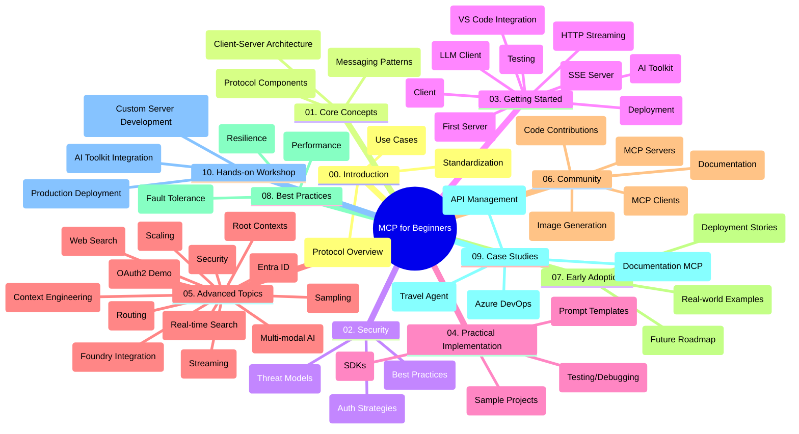

<!--
CO_OP_TRANSLATOR_METADATA:
{
  "original_hash": "5f321ea583cf087a94e47ee74c62b504",
  "translation_date": "2025-07-17T07:04:42+00:00",
  "source_file": "study_guide.md",
  "language_code": "nl"
}
-->
# Model Context Protocol (MCP) voor Beginners - Studiegids

Deze studiegids geeft een overzicht van de structuur en inhoud van de repository voor de "Model Context Protocol (MCP) voor Beginners" cursus. Gebruik deze gids om efficiënt door de repository te navigeren en optimaal gebruik te maken van de beschikbare bronnen.

## Overzicht van de Repository

Het Model Context Protocol (MCP) is een gestandaardiseerd raamwerk voor interacties tussen AI-modellen en clientapplicaties. Oorspronkelijk ontwikkeld door Anthropic, wordt MCP nu onderhouden door de bredere MCP-gemeenschap via de officiële GitHub-organisatie. Deze repository biedt een uitgebreide cursus met praktische codevoorbeelden in C#, Java, JavaScript, Python en TypeScript, bedoeld voor AI-ontwikkelaars, systeemarchitecten en software-engineers.

## Visuele Curriculumkaart

## Structuur van de Repository

De repository is ingedeeld in tien hoofdsecties, elk gericht op verschillende aspecten van MCP:

1. **Introductie (00-Introduction/)**
   - Overzicht van het Model Context Protocol
   - Waarom standaardisatie belangrijk is in AI-pijplijnen
   - Praktische toepassingen en voordelen

2. **Kernconcepten (01-CoreConcepts/)**
   - Client-server architectuur
   - Belangrijke protocolcomponenten
   - Messagingpatronen in MCP

3. **Beveiliging (02-Security/)**
   - Beveiligingsrisico’s in MCP-gebaseerde systemen
   - Best practices voor veilige implementaties
   - Authenticatie- en autorisatiestrategieën

4. **Aan de Slag (03-GettingStarted/)**
   - Omgevingsopzet en configuratie
   - Basis MCP-servers en clients maken
   - Integratie met bestaande applicaties
   - Bevat secties voor:
     - Eerste serverimplementatie
     - Clientontwikkeling
     - LLM-clientintegratie
     - VS Code-integratie
     - Server-Sent Events (SSE) server
     - HTTP-streaming
     - AI Toolkit-integratie
     - Teststrategieën
     - Deployment-richtlijnen

5. **Praktische Implementatie (04-PracticalImplementation/)**
   - Gebruik van SDK’s in verschillende programmeertalen
   - Debuggen, testen en validatietechnieken
   - Maken van herbruikbare prompttemplates en workflows
   - Voorbeeldprojecten met implementatievoorbeelden

6. **Geavanceerde Onderwerpen (05-AdvancedTopics/)**
   - Context engineering technieken
   - Foundry agent integratie
   - Multi-modale AI-workflows
   - OAuth2 authenticatie-demo’s
   - Real-time zoekmogelijkheden
   - Real-time streaming
   - Implementatie van root contexts
   - Routingstrategieën
   - Samplingtechnieken
   - Schaalmethoden
   - Beveiligingsoverwegingen
   - Entra ID beveiligingsintegratie
   - Webzoekintegratie

7. **Communitybijdragen (06-CommunityContributions/)**
   - Hoe code en documentatie bij te dragen
   - Samenwerken via GitHub
   - Community-gedreven verbeteringen en feedback
   - Gebruik van diverse MCP-clients (Claude Desktop, Cline, VSCode)
   - Werken met populaire MCP-servers inclusief beeldgeneratie

8. **Lessen uit Vroege Adoptie (07-LessonsfromEarlyAdoption/)**
   - Praktijkvoorbeelden en succesverhalen
   - Bouwen en uitrollen van MCP-gebaseerde oplossingen
   - Trends en toekomstige roadmap

9. **Best Practices (08-BestPractices/)**
   - Prestatieoptimalisatie en tuning
   - Ontwerpen van fouttolerante MCP-systemen
   - Test- en veerkrachtstrategieën

10. **Case Studies (09-CaseStudy/)**
    - Case study: Azure API Management integratie
    - Case study: Reisagentimplementatie
    - Case study: Azure DevOps integratie met YouTube
    - Implementatievoorbeelden met gedetailleerde documentatie

11. **Hands-on Workshop (10-StreamliningAIWorkflowsBuildingAnMCPServerWithAIToolkit/)**
    - Uitgebreide hands-on workshop die MCP combineert met AI Toolkit
    - Bouwen van intelligente applicaties die AI-modellen koppelen aan tools uit de praktijk
    - Praktische modules over de basis, custom serverontwikkeling en productie-deploymentstrategieën
    - Lab-gebaseerde leerbenadering met stapsgewijze instructies

## Aanvullende Bronnen

De repository bevat ondersteunende bronnen:

- **Afbeeldingenmap**: Bevat diagrammen en illustraties die door de cursus heen worden gebruikt
- **Vertalingen**: Meertalige ondersteuning met automatische vertalingen van documentatie
- **Officiële MCP-bronnen**:
  - [MCP Documentation](https://modelcontextprotocol.io/)
  - [MCP Specification](https://spec.modelcontextprotocol.io/)
  - [MCP GitHub Repository](https://github.com/modelcontextprotocol)

## Hoe Gebruik je Deze Repository

1. **Gestructureerd Leren**: Volg de hoofdstukken op volgorde (00 tot en met 10) voor een gestructureerde leerervaring.
2. **Taalgerichte Focus**: Ben je geïnteresseerd in een specifieke programmeertaal? Verken dan de samples-mappen voor implementaties in jouw voorkeurstaal.
3. **Praktische Implementatie**: Begin met de sectie "Aan de Slag" om je omgeving op te zetten en je eerste MCP-server en client te maken.
4. **Geavanceerde Verkenning**: Zodra je de basis beheerst, duik je in de geavanceerde onderwerpen om je kennis uit te breiden.
5. **Community Betrokkenheid**: Word lid van de MCP-gemeenschap via GitHub-discussies en Discord-kanalen om in contact te komen met experts en medeontwikkelaars.

## MCP Clients en Tools

De cursus behandelt diverse MCP-clients en tools:

1. **Officiële Clients**:
   - Visual Studio Code
   - MCP in Visual Studio Code
   - Claude Desktop
   - Claude in VSCode
   - Claude API

2. **Community Clients**:
   - Cline (terminal-gebaseerd)
   - Cursor (code-editor)
   - ChatMCP
   - Windsurf

3. **MCP Beheer Tools**:
   - MCP CLI
   - MCP Manager
   - MCP Linker
   - MCP Router

## Populaire MCP Servers

De repository introduceert verschillende MCP-servers, waaronder:

1. **Officiële Referentieservers**:
   - Filesystem
   - Fetch
   - Memory
   - Sequential Thinking

2. **Beeldgeneratie**:
   - Azure OpenAI DALL-E 3
   - Stable Diffusion WebUI
   - Replicate

3. **Ontwikkeltools**:
   - Git MCP
   - Terminal Control
   - Code Assistant

4. **Gespecialiseerde Servers**:
   - Salesforce
   - Microsoft Teams
   - Jira & Confluence

## Bijdragen

Deze repository verwelkomt bijdragen vanuit de community. Zie de sectie Communitybijdragen voor richtlijnen over hoe je effectief kunt bijdragen aan het MCP-ecosysteem.

## Wijzigingslog

| Datum | Wijzigingen |
|-------|-------------|
| 16 juli 2025 | - Repositorystructuur bijgewerkt om huidige inhoud weer te geven - Sectie MCP Clients en Tools toegevoegd - Sectie Populaire MCP Servers toegevoegd - Visuele Curriculumkaart bijgewerkt met alle actuele onderwerpen - Geavanceerde Onderwerpen uitgebreid met alle gespecialiseerde gebieden - Case Studies geactualiseerd met echte voorbeelden - Verduidelijkt dat MCP is ontwikkeld door Anthropic |
| 11 juni 2025 | - Eerste aanmaak van de studiegids - Visuele Curriculumkaart toegevoegd - Structuur van de repository geschetst - Voorbeeldprojecten en aanvullende bronnen opgenomen |

---

*Deze studiegids is bijgewerkt op 16 juli 2025 en geeft een overzicht van de repository tot die datum. De inhoud van de repository kan na deze datum worden aangepast.*

**Disclaimer**:  
Dit document is vertaald met behulp van de AI-vertalingsdienst [Co-op Translator](https://github.com/Azure/co-op-translator). Hoewel we streven naar nauwkeurigheid, dient u er rekening mee te houden dat geautomatiseerde vertalingen fouten of onnauwkeurigheden kunnen bevatten. Het originele document in de oorspronkelijke taal moet als de gezaghebbende bron worden beschouwd. Voor cruciale informatie wordt professionele menselijke vertaling aanbevolen. Wij zijn niet aansprakelijk voor eventuele misverstanden of verkeerde interpretaties die voortvloeien uit het gebruik van deze vertaling.