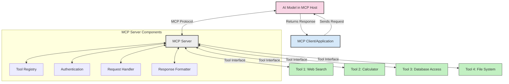
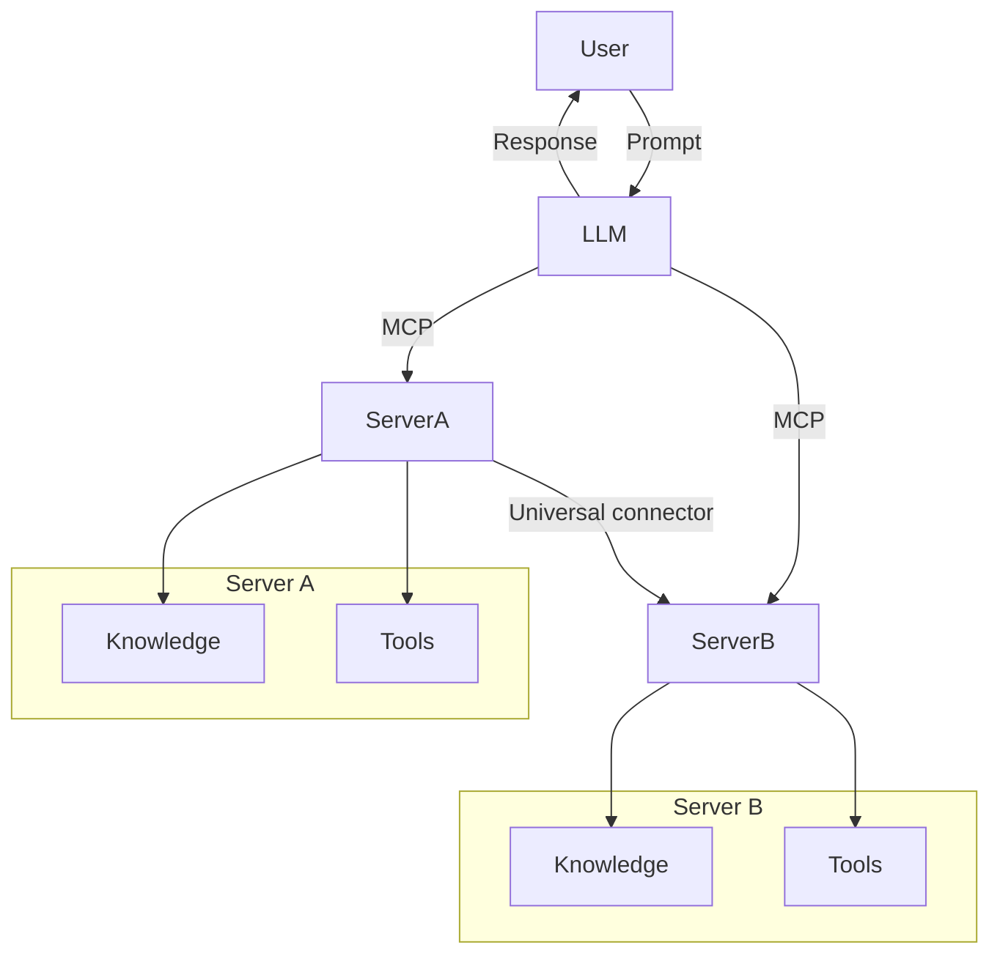

<!--
CO_OP_TRANSLATOR_METADATA:
{
  "original_hash": "1d88dee994dcbb3fa52c271d0c0817b5",
  "translation_date": "2025-05-20T21:46:39+00:00",
  "source_file": "00-Introduction/README.md",
  "language_code": "no"
}
-->
# Introduksjon til Model Context Protocol (MCP): Hvorfor det er viktig for skalerbare AI-applikasjoner

Generative AI-applikasjoner er et stort steg fremover, da de ofte lar brukeren samhandle med appen ved hjelp av naturlige språkforespørsler. Men etter hvert som man investerer mer tid og ressurser i slike apper, ønsker man å sikre at det er enkelt å integrere funksjonaliteter og ressurser på en måte som gjør det lett å utvide, at appen kan håndtere mer enn én modell samtidig, og takle ulike modellspesifikke detaljer. Kort sagt, det er enkelt å komme i gang med å bygge Gen AI-apper, men når de vokser og blir mer komplekse, må man begynne å definere en arkitektur og sannsynligvis basere seg på en standard for å sikre at appene bygges på en konsistent måte. Det er her MCP kommer inn for å organisere ting og tilby en standard.

---

## **🔍 Hva er Model Context Protocol (MCP)?**

**Model Context Protocol (MCP)** er et **åpent, standardisert grensesnitt** som gjør det mulig for store språkmodeller (LLMs) å samhandle sømløst med eksterne verktøy, API-er og datakilder. Det gir en konsistent arkitektur som forbedrer AI-modellenes funksjonalitet utover treningsdataene, og muliggjør smartere, skalerbare og mer responsive AI-systemer.

---

## **🎯 Hvorfor standardisering er viktig i AI**

Etter hvert som generative AI-applikasjoner blir mer komplekse, er det avgjørende å ta i bruk standarder som sikrer **skalerbarhet, utvidbarhet** og **vedlikeholdbarhet**. MCP dekker disse behovene ved å:

- Samle modell-verktøy-integrasjoner
- Redusere skjøre, engangsløsninger
- Tillate flere modeller å eksistere i samme økosystem

---

## **📚 Læringsmål**

Etter å ha lest denne artikkelen vil du kunne:

- Definere **Model Context Protocol (MCP)** og dets bruksområder
- Forstå hvordan MCP standardiserer kommunikasjon mellom modell og verktøy
- Identifisere hovedkomponentene i MCP-arkitekturen
- Utforske reelle bruksområder for MCP i virksomheter og utviklingsmiljøer

---

## **💡 Hvorfor Model Context Protocol (MCP) er en revolusjon**

### **🔗 MCP løser fragmentering i AI-interaksjoner**

Før MCP krevde integrasjon av modeller med verktøy:

- Egen kode for hvert verktøy-modell-par
- Ikke-standardiserte API-er fra hver leverandør
- Hyppige brudd ved oppdateringer
- Dårlig skalerbarhet med flere verktøy

### **✅ Fordeler med MCP-standardisering**

| **Fordel**               | **Beskrivelse**                                                                 |
|--------------------------|--------------------------------------------------------------------------------|
| Interoperabilitet        | LLM-er fungerer sømløst med verktøy fra ulike leverandører                     |
| Konsistens               | Enhetlig oppførsel på tvers av plattformer og verktøy                          |
| Gjenbruk                 | Verktøy bygget én gang kan brukes på tvers av prosjekter og systemer           |
| Raskere utvikling        | Reduserer utviklingstid ved å bruke standardiserte, plug-and-play-grensesnitt |

---

## **🧱 Overordnet MCP-arkitektur**

MCP følger en **klient-server-modell**, hvor:

- **MCP Hosts** kjører AI-modellene
- **MCP Clients** initierer forespørsler
- **MCP Servers** leverer kontekst, verktøy og kapasiteter

### **Hovedkomponenter:**

- **Ressurser** – Statisk eller dynamisk data for modellene  
- **Prompter** – Forhåndsdefinerte arbeidsflyter for styrt generering  
- **Verktøy** – Utførbare funksjoner som søk, beregninger  
- **Sampling** – Agentisk atferd gjennom rekursive interaksjoner

---

## Hvordan MCP-servere fungerer

MCP-servere opererer på følgende måte:

- **Forespørselsflyt**:  
    1. MCP-klienten sender en forespørsel til AI-modellen som kjører i en MCP Host.  
    2. AI-modellen identifiserer når den trenger eksterne verktøy eller data.  
    3. Modellen kommuniserer med MCP-serveren ved hjelp av den standardiserte protokollen.

- **MCP-serverfunksjonalitet**:  
    - Verktøyregister: Holder en katalog over tilgjengelige verktøy og deres kapasiteter.  
    - Autentisering: Verifiserer tilgangstillatelser til verktøy.  
    - Forespørselsbehandler: Behandler innkommende verktøyforespørsler fra modellen.  
    - Svarformatterer: Strukturere verktøyutdata i et format modellen kan forstå.

- **Verktøykjøring**:  
    - Serveren ruter forespørsler til riktige eksterne verktøy  
    - Verktøyene utfører sine spesialiserte funksjoner (søk, beregning, databaseforespørsler osv.)  
    - Resultatene returneres til modellen i et konsistent format.

- **Fullføring av svar**:  
    - AI-modellen inkorporerer verktøyutdata i sitt svar.  
    - Det endelige svaret sendes tilbake til klientapplikasjonen.

## 👨‍💻 Hvordan bygge en MCP-server (med eksempler)

MCP-servere lar deg utvide LLM-funksjonalitet ved å tilby data og funksjonalitet.

Klar til å prøve? Her er eksempler på hvordan man lager en enkel MCP-server i ulike språk:

- **Python-eksempel**: https://github.com/modelcontextprotocol/python-sdk

- **TypeScript-eksempel**: https://github.com/modelcontextprotocol/typescript-sdk

- **Java-eksempel**: https://github.com/modelcontextprotocol/java-sdk

- **C#/.NET-eksempel**: https://github.com/modelcontextprotocol/csharp-sdk

## 🌍 Reelle bruksområder for MCP

MCP muliggjør et bredt spekter av applikasjoner ved å utvide AI-kapasiteter:

| **Bruksområde**             | **Beskrivelse**                                                                 |
|----------------------------|---------------------------------------------------------------------------------|
| Integrasjon av bedriftsdata | Koble LLM-er til databaser, CRM-systemer eller interne verktøy                  |
| Agentiske AI-systemer       | Muliggjør autonome agenter med verktøystøtte og beslutningsflyter               |
| Multi-modale applikasjoner  | Kombiner tekst-, bilde- og lydverktøy i én samlet AI-app                        |
| Sanntidsdataintegrasjon     | Bring levende data inn i AI-interaksjoner for mer nøyaktige og oppdaterte svar |

### 🧠 MCP = Universell standard for AI-interaksjoner

Model Context Protocol (MCP) fungerer som en universell standard for AI-interaksjoner, på samme måte som USB-C standardiserte fysiske tilkoblinger for enheter. Innen AI gir MCP et konsistent grensesnitt som lar modeller (klienter) integrere sømløst med eksterne verktøy og dataleverandører (servere). Dette eliminerer behovet for ulike, skreddersydde protokoller for hver API eller datakilde.

Under MCP følger et MCP-kompatibelt verktøy (kalt MCP-server) en felles standard. Disse serverne kan liste opp hvilke verktøy eller handlinger de tilbyr, og utføre disse når en AI-agent ber om det. AI-agentplattformer som støtter MCP kan oppdage tilgjengelige verktøy fra serverne og bruke dem via denne standardprotokollen.

### 💡 Legger til rette for kunnskapstilgang

I tillegg til å tilby verktøy, legger MCP også til rette for tilgang til kunnskap. Det gjør det mulig for applikasjoner å gi kontekst til store språkmodeller (LLM-er) ved å koble dem til ulike datakilder. For eksempel kan en MCP-server representere et selskaps dokumentarkiv, slik at agenter kan hente relevant informasjon på forespørsel. En annen server kan håndtere spesifikke handlinger som å sende e-post eller oppdatere poster. Fra agentens perspektiv er dette bare verktøy den kan bruke – noen verktøy returnerer data (kunnskapskontekst), mens andre utfører handlinger. MCP håndterer begge deler effektivt.

En agent som kobler til en MCP-server lærer automatisk om serverens tilgjengelige kapasiteter og data via et standardisert format. Denne standardiseringen muliggjør dynamisk tilgjengelighet av verktøy. For eksempel, ved å legge til en ny MCP-server i agentens system, blir funksjonene umiddelbart tilgjengelige uten at agentens instruksjoner må endres.

Denne strømlinjeformede integrasjonen samsvarer med flyten vist i mermaid-diagrammet, hvor servere tilbyr både verktøy og kunnskap, og sikrer sømløst samarbeid på tvers av systemer.

### 👉 Eksempel: Skalerbar agentløsning

## 🔐 Praktiske fordeler med MCP

Her er de praktiske fordelene ved å bruke MCP:

- **Oppdatert informasjon**: Modeller kan hente oppdatert informasjon utover treningsdataene sine  
- **Utvidet funksjonalitet**: Modeller kan bruke spesialiserte verktøy for oppgaver de ikke er trent for  
- **Reduserte hallusinasjoner**: Eksterne datakilder gir faktabasert grunnlag  
- **Personvern**: Sensitiv data kan forbli i sikre miljøer i stedet for å være innebygd i prompter

## 📌 Viktige punkter

Dette er de viktigste punktene ved bruk av MCP:

- **MCP** standardiserer hvordan AI-modeller samhandler med verktøy og data  
- Fremmer **utvidbarhet, konsistens og interoperabilitet**  
- MCP hjelper til med å **forkorte utviklingstid, øke pålitelighet og utvide modellens kapasiteter**  
- Klient-server-arkitekturen **muliggjør fleksible, utvidbare AI-applikasjoner**

## 🧠 Øvelse

Tenk på en AI-applikasjon du ønsker å bygge.

- Hvilke **eksterne verktøy eller data** kan forbedre funksjonaliteten?  
- Hvordan kan MCP gjøre integrasjonen **enklere og mer pålitelig?**

## Ytterligere ressurser

- [MCP GitHub Repository](https://github.com/modelcontextprotocol)

## Hva skjer videre

Neste: [Kapittel 1: Kjernebegreper](/01-CoreConcepts/README.md)

**Ansvarsfraskrivelse**:  
Dette dokumentet er oversatt ved hjelp av AI-oversettelsestjenesten [Co-op Translator](https://github.com/Azure/co-op-translator). Selv om vi streber etter nøyaktighet, vær oppmerksom på at automatiske oversettelser kan inneholde feil eller unøyaktigheter. Det opprinnelige dokumentet på originalspråket skal anses som den autoritative kilden. For kritisk informasjon anbefales profesjonell menneskelig oversettelse. Vi er ikke ansvarlige for eventuelle misforståelser eller feiltolkninger som oppstår ved bruk av denne oversettelsen.