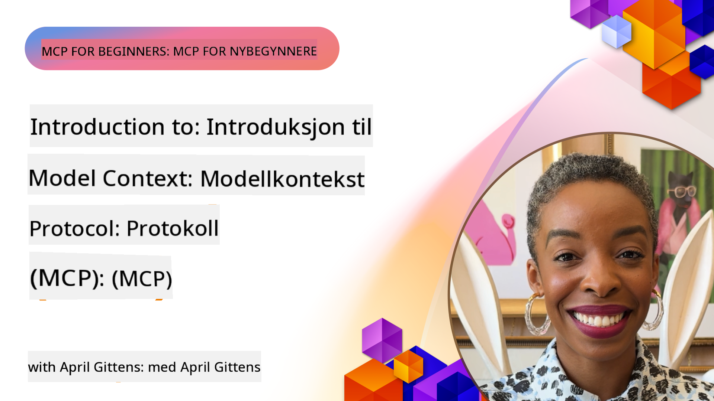
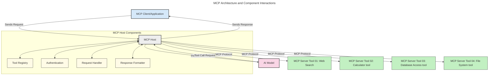
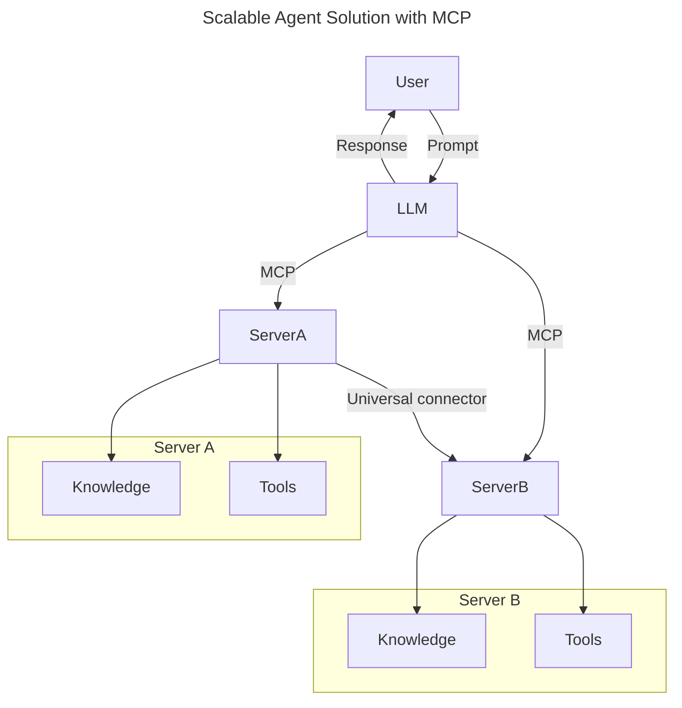
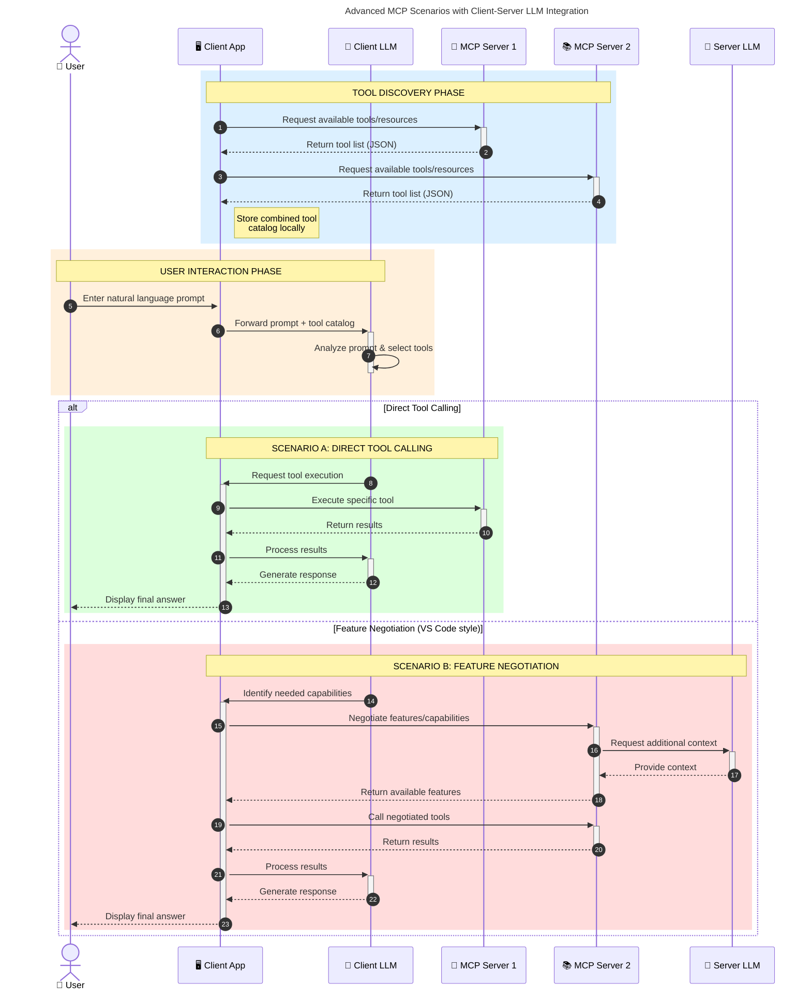

<!--
CO_OP_TRANSLATOR_METADATA:
{
  "original_hash": "0df1ee78a6dd8300f3a040ca5b411c2e",
  "translation_date": "2025-08-18T15:52:17+00:00",
  "source_file": "00-Introduction/README.md",
  "language_code": "no"
}
-->
# Introduksjon til Model Context Protocol (MCP): Hvorfor det er viktig for skalerbare AI-applikasjoner

_(Klikk på bildet over for å se videoen til denne leksjonen)_

Generative AI-applikasjoner er et stort fremskritt, da de ofte lar brukeren samhandle med appen ved hjelp av naturlige språkkommandoer. Men etter hvert som mer tid og ressurser investeres i slike apper, vil du sørge for at du enkelt kan integrere funksjonaliteter og ressurser på en måte som gjør det lett å utvide, at appen din kan støtte flere modeller, og håndtere ulike modellspesifikasjoner. Kort sagt, det er enkelt å starte med å bygge generative AI-apper, men etter hvert som de vokser og blir mer komplekse, må du begynne å definere en arkitektur og sannsynligvis stole på en standard for å sikre at appene dine bygges på en konsistent måte. Det er her MCP kommer inn for å organisere ting og tilby en standard.

---

## **🔍 Hva er Model Context Protocol (MCP)?**

**Model Context Protocol (MCP)** er en **åpen, standardisert grensesnitt** som lar store språkmodeller (LLMs) samhandle sømløst med eksterne verktøy, API-er og datakilder. Det gir en konsistent arkitektur for å forbedre AI-modellers funksjonalitet utover deres treningsdata, og muliggjør smartere, skalerbare og mer responsive AI-systemer.

---

## **🎯 Hvorfor standardisering i AI er viktig**

Etter hvert som generative AI-applikasjoner blir mer komplekse, er det avgjørende å ta i bruk standarder som sikrer **skalerbarhet, utvidbarhet, vedlikeholdbarhet** og **unngå leverandørbinding**. MCP adresserer disse behovene ved å:

- Forene integrasjoner mellom modeller og verktøy
- Redusere skjøre, engangsløsninger
- Tillate flere modeller fra ulike leverandører å eksistere i ett økosystem

**Merk:** Selv om MCP presenterer seg som en åpen standard, er det ingen planer om å standardisere MCP gjennom eksisterende standardiseringsorganer som IEEE, IETF, W3C, ISO eller andre.

---

## **📚 Læringsmål**

Ved slutten av denne artikkelen vil du kunne:

- Definere **Model Context Protocol (MCP)** og dens bruksområder
- Forstå hvordan MCP standardiserer kommunikasjon mellom modeller og verktøy
- Identifisere de viktigste komponentene i MCP-arkitekturen
- Utforske virkelige anvendelser av MCP i bedrifts- og utviklingskontekster

---

## **💡 Hvorfor Model Context Protocol (MCP) er en revolusjon**

### **🔗 MCP løser fragmentering i AI-interaksjoner**

Før MCP krevde integrering av modeller med verktøy:

- Tilpasset kode for hvert verktøy-modell-par
- Ikke-standardiserte API-er for hver leverandør
- Hyppige feil på grunn av oppdateringer
- Dårlig skalerbarhet med flere verktøy

### **✅ Fordeler med MCP-standardisering**

| **Fordel**                | **Beskrivelse**                                                                |
|---------------------------|--------------------------------------------------------------------------------|
| Interoperabilitet         | LLMs fungerer sømløst med verktøy fra ulike leverandører                       |
| Konsistens                | Ensartet oppførsel på tvers av plattformer og verktøy                          |
| Gjenbrukbarhet            | Verktøy bygget én gang kan brukes på tvers av prosjekter og systemer           |
| Akselerert utvikling      | Reduser utviklingstid ved å bruke standardiserte, plug-and-play-grensesnitt    |

---

## **🧱 Oversikt over MCP-arkitektur på høyt nivå**

MCP følger en **klient-server-modell**, der:

- **MCP Hosts** kjører AI-modellene
- **MCP Clients** initierer forespørsler
- **MCP Servers** leverer kontekst, verktøy og funksjonaliteter

### **Nøkkelkomponenter:**

- **Ressurser** – Statisk eller dynamisk data for modeller  
- **Prompter** – Forhåndsdefinerte arbeidsflyter for veiledet generering  
- **Verktøy** – Utførbare funksjoner som søk, beregninger  
- **Sampling** – Agentisk oppførsel via rekursive interaksjoner

---

## Hvordan MCP-servere fungerer

MCP-servere opererer på følgende måte:

- **Forespørselsflyt**:
    1. En forespørsel initieres av en sluttbruker eller programvare som handler på deres vegne.
    2. **MCP-klienten** sender forespørselen til en **MCP Host**, som administrerer AI-modellens runtime.
    3. **AI-modellen** mottar brukerens prompt og kan be om tilgang til eksterne verktøy eller data via ett eller flere verktøykall.
    4. **MCP Host**, ikke modellen direkte, kommuniserer med de relevante **MCP-serverne** ved hjelp av den standardiserte protokollen.
- **MCP Host-funksjonalitet**:
    - **Verktøysregister**: Opprettholder en katalog over tilgjengelige verktøy og deres funksjoner.
    - **Autentisering**: Verifiserer tillatelser for verktøytilgang.
    - **Forespørselshåndtering**: Behandler innkommende verktøykall fra modellen.
    - **Responsformatter**: Strukturerer verktøyutganger i et format modellen kan forstå.
- **MCP-serverutførelse**:
    - **MCP Host** ruter verktøykall til én eller flere **MCP-servere**, som hver eksponerer spesialiserte funksjoner (f.eks. søk, beregninger, databaseforespørsler).
    - **MCP-serverne** utfører sine respektive operasjoner og returnerer resultater til **MCP Host** i et konsistent format.
    - **MCP Host** formaterer og videresender disse resultatene til **AI-modellen**.
- **Responsfullføring**:
    - **AI-modellen** inkorporerer verktøyutgangene i en endelig respons.
    - **MCP Host** sender denne responsen tilbake til **MCP-klienten**, som leverer den til sluttbrukeren eller den kallende programvaren.

## 👨‍💻 Hvordan bygge en MCP-server (med eksempler)

MCP-servere lar deg utvide LLM-funksjonaliteter ved å tilby data og funksjonalitet.

Klar til å prøve det? Her er språk- og/eller stack-spesifikke SDK-er med eksempler på hvordan du kan lage enkle MCP-servere i ulike språk/stakker:

- **Python SDK**: https://github.com/modelcontextprotocol/python-sdk

- **TypeScript SDK**: https://github.com/modelcontextprotocol/typescript-sdk

- **Java SDK**: https://github.com/modelcontextprotocol/java-sdk

- **C#/.NET SDK**: https://github.com/modelcontextprotocol/csharp-sdk

---

## 🌍 Virkelige bruksområder for MCP

MCP muliggjør et bredt spekter av applikasjoner ved å utvide AI-funksjonaliteter:

| **Applikasjon**             | **Beskrivelse**                                                                |
|-----------------------------|--------------------------------------------------------------------------------|
| Integrering av bedriftsdata | Koble LLMs til databaser, CRM-er eller interne verktøy                         |
| Agentiske AI-systemer       | Muliggjør autonome agenter med verktøystilgang og beslutningsarbeidsflyter     |
| Multimodale applikasjoner   | Kombiner tekst-, bilde- og lydverktøy i én samlet AI-app                      |
| Sanntidsdataintegrering     | Bring live data inn i AI-interaksjoner for mer nøyaktige, oppdaterte resultater|

---

### 🧠 MCP = Universell standard for AI-interaksjoner

Model Context Protocol (MCP) fungerer som en universell standard for AI-interaksjoner, på samme måte som USB-C standardiserte fysiske tilkoblinger for enheter. I AI-verdenen gir MCP et konsistent grensesnitt som lar modeller (klienter) integrere sømløst med eksterne verktøy og dataleverandører (servere). Dette eliminerer behovet for diverse, tilpassede protokoller for hver API eller datakilde.

Under MCP følger et MCP-kompatibelt verktøy (referert til som en MCP-server) en enhetlig standard. Disse serverne kan liste opp verktøyene eller handlingene de tilbyr og utføre disse handlingene når de blir bedt om av en AI-agent. AI-agentplattformer som støtter MCP er i stand til å oppdage tilgjengelige verktøy fra serverne og bruke dem gjennom denne standardprotokollen.

---

### 💡 Tilrettelegger for tilgang til kunnskap

I tillegg til å tilby verktøy, tilrettelegger MCP også for tilgang til kunnskap. Det gjør det mulig for applikasjoner å gi kontekst til store språkmodeller (LLMs) ved å koble dem til ulike datakilder. For eksempel kan en MCP-server representere et selskaps dokumentarkiv, slik at agenter kan hente relevant informasjon på forespørsel. En annen server kan håndtere spesifikke handlinger som å sende e-poster eller oppdatere poster. Fra agentens perspektiv er dette bare verktøy den kan bruke—noen verktøy returnerer data (kunnskapskontekst), mens andre utfører handlinger. MCP administrerer begge effektivt.

En agent som kobler seg til en MCP-server lærer automatisk serverens tilgjengelige funksjoner og tilgjengelige data gjennom et standardformat. Denne standardiseringen muliggjør dynamisk verktøytilgjengelighet. For eksempel gjør det å legge til en ny MCP-server i agentens system dens funksjoner umiddelbart brukbare uten behov for ytterligere tilpasning av agentens instruksjoner.

---

### 👉 Eksempel: Skalerbar agentløsning

---

### 🔄 Avanserte MCP-scenarier med klientbasert LLM-integrering

Utover den grunnleggende MCP-arkitekturen finnes det avanserte scenarier der både klient og server inneholder LLMs, noe som muliggjør mer sofistikerte interaksjoner. I diagrammet nedenfor kan **Client App** være en IDE med en rekke MCP-verktøy tilgjengelig for bruk av LLM:

---

## 🔐 Praktiske fordeler med MCP

Her er de praktiske fordelene ved å bruke MCP:

- **Oppdatert informasjon**: Modeller kan få tilgang til oppdatert informasjon utover treningsdataene
- **Utvidet funksjonalitet**: Modeller kan bruke spesialiserte verktøy for oppgaver de ikke er trent for
- **Reduserte hallusinasjoner**: Eksterne datakilder gir faktabasert grunnlag
- **Personvern**: Sensitiv data kan forbli innen sikre miljøer i stedet for å bli innebygd i prompter

---

## 📌 Viktige punkter

Følgende er viktige punkter for bruk av MCP:

- **MCP** standardiserer hvordan AI-modeller samhandler med verktøy og data
- Fremmer **utvidbarhet, konsistens og interoperabilitet**
- MCP hjelper med **å redusere utviklingstid, forbedre pålitelighet og utvide modellens funksjonaliteter**
- Klient-server-arkitekturen **muliggjør fleksible, utvidbare AI-applikasjoner**

---

## 🧠 Oppgave

Tenk på en AI-applikasjon du er interessert i å bygge.

- Hvilke **eksterne verktøy eller data** kan forbedre dens funksjonaliteter?
- Hvordan kan MCP gjøre integrasjonen **enklere og mer pålitelig?**

---

## Ytterligere ressurser

- [MCP GitHub Repository](https://github.com/modelcontextprotocol)

---

## Hva er neste

Neste: [Kapittel 1: Grunnleggende konsepter](../01-CoreConcepts/README.md)

**Ansvarsfraskrivelse**:  
Dette dokumentet er oversatt ved hjelp av AI-oversettelsestjenesten [Co-op Translator](https://github.com/Azure/co-op-translator). Selv om vi streber etter nøyaktighet, vær oppmerksom på at automatiserte oversettelser kan inneholde feil eller unøyaktigheter. Det originale dokumentet på sitt opprinnelige språk bør anses som den autoritative kilden. For kritisk informasjon anbefales profesjonell menneskelig oversettelse. Vi er ikke ansvarlige for misforståelser eller feiltolkninger som oppstår ved bruk av denne oversettelsen.