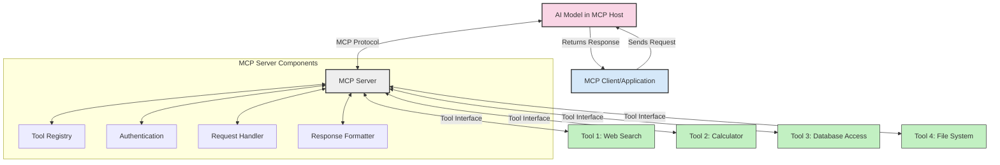
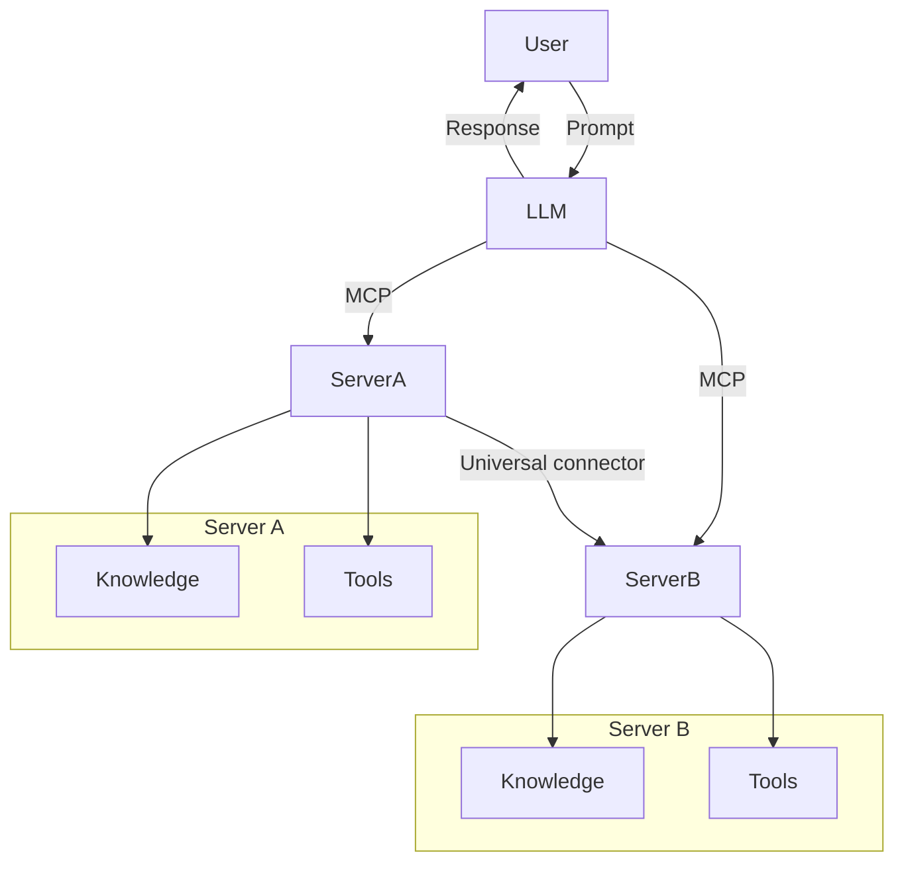

<!--
CO_OP_TRANSLATOR_METADATA:
{
  "original_hash": "02301140adbd807ecf0f17720fa307bc",
  "translation_date": "2025-05-17T06:03:31+00:00",
  "source_file": "00-Introduction/README.md",
  "language_code": "no"
}
-->
# Introduksjon til Model Context Protocol (MCP): Hvorfor det er viktig for skalerbare AI-applikasjoner

Generative AI-applikasjoner er et stort fremskritt fordi de ofte lar brukeren samhandle med appen ved hjelp av naturlige språkkommandoer. Men etter hvert som mer tid og ressurser investeres i slike apper, vil du sikre at du enkelt kan integrere funksjonaliteter og ressurser på en måte som gjør det enkelt å utvide, at appen din kan håndtere mer enn én modell som brukes, og dens intrikate detaljer. Kort sagt, det er enkelt å begynne å bygge Gen AI-apper, men etter hvert som de vokser og blir mer komplekse, må du begynne å definere en arkitektur og sannsynligvis vil du måtte lene deg på en standard for å sikre at appene dine bygges på en konsistent måte. Det er her MCP kommer inn for å organisere ting, for å gi en standard.

---

## **🔍 Hva er Model Context Protocol (MCP)?**

**Model Context Protocol (MCP)** er en **åpen, standardisert grensesnitt** som lar store språkmodeller (LLMs) samhandle sømløst med eksterne verktøy, API-er og datakilder. Det gir en konsistent arkitektur for å forbedre AI-modellens funksjonalitet utover deres treningsdata, og muliggjør smartere, skalerbare og mer responsive AI-systemer.

---

## **🎯 Hvorfor standardisering i AI er viktig**

Etter hvert som generative AI-applikasjoner blir mer komplekse, er det viktig å ta i bruk standarder som sikrer **skalerbarhet, utvidbarhet** og **vedlikeholdbarhet**. MCP adresserer disse behovene ved å:

- Forene modell-verktøy-integrasjoner
- Redusere skjøre, engangsløsninger
- Tillate flere modeller å sameksistere innen ett økosystem

---

## **📚 Læringsmål**

Ved slutten av denne artikkelen vil du kunne:

- Definere **Model Context Protocol (MCP)** og dens bruksområder
- Forstå hvordan MCP standardiserer kommunikasjon mellom modell og verktøy
- Identifisere kjernedelene i MCP-arkitekturen
- Utforske virkelige anvendelser av MCP i bedrifts- og utviklingssammenhenger

---

## **💡 Hvorfor Model Context Protocol (MCP) er en game-changer**

### **🔗 MCP løser fragmentering i AI-interaksjoner**

Før MCP krevde integrering av modeller med verktøy:

- Tilpasset kode for hvert verktøy-modell-par
- Ikke-standardiserte API-er for hver leverandør
- Hyppige avbrudd på grunn av oppdateringer
- Dårlig skalerbarhet med flere verktøy

### **✅ Fordeler med MCP-standardisering**

| **Fordel**                | **Beskrivelse**                                                                 |
|---------------------------|---------------------------------------------------------------------------------|
| Interoperabilitet         | LLM-er fungerer sømløst med verktøy fra ulike leverandører                      |
| Konsistens                | Ensartet oppførsel på tvers av plattformer og verktøy                           |
| Gjenbrukbarhet            | Verktøy bygget én gang kan brukes på tvers av prosjekter og systemer            |
| Akselerert utvikling      | Reduser utviklingstid ved å bruke standardiserte, plug-and-play-grensesnitt     |

---

## **🧱 Oversikt over MCP-arkitektur på høyt nivå**

MCP følger en **klient-server-modell**, hvor:

- **MCP-verter** kjører AI-modellene
- **MCP-klienter** initierer forespørsler
- **MCP-servere** leverer kontekst, verktøy og funksjoner

### **Nøkkelkomponenter:**

- **Ressurser** – Statisk eller dynamisk data for modeller  
- **Kommandoer** – Forhåndsdefinerte arbeidsflyter for veiledet generering  
- **Verktøy** – Utførbare funksjoner som søk, beregninger  
- **Prøvetaking** – Agentisk oppførsel gjennom rekursive interaksjoner

---

## Hvordan MCP-servere fungerer

MCP-servere opererer på følgende måte:

- **Forespørselsflyt**: 
    1. MCP-klienten sender en forespørsel til AI-modellen som kjører i en MCP-vert.
    2. AI-modellen identifiserer når den trenger eksterne verktøy eller data.
    3. Modellen kommuniserer med MCP-serveren ved hjelp av den standardiserte protokollen.

- **MCP-serverfunksjonalitet**:
    - Verktøysregister: Opprettholder en katalog over tilgjengelige verktøy og deres funksjoner.
    - Autentisering: Verifiserer tillatelser for verktøytilgang.
    - Forespørselshåndtering: Behandler innkommende verktøyforespørsler fra modellen.
    - Responsformatering: Strukturerer verktøyutganger i et format modellen kan forstå.

- **Verktøyutførelse**: 
    - Serveren ruter forespørsler til de aktuelle eksterne verktøyene
    - Verktøyene utfører sine spesialiserte funksjoner (søk, beregning, databaseforespørsler, etc.)
    - Resultatene returneres til modellen i et konsistent format.

- **Fullføring av respons**: 
    - AI-modellen inkorporerer verktøyutganger i sin respons.
    - Den endelige responsen sendes tilbake til klientapplikasjonen.

## 👨‍💻 Hvordan bygge en MCP-server (med eksempler)

MCP-servere lar deg utvide LLM-evner ved å tilby data og funksjonalitet. 

Klar til å prøve det ut? Her er eksempler på å lage en enkel MCP-server i forskjellige språk:

- **Python-eksempel**: https://github.com/modelcontextprotocol/python-sdk

- **TypeScript-eksempel**: https://github.com/modelcontextprotocol/typescript-sdk

- **Java-eksempel**: https://github.com/modelcontextprotocol/java-sdk

- **C#/.NET-eksempel**: https://github.com/modelcontextprotocol/csharp-sdk

## 🌍 Virkelige bruksområder for MCP

MCP muliggjør et bredt spekter av applikasjoner ved å utvide AI-evner:

| **Applikasjon**               | **Beskrivelse**                                                               |
|-------------------------------|-------------------------------------------------------------------------------|
| Bedriftsdataintegrasjon       | Koble LLM-er til databaser, CRM-er eller interne verktøy                      |
| Agentiske AI-systemer         | Aktiver autonome agenter med verktøytilgang og beslutningsprosesser           |
| Multi-modale applikasjoner    | Kombiner tekst-, bilde- og lydverktøy innen en enkelt, enhetlig AI-app        |
| Sanntidsdataintegrasjon       | Bring live-data inn i AI-interaksjoner for mer nøyaktige, oppdaterte resultater|

### 🧠 MCP = Universell standard for AI-interaksjoner

Model Context Protocol (MCP) fungerer som en universell standard for AI-interaksjoner, på samme måte som USB-C standardiserte fysiske tilkoblinger for enheter. I AI-verdenen gir MCP et konsistent grensesnitt, slik at modeller (klienter) kan integrere seg sømløst med eksterne verktøy og dataleverandører (servere). Dette eliminerer behovet for mangfoldige, tilpassede protokoller for hver API eller datakilde.

Under MCP følger et MCP-kompatibelt verktøy (referert til som en MCP-server) en enhetlig standard. Disse serverne kan liste opp verktøyene eller handlingene de tilbyr og utføre disse handlingene når de blir forespurt av en AI-agent. AI-agentplattformer som støtter MCP er i stand til å oppdage tilgjengelige verktøy fra serverne og påkalle dem gjennom denne standardprotokollen.

### 💡 Tilrettelegger tilgang til kunnskap

Utover å tilby verktøy, tilrettelegger MCP også tilgang til kunnskap. Det gjør det mulig for applikasjoner å gi kontekst til store språkmodeller (LLMs) ved å koble dem til ulike datakilder. For eksempel kan en MCP-server representere et selskaps dokumentlager, slik at agenter kan hente relevant informasjon på forespørsel. En annen server kan håndtere spesifikke handlinger som å sende e-post eller oppdatere poster. Fra agentens perspektiv er dette bare verktøy den kan bruke—noen verktøy returnerer data (kunnskapskontekst), mens andre utfører handlinger. MCP håndterer begge effektivt.

En agent som kobler seg til en MCP-server lærer automatisk om serverens tilgjengelige funksjoner og tilgjengelige data gjennom et standardformat. Denne standardiseringen muliggjør dynamisk verktøytilgjengelighet. For eksempel, ved å legge til en ny MCP-server i en agents system, blir dens funksjoner umiddelbart brukbare uten å kreve ytterligere tilpasning av agentens instruksjoner.

Denne strømlinjeformede integrasjonen samsvarer med flyten vist i mermaid-diagrammet, der servere tilbyr både verktøy og kunnskap, og sikrer sømløst samarbeid på tvers av systemer.

### 👉 Eksempel: Skalerbar agentløsning

## 🔐 Praktiske fordeler med MCP

Her er noen praktiske fordeler med å bruke MCP:

- **Oppdatert informasjon**: Modeller kan få tilgang til oppdatert informasjon utover deres treningsdata
- **Utvidelse av funksjoner**: Modeller kan utnytte spesialiserte verktøy for oppgaver de ikke ble trent for
- **Reduserte hallusinasjoner**: Eksterne datakilder gir faktabasert forankring
- **Personvern**: Sensitive data kan forbli innenfor sikre miljøer i stedet for å bli innebygd i kommandoer

## 📌 Viktige punkter

Følgende er viktige punkter for bruk av MCP:

- **MCP** standardiserer hvordan AI-modeller samhandler med verktøy og data
- Fremmer **utvidbarhet, konsistens og interoperabilitet**
- MCP hjelper med å **redusere utviklingstid, forbedre pålitelighet og utvide modellevner**
- Klient-server-arkitekturen **muliggjør fleksible, utvidbare AI-applikasjoner**

## 🧠 Øvelse

Tenk på en AI-applikasjon du er interessert i å bygge.

- Hvilke **eksterne verktøy eller data** kan forbedre dens evner?
- Hvordan kan MCP gjøre integrasjonen **enklere og mer pålitelig?**

## Ytterligere ressurser

- [MCP GitHub Repository](https://github.com/modelcontextprotocol)

## Hva er neste

Neste: [Kapittel 1: Kjernebegreper](/01-CoreConcepts/README.md)

I'm sorry, but "no" does not seem to correspond to any recognized language code. Could you please specify the language you want the text translated into?