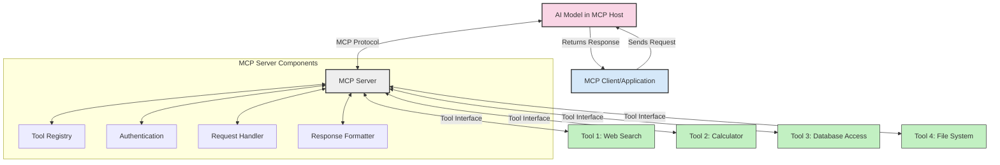
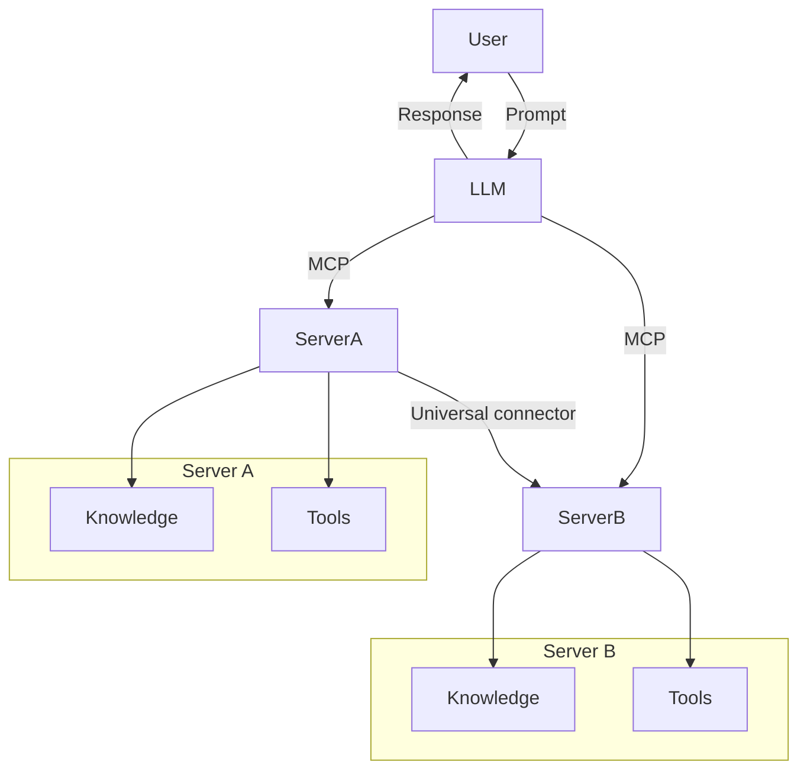

<!--
CO_OP_TRANSLATOR_METADATA:
{
  "original_hash": "cf84f987e1b771d2201408e110dfd2db",
  "translation_date": "2025-05-20T17:23:22+00:00",
  "source_file": "00-Introduction/README.md",
  "language_code": "no"
}
-->
# Introduksjon til Model Context Protocol (MCP): Hvorfor det er viktig for skalerbare AI-applikasjoner

Generative AI-applikasjoner er et stort fremskritt siden de ofte lar brukeren samhandle med appen ved hjelp av naturlige språkkommandoer. Men etter hvert som mer tid og ressurser investeres i slike apper, vil du sørge for at det er enkelt å integrere funksjonalitet og ressurser på en måte som gjør det lett å utvide, at appen kan håndtere mer enn én modell samtidig, og deres kompleksitet. Kort sagt, det er enkelt å komme i gang med Gen AI-apper, men når de vokser og blir mer komplekse, må du begynne å definere en arkitektur og mest sannsynlig basere deg på en standard for å sikre at appene bygges på en konsistent måte. Her kommer MCP inn for å organisere ting og tilby en standard.

---

## **🔍 Hva er Model Context Protocol (MCP)?**

**Model Context Protocol (MCP)** er et **åpent, standardisert grensesnitt** som gjør det mulig for store språkmodeller (LLMs) å samhandle sømløst med eksterne verktøy, API-er og datakilder. Det gir en konsekvent arkitektur for å forbedre AI-modellers funksjonalitet utover treningsdataene, noe som muliggjør smartere, skalerbare og mer responsive AI-systemer.

---

## **🎯 Hvorfor standardisering i AI er viktig**

Etter hvert som generative AI-applikasjoner blir mer komplekse, er det avgjørende å ta i bruk standarder som sikrer **skalerbarhet, utvidbarhet** og **vedlikeholdbarhet**. MCP møter disse behovene ved å:

- Samle integrasjoner mellom modeller og verktøy
- Redusere skjøre, engangsløsninger
- Tillate at flere modeller kan eksistere i samme økosystem

---

## **📚 Læringsmål**

Etter å ha lest denne artikkelen vil du kunne:

- Definere **Model Context Protocol (MCP)** og dets bruksområder
- Forstå hvordan MCP standardiserer kommunikasjon mellom modeller og verktøy
- Identifisere kjernekomponentene i MCP-arkitekturen
- Utforske virkelige bruksområder for MCP i bedrifts- og utviklingssammenheng

---

## **💡 Hvorfor Model Context Protocol (MCP) er en revolusjon**

### **🔗 MCP løser fragmentering i AI-interaksjoner**

Før MCP krevde integrasjon av modeller med verktøy:

- Egendefinert kode for hvert verktøy-modell-par
- Ikke-standardiserte API-er for hver leverandør
- Hyppige brudd ved oppdateringer
- Dårlig skalerbarhet med flere verktøy

### **✅ Fordeler med MCP-standardisering**

| **Fordel**               | **Beskrivelse**                                                                 |
|--------------------------|---------------------------------------------------------------------------------|
| Interoperabilitet        | LLM-er fungerer sømløst med verktøy fra ulike leverandører                      |
| Konsistens               | Ensartet oppførsel på tvers av plattformer og verktøy                           |
| Gjenbrukbarhet           | Verktøy bygget én gang kan brukes på tvers av prosjekter og systemer            |
| Raskere utvikling        | Reduserer utviklingstid ved å bruke standardiserte, plug-and-play grensesnitt  |

---

## **🧱 Høy-nivå oversikt over MCP-arkitekturen**

MCP følger en **klient-server-modell**, hvor:

- **MCP Hosts** kjører AI-modellene
- **MCP Clients** initierer forespørsler
- **MCP Servers** leverer kontekst, verktøy og kapabiliteter

### **Nøkkelkomponenter:**

- **Resources** – Statisk eller dynamisk data for modeller  
- **Prompts** – Forhåndsdefinerte arbeidsflyter for styrt generering  
- **Tools** – Utførbare funksjoner som søk, beregninger  
- **Sampling** – Agentisk atferd via rekursive interaksjoner

---

## Hvordan MCP-servere fungerer

MCP-servere fungerer slik:

- **Forespørselsflyt**:  
    1. MCP-klienten sender en forespørsel til AI-modellen som kjører i en MCP Host.  
    2. AI-modellen identifiserer når den trenger eksterne verktøy eller data.  
    3. Modellen kommuniserer med MCP-serveren via det standardiserte protokoll.

- **MCP-serverens funksjoner**:  
    - Verktøyregister: Opprettholder en katalog over tilgjengelige verktøy og deres kapabiliteter.  
    - Autentisering: Verifiserer tillatelser for verktøystilgang.  
    - Forespørselsbehandler: Behandler innkommende verktøyforespørsler fra modellen.  
    - Svarformatør: Strukturere verktøyutdata i et format modellen kan forstå.

- **Verktøykjøring**:  
    - Serveren ruter forespørsler til riktige eksterne verktøy  
    - Verktøyene utfører sine spesialiserte funksjoner (søk, beregning, databaseforespørsler, osv.)  
    - Resultatene returneres til modellen i et konsistent format.

- **Fullføring av svar**:  
    - AI-modellen inkorporerer verktøyutdata i sitt svar.  
    - Det endelige svaret sendes tilbake til klientapplikasjonen.

## 👨‍💻 Hvordan bygge en MCP-server (med eksempler)

MCP-servere lar deg utvide LLM-funksjonalitet ved å tilby data og funksjoner.

Klar til å prøve? Her er eksempler på hvordan du lager en enkel MCP-server i forskjellige språk:

- **Python-eksempel**: https://github.com/modelcontextprotocol/python-sdk

- **TypeScript-eksempel**: https://github.com/modelcontextprotocol/typescript-sdk

- **Java-eksempel**: https://github.com/modelcontextprotocol/java-sdk

- **C#/.NET-eksempel**: https://github.com/modelcontextprotocol/csharp-sdk

## 🌍 Virkelige bruksområder for MCP

MCP muliggjør et bredt spekter av applikasjoner ved å utvide AI-kapasiteter:

| **Applikasjon**            | **Beskrivelse**                                                                 |
|----------------------------|---------------------------------------------------------------------------------|
| Enterprise Data Integration | Koble LLM-er til databaser, CRM-er eller interne verktøy                        |
| Agentiske AI-systemer       | Muliggjør autonome agenter med tilgang til verktøy og beslutningsflyter        |
| Multimodale applikasjoner   | Kombiner tekst-, bilde- og lydverktøy i én samlet AI-app                        |
| Sanntidsdataintegrasjon     | Bring inn live data i AI-interaksjoner for mer nøyaktige og oppdaterte svar    |

### 🧠 MCP = Universell standard for AI-interaksjoner

Model Context Protocol (MCP) fungerer som en universell standard for AI-interaksjoner, på samme måte som USB-C standardiserte fysiske tilkoblinger for enheter. I AI-verdenen gir MCP et konsekvent grensesnitt som lar modeller (klienter) integrere sømløst med eksterne verktøy og dataleverandører (servere). Dette eliminerer behovet for ulike, egendefinerte protokoller for hver API eller datakilde.

Under MCP følger et MCP-kompatibelt verktøy (kalt en MCP-server) en samlet standard. Disse serverne kan liste opp verktøyene eller handlingene de tilbyr, og utføre disse når de blir bedt om det av en AI-agent. AI-agentplattformer som støtter MCP kan oppdage tilgjengelige verktøy fra serverne og kalle dem via denne standardprotokollen.

### 💡 Legger til rette for tilgang til kunnskap

I tillegg til å tilby verktøy, gjør MCP det også mulig å gi tilgang til kunnskap. Det lar applikasjoner gi kontekst til store språkmodeller (LLMs) ved å koble dem til ulike datakilder. For eksempel kan en MCP-server representere et firmas dokumentarkiv, slik at agenter kan hente relevant informasjon etter behov. En annen server kan håndtere spesifikke handlinger som å sende e-poster eller oppdatere registre. Fra agentens perspektiv er dette bare verktøy den kan bruke – noen verktøy returnerer data (kunnskapskontekst), mens andre utfører handlinger. MCP håndterer begge effektivt.

En agent som kobler til en MCP-server lærer automatisk om serverens tilgjengelige kapabiliteter og data via et standardformat. Denne standardiseringen muliggjør dynamisk verktøystøtte. For eksempel, når en ny MCP-server legges til agentens system, blir funksjonene umiddelbart tilgjengelige uten behov for ytterligere tilpasning av agentens instruksjoner.

Denne strømlinjeformede integrasjonen følger flyten vist i mermaid-diagrammet, der servere leverer både verktøy og kunnskap, og sikrer sømløst samarbeid mellom systemer.

### 👉 Eksempel: Skalerbar agentløsning

## 🔐 Praktiske fordeler med MCP

Her er de praktiske fordelene ved å bruke MCP:

- **Oppdatert informasjon**: Modeller kan få tilgang til oppdatert informasjon utover treningsdataene sine  
- **Utvidede kapabiliteter**: Modeller kan bruke spesialiserte verktøy for oppgaver de ikke er trent for  
- **Redusert hallusinasjon**: Eksterne datakilder gir faktabasert forankring  
- **Personvern**: Sensitiv data kan holdes i sikre miljøer i stedet for å være innebygd i prompts

## 📌 Viktige punkter

Her er viktige punkter å ta med seg om MCP:

- **MCP** standardiserer hvordan AI-modeller samhandler med verktøy og data  
- Fremmer **utvidbarhet, konsistens og interoperabilitet**  
- MCP bidrar til å **redusere utviklingstid, forbedre pålitelighet og utvide modellkapasiteter**  
- Klient-server-arkitekturen **gjør AI-applikasjoner fleksible og utvidbare**

## 🧠 Øvelse

Tenk på en AI-applikasjon du ønsker å bygge.

- Hvilke **eksterne verktøy eller data** kan forbedre funksjonaliteten?  
- Hvordan kan MCP gjøre integrasjonen **enklere og mer pålitelig**?

## Tilleggsressurser

- [MCP GitHub Repository](https://github.com/modelcontextprotocol)

## Hva nå

Neste: [Kapittel 1: Kjernebegreper](/01-CoreConcepts/README.md)

**Ansvarsfraskrivelse**:  
Dette dokumentet er oversatt ved hjelp av AI-oversettelsestjenesten [Co-op Translator](https://github.com/Azure/co-op-translator). Selv om vi streber etter nøyaktighet, vær oppmerksom på at automatiserte oversettelser kan inneholde feil eller unøyaktigheter. Det originale dokumentet på dets opprinnelige språk bør betraktes som den autoritative kilden. For kritisk informasjon anbefales profesjonell menneskelig oversettelse. Vi er ikke ansvarlige for eventuelle misforståelser eller feiltolkninger som oppstår fra bruk av denne oversettelsen.