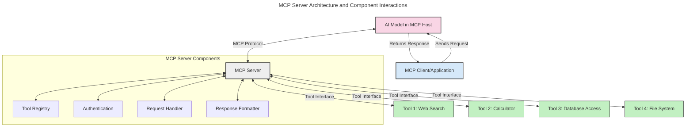
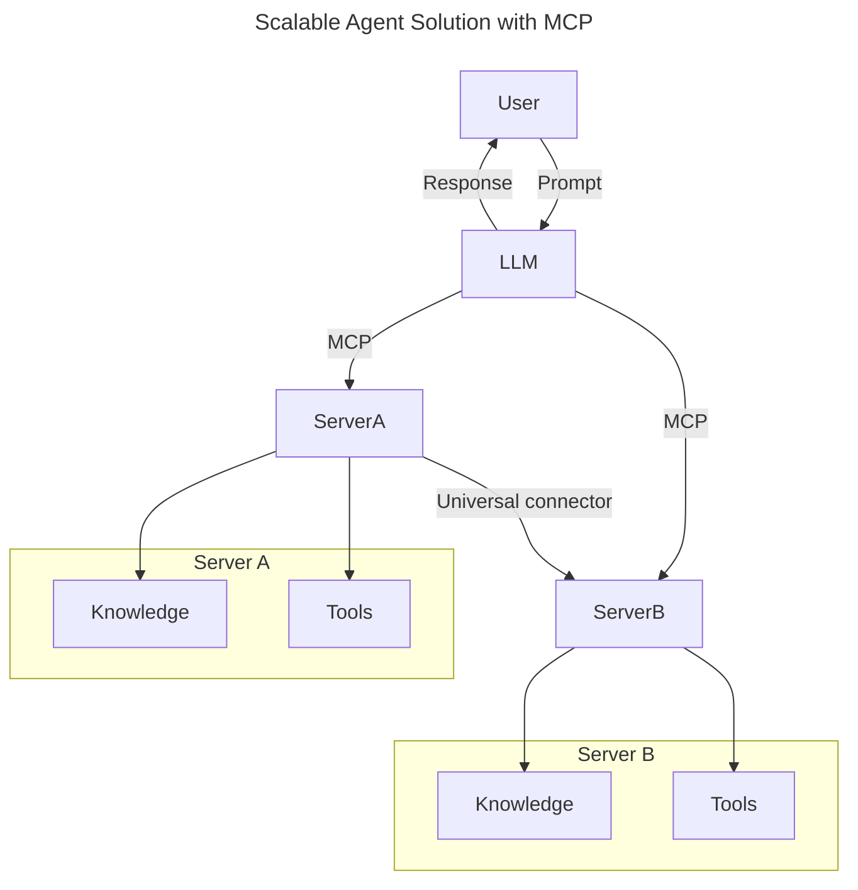
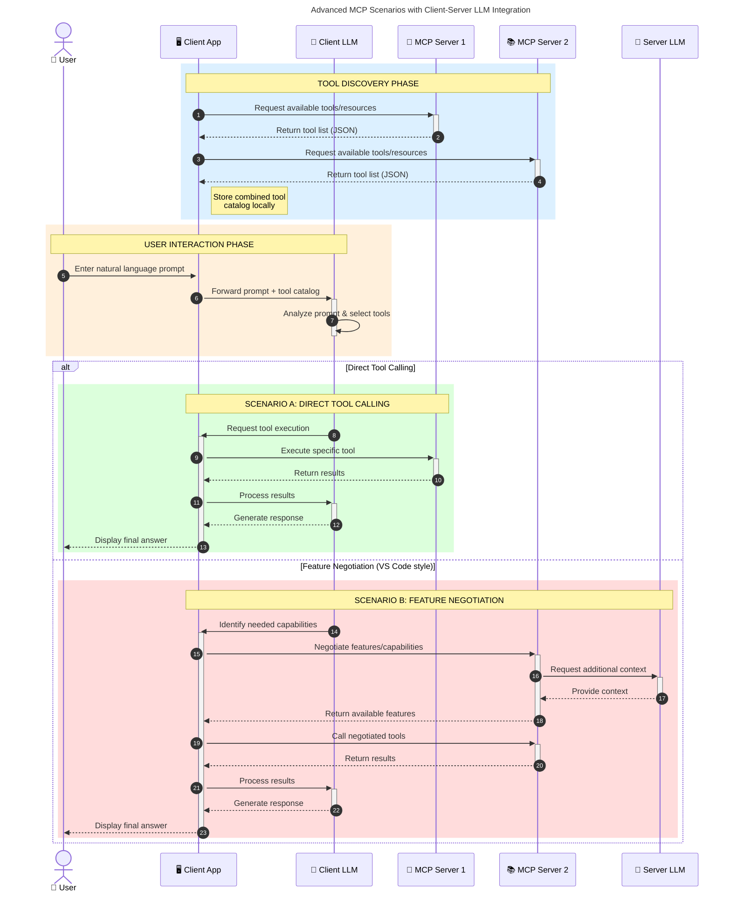

<!--
CO_OP_TRANSLATOR_METADATA:
{
  "original_hash": "105c2ddbb77bc38f7e9df009e1b06e45",
  "translation_date": "2025-07-13T15:34:42+00:00",
  "source_file": "00-Introduction/README.md",
  "language_code": "no"
}
-->
# Introduksjon til Model Context Protocol (MCP): Hvorfor det er viktig for skalerbare AI-applikasjoner

Generative AI-applikasjoner er et stort steg fremover, da de ofte lar brukeren samhandle med appen ved hjelp av naturlige språkkommandoer. Men etter hvert som mer tid og ressurser investeres i slike apper, vil du sikre at du enkelt kan integrere funksjonalitet og ressurser på en måte som gjør det lett å utvide, at appen kan håndtere mer enn én modell samtidig, og takle ulike modellspesifikke utfordringer. Kort sagt, det er enkelt å komme i gang med å bygge Gen AI-apper, men når de vokser og blir mer komplekse, må du begynne å definere en arkitektur og sannsynligvis basere deg på en standard for å sikre at appene bygges på en konsistent måte. Her kommer MCP inn for å organisere ting og tilby en standard.

---

## **🔍 Hva er Model Context Protocol (MCP)?**

**Model Context Protocol (MCP)** er et **åpent, standardisert grensesnitt** som gjør det mulig for store språkmodeller (LLMs) å samhandle sømløst med eksterne verktøy, API-er og datakilder. Det gir en konsistent arkitektur som forbedrer AI-modellers funksjonalitet utover treningsdataene, og muliggjør smartere, skalerbare og mer responsive AI-systemer.

---

## **🎯 Hvorfor standardisering i AI er viktig**

Etter hvert som generative AI-applikasjoner blir mer komplekse, er det avgjørende å ta i bruk standarder som sikrer **skalerbarhet, utvidbarhet** og **vedlikeholdbarhet**. MCP dekker disse behovene ved å:

- Samle modell-verktøy-integrasjoner
- Redusere skjøre, engangsløsninger
- Tillate flere modeller å eksistere i samme økosystem

---

## **📚 Læringsmål**

Etter å ha lest denne artikkelen vil du kunne:

- Definere **Model Context Protocol (MCP)** og dets bruksområder
- Forstå hvordan MCP standardiserer kommunikasjon mellom modell og verktøy
- Identifisere kjernekomponentene i MCP-arkitekturen
- Utforske praktiske anvendelser av MCP i bedrifts- og utviklingssammenheng

---

## **💡 Hvorfor Model Context Protocol (MCP) er en revolusjon**

### **🔗 MCP løser fragmentering i AI-interaksjoner**

Før MCP krevde integrasjon av modeller med verktøy:

- Egen kode for hvert verktøy-modell-par
- Ikke-standardiserte API-er for hver leverandør
- Hyppige brudd ved oppdateringer
- Dårlig skalerbarhet med flere verktøy

### **✅ Fordeler med MCP-standardisering**

| **Fordel**               | **Beskrivelse**                                                                |
|--------------------------|--------------------------------------------------------------------------------|
| Interoperabilitet        | LLM-er fungerer sømløst med verktøy fra ulike leverandører                    |
| Konsistens               | Enhetlig oppførsel på tvers av plattformer og verktøy                          |
| Gjenbruk                 | Verktøy bygget én gang kan brukes på tvers av prosjekter og systemer          |
| Raskere utvikling        | Reduserer utviklingstid ved bruk av standardiserte, plug-and-play-grensesnitt |

---

## **🧱 Overordnet MCP-arkitektur**

MCP følger en **klient-server-modell**, hvor:

- **MCP Hosts** kjører AI-modellene
- **MCP Clients** initierer forespørsler
- **MCP Servers** leverer kontekst, verktøy og funksjonalitet

### **Nøkkelkomponenter:**

- **Ressurser** – Statisk eller dynamisk data for modellene  
- **Prompter** – Forhåndsdefinerte arbeidsflyter for styrt generering  
- **Verktøy** – Utførbare funksjoner som søk, beregninger  
- **Sampling** – Agent-lignende oppførsel via rekursive interaksjoner

---

## Hvordan MCP-servere fungerer

MCP-servere opererer på følgende måte:

- **Forespørselsflyt**:  
    1. MCP-klienten sender en forespørsel til AI-modellen som kjører i en MCP Host.  
    2. AI-modellen identifiserer når den trenger eksterne verktøy eller data.  
    3. Modellen kommuniserer med MCP-serveren ved hjelp av den standardiserte protokollen.

- **MCP-serverens funksjonalitet**:  
    - Verktøyregister: Holder oversikt over tilgjengelige verktøy og deres funksjoner.  
    - Autentisering: Verifiserer tillatelser for verktøytillatelse.  
    - Forespørselsbehandler: Behandler innkommende verktøyforespørsler fra modellen.  
    - Responsformatterer: Strukturere verktøyutdata i et format modellen forstår.

- **Verktøyutførelse**:  
    - Serveren ruter forespørsler til riktige eksterne verktøy  
    - Verktøyene utfører sine spesialiserte funksjoner (søk, beregning, databaseforespørsler osv.)  
    - Resultatene returneres til modellen i et konsistent format.

- **Fullføring av respons**:  
    - AI-modellen inkorporerer verktøyutdata i sitt svar.  
    - Det endelige svaret sendes tilbake til klientapplikasjonen.

```mermaid
---
title: MCP Server Architecture and Component Interactions
description: A diagram showing how AI models interact with MCP servers and various tools, depicting the request flow and server components including Tool Registry, Authentication, Request Handler, and Response Formatter
---
graph TD
    A[AI Model in MCP Host] <-->|MCP Protocol| B[MCP Server]
    B <-->|Tool Interface| C[Tool 1: Web Search]
    B <-->|Tool Interface| D[Tool 2: Calculator]
    B <-->|Tool Interface| E[Tool 3: Database Access]
    B <-->|Tool Interface| F[Tool 4: File System]
    
    Client[MCP Client/Application] -->|Sends Request| A
    A -->|Returns Response| Client
    
    subgraph "MCP Server Components"
        B
        G[Tool Registry]
        H[Authentication]
        I[Request Handler]
        J[Response Formatter]
    end
    
    B <--> G
    B <--> H
    B <--> I
    B <--> J
    
    style A fill:#f9d5e5,stroke:#333,stroke-width:2px
    style B fill:#eeeeee,stroke:#333,stroke-width:2px
    style Client fill:#d5e8f9,stroke:#333,stroke-width:2px
    style C fill:#c2f0c2,stroke:#333,stroke-width:1px
    style D fill:#c2f0c2,stroke:#333,stroke-width:1px
    style E fill:#c2f0c2,stroke:#333,stroke-width:1px
    style F fill:#c2f0c2,stroke:#333,stroke-width:1px    
```

## 👨‍💻 Hvordan bygge en MCP-server (med eksempler)

MCP-servere lar deg utvide LLM-funksjonalitet ved å tilby data og funksjoner.

Klar til å prøve? Her er eksempler på hvordan du lager en enkel MCP-server i ulike språk:

- **Python-eksempel**: https://github.com/modelcontextprotocol/python-sdk

- **TypeScript-eksempel**: https://github.com/modelcontextprotocol/typescript-sdk

- **Java-eksempel**: https://github.com/modelcontextprotocol/java-sdk

- **C#/.NET-eksempel**: https://github.com/modelcontextprotocol/csharp-sdk

## 🌍 Praktiske bruksområder for MCP

MCP muliggjør et bredt spekter av applikasjoner ved å utvide AI-funksjonalitet:

| **Bruksområde**            | **Beskrivelse**                                                                |
|----------------------------|--------------------------------------------------------------------------------|
| Bedriftsdataintegrasjon    | Koble LLM-er til databaser, CRM-systemer eller interne verktøy                 |
| Agentbaserte AI-systemer   | Muliggjør autonome agenter med verktøystøtte og beslutningsflyt               |
| Multimodale applikasjoner  | Kombiner tekst-, bilde- og lydverktøy i én samlet AI-app                       |
| Sanntidsdataintegrasjon    | Hent inn levende data i AI-interaksjoner for mer nøyaktige og oppdaterte svar |

### 🧠 MCP = Universell standard for AI-interaksjoner

Model Context Protocol (MCP) fungerer som en universell standard for AI-interaksjoner, på samme måte som USB-C standardiserte fysiske tilkoblinger for enheter. I AI-verdenen gir MCP et konsistent grensesnitt som gjør det mulig for modeller (klienter) å integrere sømløst med eksterne verktøy og dataleverandører (servere). Dette eliminerer behovet for ulike, tilpassede protokoller for hver API eller datakilde.

Under MCP følger et MCP-kompatibelt verktøy (kalt MCP-server) en felles standard. Disse serverne kan liste opp verktøyene eller handlingene de tilbyr, og utføre disse når de blir bedt om det av en AI-agent. AI-agentplattformer som støtter MCP kan oppdage tilgjengelige verktøy fra serverne og kalle dem via denne standardprotokollen.

### 💡 Legger til rette for kunnskapstilgang

I tillegg til å tilby verktøy, legger MCP også til rette for tilgang til kunnskap. Det gjør det mulig for applikasjoner å gi kontekst til store språkmodeller (LLMs) ved å koble dem til ulike datakilder. For eksempel kan en MCP-server representere et selskaps dokumentarkiv, slik at agenter kan hente relevant informasjon ved behov. En annen server kan håndtere spesifikke handlinger som å sende e-post eller oppdatere poster. Fra agentens perspektiv er dette bare verktøy den kan bruke – noen verktøy returnerer data (kunnskapskontekst), mens andre utfører handlinger. MCP håndterer begge deler effektivt.

En agent som kobler seg til en MCP-server lærer automatisk om serverens tilgjengelige funksjoner og data gjennom et standardisert format. Denne standardiseringen muliggjør dynamisk tilgjengelighet av verktøy. For eksempel, ved å legge til en ny MCP-server i agentens system, blir dens funksjoner umiddelbart tilgjengelige uten behov for ytterligere tilpasning av agentens instruksjoner.

Denne strømlinjeformede integrasjonen samsvarer med flyten vist i mermaid-diagrammet, hvor servere tilbyr både verktøy og kunnskap, og sikrer sømløst samarbeid på tvers av systemer.

### 👉 Eksempel: Skalerbar agentløsning

```mermaid
---
title: Scalable Agent Solution with MCP
description: A diagram illustrating how a user interacts with an LLM that connects to multiple MCP servers, with each server providing both knowledge and tools, creating a scalable AI system architecture
---
graph TD
    User -->|Prompt| LLM
    LLM -->|Response| User
    LLM -->|MCP| ServerA
    LLM -->|MCP| ServerB
    ServerA -->|Universal connector| ServerB
    ServerA --> KnowledgeA
    ServerA --> ToolsA
    ServerB --> KnowledgeB
    ServerB --> ToolsB

    subgraph Server A
        KnowledgeA[Knowledge]
        ToolsA[Tools]
    end

    subgraph Server B
        KnowledgeB[Knowledge]
        ToolsB[Tools]
    end
```

### 🔄 Avanserte MCP-scenarier med klientbasert LLM-integrasjon

Utover grunnleggende MCP-arkitektur finnes det avanserte scenarier hvor både klient og server inneholder LLM-er, noe som muliggjør mer sofistikerte interaksjoner:

```mermaid
---
title: Advanced MCP Scenarios with Client-Server LLM Integration
description: A sequence diagram showing the detailed interaction flow between user, client application, client LLM, multiple MCP servers, and server LLM, illustrating tool discovery, user interaction, direct tool calling, and feature negotiation phases
---
sequenceDiagram
    autonumber
    actor User as 👤 User
    participant ClientApp as 🖥️ Client App
    participant ClientLLM as 🧠 Client LLM
    participant Server1 as 🔧 MCP Server 1
    participant Server2 as 📚 MCP Server 2
    participant ServerLLM as 🤖 Server LLM
    
    %% Discovery Phase
    rect rgb(220, 240, 255)
        Note over ClientApp, Server2: TOOL DISCOVERY PHASE
        ClientApp->>+Server1: Request available tools/resources
        Server1-->>-ClientApp: Return tool list (JSON)
        ClientApp->>+Server2: Request available tools/resources
        Server2-->>-ClientApp: Return tool list (JSON)
        Note right of ClientApp: Store combined tool<br/>catalog locally
    end
    
    %% User Interaction
    rect rgb(255, 240, 220)
        Note over User, ClientLLM: USER INTERACTION PHASE
        User->>+ClientApp: Enter natural language prompt
        ClientApp->>+ClientLLM: Forward prompt + tool catalog
        ClientLLM->>-ClientLLM: Analyze prompt & select tools
    end
    
    %% Scenario A: Direct Tool Calling
    alt Direct Tool Calling
        rect rgb(220, 255, 220)
            Note over ClientApp, Server1: SCENARIO A: DIRECT TOOL CALLING
            ClientLLM->>+ClientApp: Request tool execution
            ClientApp->>+Server1: Execute specific tool
            Server1-->>-ClientApp: Return results
            ClientApp->>+ClientLLM: Process results
            ClientLLM-->>-ClientApp: Generate response
            ClientApp-->>-User: Display final answer
        end
    
    %% Scenario B: Feature Negotiation (VS Code style)
    else Feature Negotiation (VS Code style)
        rect rgb(255, 220, 220)
            Note over ClientApp, ServerLLM: SCENARIO B: FEATURE NEGOTIATION
            ClientLLM->>+ClientApp: Identify needed capabilities
            ClientApp->>+Server2: Negotiate features/capabilities
            Server2->>+ServerLLM: Request additional context
            ServerLLM-->>-Server2: Provide context
            Server2-->>-ClientApp: Return available features
            ClientApp->>+Server2: Call negotiated tools
            Server2-->>-ClientApp: Return results
            ClientApp->>+ClientLLM: Process results
            ClientLLM-->>-ClientApp: Generate response
            ClientApp-->>-User: Display final answer
        end
    end
```

## 🔐 Praktiske fordeler med MCP

Her er de praktiske fordelene ved å bruke MCP:

- **Oppdatert informasjon**: Modeller kan få tilgang til fersk informasjon utover treningsdataene  
- **Utvidet funksjonalitet**: Modeller kan bruke spesialiserte verktøy for oppgaver de ikke er trent for  
- **Redusert hallusinasjon**: Eksterne datakilder gir faktabasert grunnlag  
- **Personvern**: Sensitiv data kan forbli i sikre miljøer i stedet for å være innebygd i prompter

## 📌 Viktige punkter

Her er hovedpunktene for bruk av MCP:

- **MCP** standardiserer hvordan AI-modeller samhandler med verktøy og data  
- Fremmer **utvidbarhet, konsistens og interoperabilitet**  
- MCP hjelper til med å **redusere utviklingstid, forbedre pålitelighet og utvide modellfunksjoner**  
- Klient-server-arkitekturen **muliggjør fleksible, utvidbare AI-applikasjoner**

## 🧠 Øvelse

Tenk på en AI-applikasjon du er interessert i å bygge.

- Hvilke **eksterne verktøy eller data** kan forbedre funksjonaliteten?  
- Hvordan kan MCP gjøre integrasjonen **enklere og mer pålitelig?**

## Ytterligere ressurser

- [MCP GitHub Repository](https://github.com/modelcontextprotocol)

## Hva skjer videre

Neste: [Kapittel 1: Kjernebegreper](../01-CoreConcepts/README.md)

**Ansvarsfraskrivelse**:  
Dette dokumentet er oversatt ved hjelp av AI-oversettelsestjenesten [Co-op Translator](https://github.com/Azure/co-op-translator). Selv om vi streber etter nøyaktighet, vennligst vær oppmerksom på at automatiske oversettelser kan inneholde feil eller unøyaktigheter. Det opprinnelige dokumentet på originalspråket skal anses som den autoritative kilden. For kritisk informasjon anbefales profesjonell menneskelig oversettelse. Vi er ikke ansvarlige for eventuelle misforståelser eller feiltolkninger som oppstår ved bruk av denne oversettelsen.