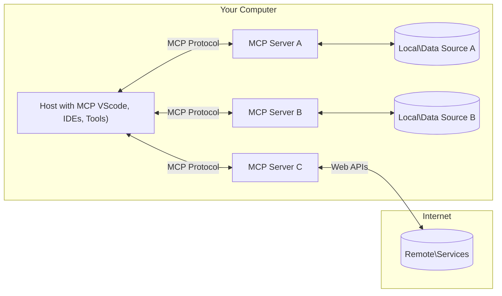

<!--
CO_OP_TRANSLATOR_METADATA:
{
  "original_hash": "355b12a5970c5c9e6db0bee970c751ba",
  "translation_date": "2025-07-04T17:43:35+00:00",
  "source_file": "01-CoreConcepts/README.md",
  "language_code": "no"
}
-->
# 📖 MCP Kjernebegreper: Mestre Model Context Protocol for AI-integrasjon

[Model Context Protocol (MCP)](https://github.com/modelcontextprotocol) er et kraftfullt, standardisert rammeverk som optimaliserer kommunikasjonen mellom store språkmodeller (LLMs) og eksterne verktøy, applikasjoner og datakilder. Denne SEO-optimaliserte guiden tar deg gjennom kjernebegrepene i MCP, slik at du forstår klient-server-arkitekturen, viktige komponenter, kommunikasjonsmekanismer og beste praksis for implementering.

## Oversikt

Denne leksjonen utforsker den grunnleggende arkitekturen og komponentene som utgjør Model Context Protocol (MCP)-økosystemet. Du vil lære om klient-server-arkitekturen, nøkkelkomponenter og kommunikasjonsmekanismer som driver MCP-interaksjoner.

## 👩‍🎓 Viktige læringsmål

Etter denne leksjonen vil du:

- Forstå MCPs klient-server-arkitektur.
- Identifisere roller og ansvar for Hosts, Clients og Servers.
- Analysere kjernefunksjonene som gjør MCP til et fleksibelt integrasjonslag.
- Lære hvordan informasjon flyter innen MCP-økosystemet.
- Få praktisk innsikt gjennom kodeeksempler i .NET, Java, Python og JavaScript.

## 🔎 MCP-arkitektur: En nærmere titt

MCP-økosystemet er bygget på en klient-server-modell. Denne modulære strukturen gjør det mulig for AI-applikasjoner å samhandle effektivt med verktøy, databaser, API-er og kontekstuelle ressurser. La oss bryte ned denne arkitekturen i dens kjernekomponenter.

I bunn og grunn følger MCP en klient-server-arkitektur hvor en host-applikasjon kan koble til flere servere:



- **MCP Hosts**: Programmer som VSCode, Claude Desktop, IDE-er eller AI-verktøy som ønsker å få tilgang til data via MCP
- **MCP Clients**: Protokollklienter som opprettholder 1:1-tilkoblinger med servere
- **MCP Servers**: Lettvektsprogrammer som hver eksponerer spesifikke funksjoner gjennom den standardiserte Model Context Protocol
- **Lokale datakilder**: Filene, databasene og tjenestene på din datamaskin som MCP-servere kan få sikker tilgang til
- **Eksterne tjenester**: Systemer tilgjengelig over internett som MCP-servere kan koble til via API-er.

MCP-protokollen er en standard i utvikling, og du kan se de siste oppdateringene i [protokollspesifikasjonen](https://modelcontextprotocol.io/specification/2025-06-18/)

### 1. Hosts

I Model Context Protocol (MCP) spiller Hosts en avgjørende rolle som hovedgrensesnittet brukerne benytter for å samhandle med protokollen. Hosts er applikasjoner eller miljøer som initierer tilkoblinger til MCP-servere for å få tilgang til data, verktøy og prompts. Eksempler på Hosts inkluderer integrerte utviklingsmiljøer (IDE-er) som Visual Studio Code, AI-verktøy som Claude Desktop, eller spesialbygde agenter designet for bestemte oppgaver.

**Hosts** er LLM-applikasjoner som starter tilkoblinger. De:

- Kjører eller samhandler med AI-modeller for å generere svar.
- Initierer tilkoblinger til MCP-servere.
- Styrer samtaleflyten og brukergrensesnittet.
- Kontrollerer tillatelser og sikkerhetsbegrensninger.
- Håndterer brukerens samtykke for datadeling og verktøykjøring.

### 2. Clients

Clients er essensielle komponenter som muliggjør interaksjonen mellom Hosts og MCP-servere. Clients fungerer som mellomledd, og gjør det mulig for Hosts å få tilgang til og bruke funksjonaliteten som MCP-servere tilbyr. De spiller en viktig rolle i å sikre smidig kommunikasjon og effektiv datautveksling innen MCP-arkitekturen.

**Clients** er koblinger inne i host-applikasjonen. De:

- Sender forespørsler til servere med prompts/instruksjoner.
- Forhandler om funksjonalitet med servere.
- Håndterer forespørsler om verktøykjøring fra modeller.
- Behandler og viser svar til brukerne.

### 3. Servers

Servers er ansvarlige for å håndtere forespørsler fra MCP-klienter og gi passende svar. De styrer ulike operasjoner som datainnhenting, verktøykjøring og promptgenerering. Servere sørger for at kommunikasjonen mellom klienter og Hosts er effektiv og pålitelig, og opprettholder integriteten i interaksjonsprosessen.

**Servers** er tjenester som tilbyr kontekst og funksjonalitet. De:

- Registrerer tilgjengelige funksjoner (ressurser, prompts, verktøy)
- Mottar og utfører verktøykall fra klienten
- Gir kontekstuell informasjon for å forbedre modellens svar
- Returnerer resultater tilbake til klienten
- Opprettholder tilstand på tvers av interaksjoner når det er nødvendig

Servere kan utvikles av hvem som helst for å utvide modellens funksjonalitet med spesialisert funksjonalitet.

### 4. Serverfunksjoner

Servere i Model Context Protocol (MCP) tilbyr grunnleggende byggeklosser som muliggjør rike interaksjoner mellom klienter, hosts og språkmodeller. Disse funksjonene er designet for å forbedre MCPs evner ved å tilby strukturert kontekst, verktøy og prompts.

MCP-servere kan tilby noen av følgende funksjoner:

#### 📑 Ressurser

Ressurser i Model Context Protocol (MCP) omfatter ulike typer kontekst og data som kan brukes av brukere eller AI-modeller. Disse inkluderer:

- **Kontekstuell data**: Informasjon og kontekst som brukere eller AI-modeller kan bruke til beslutningstaking og oppgaveutførelse.
- **Kunnskapsbaser og dokumentarkiver**: Samlinger av strukturert og ustrukturert data, som artikler, manualer og forskningsartikler, som gir verdifull innsikt og informasjon.
- **Lokale filer og databaser**: Data lagret lokalt på enheter eller i databaser, tilgjengelig for behandling og analyse.
- **API-er og webtjenester**: Eksterne grensesnitt og tjenester som tilbyr ekstra data og funksjonalitet, og muliggjør integrasjon med ulike nettressurser og verktøy.

Et eksempel på en ressurs kan være et databaseskjema eller en fil som kan aksesseres slik:

```text
file://log.txt
database://schema
```

### 🤖 Prompts

Prompts i Model Context Protocol (MCP) inkluderer ulike forhåndsdefinerte maler og interaksjonsmønstre designet for å effektivisere brukerarbeidsflyter og forbedre kommunikasjon. Disse inkluderer:

- **Malerte meldinger og arbeidsflyter**: Forhåndsstrukturerte meldinger og prosesser som veileder brukere gjennom spesifikke oppgaver og interaksjoner.
- **Forhåndsdefinerte interaksjonsmønstre**: Standardiserte sekvenser av handlinger og svar som legger til rette for konsistent og effektiv kommunikasjon.
- **Spesialiserte samtalemaler**: Tilpassbare maler skreddersydd for bestemte typer samtaler, som sikrer relevante og kontekstuelt passende interaksjoner.

En prompt-mal kan se slik ut:

```markdown
Generate a product slogan based on the following {{product}} with the following {{keywords}}
```

#### ⛏️ Verktøy

Verktøy i Model Context Protocol (MCP) er funksjoner som AI-modellen kan utføre for å løse spesifikke oppgaver. Disse verktøyene er designet for å utvide AI-modellens evner ved å tilby strukturerte og pålitelige operasjoner. Nøkkelaspekter inkluderer:

- **Funksjoner som AI-modellen kan kjøre**: Verktøy er kjørbare funksjoner som AI-modellen kan påkalle for å utføre ulike oppgaver.
- **Unikt navn og beskrivelse**: Hvert verktøy har et tydelig navn og en detaljert beskrivelse som forklarer formålet og funksjonaliteten.
- **Parametere og utdata**: Verktøy tar imot spesifikke parametere og returnerer strukturerte resultater, som sikrer konsistente og forutsigbare utfall.
- **Diskrete funksjoner**: Verktøy utfører avgrensede funksjoner som nettsøk, beregninger og databaseforespørsler.

Et eksempel på et verktøy kan se slik ut:

```typescript
server.tool(
  "GetProducts",
  {
    pageSize: z.string().optional(),
    pageCount: z.string().optional()
  }, () => {
    // return results from API
  }
)
```

## Klientfunksjoner

I Model Context Protocol (MCP) tilbyr klienter flere viktige funksjoner til servere, som forbedrer den samlede funksjonaliteten og interaksjonen i protokollen. En av de mest bemerkelsesverdige funksjonene er Sampling.

### 👉 Sampling

- **Server-initierte agentiske handlinger**: Klienter gjør det mulig for servere å initiere spesifikke handlinger eller atferd autonomt, noe som øker systemets dynamiske evner.
- **Rekursive LLM-interaksjoner**: Denne funksjonen tillater rekursive interaksjoner med store språkmodeller (LLMs), som muliggjør mer komplekse og iterative oppgavebehandlinger.
- **Forespørsel om flere modellfullføringer**: Servere kan be om flere fullføringer fra modellen, for å sikre at svarene er grundige og kontekstuelt relevante.

## Informasjonsflyt i MCP

Model Context Protocol (MCP) definerer en strukturert informasjonsflyt mellom hosts, clients, servers og modeller. Å forstå denne flyten hjelper med å klargjøre hvordan brukerforespørsler behandles og hvordan eksterne verktøy og data integreres i modelsvar.

- **Host initierer tilkobling**  
  Host-applikasjonen (som en IDE eller chattegrensesnitt) etablerer en tilkobling til en MCP-server, vanligvis via STDIO, WebSocket eller en annen støttet transport.

- **Forhandling av funksjonalitet**  
  Klienten (innebygd i hosten) og serveren utveksler informasjon om hvilke funksjoner, verktøy, ressurser og protokollversjoner de støtter. Dette sikrer at begge parter forstår hvilke muligheter som er tilgjengelige for økten.

- **Brukerforespørsel**  
  Brukeren samhandler med hosten (f.eks. skriver inn en prompt eller kommando). Hosten samler inn denne inputen og sender den til klienten for behandling.

- **Bruk av ressurs eller verktøy**  
  - Klienten kan be om ekstra kontekst eller ressurser fra serveren (som filer, databaseoppføringer eller artikler fra kunnskapsbaser) for å berike modellens forståelse.  
  - Hvis modellen avgjør at et verktøy trengs (f.eks. for å hente data, utføre en beregning eller kalle et API), sender klienten en forespørsel om verktøykall til serveren, med spesifikasjon av verktøynavn og parametere.

- **Serverutførelse**  
  Serveren mottar ressurs- eller verktøyforespørselen, utfører nødvendige operasjoner (som å kjøre en funksjon, spørre en database eller hente en fil), og returnerer resultatene til klienten i et strukturert format.

- **Generering av svar**  
  Klienten integrerer serverens svar (ressursdata, verktøyutdata osv.) i den pågående modellinteraksjonen. Modellen bruker denne informasjonen til å generere et omfattende og kontekstuelt relevant svar.

- **Resultatpresentasjon**  
  Hosten mottar det endelige resultatet fra klienten og viser det til brukeren, ofte inkludert både modellens genererte tekst og eventuelle resultater fra verktøykjøringer eller ressursoppslag.

Denne flyten gjør det mulig for MCP å støtte avanserte, interaktive og kontekstbevisste AI-applikasjoner ved sømløst å koble modeller med eksterne verktøy og datakilder.

## Protokolldetaljer

MCP (Model Context Protocol) er bygget på toppen av [JSON-RPC 2.0](https://www.jsonrpc.org/), og tilbyr et standardisert, språkagnostisk meldingsformat for kommunikasjon mellom hosts, clients og servers. Dette grunnlaget muliggjør pålitelig, strukturert og utvidbar interaksjon på tvers av ulike plattformer og programmeringsspråk.

### Viktige protokollfunksjoner

MCP utvider JSON-RPC 2.0 med ekstra konvensjoner for verktøykall, ressursaksess og prompthåndtering. Den støtter flere transportlag (STDIO, WebSocket, SSE) og muliggjør sikker, utvidbar og språkagnostisk kommunikasjon mellom komponenter.

#### 🧢 Grunnprotokoll

- **JSON-RPC meldingsformat**: Alle forespørsler og svar følger JSON-RPC 2.0-spesifikasjonen, som sikrer konsistent struktur for metodekall, parametere, resultater og feilhåndtering.
- **Stateful tilkoblinger**: MCP-økter opprettholder tilstand over flere forespørsler, og støtter pågående samtaler, kontekstakkumulering og ressursstyring.
- **Forhandling av funksjonalitet**: Under tilkoblingsoppsett utveksler klienter og servere informasjon om støttede funksjoner, protokollversjoner, tilgjengelige verktøy og ressurser. Dette sikrer at begge parter forstår hverandres muligheter og kan tilpasse seg.

#### ➕ Ytterligere verktøy

Nedenfor er noen ekstra verktøy og protokollutvidelser som MCP tilbyr for å forbedre utvikleropplevelsen og muliggjøre avanserte scenarier:

- **Konfigurasjonsvalg**: MCP tillater dynamisk konfigurasjon av øktparametere, som verktøytillatelser, ressursaksess og modellinnstillinger, tilpasset hver interaksjon.
- **Fremdriftssporing**: Langvarige operasjoner kan rapportere fremdriftsoppdateringer, noe som gir responsive brukergrensesnitt og bedre brukeropplevelse under komplekse oppgaver.
- **Avbrytelse av forespørsler**: Klienter kan avbryte pågående forespørsler, slik at brukere kan stoppe operasjoner som ikke lenger er nødvendige eller tar for lang tid.
- **Feilrapportering**: Standardiserte feilmeldinger og koder hjelper med å diagnostisere problemer, håndtere feil på en ryddig måte og gi handlingsrettet tilbakemelding til brukere og utviklere.
- **Logging**: Både klienter og servere kan sende strukturerte logger for revisjon, feilsøking og overvåking av protokollinteraksjoner.

Ved å utnytte disse protokollfunksjonene sikrer MCP robust, sikker og fleksibel kommunikasjon mellom språkmodeller og eksterne verktøy eller datakilder.

### 🔐 Sikkerhetshensyn

MCP-implementasjoner bør følge flere viktige sikkerhetsprinsipper for å sikre trygge og pålitelige interaksjoner:

- **Brukersamtykke og kontroll**: Brukere må gi eksplisitt samtykke før noen data aksesseres eller operasjoner utføres. De bør ha klar kontroll over hvilke data som deles og hvilke handlinger som autoriseres, støttet av intuitive brukergrensesnitt for gjennomgang og godkjenning av aktiviteter.

- **Datapersonvern**: Brukerdata skal kun eksponeres med eksplisitt samtykke og må beskyttes med passende tilgangskontroller. MCP-implementasjoner må forhindre uautorisert datatransmisjon og sikre at personvernet opprettholdes gjennom alle interaksjoner.

- **Verktøysikkerhet**: Før et verktøy påkalles, kreves eksplisitt brukersamtykke. Brukere bør ha en klar forståelse av hvert verktøys funksjonalitet, og robuste sikkerhetsgrenser må håndheves for å forhindre utilsiktet eller usikker verktøykjøring.

Ved å følge disse prinsippene sikrer MCP at brukertillit, personvern og sikkerhet opprettholdes i alle protokollinteraksjoner.

## Kodeeksempler: Nøkkelkomponenter

Nedenfor finner du kodeeksempler i flere populære programmeringsspråk som illustrerer hvordan man implementerer viktige MCP-serverkomponenter og verktøy.

### .NET-eksempel: Lage en enkel MCP-server med verktøy

Her er et praktisk .NET-kodeeksempel som viser hvordan man implementerer en enkel MCP-server med egendefinerte verktøy. Eksemplet viser hvordan man definerer og registrerer verktøy, håndterer forespørsler og kobler serveren ved hjelp av Model Context Protocol.

```csharp
using System;
using System.Threading.Tasks;
using ModelContextProtocol.Server;
using ModelContextProtocol.Server.Transport;
using ModelContextProtocol.Server.Tools;

public class WeatherServer
{
    public static async Task Main(string[] args)
    {
        // Create an MCP server
        var server = new McpServer(
            name: "Weather MCP Server",
            version: "1.0.0"
        );
        
        // Register our custom weather tool
        server.AddTool<string, WeatherData>("weatherTool", 
            description: "Gets current weather for a location",
            execute: async (location) => {
                // Call weather API (simplified)
                var weatherData = await GetWeatherDataAsync(location);
                return weatherData;
            });
        
        // Connect the server using stdio transport
        var transport = new StdioServerTransport();
        await server.ConnectAsync(transport);
        
        Console.WriteLine("Weather MCP Server started");
        
        // Keep the server running until process is terminated
        await Task.Delay(-1);
    }
    
    private static async Task<WeatherData> GetWeatherDataAsync(string location)
    {
        // This would normally call a weather API
        // Simplified for demonstration
        await Task.Delay(100); // Simulate API call
        return new WeatherData { 
            Temperature = 72.5,
            Conditions = "Sunny",
            Location = location
        };
    }
}

public class WeatherData
{
    public double Temperature { get; set; }
    public string Conditions { get; set; }
    public string Location { get; set; }
}
```

### Java-eksempel: MCP-serverkomponenter

Dette eksemplet viser samme MCP-server og verktøyregistrering som .NET-eksemplet over, men implementert i Java.

```java
import io.modelcontextprotocol.server.McpServer;
import io.modelcontextprotocol.server.McpToolDefinition;
import io.modelcontextprotocol.server.transport.StdioServerTransport;
import io.modelcontextprotocol.server.tool.ToolExecutionContext;
import io.modelcontextprotocol.server.tool.ToolResponse;

public class WeatherMcpServer {
    public static void main(String[] args) throws Exception {
        // Create an MCP server
        McpServer server = McpServer.builder()
            .name("Weather MCP Server")
            .version("1.0.0")
            .build();
            
        // Register a weather tool
        server.registerTool(McpToolDefinition.builder("weatherTool")
            .description("Gets current weather for a location")
            .parameter("location", String.class)
            .execute((ToolExecutionContext ctx) -> {
                String location = ctx.getParameter("location", String.class);
                
                // Get weather data (simplified)
                WeatherData data = getWeatherData(location);
                
                // Return formatted response
                return ToolResponse.content(
                    String.format("Temperature: %.1f°F, Conditions: %s, Location: %s", 
                    data.getTemperature(), 
                    data.getConditions(), 
                    data.getLocation())
                );
            })
            .build());
        
        // Connect the server using stdio transport
        try (StdioServerTransport transport = new StdioServerTransport()) {
            server.connect(transport);
            System.out.println("Weather MCP Server started");
            // Keep server running until process is terminated
            Thread.currentThread().join();
        }
    }
    
    private static WeatherData getWeatherData(String location) {
        // Implementation would call a weather API
        // Simplified for example purposes
        return new WeatherData(72.5, "Sunny", location);
    }
}

class WeatherData {
    private double temperature;
    private String conditions;
    private String location;
    
    public WeatherData(double temperature, String conditions, String location) {
        this.temperature = temperature;
        this.conditions = conditions;
        this.location = location;
    }
    
    public double getTemperature() {
        return temperature;
    }
    
    public String getConditions() {
        return conditions;
    }
    
    public String getLocation() {
        return location;
    }
}
```

### Python-eksempel: Bygge en MCP-server

I dette eksemplet viser vi hvordan man bygger en MCP-server i Python. Du får også se to forskjellige måter å lage verktøy på.

```python
#!/usr/bin/env python3
import asyncio
from mcp.server.fastmcp import FastMCP
from mcp.server.transports.stdio import serve_stdio

# Create a FastMCP server
mcp = FastMCP(
    name="Weather MCP Server",
    version="1.0.0"
)

@mcp.tool()
def get_weather(location: str) -> dict:
    """Gets current weather for a location."""
    # This would normally call a weather API
    # Simplified for demonstration
    return {
        "temperature": 72.5,
        "conditions": "Sunny",
        "location": location
    }

# Alternative approach using a class
class WeatherTools:
    @mcp.tool()
    def forecast(self, location: str, days: int = 1) -> dict:
        """Gets weather forecast for a location for the specified number of days."""
        # This would normally call a weather API forecast endpoint
        # Simplified for demonstration
        return {
            "location": location,
            "forecast": [
                {"day": i+1, "temperature": 70 + i, "conditions": "Partly Cloudy"}
                for i in range(days)
            ]
        }

# Instantiate the class to register its tools
weather_tools = WeatherTools()

# Start the server using stdio transport
if __name__ == "__main__":
    asyncio.run(serve_stdio(mcp))
```

### JavaScript-eksempel: Lage en MCP-server

Dette eksemplet viser opprettelse av MCP-server i JavaScript og hvordan man registrerer to værrelaterte verktøy.

```javascript
// Using the official Model Context Protocol SDK
import { McpServer } from "@modelcontextprotocol/sdk/server/mcp.js";
import { StdioServerTransport } from "@modelcontextprotocol/sdk/server/stdio.js";
import { z } from "zod"; // For parameter validation

// Create an MCP server
const server = new McpServer({
  name: "Weather MCP Server",
  version: "1.0.0"
});

// Define a weather tool
server.tool(
  "weatherTool",
  {
    location: z.string().describe("The location to get weather for")
  },
  async ({ location }) => {
    // This would normally call a weather API
    // Simplified for demonstration
    const weatherData = await getWeatherData(location);
    
    return {
      content: [
        { 
          type: "text", 
          text: `Temperature: ${weatherData.temperature}°F, Conditions: ${weatherData.conditions}, Location: ${weatherData.location}` 
        }
      ]
    };
  }
);

// Define a forecast tool
server.tool(
  "forecastTool",
  {
    location: z.string(),
    days: z.number().default(3).describe("Number of days for forecast")
  },
  async ({ location, days }) => {
    // This would normally call a weather API
    // Simplified for demonstration
    const forecast = await getForecastData(location, days);
    
    return {
      content: [
        { 
          type: "text", 
          text: `${days}-day forecast for ${location}: ${JSON.stringify(forecast)}` 
        }
      ]
    };
  }
);

// Helper functions
async function getWeatherData(location) {
  // Simulate API call
  return {
    temperature: 72.5,
    conditions: "Sunny",
    location: location
  };
}

async function getForecastData(location, days) {
  // Simulate API call
  return Array.from({ length: days }, (_, i) => ({
    day: i + 1,
    temperature: 70 + Math.floor(Math.random() * 10),
    conditions: i % 2 === 0 ? "Sunny" : "Partly Cloudy"
  }));
}

// Connect the server using stdio transport
const transport = new StdioServerTransport();
server.connect(transport).catch(console.error);

console.log("Weather MCP Server started");
```

Dette JavaScript-eksemplet demonstrerer hvordan man lager en MCP-klient som kobler til en server, sender en prompt og behandler svaret, inkludert eventuelle verktøykall som ble gjort.

## Sikkerhet og autorisasjon
MCP inkluderer flere innebygde konsepter og mekanismer for å håndtere sikkerhet og autorisasjon gjennom hele protokollen:

1. **Verktøytillatelseskontroll**:  
  Klienter kan spesifisere hvilke verktøy en modell har lov til å bruke under en økt. Dette sikrer at kun eksplisitt godkjente verktøy er tilgjengelige, noe som reduserer risikoen for utilsiktede eller usikre operasjoner. Tillatelser kan konfigureres dynamisk basert på brukerpreferanser, organisasjonspolicyer eller konteksten for interaksjonen.

2. **Autentisering**:  
  Servere kan kreve autentisering før de gir tilgang til verktøy, ressurser eller sensitive operasjoner. Dette kan innebære API-nøkler, OAuth-tokens eller andre autentiseringsmetoder. Riktig autentisering sikrer at kun betrodde klienter og brukere kan benytte serverens funksjonalitet.

3. **Validering**:  
  Parameter-validering håndheves for alle verktøy-kall. Hvert verktøy definerer forventede typer, formater og begrensninger for sine parametere, og serveren validerer innkommende forespørsler deretter. Dette forhindrer at feilaktig eller ondsinnet input når verktøyimplementasjonene og bidrar til å opprettholde integriteten i operasjonene.

4. **Ratebegrensning**:  
  For å forhindre misbruk og sikre rettferdig bruk av serverressurser, kan MCP-servere implementere ratebegrensning for verktøykall og ressursbruk. Ratebegrensninger kan settes per bruker, per økt eller globalt, og hjelper til med å beskytte mot tjenestenektangrep eller overdreven ressursforbruk.

Ved å kombinere disse mekanismene gir MCP et sikkert grunnlag for å integrere språkmodeller med eksterne verktøy og datakilder, samtidig som brukere og utviklere får detaljert kontroll over tilgang og bruk.

## Protokollmeldinger

MCP-kommunikasjon bruker strukturerte JSON-meldinger for å legge til rette for klare og pålitelige interaksjoner mellom klienter, servere og modeller. De viktigste meldingstypene inkluderer:

- **Client Request**  
  Sendes fra klienten til serveren, og inneholder vanligvis:
  - Brukerens prompt eller kommando
  - Samtaleloggen for kontekst
  - Verktøykonfigurasjon og tillatelser
  - Eventuell ekstra metadata eller øktinformasjon

- **Model Response**  
  Returneres av modellen (via klienten), og inneholder:
  - Generert tekst eller fullføring basert på prompt og kontekst
  - Valgfrie instruksjoner om verktøykall hvis modellen bestemmer at et verktøy skal brukes
  - Referanser til ressurser eller ekstra kontekst ved behov

- **Tool Request**  
  Sendes fra klienten til serveren når et verktøy skal utføres. Denne meldingen inkluderer:
  - Navnet på verktøyet som skal kalles
  - Parametere som kreves av verktøyet (valideres mot verktøyets skjema)
  - Kontekstuell informasjon eller identifikatorer for å spore forespørselen

- **Tool Response**  
  Returneres av serveren etter at et verktøy er utført. Denne meldingen gir:
  - Resultatene av verktøyets utførelse (strukturert data eller innhold)
  - Eventuelle feil eller statusinformasjon hvis verktøykallet mislyktes
  - Valgfritt ekstra metadata eller logger knyttet til utførelsen

Disse strukturerte meldingene sikrer at hvert steg i MCP-arbeidsflyten er tydelig, sporbar og utvidbar, og støtter avanserte scenarier som flertrinnssamtaler, verktøykjeding og robust feilhåndtering.

## Viktige punkter

- MCP bruker en klient-server-arkitektur for å koble modeller med eksterne funksjoner
- Økosystemet består av klienter, verter, servere, verktøy og datakilder
- Kommunikasjon kan skje via STDIO, SSE eller WebSockets
- Verktøy er de grunnleggende funksjonsenhetene som eksponeres for modeller
- Strukturerte kommunikasjonsprotokoller sikrer konsistente interaksjoner

## Øvelse

Design et enkelt MCP-verktøy som ville vært nyttig i ditt fagområde. Definer:
1. Hva verktøyet skal hete
2. Hvilke parametere det skal akseptere
3. Hvilket resultat det skal returnere
4. Hvordan en modell kan bruke dette verktøyet for å løse brukerens problemer


---

## Hva skjer videre

Neste: [Chapter 2: Security](../02-Security/README.md)

**Ansvarsfraskrivelse**:  
Dette dokumentet er oversatt ved hjelp av AI-oversettelsestjenesten [Co-op Translator](https://github.com/Azure/co-op-translator). Selv om vi streber etter nøyaktighet, vennligst vær oppmerksom på at automatiske oversettelser kan inneholde feil eller unøyaktigheter. Det opprinnelige dokumentet på originalspråket skal anses som den autoritative kilden. For kritisk informasjon anbefales profesjonell menneskelig oversettelse. Vi er ikke ansvarlige for eventuelle misforståelser eller feiltolkninger som oppstår ved bruk av denne oversettelsen.