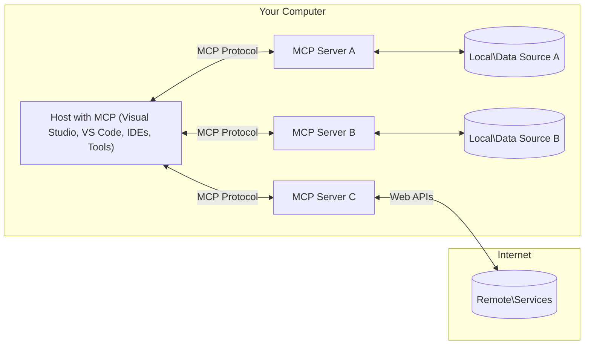

<!--
CO_OP_TRANSLATOR_METADATA:
{
  "original_hash": "88b863a69b4f18b15e82da358ffd3489",
  "translation_date": "2025-08-21T13:19:06+00:00",
  "source_file": "01-CoreConcepts/README.md",
  "language_code": "no"
}
-->
# MCP Kjernekonsepter: Mestre Model Context Protocol for AI-integrasjon

[](https://youtu.be/earDzWGtE84)

_(Klikk på bildet over for å se videoen til denne leksjonen)_

[Model Context Protocol (MCP)](https://github.com/modelcontextprotocol) er et kraftig, standardisert rammeverk som optimaliserer kommunikasjonen mellom store språkmodeller (LLMs) og eksterne verktøy, applikasjoner og datakilder. 
Denne veiledningen tar deg gjennom de grunnleggende konseptene i MCP. Du vil lære om dens klient-server-arkitektur, essensielle komponenter, kommunikasjonsmekanismer og beste praksis for implementering.

- **Eksplisitt brukeraksept**: All tilgang til data og operasjoner krever eksplisitt godkjenning fra brukeren før utførelse. Brukerne må tydelig forstå hvilke data som vil bli brukt og hvilke handlinger som vil bli utført, med detaljert kontroll over tillatelser og autorisasjoner.

- **Beskyttelse av personvern**: Brukerdata eksponeres kun med eksplisitt samtykke og må beskyttes av robuste tilgangskontroller gjennom hele interaksjonsforløpet. Implementasjoner må forhindre uautorisert dataoverføring og opprettholde strenge personvernbegrensninger.

- **Sikkerhet ved verktøyutførelse**: Hver gang et verktøy brukes, kreves eksplisitt brukeraksept med en klar forståelse av verktøyets funksjonalitet, parametere og potensielle konsekvenser. Robuste sikkerhetsgrenser må forhindre utilsiktet, usikker eller ondsinnet bruk av verktøy.

- **Transportlagssikkerhet**: Alle kommunikasjonskanaler bør bruke passende kryptering og autentiseringsmekanismer. Eksterne tilkoblinger bør implementere sikre transportprotokoller og riktig håndtering av legitimasjon.

#### Retningslinjer for implementering:

- **Tillatelseshåndtering**: Implementer detaljerte tillatelsessystemer som lar brukere kontrollere hvilke servere, verktøy og ressurser som er tilgjengelige.
- **Autentisering og autorisasjon**: Bruk sikre autentiseringsmetoder (OAuth, API-nøkler) med riktig håndtering og utløp av tokens.  
- **Validering av inndata**: Valider alle parametere og data i henhold til definerte skjemaer for å forhindre injeksjonsangrep.
- **Revisjonslogging**: Oppretthold omfattende logger over alle operasjoner for sikkerhetsovervåking og samsvar.

## Oversikt

Denne leksjonen utforsker den grunnleggende arkitekturen og komponentene som utgjør Model Context Protocol (MCP)-økosystemet. Du vil lære om klient-server-arkitekturen, nøkkelkomponentene og kommunikasjonsmekanismene som driver MCP-interaksjoner.

## Viktige læringsmål

Ved slutten av denne leksjonen vil du:

- Forstå MCPs klient-server-arkitektur.
- Identifisere roller og ansvar for Hosts, Clients og Servers.
- Analysere kjernefunksjonene som gjør MCP til et fleksibelt integrasjonslag.
- Lære hvordan informasjon flyter innenfor MCP-økosystemet.
- Få praktisk innsikt gjennom kodeeksempler i .NET, Java, Python og JavaScript.

## MCP-arkitektur: En dypere titt

MCP-økosystemet er bygget på en klient-server-modell. Denne modulære strukturen gjør det mulig for AI-applikasjoner å samhandle effektivt med verktøy, databaser, API-er og kontekstuelle ressurser. La oss bryte ned denne arkitekturen i dens kjernekomponenter.

I kjernen følger MCP en klient-server-arkitektur der en vertsapplikasjon kan koble til flere servere:



- **MCP Hosts**: Programmer som VSCode, Claude Desktop, IDE-er eller AI-verktøy som ønsker å få tilgang til data via MCP.
- **MCP Clients**: Protokollklienter som opprettholder 1:1-tilkoblinger med servere.
- **MCP Servers**: Lettvektsprogrammer som hver eksponerer spesifikke funksjoner gjennom den standardiserte Model Context Protocol.
- **Lokale datakilder**: Filer, databaser og tjenester på datamaskinen din som MCP-servere kan få sikker tilgang til.
- **Eksterne tjenester**: Systemer tilgjengelige over internett som MCP-servere kan koble til via API-er.

MCP-protokollen er en utviklende standard som bruker dato-basert versjonering (YYYY-MM-DD-format). Den nåværende protokollversjonen er **2025-06-18**. Du kan se de siste oppdateringene til [protokollspesifikasjonen](https://modelcontextprotocol.io/specification/2025-06-18/).

### 1. Hosts

I Model Context Protocol (MCP) er **Hosts** AI-applikasjoner som fungerer som det primære grensesnittet der brukere interagerer med protokollen. Hosts koordinerer og administrerer tilkoblinger til flere MCP-servere ved å opprette dedikerte MCP-klienter for hver servertilkobling. Eksempler på Hosts inkluderer:

- **AI-applikasjoner**: Claude Desktop, Visual Studio Code, Claude Code.
- **Utviklingsmiljøer**: IDE-er og kodeeditorer med MCP-integrasjon.  
- **Egendefinerte applikasjoner**: Spesialbygde AI-agenter og verktøy.

**Hosts** er applikasjoner som koordinerer AI-modellinteraksjoner. De:

- **Orkestrerer AI-modeller**: Utfører eller interagerer med LLM-er for å generere svar og koordinere AI-arbeidsflyter.
- **Administrerer klienttilkoblinger**: Oppretter og vedlikeholder én MCP-klient per MCP-servertilkobling.
- **Kontrollerer brukergrensesnittet**: Håndterer samtaleflyt, brukerinteraksjoner og presentasjon av svar.  
- **Håndhever sikkerhet**: Kontrollerer tillatelser, sikkerhetsbegrensninger og autentisering.
- **Håndterer brukeraksept**: Administrerer brukerens godkjenning for datadeling og verktøyutførelse.

### 2. Clients

**Clients** er essensielle komponenter som opprettholder dedikerte én-til-én-tilkoblinger mellom Hosts og MCP-servere. Hver MCP-klient opprettes av Host for å koble til en spesifikk MCP-server, og sikrer organiserte og sikre kommunikasjonskanaler. Flere klienter gjør det mulig for Hosts å koble til flere servere samtidig.

**Clients** er koblingskomponenter i vertsapplikasjonen. De:

- **Protokollkommunikasjon**: Sender JSON-RPC 2.0-forespørsler til servere med instruksjoner og forespørsler.
- **Forhandlingskapasitet**: Forhandler støttede funksjoner og protokollversjoner med servere under initialisering.
- **Verktøyutførelse**: Administrerer forespørsler om verktøyutførelse fra modeller og behandler svar.
- **Sanntidsoppdateringer**: Håndterer varsler og sanntidsoppdateringer fra servere.
- **Svarbehandling**: Behandler og formaterer serversvar for visning til brukere.

### 3. Servers

**Servers** er programmer som gir kontekst, verktøy og funksjoner til MCP-klienter. De kan kjøre lokalt (på samme maskin som Host) eller eksternt (på eksterne plattformer), og er ansvarlige for å håndtere klientforespørsler og gi strukturerte svar. Servere eksponerer spesifikke funksjoner gjennom den standardiserte Model Context Protocol.

**Servers** er tjenester som gir kontekst og funksjonalitet. De:

- **Funksjonsregistrering**: Registrerer og eksponerer tilgjengelige primitive funksjoner (ressurser, forespørsler, verktøy) til klienter.
- **Forespørselsbehandling**: Mottar og utfører verktøyanrop, ressursforespørsler og forespørsler fra klienter.
- **Kontekstlevering**: Gir kontekstuell informasjon og data for å forbedre modellens svar.
- **Tilstandshåndtering**: Opprettholder sesjonstilstand og håndterer tilstandsbaserte interaksjoner når det er nødvendig.
- **Sanntidsvarsler**: Sender varsler om endringer og oppdateringer av funksjoner til tilkoblede klienter.

Servere kan utvikles av hvem som helst for å utvide modellens funksjoner med spesialisert funksjonalitet, og de støtter både lokale og eksterne distribusjonsscenarier.

### 4. Serverprimitiver

Servere i Model Context Protocol (MCP) tilbyr tre kjerne**primitiver** som definerer de grunnleggende byggeklossene for rike interaksjoner mellom klienter, Hosts og språkmodeller. Disse primitivene spesifiserer typene kontekstuell informasjon og handlinger som er tilgjengelige gjennom protokollen.

MCP-servere kan eksponere en hvilken som helst kombinasjon av følgende tre kjerneprimitiver:

#### Ressurser

**Ressurser** er datakilder som gir kontekstuell informasjon til AI-applikasjoner. De representerer statisk eller dynamisk innhold som kan forbedre modellens forståelse og beslutningstaking:

- **Kontekstuelle data**: Strukturert informasjon og kontekst for AI-modellens bruk.
- **Kunnskapsbaser**: Dokumentarkiver, artikler, manualer og forskningsartikler.
- **Lokale datakilder**: Filer, databaser og lokal systeminformasjon.  
- **Eksterne data**: API-responser, webtjenester og data fra eksterne systemer.
- **Dynamisk innhold**: Sanntidsdata som oppdateres basert på eksterne forhold.

Ressurser identifiseres med URI-er og støtter oppdagelse gjennom `resources/list` og henting gjennom `resources/read`-metoder:

```text
file://documents/project-spec.md
database://production/users/schema
api://weather/current
```

#### Forespørsler

**Forespørsler** er gjenbrukbare maler som hjelper til med å strukturere interaksjoner med språkmodeller. De gir standardiserte interaksjonsmønstre og malbaserte arbeidsflyter:

- **Malbaserte interaksjoner**: Forhåndsstrukturerte meldinger og samtalestartere.
- **Arbeidsflytmønstre**: Standardiserte sekvenser for vanlige oppgaver og interaksjoner.
- **Few-shot-eksempler**: Eksempelbaserte maler for modellinstruksjon.
- **Systemforespørsler**: Grunnleggende forespørsler som definerer modellens oppførsel og kontekst.
- **Dynamiske maler**: Parameteriserte forespørsler som tilpasses spesifikke kontekster.

Forespørsler støtter variabel substitusjon og kan oppdages via `prompts/list` og hentes med `prompts/get`:

```markdown
Generate a {{task_type}} for {{product}} targeting {{audience}} with the following requirements: {{requirements}}
```

#### Verktøy

**Verktøy** er kjørbare funksjoner som AI-modeller kan påkalle for å utføre spesifikke handlinger. De representerer "verbene" i MCP-økosystemet, som gjør det mulig for modeller å samhandle med eksterne systemer:

- **Kjørbare funksjoner**: Diskrete operasjoner som modeller kan påkalle med spesifikke parametere.
- **Integrasjon med eksterne systemer**: API-anrop, databaseforespørsler, filoperasjoner, beregninger.
- **Unik identitet**: Hvert verktøy har et unikt navn, beskrivelse og parameterskjema.
- **Strukturert I/O**: Verktøy aksepterer validerte parametere og returnerer strukturerte, typede svar.
- **Handlingskapasitet**: Gjør det mulig for modeller å utføre reelle handlinger og hente sanntidsdata.

Verktøy defineres med JSON Schema for parametervalidation og oppdages gjennom `tools/list` og utføres via `tools/call`:

```typescript
server.tool(
  "search_products", 
  {
    query: z.string().describe("Search query for products"),
    category: z.string().optional().describe("Product category filter"),
    max_results: z.number().default(10).describe("Maximum results to return")
  }, 
  async (params) => {
    // Execute search and return structured results
    return await productService.search(params);
  }
);
```

## Klientprimitiver

I Model Context Protocol (MCP) kan **klienter** eksponere primitivere som gjør det mulig for servere å be om ytterligere funksjoner fra vertsapplikasjonen. Disse klientbaserte primitivene muliggjør rikere, mer interaktive serverimplementasjoner som kan få tilgang til AI-modellens funksjoner og brukerinteraksjoner.

### Sampling

**Sampling** lar servere be om språkmodellfullføringer fra klientens AI-applikasjon. Denne primitivet gjør det mulig for servere å få tilgang til LLM-funksjoner uten å inkludere egne modellavhengigheter:

- **Modelluavhengig tilgang**: Servere kan be om fullføringer uten å inkludere LLM-SDK-er eller administrere modelltilgang.
- **Server-initiert AI**: Gjør det mulig for servere å autonomt generere innhold ved hjelp av klientens AI-modell.
- **Rekursive LLM-interaksjoner**: Støtter komplekse scenarier der servere trenger AI-assistanse for behandling.
- **Dynamisk innholdsgenerering**: Lar servere lage kontekstuelle svar ved hjelp av vertens modell.

Sampling initieres gjennom `sampling/complete`-metoden, der servere sender forespørsler om fullføring til klienter.

### Elicitation  

**Elicitation** gjør det mulig for servere å be om tilleggsinformasjon eller bekreftelse fra brukere gjennom klientgrensesnittet:

- **Brukerinformasjonsforespørsler**: Servere kan be om tilleggsinformasjon når det trengs for verktøyutførelse.
- **Bekreftelsesdialoger**: Be om brukerens godkjenning for sensitive eller viktige operasjoner.
- **Interaktive arbeidsflyter**: Gjør det mulig for servere å lage trinnvise brukerinteraksjoner.
- **Dynamisk parameterinnsamling**: Samle inn manglende eller valgfrie parametere under verktøyutførelse.

Elicitation-forespørsler gjøres ved hjelp av `elicitation/request`-metoden for å samle inn brukerdata gjennom klientens grensesnitt.

### Logging

**Logging** lar servere sende strukturerte loggmeldinger til klienter for feilsøking, overvåking og operasjonell synlighet:

- **Feilsøkingsstøtte**: Gjør det mulig for servere å gi detaljerte utførelseslogger for feilsøking.
- **Operasjonell overvåking**: Send statusoppdateringer og ytelsesmetrikker til klienter.
- **Feilrapportering**: Gi detaljert feilkontekst og diagnostisk informasjon.
- **Revisjonsspor**: Opprett omfattende logger over serveroperasjoner og beslutninger.

Loggmeldinger sendes til klienter for å gi innsikt i serveroperasjoner og lette feilsøking.

## Informasjonsflyt i MCP

Model Context Protocol (MCP) definerer en strukturert flyt av informasjon mellom Hosts, Clients, Servers og modeller. Å forstå denne flyten hjelper med å klargjøre hvordan brukerforespørsler behandles og hvordan eksterne verktøy og data integreres i modellsvar.

- **Host initierer tilkobling**  
  Vertsapplikasjonen (som en IDE eller chatgrensesnitt) oppretter en tilkobling til en MCP-server, vanligvis via STDIO, WebSocket eller en annen støttet transport.

- **Forhandling av funksjoner**  
  Klienten (innebygd i verten) og serveren utveksler informasjon om deres støttede funksjoner, verktøy, ressurser og protokollversjoner. Dette sikrer at begge sider forstår hvilke funksjoner som er tilgjengelige for økten.

- **Brukerforespørsel**  
  Brukeren interagerer med verten (f.eks. skriver inn en forespørsel eller kommando). Verten samler inn dette inndataet og sender det til klienten for behandling.

- **Bruk av ressurser eller verktøy**  
  - Klienten kan be om tilleggsinformasjon eller ressurser fra serveren (som filer, databaseoppføringer eller kunnskapsbaseartikler) for å berike modellens forståelse.
  - Hvis modellen bestemmer at et verktøy er nødvendig (f.eks. for å hente data, utføre en beregning eller kalle et API), sender klienten en forespørsel om verktøyutførelse til serveren, med spesifikasjon av verktøyets navn og parametere.

- **Serverutførelse**  
  Serveren mottar ressurs- eller verktøyforespørselen, utfører nødvendige operasjoner (som å kjøre en funksjon, spørre en database eller hente en fil), og returnerer resultatene til klienten i et strukturert format.

- **Generering av svar**  
  Klienten integrerer serverens svar (ressursdata, verktøyutganger osv.) i den pågående modellinteraksjonen. Modellen bruker denne informasjonen til å generere et omfattende og kontekstuelt relevant svar.

- **Presentasjon av resultat**  
  Verten mottar den endelige utgangen fra klienten og presenterer den for brukeren, ofte inkludert både modellens genererte tekst og eventuelle resultater fra verktøyutførelser eller ressursoppslag.

Denne flyten gjør det mulig for MCP å støtte avanserte, interaktive og kontekstbevisste AI-applikasjoner ved sømløst å koble modeller med eksterne verktøy og datakilder.

## Protokollarkitektur og lag

MCP består av to distinkte arkitektoniske lag som samarbeider for å gi et komplett kommunikasjonsrammeverk:

### Datalag
- **JSON-RPC 2.0-protokoll**: All kommunikasjon bruker standardisert JSON-RPC 2.0-meldingsformat for metodekall, svar og varsler  
- **Livssyklusadministrasjon**: Håndterer tilkoblingsinitialisering, kapabilitetsforhandling og sesjonsavslutning mellom klienter og servere  
- **Serverprimitiver**: Gjør det mulig for servere å tilby kjernefunksjonalitet gjennom verktøy, ressurser og maler  
- **Klientprimitiver**: Gjør det mulig for servere å be om prøvetaking fra LLM-er, hente brukerinput og sende loggmeldinger  
- **Varsler i sanntid**: Støtter asynkrone varsler for dynamiske oppdateringer uten polling  

#### Nøkkelfunksjoner:

- **Protokollversjonsforhandling**: Bruker dato-basert versjonering (ÅÅÅÅ-MM-DD) for å sikre kompatibilitet  
- **Kapabilitetsoppdagelse**: Klienter og servere utveksler informasjon om støttede funksjoner under initialisering  
- **Tilstandfulle sesjoner**: Opprettholder tilkoblingstilstand på tvers av flere interaksjoner for kontekstkonsistens  

### Transportlag

**Transportlaget** administrerer kommunikasjonskanaler, meldingsinnramming og autentisering mellom MCP-deltakere:

#### Støttede transportmekanismer:

1. **STDIO-transport**:
   - Bruker standard inn-/utstrømmer for direkte prosesskommunikasjon  
   - Optimalt for lokale prosesser på samme maskin uten nettverksbelastning  
   - Vanlig brukt for lokale MCP-serverimplementasjoner  

2. **Streamable HTTP-transport**:
   - Bruker HTTP POST for meldinger fra klient til server  
   - Valgfri Server-Sent Events (SSE) for strømming fra server til klient  
   - Muliggjør fjernserverkommunikasjon over nettverk  
   - Støtter standard HTTP-autentisering (bearertokens, API-nøkler, egendefinerte overskrifter)  
   - MCP anbefaler OAuth for sikker token-basert autentisering  

#### Transportabstraksjon:

Transportlaget abstraherer kommunikasjonsdetaljer fra datalaget, slik at samme JSON-RPC 2.0-meldingsformat kan brukes på tvers av alle transportmekanismer. Denne abstraksjonen gjør det mulig for applikasjoner å bytte mellom lokale og eksterne servere sømløst.

### Sikkerhetsvurderinger

MCP-implementasjoner må følge flere kritiske sikkerhetsprinsipper for å sikre trygge, pålitelige og sikre interaksjoner på tvers av alle protokolloperasjoner:

- **Brukersamtykke og kontroll**: Brukere må gi eksplisitt samtykke før data blir aksessert eller operasjoner utført. De bør ha klar kontroll over hvilke data som deles og hvilke handlinger som er autorisert, støttet av intuitive brukergrensesnitt for gjennomgang og godkjenning av aktiviteter.  

- **Datapersonvern**: Brukerdata skal kun eksponeres med eksplisitt samtykke og må beskyttes av passende tilgangskontroller. MCP-implementasjoner må sikre seg mot uautorisert datatransmisjon og sørge for at personvernet opprettholdes gjennom alle interaksjoner.  

- **Verktøysikkerhet**: Før et verktøy brukes, kreves eksplisitt brukersamtykke. Brukere bør ha en klar forståelse av hvert verktøys funksjonalitet, og robuste sikkerhetsgrenser må håndheves for å forhindre utilsiktet eller usikker verktøyutførelse.  

Ved å følge disse sikkerhetsprinsippene sikrer MCP at brukertillit, personvern og sikkerhet opprettholdes på tvers av alle protokollinteraksjoner, samtidig som kraftige AI-integrasjoner muliggjøres.

## Kodeeksempler: Nøkkelkomponenter

Nedenfor er kodeeksempler i flere populære programmeringsspråk som illustrerer hvordan man implementerer nøkkelkomponenter og verktøy for MCP-servere.

### .NET-eksempel: Opprette en enkel MCP-server med verktøy

Her er et praktisk .NET-kodeeksempel som demonstrerer hvordan man implementerer en enkel MCP-server med egendefinerte verktøy. Eksemplet viser hvordan man definerer og registrerer verktøy, håndterer forespørsler og kobler serveren ved hjelp av Model Context Protocol.

```csharp
using System;
using System.Threading.Tasks;
using ModelContextProtocol.Server;
using ModelContextProtocol.Server.Transport;
using ModelContextProtocol.Server.Tools;

public class WeatherServer
{
    public static async Task Main(string[] args)
    {
        // Create an MCP server
        var server = new McpServer(
            name: "Weather MCP Server",
            version: "1.0.0"
        );
        
        // Register our custom weather tool
        server.AddTool<string, WeatherData>("weatherTool", 
            description: "Gets current weather for a location",
            execute: async (location) => {
                // Call weather API (simplified)
                var weatherData = await GetWeatherDataAsync(location);
                return weatherData;
            });
        
        // Connect the server using stdio transport
        var transport = new StdioServerTransport();
        await server.ConnectAsync(transport);
        
        Console.WriteLine("Weather MCP Server started");
        
        // Keep the server running until process is terminated
        await Task.Delay(-1);
    }
    
    private static async Task<WeatherData> GetWeatherDataAsync(string location)
    {
        // This would normally call a weather API
        // Simplified for demonstration
        await Task.Delay(100); // Simulate API call
        return new WeatherData { 
            Temperature = 72.5,
            Conditions = "Sunny",
            Location = location
        };
    }
}

public class WeatherData
{
    public double Temperature { get; set; }
    public string Conditions { get; set; }
    public string Location { get; set; }
}
```

### Java-eksempel: MCP-serverkomponenter

Dette eksemplet demonstrerer den samme MCP-serveren og verktøyregistreringen som .NET-eksemplet ovenfor, men implementert i Java.

```java
import io.modelcontextprotocol.server.McpServer;
import io.modelcontextprotocol.server.McpToolDefinition;
import io.modelcontextprotocol.server.transport.StdioServerTransport;
import io.modelcontextprotocol.server.tool.ToolExecutionContext;
import io.modelcontextprotocol.server.tool.ToolResponse;

public class WeatherMcpServer {
    public static void main(String[] args) throws Exception {
        // Create an MCP server
        McpServer server = McpServer.builder()
            .name("Weather MCP Server")
            .version("1.0.0")
            .build();
            
        // Register a weather tool
        server.registerTool(McpToolDefinition.builder("weatherTool")
            .description("Gets current weather for a location")
            .parameter("location", String.class)
            .execute((ToolExecutionContext ctx) -> {
                String location = ctx.getParameter("location", String.class);
                
                // Get weather data (simplified)
                WeatherData data = getWeatherData(location);
                
                // Return formatted response
                return ToolResponse.content(
                    String.format("Temperature: %.1f°F, Conditions: %s, Location: %s", 
                    data.getTemperature(), 
                    data.getConditions(), 
                    data.getLocation())
                );
            })
            .build());
        
        // Connect the server using stdio transport
        try (StdioServerTransport transport = new StdioServerTransport()) {
            server.connect(transport);
            System.out.println("Weather MCP Server started");
            // Keep server running until process is terminated
            Thread.currentThread().join();
        }
    }
    
    private static WeatherData getWeatherData(String location) {
        // Implementation would call a weather API
        // Simplified for example purposes
        return new WeatherData(72.5, "Sunny", location);
    }
}

class WeatherData {
    private double temperature;
    private String conditions;
    private String location;
    
    public WeatherData(double temperature, String conditions, String location) {
        this.temperature = temperature;
        this.conditions = conditions;
        this.location = location;
    }
    
    public double getTemperature() {
        return temperature;
    }
    
    public String getConditions() {
        return conditions;
    }
    
    public String getLocation() {
        return location;
    }
}
```

### Python-eksempel: Bygge en MCP-server

I dette eksemplet viser vi hvordan man bygger en MCP-server i Python. Du får også se to forskjellige måter å opprette verktøy på.

```python
#!/usr/bin/env python3
import asyncio
from mcp.server.fastmcp import FastMCP
from mcp.server.transports.stdio import serve_stdio

# Create a FastMCP server
mcp = FastMCP(
    name="Weather MCP Server",
    version="1.0.0"
)

@mcp.tool()
def get_weather(location: str) -> dict:
    """Gets current weather for a location."""
    # This would normally call a weather API
    # Simplified for demonstration
    return {
        "temperature": 72.5,
        "conditions": "Sunny",
        "location": location
    }

# Alternative approach using a class
class WeatherTools:
    @mcp.tool()
    def forecast(self, location: str, days: int = 1) -> dict:
        """Gets weather forecast for a location for the specified number of days."""
        # This would normally call a weather API forecast endpoint
        # Simplified for demonstration
        return {
            "location": location,
            "forecast": [
                {"day": i+1, "temperature": 70 + i, "conditions": "Partly Cloudy"}
                for i in range(days)
            ]
        }

# Instantiate the class to register its tools
weather_tools = WeatherTools()

# Start the server using stdio transport
if __name__ == "__main__":
    asyncio.run(serve_stdio(mcp))
```

### JavaScript-eksempel: Opprette en MCP-server

Dette eksemplet viser opprettelse av MCP-server i JavaScript og hvordan man registrerer to værrelaterte verktøy.

```javascript
// Using the official Model Context Protocol SDK
import { McpServer } from "@modelcontextprotocol/sdk/server/mcp.js";
import { StdioServerTransport } from "@modelcontextprotocol/sdk/server/stdio.js";
import { z } from "zod"; // For parameter validation

// Create an MCP server
const server = new McpServer({
  name: "Weather MCP Server",
  version: "1.0.0"
});

// Define a weather tool
server.tool(
  "weatherTool",
  {
    location: z.string().describe("The location to get weather for")
  },
  async ({ location }) => {
    // This would normally call a weather API
    // Simplified for demonstration
    const weatherData = await getWeatherData(location);
    
    return {
      content: [
        { 
          type: "text", 
          text: `Temperature: ${weatherData.temperature}°F, Conditions: ${weatherData.conditions}, Location: ${weatherData.location}` 
        }
      ]
    };
  }
);

// Define a forecast tool
server.tool(
  "forecastTool",
  {
    location: z.string(),
    days: z.number().default(3).describe("Number of days for forecast")
  },
  async ({ location, days }) => {
    // This would normally call a weather API
    // Simplified for demonstration
    const forecast = await getForecastData(location, days);
    
    return {
      content: [
        { 
          type: "text", 
          text: `${days}-day forecast for ${location}: ${JSON.stringify(forecast)}` 
        }
      ]
    };
  }
);

// Helper functions
async function getWeatherData(location) {
  // Simulate API call
  return {
    temperature: 72.5,
    conditions: "Sunny",
    location: location
  };
}

async function getForecastData(location, days) {
  // Simulate API call
  return Array.from({ length: days }, (_, i) => ({
    day: i + 1,
    temperature: 70 + Math.floor(Math.random() * 10),
    conditions: i % 2 === 0 ? "Sunny" : "Partly Cloudy"
  }));
}

// Connect the server using stdio transport
const transport = new StdioServerTransport();
server.connect(transport).catch(console.error);

console.log("Weather MCP Server started");
```

Dette JavaScript-eksemplet demonstrerer hvordan man oppretter en MCP-klient som kobler til en server, sender en prompt og behandler svaret, inkludert eventuelle verktøykall som ble gjort.

## Sikkerhet og autorisasjon

MCP inkluderer flere innebygde konsepter og mekanismer for å administrere sikkerhet og autorisasjon gjennom hele protokollen:

1. **Verktøytillatelseskontroll**:  
   Klienter kan spesifisere hvilke verktøy en modell har lov til å bruke under en sesjon. Dette sikrer at kun eksplisitt autoriserte verktøy er tilgjengelige, og reduserer risikoen for utilsiktede eller usikre operasjoner. Tillatelser kan konfigureres dynamisk basert på brukerpreferanser, organisasjonspolicyer eller interaksjonskontekst.  

2. **Autentisering**:  
   Servere kan kreve autentisering før tilgang til verktøy, ressurser eller sensitive operasjoner gis. Dette kan innebære API-nøkler, OAuth-tokens eller andre autentiseringsordninger. Riktig autentisering sikrer at kun betrodde klienter og brukere kan påkalle serverfunksjoner.  

3. **Validering**:  
   Parametervalidering håndheves for alle verktøykall. Hvert verktøy definerer forventede typer, formater og begrensninger for sine parametere, og serveren validerer innkommende forespørsler deretter. Dette forhindrer feilformet eller ondsinnet input fra å nå verktøyimplementasjoner og bidrar til å opprettholde integriteten til operasjoner.  

4. **Ratebegrensning**:  
   For å forhindre misbruk og sikre rettferdig bruk av serverressurser kan MCP-servere implementere ratebegrensning for verktøykall og ressursaksess. Ratebegrensninger kan brukes per bruker, per sesjon eller globalt, og bidrar til å beskytte mot tjenestenektangrep eller overdreven ressursforbruk.  

Ved å kombinere disse mekanismene gir MCP et sikkert grunnlag for å integrere språkmodeller med eksterne verktøy og datakilder, samtidig som brukere og utviklere får finjustert kontroll over tilgang og bruk.

## Protokollmeldinger og kommunikasjonsflyt

MCP-kommunikasjon bruker strukturerte **JSON-RPC 2.0**-meldinger for å legge til rette for klare og pålitelige interaksjoner mellom verter, klienter og servere. Protokollen definerer spesifikke meldingsmønstre for ulike typer operasjoner:

### Kjernemeldingstyper:

#### **Initialiseringsmeldinger**
- **`initialize`-forespørsel**: Etablerer tilkobling og forhandler protokollversjon og kapabiliteter  
- **`initialize`-svar**: Bekrefter støttede funksjoner og serverinformasjon  
- **`notifications/initialized`**: Signalerer at initialisering er fullført og sesjonen er klar  

#### **Oppdagelsesmeldinger**
- **`tools/list`-forespørsel**: Oppdager tilgjengelige verktøy fra serveren  
- **`resources/list`-forespørsel**: Lister tilgjengelige ressurser (datakilder)  
- **`prompts/list`-forespørsel**: Henter tilgjengelige maler for prompt  

#### **Utførelsesmeldinger**  
- **`tools/call`-forespørsel**: Utfører et spesifikt verktøy med angitte parametere  
- **`resources/read`-forespørsel**: Henter innhold fra en spesifikk ressurs  
- **`prompts/get`-forespørsel**: Henter en mal for prompt med valgfrie parametere  

#### **Klientmeldinger**
- **`sampling/complete`-forespørsel**: Serveren ber om LLM-fullføring fra klienten  
- **`elicitation/request`**: Serveren ber om brukerinput via klientgrensesnittet  
- **Loggmeldinger**: Serveren sender strukturerte loggmeldinger til klienten  

#### **Varslingsmeldinger**
- **`notifications/tools/list_changed`**: Serveren varsler klienten om endringer i verktøy  
- **`notifications/resources/list_changed`**: Serveren varsler klienten om endringer i ressurser  
- **`notifications/prompts/list_changed`**: Serveren varsler klienten om endringer i maler  

### Meldingsstruktur:

Alle MCP-meldinger følger JSON-RPC 2.0-format med:  
- **Forespørselsmeldinger**: Inkluderer `id`, `method` og valgfrie `params`  
- **Svarmeldinger**: Inkluderer `id` og enten `result` eller `error`  
- **Varslingsmeldinger**: Inkluderer `method` og valgfrie `params` (ingen `id` eller svar forventet)  

Denne strukturerte kommunikasjonen sikrer pålitelige, sporbare og utvidbare interaksjoner som støtter avanserte scenarier som sanntidsoppdateringer, verktøykjeding og robust feilhåndtering.

## Viktige punkter

- **Arkitektur**: MCP bruker en klient-server-arkitektur der verter administrerer flere klienttilkoblinger til servere  
- **Deltakere**: Økosystemet inkluderer verter (AI-applikasjoner), klienter (protokollkoblinger) og servere (kapabilitetsleverandører)  
- **Transportmekanismer**: Kommunikasjon støtter STDIO (lokal) og Streamable HTTP med valgfri SSE (fjern)  
- **Kjerneprimitiver**: Servere eksponerer verktøy (utførbare funksjoner), ressurser (datakilder) og maler (templates)  
- **Klientprimitiver**: Servere kan be om prøvetaking (LLM-fullføringer), innhenting (brukerinput) og logging fra klienter  
- **Protokollgrunnlag**: Bygget på JSON-RPC 2.0 med dato-basert versjonering (nåværende: 2025-06-18)  
- **Sanntidsfunksjoner**: Støtter varsler for dynamiske oppdateringer og sanntidssynkronisering  
- **Sikkerhet først**: Eksplisitt brukersamtykke, beskyttelse av personvern og sikker transport er kjernekrav  

## Oppgave

Design et enkelt MCP-verktøy som ville være nyttig i ditt fagområde. Definer:  
1. Hva verktøyet skal hete  
2. Hvilke parametere det skal akseptere  
3. Hvilket output det skal returnere  
4. Hvordan en modell kan bruke dette verktøyet for å løse brukerproblemer  

---

## Hva skjer videre

Neste: [Kapittel 2: Sikkerhet](../02-Security/README.md)  

**Ansvarsfraskrivelse**:  
Dette dokumentet er oversatt ved hjelp av AI-oversettelsestjenesten [Co-op Translator](https://github.com/Azure/co-op-translator). Selv om vi tilstreber nøyaktighet, vennligst vær oppmerksom på at automatiske oversettelser kan inneholde feil eller unøyaktigheter. Det originale dokumentet på sitt opprinnelige språk bør anses som den autoritative kilden. For kritisk informasjon anbefales profesjonell menneskelig oversettelse. Vi er ikke ansvarlige for eventuelle misforståelser eller feiltolkninger som oppstår ved bruk av denne oversettelsen.