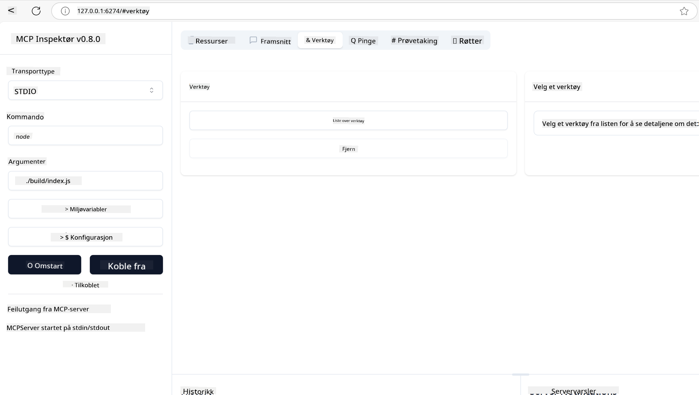
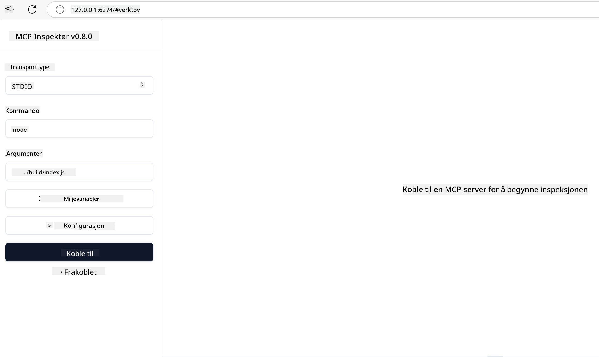

<!--
CO_OP_TRANSLATOR_METADATA:
{
  "original_hash": "5331ffd328a54b90f76706c52b673e27",
  "translation_date": "2025-05-17T08:41:04+00:00",
  "source_file": "03-GettingStarted/01-first-server/README.md",
  "language_code": "no"
}
-->
# Komme i gang med MCP

Velkommen til dine første steg med Model Context Protocol (MCP)! Enten du er ny til MCP eller ønsker å fordype deg mer, vil denne veiledningen lede deg gjennom den essensielle oppsett- og utviklingsprosessen. Du vil oppdage hvordan MCP muliggjør sømløs integrasjon mellom AI-modeller og applikasjoner, og lære hvordan du raskt får miljøet ditt klart for å bygge og teste MCP-baserte løsninger.

> TLDR; Hvis du bygger AI-apper, vet du at du kan legge til verktøy og andre ressurser til din LLM (stor språkmodell) for å gjøre LLM mer kunnskapsrik. Men hvis du plasserer disse verktøyene og ressursene på en server, kan appen og serverens funksjoner brukes av enhver klient med/uten en LLM.

## Oversikt

Denne leksjonen gir praktisk veiledning om oppsett av MCP-miljøer og bygging av dine første MCP-applikasjoner. Du vil lære hvordan du setter opp nødvendige verktøy og rammeverk, bygger grunnleggende MCP-servere, lager vertsapplikasjoner og tester implementeringene dine.

Model Context Protocol (MCP) er en åpen protokoll som standardiserer hvordan applikasjoner gir kontekst til LLM-er. Tenk på MCP som en USB-C-port for AI-applikasjoner - den gir en standardisert måte å koble AI-modeller til ulike datakilder og verktøy.

## Læringsmål

Ved slutten av denne leksjonen vil du kunne:

- Sette opp utviklingsmiljøer for MCP i C#, Java, Python, TypeScript og JavaScript
- Bygge og distribuere grunnleggende MCP-servere med egendefinerte funksjoner (ressurser, oppfordringer og verktøy)
- Lage vertsapplikasjoner som kobler til MCP-servere
- Teste og feilsøke MCP-implementeringer

## Sette opp ditt MCP-miljø

Før du begynner å arbeide med MCP, er det viktig å forberede utviklingsmiljøet ditt og forstå den grunnleggende arbeidsflyten. Denne delen vil veilede deg gjennom de innledende oppsettstrinnene for å sikre en smidig start med MCP.

### Forutsetninger

Før du dykker inn i MCP-utvikling, sørg for at du har:

- **Utviklingsmiljø**: For ditt valgte språk (C#, Java, Python, TypeScript eller JavaScript)
- **IDE/Editor**: Visual Studio, Visual Studio Code, IntelliJ, Eclipse, PyCharm eller en moderne kodeeditor
- **Pakkeadministratorer**: NuGet, Maven/Gradle, pip eller npm/yarn
- **API-nøkler**: For alle AI-tjenester du planlegger å bruke i dine vertsapplikasjoner

## Grunnleggende MCP-serverstruktur

En MCP-server inkluderer vanligvis:

- **Serverkonfigurasjon**: Oppsett av port, autentisering og andre innstillinger
- **Ressurser**: Data og kontekst tilgjengelig for LLM-er
- **Verktøy**: Funksjonalitet som modeller kan bruke
- **Oppfordringer**: Maler for generering eller strukturering av tekst

Her er et forenklet eksempel i TypeScript:

```typescript
import { Server, Tool, Resource } from "@modelcontextprotocol/typescript-server-sdk";

// Create a new MCP server
const server = new Server({
  port: 3000,
  name: "Example MCP Server",
  version: "1.0.0"
});

// Register a tool
server.registerTool({
  name: "calculator",
  description: "Performs basic calculations",
  parameters: {
    expression: {
      type: "string",
      description: "The math expression to evaluate"
    }
  },
  handler: async (params) => {
    const result = eval(params.expression);
    return { result };
  }
});

// Start the server
server.start();
```

I den foregående koden:

- Importerer vi de nødvendige klassene fra MCP TypeScript SDK.
- Oppretter og konfigurerer vi en ny MCP-serverinstans.
- Registrerer vi et egendefinert verktøy (`calculator`) med en håndteringsfunksjon.
- Starter vi serveren for å lytte etter innkommende MCP-forespørsler.

## Testing og Feilsøking

Før du begynner å teste MCP-serveren din, er det viktig å forstå de tilgjengelige verktøyene og beste praksisene for feilsøking. Effektiv testing sikrer at serveren din oppfører seg som forventet og hjelper deg med å raskt identifisere og løse problemer. Den følgende delen skisserer anbefalte tilnærminger for å validere MCP-implementeringen din.

MCP gir verktøy for å hjelpe deg med å teste og feilsøke serverne dine:

- **Inspector-verktøy**, denne grafiske grensesnittet lar deg koble til serveren din og teste verktøyene, oppfordringene og ressursene.
- **curl**, du kan også koble til serveren din ved å bruke et kommandolinjeverktøy som curl eller andre klienter som kan lage og kjøre HTTP-kommandoer.

### Bruke MCP Inspector

[MCP Inspector](https://github.com/modelcontextprotocol/inspector) er et visuelt testverktøy som hjelper deg med:

1. **Oppdage Serverkapasiteter**: Automatisk deteksjon av tilgjengelige ressurser, verktøy og oppfordringer
2. **Teste Verktøyutførelse**: Prøv forskjellige parametere og se svarene i sanntid
3. **Vis Servermetadata**: Undersøk serverinfo, skjemaer og konfigurasjoner

```bash
# ex TypeScript, installing and running MCP Inspector
npx @modelcontextprotocol/inspector node build/index.js
```

Når du kjører kommandoene ovenfor, vil MCP Inspector starte et lokalt webgrensesnitt i nettleseren din. Du kan forvente å se et dashbord som viser dine registrerte MCP-servere, deres tilgjengelige verktøy, ressurser og oppfordringer. Grensesnittet lar deg interaktivt teste verktøyutførelse, inspisere servermetadata og se sanntidsresponser, noe som gjør det enklere å validere og feilsøke MCP-serverimplementeringene dine.

Her er et skjermbilde av hvordan det kan se ut:



## Vanlige oppsettproblemer og løsninger

| Problem | Mulig løsning |
|--------|---------------|
| Tilkobling nektet | Sjekk om serveren kjører og porten er riktig |
| Verktøyutførelsesfeil | Gjennomgå parameter validering og feilbehandling |
| Autentiseringsfeil | Verifiser API-nøkler og tillatelser |
| Skjemavalideringsfeil | Sørg for at parametere samsvarer med det definerte skjemaet |
| Serveren starter ikke | Sjekk for portkonflikter eller manglende avhengigheter |
| CORS-feil | Konfigurer riktige CORS-overskrifter for forespørsler på tvers av opprinnelse |
| Autentiseringsproblemer | Verifiser token gyldighet og tillatelser |

## Lokal Utvikling

For lokal utvikling og testing, kan du kjøre MCP-servere direkte på din maskin:

1. **Start serverprosessen**: Kjør MCP-serverapplikasjonen din 
2. **Konfigurer nettverk**: Sørg for at serveren er tilgjengelig på den forventede porten 
3. **Koble til klienter**: Bruk lokale tilkoblings-URL-er som `http://localhost:3000`

```bash
# Example: Running a TypeScript MCP server locally
npm run start
# Server running at http://localhost:3000
```

## Bygg din første MCP-server

Vi har dekket [Kjernekonsepter](/01-CoreConcepts/README.md) i en tidligere leksjon, nå er det på tide å sette den kunnskapen i arbeid.

### Hva en server kan gjøre

Før vi begynner å skrive kode, la oss bare minne oss selv på hva en server kan gjøre:

En MCP-server kan for eksempel:

- Få tilgang til lokale filer og databaser
- Koble til eksterne API-er
- Utføre beregninger
- Integrere med andre verktøy og tjenester
- Gi et brukergrensesnitt for interaksjon

Flott, nå som vi vet hva vi kan gjøre for det, la oss begynne å kode.

## Øvelse: Lage en server

For å lage en server, må du følge disse trinnene:

- Installer MCP SDK.
- Lag et prosjekt og sett opp prosjektstrukturen.
- Skriv serverkoden.
- Test serveren.

### -1- Installer SDK

Dette varierer litt avhengig av ditt valgte runtime, så velg en av runtime-ene nedenfor:

Generativ AI kan generere tekst, bilder, og til og med kode.
Du er trent på data opp til oktober 2023.

### -2- Lag prosjekt

Nå som du har installert SDK-en din, la oss lage et prosjekt:

### -3- Lag prosjektfiler

### -4- Lag serverkode

### -5- Legge til et verktøy og en ressurs

Legg til et verktøy og en ressurs ved å legge til følgende kode:

### -6- Siste kode

La oss legge til den siste koden vi trenger slik at serveren kan starte:

### -7- Test serveren

Start serveren med følgende kommando:

### -8- Kjør ved hjelp av inspector

Inspector er et flott verktøy som kan starte opp serveren din og lar deg interagere med den slik at du kan teste at den fungerer. La oss starte den:

> [!NOTE]
> det kan se annerledes ut i "kommando"-feltet da det inneholder kommandoen for å kjøre en server med din spesifikke runtime.

Du bør se følgende brukergrensesnitt:



1. Koble til serveren ved å velge Connect-knappen 
  Når du har koblet til serveren, bør du nå se følgende:

  

1. Velg "Tools" og "listTools", du bør se "Add" dukke opp, velg "Add" og fyll inn parameterverdiene.

  Du bør se følgende respons, altså et resultat fra "add"-verktøyet:

  

Gratulerer, du har klart å lage og kjøre din første server!

### Offisielle SDK-er

MCP tilbyr offisielle SDK-er for flere språk:
- [C# SDK](https://github.com/modelcontextprotocol/csharp-sdk) - Vedlikeholdt i samarbeid med Microsoft
- [Java SDK](https://github.com/modelcontextprotocol/java-sdk) - Vedlikeholdt i samarbeid med Spring AI
- [TypeScript SDK](https://github.com/modelcontextprotocol/typescript-sdk) - Den offisielle TypeScript-implementasjonen
- [Python SDK](https://github.com/modelcontextprotocol/python-sdk) - Den offisielle Python-implementasjonen
- [Kotlin SDK](https://github.com/modelcontextprotocol/kotlin-sdk) - Den offisielle Kotlin-implementasjonen
- [Swift SDK](https://github.com/modelcontextprotocol/swift-sdk) - Vedlikeholdt i samarbeid med Loopwork AI
- [Rust SDK](https://github.com/modelcontextprotocol/rust-sdk) - Den offisielle Rust-implementasjonen

## Viktige Poeng

- Oppsett av et MCP-utviklingsmiljø er enkelt med språkspesifikke SDK-er
- Bygging av MCP-servere innebærer å lage og registrere verktøy med klare skjemaer
- Testing og feilsøking er essensielle for pålitelige MCP-implementeringer

## Eksempler

- [Java Kalkulator](../samples/java/calculator/README.md)
- [.Net Kalkulator](../../../../03-GettingStarted/samples/csharp)
- [JavaScript Kalkulator](../samples/javascript/README.md)
- [TypeScript Kalkulator](../samples/typescript/README.md)
- [Python Kalkulator](../../../../03-GettingStarted/samples/python)

## Oppgave

Lag en enkel MCP-server med et verktøy du velger:
1. Implementer verktøyet i ditt foretrukne språk (.NET, Java, Python eller JavaScript).
2. Definer inngangsparametere og returverdier.
3. Kjør inspector-verktøyet for å sikre at serveren fungerer som tiltenkt.
4. Test implementeringen med ulike innganger.

## Løsning

[Løsning](./solution/README.md)

## Ekstra Ressurser

- [MCP GitHub Repository](https://github.com/microsoft/mcp-for-beginners)

## Hva er neste

Neste: [Komme i gang med MCP-klienter](/03-GettingStarted/02-client/README.md)

**Ansvarsfraskrivelse**:  
Dette dokumentet er oversatt ved hjelp av AI-oversettelsestjenesten [Co-op Translator](https://github.com/Azure/co-op-translator). Selv om vi tilstreber nøyaktighet, vær oppmerksom på at automatiserte oversettelser kan inneholde feil eller unøyaktigheter. Det originale dokumentet på sitt opprinnelige språk bør betraktes som den autoritative kilden. For kritisk informasjon anbefales profesjonell menneskelig oversettelse. Vi er ikke ansvarlige for misforståelser eller feiltolkninger som oppstår ved bruk av denne oversettelsen.