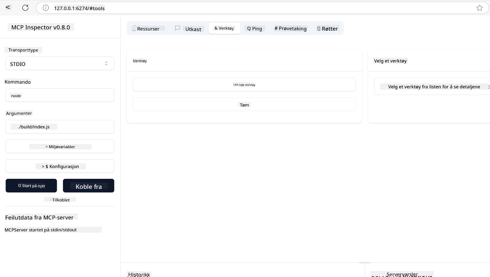
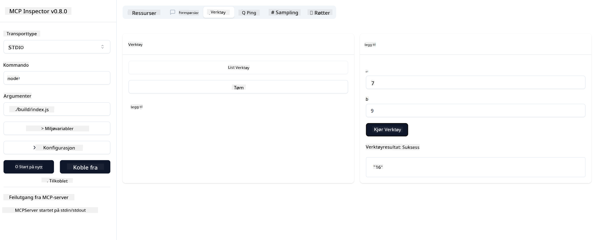

<!--
CO_OP_TRANSLATOR_METADATA:
{
  "original_hash": "37563349cd6894fe00489bf3b4d488ae",
  "translation_date": "2025-06-02T10:36:52+00:00",
  "source_file": "03-GettingStarted/01-first-server/README.md",
  "language_code": "no"
}
-->
### -2- Opprett prosjekt

Nå som du har installert SDK-en, la oss opprette et prosjekt neste steg:

### -3- Opprett prosjektfiler

### -4- Lag serverkode

### -5- Legge til et verktøy og en ressurs

Legg til et verktøy og en ressurs ved å legge til følgende kode:

### -6- Fullstendig kode

La oss legge til den siste koden vi trenger slik at serveren kan starte:

### -7- Test serveren

Start serveren med følgende kommando:

### -8- Kjør med inspector

Inspector er et flott verktøy som kan starte serveren din og lar deg samhandle med den slik at du kan teste at den fungerer. La oss starte den:

> [!NOTE]
> Det kan se annerledes ut i "command"-feltet siden det inneholder kommandoen for å kjøre en server med ditt spesifikke runtime/

Du skal nå se følgende brukergrensesnitt:

1. Koble til serveren ved å velge Connect-knappen  
   Når du kobler til serveren, skal du nå se følgende:

   

2. Velg "Tools" og "listTools", du skal se "Add" dukke opp, velg "Add" og fyll inn parameterverdiene.

   Du skal se følgende svar, altså et resultat fra "add"-verktøyet:

   

Gratulerer, du har klart å lage og kjøre din første server!

### Offisielle SDK-er

MCP tilbyr offisielle SDK-er for flere språk:
- [C# SDK](https://github.com/modelcontextprotocol/csharp-sdk) - Vedlikeholdt i samarbeid med Microsoft
- [Java SDK](https://github.com/modelcontextprotocol/java-sdk) - Vedlikeholdt i samarbeid med Spring AI
- [TypeScript SDK](https://github.com/modelcontextprotocol/typescript-sdk) - Den offisielle TypeScript-implementasjonen
- [Python SDK](https://github.com/modelcontextprotocol/python-sdk) - Den offisielle Python-implementasjonen
- [Kotlin SDK](https://github.com/modelcontextprotocol/kotlin-sdk) - Den offisielle Kotlin-implementasjonen
- [Swift SDK](https://github.com/modelcontextprotocol/swift-sdk) - Vedlikeholdt i samarbeid med Loopwork AI
- [Rust SDK](https://github.com/modelcontextprotocol/rust-sdk) - Den offisielle Rust-implementasjonen

## Viktige punkter

- Oppsett av MCP-utviklingsmiljø er enkelt med språkspesifikke SDK-er
- Å bygge MCP-servere innebærer å lage og registrere verktøy med klare skjemaer
- Testing og feilsøking er essensielt for pålitelige MCP-implementasjoner

## Eksempler

- [Java Calculator](../samples/java/calculator/README.md)
- [.Net Calculator](../../../../03-GettingStarted/samples/csharp)
- [JavaScript Calculator](../samples/javascript/README.md)
- [TypeScript Calculator](../samples/typescript/README.md)
- [Python Calculator](../../../../03-GettingStarted/samples/python)

## Oppgave

Lag en enkel MCP-server med et verktøy etter eget valg:  
1. Implementer verktøyet i ditt foretrukne språk (.NET, Java, Python eller JavaScript).  
2. Definer inputparametere og returverdier.  
3. Kjør inspector-verktøyet for å sikre at serveren fungerer som forventet.  
4. Test implementeringen med ulike inputverdier.

## Løsning

[Løsning](./solution/README.md)

## Tilleggsressurser

- [MCP GitHub Repository](https://github.com/microsoft/mcp-for-beginners)

## Hva nå

Neste: [Getting Started with MCP Clients](/03-GettingStarted/02-client/README.md)

**Ansvarsfraskrivelse**:  
Dette dokumentet er oversatt ved hjelp av AI-oversettelsestjenesten [Co-op Translator](https://github.com/Azure/co-op-translator). Selv om vi streber etter nøyaktighet, vennligst vær oppmerksom på at automatiserte oversettelser kan inneholde feil eller unøyaktigheter. Det opprinnelige dokumentet på originalspråket skal betraktes som den autoritative kilden. For kritisk informasjon anbefales profesjonell menneskelig oversettelse. Vi er ikke ansvarlige for misforståelser eller feiltolkninger som oppstår ved bruk av denne oversettelsen.