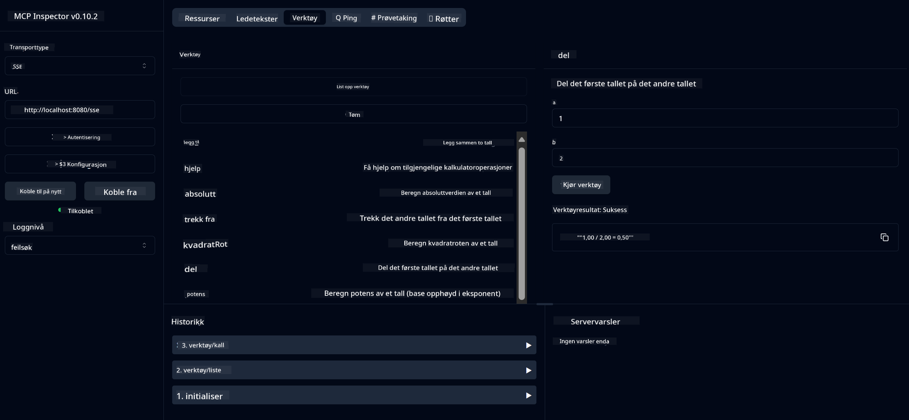

<!--
CO_OP_TRANSLATOR_METADATA:
{
  "original_hash": "ed9cab32cc67c12d8969b407aa47100a",
  "translation_date": "2025-06-11T09:33:41+00:00",
  "source_file": "03-GettingStarted/01-first-server/solution/java/README.md",
  "language_code": "no"
}
-->
# Grunnleggende Kalkulator MCP-tjeneste

Denne tjenesten tilbyr grunnleggende kalkulatoroperasjoner gjennom Model Context Protocol (MCP) ved bruk av Spring Boot med WebFlux-transport. Den er laget som et enkelt eksempel for nybegynnere som lærer om MCP-implementasjoner.

For mer informasjon, se [MCP Server Boot Starter](https://docs.spring.io/spring-ai/reference/api/mcp/mcp-server-boot-starter-docs.html) referansedokumentasjon.


## Bruke tjenesten

Tjenesten eksponerer følgende API-endepunkter gjennom MCP-protokollen:

- `add(a, b)`: Legg sammen to tall
- `subtract(a, b)`: Trekk det andre tallet fra det første
- `multiply(a, b)`: Multipliser to tall
- `divide(a, b)`: Del det første tallet med det andre (med nullsjekk)
- `power(base, exponent)`: Beregn potensen til et tall
- `squareRoot(number)`: Beregn kvadratroten (med sjekk for negative tall)
- `modulus(a, b)`: Beregn resten ved divisjon
- `absolute(number)`: Beregn absoluttverdien

## Avhengigheter

Prosjektet krever følgende nøkkelavhengigheter:

```xml
<dependency>
    <groupId>org.springframework.ai</groupId>
    <artifactId>spring-ai-starter-mcp-server-webflux</artifactId>
</dependency>
```

## Bygge prosjektet

Bygg prosjektet med Maven:
```bash
./mvnw clean install -DskipTests
```

## Kjøre serveren

### Bruke Java

```bash
java -jar target/calculator-server-0.0.1-SNAPSHOT.jar
```

### Bruke MCP Inspector

MCP Inspector er et nyttig verktøy for å samhandle med MCP-tjenester. For å bruke det med denne kalkulatortjenesten:

1. **Installer og kjør MCP Inspector** i et nytt terminalvindu:
   ```bash
   npx @modelcontextprotocol/inspector
   ```

2. **Åpne webgrensesnittet** ved å klikke på URL-en som vises i appen (vanligvis http://localhost:6274)

3. **Konfigurer tilkoblingen**:
   - Sett transporttypen til "SSE"
   - Sett URL-en til SSE-endepunktet til din kjørende server: `http://localhost:8080/sse`
   - Klikk "Connect"

4. **Bruk verktøyene**:
   - Klikk "List Tools" for å se tilgjengelige kalkulatoroperasjoner
   - Velg et verktøy og klikk "Run Tool" for å utføre en operasjon



**Ansvarsfraskrivelse**:  
Dette dokumentet er oversatt ved bruk av AI-oversettelsestjenesten [Co-op Translator](https://github.com/Azure/co-op-translator). Selv om vi streber etter nøyaktighet, vennligst vær oppmerksom på at automatiske oversettelser kan inneholde feil eller unøyaktigheter. Det opprinnelige dokumentet på originalspråket skal anses som den autoritative kilden. For kritisk informasjon anbefales profesjonell menneskelig oversettelse. Vi er ikke ansvarlige for misforståelser eller feiltolkninger som oppstår ved bruk av denne oversettelsen.