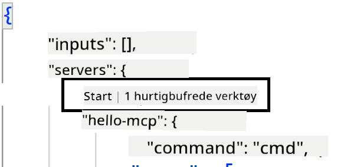

<!--
CO_OP_TRANSLATOR_METADATA:
{
  "original_hash": "c37fabfbc0dcbc9a4afb6d17e7d3be9f",
  "translation_date": "2025-05-17T11:10:14+00:00",
  "source_file": "03-GettingStarted/04-vscode/README.md",
  "language_code": "no"
}
-->
La oss snakke mer om hvordan vi bruker det visuelle grensesnittet i de neste seksjonene.

## Tilnærming

Her er hvordan vi bør nærme oss dette på et overordnet nivå:

- Konfigurer en fil for å finne vår MCP Server.
- Start/tilkoble til nevnte server for å få den til å liste sine kapabiliteter.
- Bruk nevnte kapabiliteter gjennom GitHub Copilots chat-grensesnitt.

Flott, nå som vi forstår flyten, la oss prøve å bruke en MCP Server gjennom Visual Studio Code med en øvelse.

## Øvelse: Konsumere en server

I denne øvelsen vil vi konfigurere Visual Studio Code til å finne din MCP server slik at den kan brukes fra GitHub Copilots chat-grensesnitt.

### -0- Forberedelse, aktiver MCP Server-oppdagelse

Du må kanskje aktivere oppdagelse av MCP Servere.

1. Gå til `File -> Preferences -> Settings` in Visual Studio Code.

1. Search for "MCP" and enable `chat.mcp.discovery.enabled` i settings.json-filen.

### -1- Opprett konfigurasjonsfil

Start med å opprette en konfigurasjonsfil i prosjektets rot, du vil trenge en fil kalt MCP.json og plassere den i en mappe kalt .vscode. Den bør se slik ut:

```text
.vscode
|-- mcp.json
```

La oss se hvordan vi kan legge til en serveroppføring.

### -2- Konfigurer en server

Legg til følgende innhold i *mcp.json*:

```json
{
    "inputs": [],
    "servers": {
       "hello-mcp": {
           "command": "cmd",
           "args": [
               "/c", "node", "<absolute path>\\build\\index.js"
           ]
       }
    }
}
```

Her er et enkelt eksempel på hvordan man starter en server skrevet i Node.js, for andre kjøremiljøer angi riktig kommando for å starte serveren ved å bruke `command` and `args`.

### -3- Start serveren

Nå som du har lagt til en oppføring, la oss starte serveren:

1. Finn oppføringen din i *mcp.json* og sørg for at du finner "play"-ikonet:

    

1. Klikk på "play"-ikonet, du bør se verktøyikonet i GitHub Copilot chat øke antallet tilgjengelige verktøy. Hvis du klikker på nevnte verktøyikon, vil du se en liste over registrerte verktøy. Du kan sjekke/avkrysse hvert verktøy avhengig av om du vil at GitHub Copilot skal bruke dem som kontekst:

  

1. For å kjøre et verktøy, skriv inn en prompt som du vet vil matche beskrivelsen av et av dine verktøy, for eksempel en prompt som "legg til 22 til 1":

  

  Du bør se et svar som sier 23.

## Oppgave

Prøv å legge til en serveroppføring i din *mcp.json* fil og sørg for at du kan starte/stopp serveren. Sørg for at du også kan kommunisere med verktøyene på serveren din via GitHub Copilots chat-grensesnitt.

## Løsning

[Løsning](./solution/README.md)

## Viktige punkter

De viktigste punktene fra dette kapittelet er følgende:

- Visual Studio Code er en flott klient som lar deg konsumere flere MCP Servere og deres verktøy.
- GitHub Copilots chat-grensesnitt er hvordan du interagerer med serverne.
- Du kan be brukeren om input som API-nøkler som kan sendes til MCP Serveren når du konfigurerer serveroppføringen i *mcp.json* filen.

## Eksempler

- [Java Kalkulator](../samples/java/calculator/README.md)
- [.Net Kalkulator](../../../../03-GettingStarted/samples/csharp)
- [JavaScript Kalkulator](../samples/javascript/README.md)
- [TypeScript Kalkulator](../samples/typescript/README.md)
- [Python Kalkulator](../../../../03-GettingStarted/samples/python) 

## Tilleggsressurser

- [Visual Studio dokumentasjon](https://code.visualstudio.com/docs/copilot/chat/mcp-servers)

## Hva er neste

- Neste: [Opprette en SSE Server](/03-GettingStarted/05-sse-server/README.md)

**Ansvarsfraskrivelse**:  
Dette dokumentet har blitt oversatt ved hjelp av AI-oversettelsestjenesten [Co-op Translator](https://github.com/Azure/co-op-translator). Vi bestreber oss på å oppnå nøyaktighet, men vær oppmerksom på at automatiske oversettelser kan inneholde feil eller unøyaktigheter. Det originale dokumentet på dets opprinnelige språk bør betraktes som den autoritative kilden. For kritisk informasjon anbefales profesjonell menneskelig oversettelse. Vi er ikke ansvarlige for misforståelser eller feiltolkninger som oppstår fra bruken av denne oversettelsen.