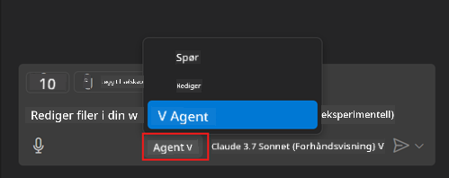
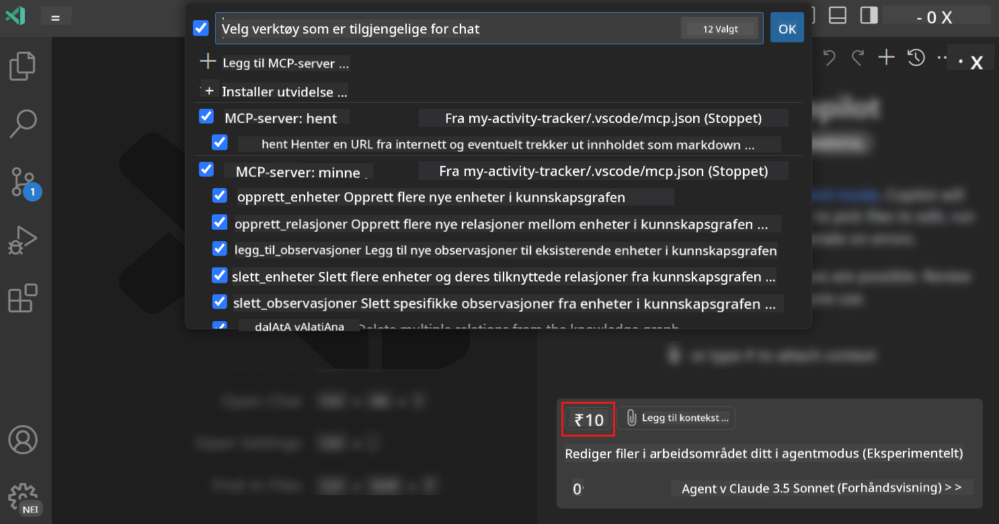
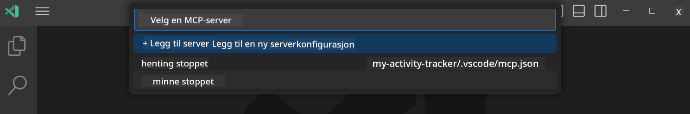
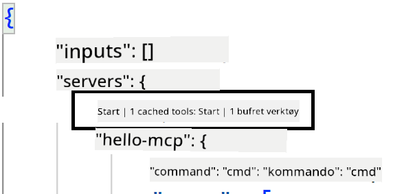
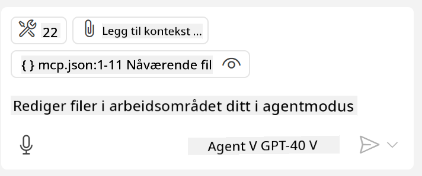
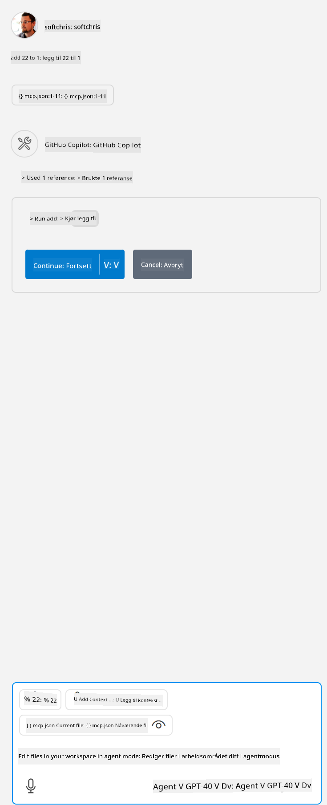

<!--
CO_OP_TRANSLATOR_METADATA:
{
  "original_hash": "d940b5e0af75e3a3a4d1c3179120d1d9",
  "translation_date": "2025-08-26T17:54:21+00:00",
  "source_file": "03-GettingStarted/04-vscode/README.md",
  "language_code": "no"
}
-->
# Bruke en server fra GitHub Copilot Agent-modus

Visual Studio Code og GitHub Copilot kan fungere som en klient og bruke en MCP-server. Hvorfor skulle vi ønske å gjøre det, spør du kanskje? Vel, det betyr at hvilke som helst funksjoner MCP-serveren har, nå kan brukes direkte fra IDE-en din. Tenk deg for eksempel å legge til GitHubs MCP-server – dette vil gjøre det mulig å kontrollere GitHub via naturlige språkkommandoer i stedet for å skrive spesifikke kommandoer i terminalen. Eller forestill deg alt som generelt kan forbedre utvikleropplevelsen din, styrt av naturlig språk. Nå begynner du å se fordelen, ikke sant?

## Oversikt

Denne leksjonen dekker hvordan du bruker Visual Studio Code og GitHub Copilot sin Agent-modus som en klient for MCP-serveren din.

## Læringsmål

Ved slutten av denne leksjonen vil du kunne:

- Bruke en MCP-server via Visual Studio Code.
- Kjøre funksjoner som verktøy via GitHub Copilot.
- Konfigurere Visual Studio Code for å finne og administrere MCP-serveren din.

## Bruk

Du kan kontrollere MCP-serveren din på to forskjellige måter:

- Brukergrensesnitt, du vil se hvordan dette gjøres senere i dette kapittelet.
- Terminal, det er mulig å kontrollere ting fra terminalen ved å bruke `code`-kommandoen:

  For å legge til en MCP-server i brukerprofilen din, bruk --add-mcp-kommandoen og oppgi JSON-serverkonfigurasjonen i formatet {\"name\":\"server-name\",\"command\":...}.

  ```
  code --add-mcp "{\"name\":\"my-server\",\"command\": \"uvx\",\"args\": [\"mcp-server-fetch\"]}"
  ```

### Skjermbilder





La oss snakke mer om hvordan vi bruker det visuelle grensesnittet i de neste seksjonene.

## Tilnærming

Slik bør vi tilnærme oss dette på et overordnet nivå:

- Konfigurer en fil for å finne MCP-serveren vår.
- Start/Koble til serveren for å få den til å liste opp sine funksjoner.
- Bruk disse funksjonene via GitHub Copilot Chat-grensesnittet.

Flott, nå som vi forstår flyten, la oss prøve å bruke en MCP-server gjennom Visual Studio Code i en øvelse.

## Øvelse: Bruke en server

I denne øvelsen skal vi konfigurere Visual Studio Code for å finne MCP-serveren din slik at den kan brukes fra GitHub Copilot Chat-grensesnittet.

### -0- Forberedelse, aktiver MCP-serveroppdagelse

Du må kanskje aktivere oppdagelse av MCP-servere.

1. Gå til `Fil -> Innstillinger -> Innstillinger` i Visual Studio Code.

1. Søk etter "MCP" og aktiver `chat.mcp.discovery.enabled` i settings.json-filen.

### -1- Opprett konfigurasjonsfil

Start med å opprette en konfigurasjonsfil i prosjektroten din. Du trenger en fil kalt MCP.json som skal plasseres i en mappe kalt .vscode. Den skal se slik ut:

```text
.vscode
|-- mcp.json
```

Deretter skal vi se hvordan vi kan legge til en serveroppføring.

### -2- Konfigurer en server

Legg til følgende innhold i *mcp.json*:

```json
{
    "inputs": [],
    "servers": {
       "hello-mcp": {
           "command": "node",
           "args": [
               "build/index.js"
           ]
       }
    }
}
```

Her er et enkelt eksempel på hvordan du starter en server skrevet i Node.js. For andre runtime-miljøer, angi riktig kommando for å starte serveren ved å bruke `command` og `args`.

### -3- Start serveren

Nå som du har lagt til en oppføring, la oss starte serveren:

1. Finn oppføringen din i *mcp.json* og sørg for at du finner "play"-ikonet:

    

1. Klikk på "play"-ikonet. Du bør se at verktøyikonet i GitHub Copilot Chat øker antallet tilgjengelige verktøy. Hvis du klikker på verktøyikonet, vil du se en liste over registrerte verktøy. Du kan merke/avmerke hvert verktøy avhengig av om du vil at GitHub Copilot skal bruke dem som kontekst:

  

1. For å kjøre et verktøy, skriv inn en prompt som du vet vil samsvare med beskrivelsen av et av verktøyene dine, for eksempel en prompt som "legg til 22 til 1":

  

  Du bør se et svar som sier 23.

## Oppgave

Prøv å legge til en serveroppføring i *mcp.json*-filen din og sørg for at du kan starte/stoppe serveren. Sørg også for at du kan kommunisere med verktøyene på serveren din via GitHub Copilot Chat-grensesnittet.

## Løsning

[Løsning](./solution/README.md)

## Viktige punkter

De viktigste punktene fra dette kapittelet er følgende:

- Visual Studio Code er en utmerket klient som lar deg bruke flere MCP-servere og deres verktøy.
- GitHub Copilot Chat-grensesnittet er hvordan du interagerer med serverne.
- Du kan be brukeren om input som API-nøkler som kan sendes til MCP-serveren når du konfigurerer serveroppføringen i *mcp.json*-filen.

## Eksempler

- [Java Kalkulator](../samples/java/calculator/README.md)
- [.Net Kalkulator](../../../../03-GettingStarted/samples/csharp)
- [JavaScript Kalkulator](../samples/javascript/README.md)
- [TypeScript Kalkulator](../samples/typescript/README.md)
- [Python Kalkulator](../../../../03-GettingStarted/samples/python)

## Tilleggsressurser

- [Visual Studio-dokumentasjon](https://code.visualstudio.com/docs/copilot/chat/mcp-servers)

## Hva er neste

- Neste: [Opprette en stdio-server](../05-stdio-server/README.md)

---

**Ansvarsfraskrivelse**:  
Dette dokumentet er oversatt ved hjelp av AI-oversettelsestjenesten [Co-op Translator](https://github.com/Azure/co-op-translator). Selv om vi streber etter nøyaktighet, vær oppmerksom på at automatiske oversettelser kan inneholde feil eller unøyaktigheter. Det originale dokumentet på sitt opprinnelige språk bør anses som den autoritative kilden. For kritisk informasjon anbefales profesjonell menneskelig oversettelse. Vi er ikke ansvarlige for misforståelser eller feiltolkninger som oppstår ved bruk av denne oversettelsen.