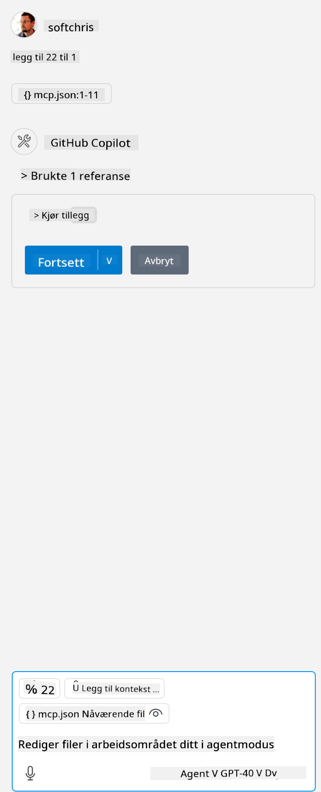

<!--
CO_OP_TRANSLATOR_METADATA:
{
  "original_hash": "96e08a8c1049dab757deb64cce4ea1e8",
  "translation_date": "2025-05-17T11:21:42+00:00",
  "source_file": "03-GettingStarted/04-vscode/solution/README.md",
  "language_code": "no"
}
-->
# Kjøre eksempelet

Her antar vi at du allerede har en fungerende serverkode. Vennligst finn en server fra en av de tidligere kapitlene.

## Sett opp mcp.json

Her er en fil du bruker som referanse, [mcp.json](../../../../../03-GettingStarted/04-vscode/solution/mcp.json).

Endre serveroppføringen etter behov for å angi den absolutte banen til serveren din, inkludert den nødvendige fulle kommandoen for å kjøre.

I eksempelfilen som det refereres til ovenfor, ser serveroppføringen slik ut:

```json
"hello-mcp": {
    "command": "cmd",
    "args": [
        "/c", "node", "<absolute path>\\build\\index.js"
    ]
}
```

Dette tilsvarer å kjøre en kommando som dette: `cmd /c node <absolute path>\\build\index.js`. 

- Change this server entry to fit where your server file is located or to what's needed to startup your server depending on your chosen runtime and server location.

## Consume the features in the server

- Click the `play` icon, once you've added *mcp.json* to *./vscode* folder, 

    Observe the tooling icon change to increase the number of available tools. Tooling icon is located right above the chat field in GitHub Copilot.

## Run a tool

- Type a prompt in your chat window that matches the description of your tool. For example to trigger the tool `add` skriv noe som "legg til 3 til 20".

    Du bør se et verktøy som vises over chatteksten som indikerer at du skal velge å kjøre verktøyet, som i denne visuelle:

    

    Å velge verktøyet bør gi et numerisk resultat som sier "23" hvis forespørselen din var som vi nevnte tidligere.

**Ansvarsfraskrivelse**:  
Dette dokumentet er oversatt ved hjelp av AI-oversettelsestjenesten [Co-op Translator](https://github.com/Azure/co-op-translator). Vi streber etter nøyaktighet, men vær oppmerksom på at automatiserte oversettelser kan inneholde feil eller unøyaktigheter. Det originale dokumentet på sitt opprinnelige språk bør betraktes som den autoritative kilden. For kritisk informasjon anbefales profesjonell menneskelig oversettelse. Vi er ikke ansvarlige for eventuelle misforståelser eller feiltolkninger som oppstår ved bruk av denne oversettelsen.