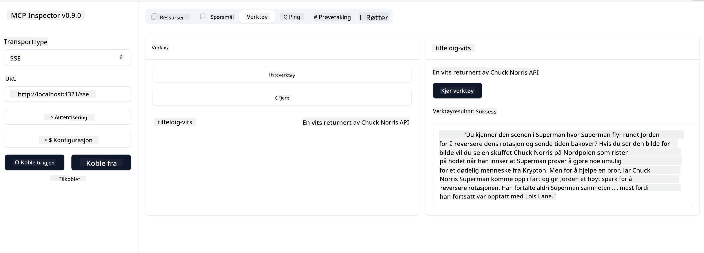

<!--
CO_OP_TRANSLATOR_METADATA:
{
  "original_hash": "0a8086dc4bf89448f83e7936db972c42",
  "translation_date": "2025-05-17T11:37:20+00:00",
  "source_file": "03-GettingStarted/05-sse-server/README.md",
  "language_code": "no"
}
-->
# SSE Server

SSE (Server Sent Events) er en standard for streaming fra server til klient, som gjør det mulig for servere å sende sanntidsoppdateringer til klienter over HTTP. Dette er spesielt nyttig for applikasjoner som krever live-oppdateringer, som chat-applikasjoner, varslinger, eller sanntids datafeeds. Dessuten kan serveren din brukes av flere klienter samtidig, da den lever på en server som kan kjøres et sted i skyen, for eksempel.

## Oversikt

Denne leksjonen dekker hvordan man bygger og bruker SSE-servere.

## Læringsmål

Ved slutten av denne leksjonen vil du kunne:

- Bygge en SSE-server.
- Feilsøke en SSE-server ved hjelp av Inspector.
- Bruke en SSE-server med Visual Studio Code.

## SSE, hvordan det fungerer

SSE er en av to støttede transporttyper. Du har allerede sett den første, stdio, bli brukt i tidligere leksjoner. Forskjellen er følgende:

- SSE krever at du håndterer to ting: tilkobling og meldinger.
- Siden dette er en server som kan leve hvor som helst, må du reflektere dette i hvordan du jobber med verktøy som Inspector og Visual Studio. Det betyr at i stedet for å peke på hvordan du starter serveren, peker du i stedet på endepunktet hvor den kan etablere en tilkobling. Se eksempel kode nedenfor:

Nå som vi vet litt mer om SSE, la oss bygge en SSE-server neste.

## Øvelse: Lage en SSE-server

For å lage serveren vår, må vi huske to ting:

- Vi må bruke en webserver for å eksponere endepunkter for tilkobling og meldinger.
- Bygge serveren vår som vi vanligvis gjør med verktøy, ressurser og forespørsler når vi brukte stdio.

### -1- Opprett en serverinstans

For å opprette serveren vår, bruker vi de samme typene som med stdio. Imidlertid må vi velge SSE for transporten.

La oss legge til de nødvendige rutene neste.

### -2- Legg til ruter

La oss legge til ruter neste som håndterer tilkoblingen og innkommende meldinger:

La oss legge til funksjonaliteter til serveren neste.

### -3- Legge til serverfunksjonaliteter

Nå som vi har definert alt spesifikt for SSE, la oss legge til serverfunksjonaliteter som verktøy, forespørsler og ressurser.

Hele koden din skal se slik ut:

Flott, vi har en server som bruker SSE, la oss prøve den neste.

## Øvelse: Feilsøke en SSE-server med Inspector

Inspector er et flott verktøy som vi så i en tidligere leksjon [Opprette din første server](/03-GettingStarted/01-first-server/README.md). La oss se om vi kan bruke Inspector også her:

### -1- Kjøre inspector

For å kjøre inspector, må du først ha en SSE-server som kjører, så la oss gjøre det neste:

1. Kjøre serveren

1. Kjøre inspector

    > ![NOTE]
    > Kjør dette i et separat terminalvindu enn der serveren kjører. Merk også at du må justere kommandoen nedenfor for å passe til URL-en hvor serveren din kjører.

    ```sh
    npx @modelcontextprotocol/inspector --cli http://localhost:8000/sse --method tools/list
    ```

    Å kjøre inspector ser likt ut i alle runtime-miljøer. Merk hvordan vi i stedet for å sende en sti til serveren vår og en kommando for å starte serveren, sender vi URL-en hvor serveren kjører, og vi spesifiserer også `/sse`-ruten.

### -2- Prøve ut verktøyet

Koble til serveren ved å velge SSE i nedtrekkslisten og fyll inn URL-feltet hvor serveren din kjører, for eksempel http:localhost:4321/sse. Klikk nå på "Connect"-knappen. Som før, velg å liste verktøy, velg et verktøy og gi inputverdier. Du bør se et resultat som nedenfor:



Flott, du er i stand til å jobbe med inspector, la oss se hvordan vi kan jobbe med Visual Studio Code neste.

## Oppgave

Prøv å bygge ut serveren din med flere funksjonaliteter. Se [denne siden](https://api.chucknorris.io/) for eksempel for å legge til et verktøy som kaller en API, du bestemmer hvordan serveren skal se ut. Ha det gøy :)

## Løsning

[Løsning](./solution/README.md) Her er en mulig løsning med fungerende kode.

## Viktige punkter

De viktige punktene fra dette kapittelet er følgende:

- SSE er den andre støttede transporttypen ved siden av stdio.
- For å støtte SSE, må du håndtere innkommende tilkoblinger og meldinger ved hjelp av et webrammeverk.
- Du kan bruke både Inspector og Visual Studio Code til å bruke SSE-server, akkurat som stdio-servere. Merk hvordan det skiller seg litt mellom stdio og SSE. For SSE må du starte serveren separat og deretter kjøre verktøyet ditt. For verktøyet er det også noen forskjeller ved at du må spesifisere URL-en.

## Eksempler

- [Java Kalkulator](../samples/java/calculator/README.md)
- [.Net Kalkulator](../../../../03-GettingStarted/samples/csharp)
- [JavaScript Kalkulator](../samples/javascript/README.md)
- [TypeScript Kalkulator](../samples/typescript/README.md)
- [Python Kalkulator](../../../../03-GettingStarted/samples/python)

## Tilleggsressurser

- [SSE](https://developer.mozilla.org/en-US/docs/Web/API/Server-sent_events)

## Hva skjer neste

- Neste: [Kom i gang med AI Toolkit for VSCode](/03-GettingStarted/06-aitk/README.md)

**Ansvarsfraskrivelse**:  
Dette dokumentet har blitt oversatt ved hjelp av AI-oversettelsestjenesten [Co-op Translator](https://github.com/Azure/co-op-translator). Selv om vi tilstreber nøyaktighet, vennligst vær oppmerksom på at automatiserte oversettelser kan inneholde feil eller unøyaktigheter. Det originale dokumentet på sitt opprinnelige språk bør betraktes som den autoritative kilden. For kritisk informasjon anbefales profesjonell menneskelig oversettelse. Vi er ikke ansvarlige for eventuelle misforståelser eller feiltolkninger som oppstår ved bruk av denne oversettelsen.