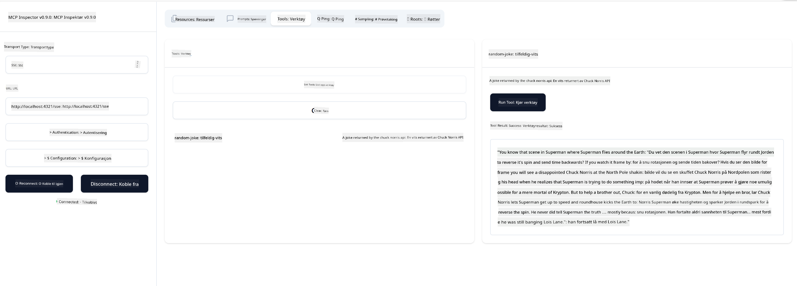

<!--
CO_OP_TRANSLATOR_METADATA:
{
  "original_hash": "a8831b194cb5ece750355e99434b7154",
  "translation_date": "2025-07-17T18:51:04+00:00",
  "source_file": "03-GettingStarted/05-sse-server/README.md",
  "language_code": "no"
}
-->
# SSE Server

SSE (Server Sent Events) er en standard for server-til-klient streaming, som lar servere sende sanntidsoppdateringer til klienter over HTTP. Dette er spesielt nyttig for applikasjoner som krever live oppdateringer, som chat-applikasjoner, varsler eller sanntidsdata. I tillegg kan serveren din brukes av flere klienter samtidig, siden den kjører på en server som for eksempel kan være i skyen.

## Oversikt

Denne leksjonen dekker hvordan man bygger og bruker SSE-servere.

## Læringsmål

Etter denne leksjonen skal du kunne:

- Bygge en SSE-server.
- Feilsøke en SSE-server ved hjelp av Inspector.
- Bruke en SSE-server med Visual Studio Code.

## SSE, hvordan det fungerer

SSE er en av to støttede transporttyper. Du har allerede sett den første, stdio, brukt i tidligere leksjoner. Forskjellen er som følger:

- SSE krever at du håndterer to ting; tilkobling og meldinger.
- Siden dette er en server som kan kjøre hvor som helst, må det gjenspeiles i hvordan du jobber med verktøy som Inspector og Visual Studio Code. Det betyr at i stedet for å peke på hvordan man starter serveren, peker du i stedet på endepunktet hvor tilkoblingen kan etableres. Se eksempel under:

### TypeScript

```typescript
app.get("/sse", async (_: Request, res: Response) => {
    const transport = new SSEServerTransport('/messages', res);
    transports[transport.sessionId] = transport;
    res.on("close", () => {
        delete transports[transport.sessionId];
    });
    await server.connect(transport);
});

app.post("/messages", async (req: Request, res: Response) => {
    const sessionId = req.query.sessionId as string;
    const transport = transports[sessionId];
    if (transport) {
        await transport.handlePostMessage(req, res);
    } else {
        res.status(400).send('No transport found for sessionId');
    }
});
```

I koden over:

- `/sse` er satt opp som en rute. Når en forespørsel sendes til denne ruten, opprettes en ny transportinstans og serveren *kobler til* ved hjelp av denne transporten.
- `/messages` er ruten som håndterer innkommende meldinger.

### Python

```python
mcp = FastMCP("My App")

@mcp.tool()
def add(a: int, b: int) -> int:
    """Add two numbers"""
    return a + b

# Mount the SSE server to the existing ASGI server
app = Starlette(
    routes=[
        Mount('/', app=mcp.sse_app()),
    ]
)

```

I koden over:

- Oppretter vi en instans av en ASGI-server (spesifikt med Starlette) og monterer standardruten `/`.

  Det som skjer i bakgrunnen er at rutene `/sse` og `/messages` settes opp for å håndtere tilkoblinger og meldinger henholdsvis. Resten av appen, som å legge til funksjoner som verktøy, skjer på samme måte som med stdio-servere.

### .NET    

```csharp
    var builder = WebApplication.CreateBuilder(args);
    builder.Services
        .AddMcpServer()
        .WithTools<Tools>();


    builder.Services.AddHttpClient();

    var app = builder.Build();

    app.MapMcp();
    ```

    Det finnes to metoder som hjelper oss å gå fra en webserver til en webserver som støtter SSE, og det er:

    - `AddMcpServer`, denne metoden legger til funksjonalitet.
    - `MapMcp`, denne legger til ruter som `/SSE` og `/messages`.
```

Now that we know a little bit more about SSE, let's build an SSE server next.

## Exercise: Creating an SSE Server

To create our server, we need to keep two things in mind:

- We need to use a web server to expose endpoints for connection and messages.
- Build our server like we normally do with tools, resources and prompts when we were using stdio.

### -1- Create a server instance

To create our server, we use the same types as with stdio. However, for the transport, we need to choose SSE.

### TypeScript

```typescript
import { Request, Response } from "express";
import express from "express";
import { McpServer } from "@modelcontextprotocol/sdk/server/mcp.js";
import { SSEServerTransport } from "@modelcontextprotocol/sdk/server/sse.js";

const server = new McpServer({
  name: "example-server",
  version: "1.0.0"
});

const app = express();

const transports: {[sessionId: string]: SSEServerTransport} = {};
```

In the preceding code we've:

- Created a server instance.
- Defined an app using the web framework express.
- Created a transports variable that we will use to store incoming connections.

### Python

```python
from starlette.applications import Starlette
from starlette.routing import Mount, Host
from mcp.server.fastmcp import FastMCP


mcp = FastMCP("My App")
```

In the preceding code we've:

- Imported the libraries we're going to need with Starlette (an ASGI framework) being pulled in.
- Created an MCP server instance `mcp`.

### .NET

```csharp
var builder = WebApplication.CreateBuilder(args);
builder.Services
    .AddMcpServer();


builder.Services.AddHttpClient();

var app = builder.Build();

// TODO: add routes 
```

At this point, we've:

- Created a web app
- Added support for MCP features through `AddMcpServer`.

Let's add the needed routes next.

### -2- Add routes

Let's add routes next that handle the connection and incoming messages:

### TypeScript

```typescript
app.get("/sse", async (_: Request, res: Response) => {
  const transport = new SSEServerTransport('/messages', res);
  transports[transport.sessionId] = transport;
  res.on("close", () => {
    delete transports[transport.sessionId];
  });
  await server.connect(transport);
});

app.post("/messages", async (req: Request, res: Response) => {
  const sessionId = req.query.sessionId as string;
  const transport = transports[sessionId];
  if (transport) {
    await transport.handlePostMessage(req, res);
  } else {
    res.status(400).send('No transport found for sessionId');
  }
});

app.listen(3001);
```

In the preceding code we've defined:

- An `/sse` route that instantiates a transport of type SSE and ends up calling `connect` on the MCP server.
- A `/messages` route that takes care of incoming messages.

### Python

```python
app = Starlette(
    routes=[
        Mount('/', app=mcp.sse_app()),
    ]
)
```

In the preceding code we've:

- Created an ASGI app instance using the Starlette framework. As part of that we passes `mcp.sse_app()` to it's list of routes. That ends up mounting an `/sse` and `/messages` route on the app instance.

### .NET

```csharp
var builder = WebApplication.CreateBuilder(args);
builder.Services
    .AddMcpServer();

builder.Services.AddHttpClient();

var app = builder.Build();

app.MapMcp();
```

We've added one line of code at the end `add.MapMcp()` this means we now have routes `/SSE` and `/messages`. 

Let's add capabilties to the server next.

### -3- Adding server capabilities

Now that we've got everything SSE specific defined, let's add server capabilities like tools, prompts and resources.

### TypeScript

```typescript
server.tool("random-joke", "A joke returned by the chuck norris api", {},
  async () => {
    const response = await fetch("https://api.chucknorris.io/jokes/random");
    const data = await response.json();

    return {
      content: [
        {
          type: "text",
          text: data.value
        }
      ]
    };
  }
);
```

Here's how you can add a tool for example. This specific tool creates a tool call "random-joke" that calls a Chuck Norris API and returns a JSON response.

### Python

```python
@mcp.tool()
def add(a: int, b: int) -> int:
    """Add two numbers"""
    return a + b
```

Now your server has one tool.

### TypeScript

```typescript
// server-sse.ts
import { Request, Response } from "express";
import express from "express";
import { McpServer } from "@modelcontextprotocol/sdk/server/mcp.js";
import { SSEServerTransport } from "@modelcontextprotocol/sdk/server/sse.js";

// Opprett en MCP-server
const server = new McpServer({
  name: "example-server",
  version: "1.0.0",
});

const app = express();

const transports: { [sessionId: string]: SSEServerTransport } = {};

app.get("/sse", async (_: Request, res: Response) => {
  const transport = new SSEServerTransport("/messages", res);
  transports[transport.sessionId] = transport;
  res.on("close", () => {
    delete transports[transport.sessionId];
  });
  await server.connect(transport);
});

app.post("/messages", async (req: Request, res: Response) => {
  const sessionId = req.query.sessionId as string;
  const transport = transports[sessionId];
  if (transport) {
    await transport.handlePostMessage(req, res);
  } else {
    res.status(400).send("No transport found for sessionId");
  }
});

server.tool("random-joke", "A joke returned by the chuck norris api", {}, async () => {
  const response = await fetch("https://api.chucknorris.io/jokes/random");
  const data = await response.json();

  return {
    content: [
      {
        type: "text",
        text: data.value,
      },
    ],
  };
});

app.listen(3001);
```

### Python

```python
from starlette.applications import Starlette
from starlette.routing import Mount, Host
from mcp.server.fastmcp import FastMCP


mcp = FastMCP("My App")

@mcp.tool()
def add(a: int, b: int) -> int:
    """Add two numbers"""
    return a + b

# Monter SSE-serveren til den eksisterende ASGI-serveren
app = Starlette(
    routes=[
        Mount('/', app=mcp.sse_app()),
    ]
)
```

### .NET

1. Let's create some tools first, for this we will create a file *Tools.cs* with the following content:

  ```csharp
  using System.ComponentModel;
  using System.Text.Json;
  using ModelContextProtocol.Server;

  namespace server;

  [McpServerToolType]
  public sealed class Tools
  {

      public Tools()
      {
      
      }

      [McpServerTool, Description("Add two numbers together.")]
      public async Task<string> AddNumbers(
          [Description("The first number")] int a,
          [Description("The second number")] int b)
      {
          return (a + b).ToString();
      }

  }
  ```

  Here we've added the following:

  - Created a class `Tools` with the decorator `McpServerToolType`.
  - Defined a tool `AddNumbers` by decorating the method with `McpServerTool`. We've also provided parameters and an implementation.

1. Let's leverage the `Tools` class we just created:

  ```csharp
  var builder = WebApplication.CreateBuilder(args);
  builder.Services
      .AddMcpServer()
      .WithTools<Tools>();


  builder.Services.AddHttpClient();

  var app = builder.Build();

  app.MapMcp();
  ```

  We've added a call to `WithTools` that specifies `Tools` as the class containing the tools. That's it, we're ready.

Great, we have a server using SSE, let's take it for a spin next.

## Exercise: Debugging an SSE Server with Inspector

Inspector is a great tool that we saw in a previous lesson [Creating your first server](/03-GettingStarted/01-first-server/README.md). Let's see if we can use the Inspector even here:

### -1- Running the inspector

To run the inspector, you first must have an SSE server running, so let's do that next:

1. Run the server 

    ### TypeScript

    ```sh
    tsx && node ./build/server-sse.ts
    ```

    ### Python

    ```sh
    uvicorn server:app
    ```

    Note how we use the executable `uvicorn` that's installed when we typed `pip install "mcp[cli]"`. Typing `server:app` means we're trying to run a file `server.py` and for it to have a Starlette instance called `app`. 

    ### .NET

    ```sh
    dotnet run
    ```

    This should start the server. To interface with it you need a new terminal.

1. Run the inspector

    > ![NOTE]
    > Run this in a separate terminal window than the server is running in. Also note, you need to adjust the below command to fit the URL where your server runs.

    ```sh
    npx @modelcontextprotocol/inspector --cli http://localhost:8000/sse --method tools/list
    ```

    Å kjøre inspector ser likt ut i alle runtime-miljøer. Legg merke til at i stedet for å sende inn en sti til serveren vår og en kommando for å starte serveren, sender vi i stedet URL-en hvor serveren kjører, og vi spesifiserer også `/sse`-ruten.

### -2- Prøve ut verktøyet

Koble til serveren ved å velge SSE i nedtrekksmenyen og fyll inn URL-feltet der serveren din kjører, for eksempel http:localhost:4321/sse. Klikk deretter på "Connect"-knappen. Som før, velg å liste opp verktøy, velg et verktøy og gi inputverdier. Du bør se et resultat som under:



Flott, du kan jobbe med inspector, la oss se hvordan vi kan jobbe med Visual Studio Code videre.

## Oppgave

Prøv å bygge ut serveren din med flere funksjoner. Se [denne siden](https://api.chucknorris.io/) for eksempelvis å legge til et verktøy som kaller et API. Du bestemmer hvordan serveren skal se ut. Lykke til :)

## Løsning

[Løsning](./solution/README.md) Her er en mulig løsning med fungerende kode.

## Viktige punkter

De viktigste punktene fra dette kapitlet er:

- SSE er den andre støttede transporttypen ved siden av stdio.
- For å støtte SSE må du håndtere innkommende tilkoblinger og meldinger ved hjelp av et web-rammeverk.
- Du kan bruke både Inspector og Visual Studio Code for å konsumere en SSE-server, akkurat som med stdio-servere. Legg merke til at det er noen forskjeller mellom stdio og SSE. For SSE må du starte serveren separat og deretter kjøre inspector-verktøyet. For inspector-verktøyet må du også spesifisere URL-en.

## Eksempler

- [Java Calculator](../samples/java/calculator/README.md)
- [.Net Calculator](../../../../03-GettingStarted/samples/csharp)
- [JavaScript Calculator](../samples/javascript/README.md)
- [TypeScript Calculator](../samples/typescript/README.md)
- [Python Calculator](../../../../03-GettingStarted/samples/python) 

## Ekstra ressurser

- [SSE](https://developer.mozilla.org/en-US/docs/Web/API/Server-sent_events)

## Hva kommer nå

- Neste: [HTTP Streaming med MCP (Streamable HTTP)](../06-http-streaming/README.md)

**Ansvarsfraskrivelse**:  
Dette dokumentet er oversatt ved hjelp av AI-oversettelsestjenesten [Co-op Translator](https://github.com/Azure/co-op-translator). Selv om vi streber etter nøyaktighet, vennligst vær oppmerksom på at automatiske oversettelser kan inneholde feil eller unøyaktigheter. Det opprinnelige dokumentet på originalspråket skal anses som den autoritative kilden. For kritisk informasjon anbefales profesjonell menneskelig oversettelse. Vi er ikke ansvarlige for eventuelle misforståelser eller feiltolkninger som oppstår ved bruk av denne oversettelsen.