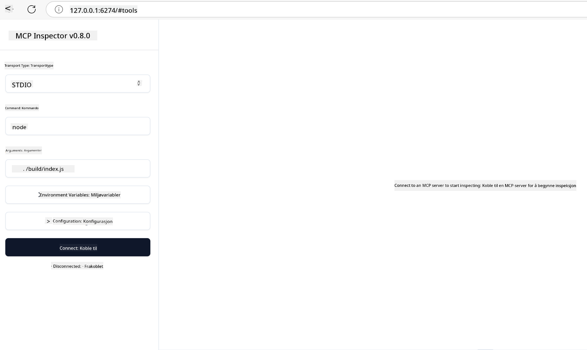

<!--
CO_OP_TRANSLATOR_METADATA:
{
  "original_hash": "4e34e34e84f013e73c7eaa6d09884756",
  "translation_date": "2025-07-13T22:01:28+00:00",
  "source_file": "03-GettingStarted/08-testing/README.md",
  "language_code": "no"
}
-->
## Testing og feilsøking

Før du begynner å teste MCP-serveren din, er det viktig å forstå hvilke verktøy som finnes og beste praksis for feilsøking. Effektiv testing sikrer at serveren oppfører seg som forventet og hjelper deg med å raskt identifisere og løse problemer. Følgende seksjon beskriver anbefalte metoder for å validere din MCP-implementasjon.

## Oversikt

Denne leksjonen handler om hvordan du velger riktig testmetode og det mest effektive testverktøyet.

## Læringsmål

Etter denne leksjonen skal du kunne:

- Beskrive ulike tilnærminger for testing.
- Bruke forskjellige verktøy for å teste koden din effektivt.

## Testing av MCP-servere

MCP tilbyr verktøy som hjelper deg med å teste og feilsøke serverne dine:

- **MCP Inspector**: Et kommandolinjeverktøy som kan kjøres både som CLI-verktøy og som et visuelt verktøy.
- **Manuell testing**: Du kan bruke et verktøy som curl for å sende web-forespørsler, men ethvert verktøy som kan håndtere HTTP fungerer.
- **Enhetstesting**: Det er mulig å bruke ditt foretrukne test-rammeverk for å teste funksjonene til både server og klient.

### Bruke MCP Inspector

Vi har beskrevet bruken av dette verktøyet i tidligere leksjoner, men la oss ta en kort oppsummering. Det er et verktøy bygget i Node.js, og du kan bruke det ved å kjøre `npx`-kommandoen, som midlertidig laster ned og installerer verktøyet, og rydder opp etter seg når forespørselen er ferdig.

[MCP Inspector](https://github.com/modelcontextprotocol/inspector) hjelper deg med å:

- **Oppdage serverkapasiteter**: Automatisk finne tilgjengelige ressurser, verktøy og prompts
- **Teste verktøyutførelse**: Prøve ulike parametere og se svar i sanntid
- **Se servermetadata**: Undersøke serverinformasjon, skjemaer og konfigurasjoner

Et typisk kjør av verktøyet ser slik ut:

```bash
npx @modelcontextprotocol/inspector node build/index.js
```

Kommandoen over starter en MCP og dens visuelle grensesnitt, og åpner en lokal webside i nettleseren din. Du vil se et dashbord som viser dine registrerte MCP-servere, tilgjengelige verktøy, ressurser og prompts. Grensesnittet lar deg teste verktøyutførelse interaktivt, inspisere servermetadata og se svar i sanntid, noe som gjør det enklere å validere og feilsøke MCP-serverimplementasjonene dine.

Slik kan det se ut: 

Du kan også kjøre dette verktøyet i CLI-modus ved å legge til `--cli`-attributtet. Her er et eksempel på å kjøre verktøyet i "CLI"-modus som viser alle verktøyene på serveren:

```sh
npx @modelcontextprotocol/inspector --cli node build/index.js --method tools/list
```

### Manuell testing

I tillegg til å bruke inspector-verktøyet for å teste serverkapasiteter, kan du også bruke en klient som kan sende HTTP-forespørsler, for eksempel curl.

Med curl kan du teste MCP-servere direkte ved hjelp av HTTP-forespørsler:

```bash
# Example: Test server metadata
curl http://localhost:3000/v1/metadata

# Example: Execute a tool
curl -X POST http://localhost:3000/v1/tools/execute \
  -H "Content-Type: application/json" \
  -d '{"name": "calculator", "parameters": {"expression": "2+2"}}'
```

Som du ser i eksempelet over, bruker du en POST-forespørsel for å kalle et verktøy med en payload som inneholder verktøyets navn og parametere. Velg den metoden som passer deg best. CLI-verktøy er generelt raskere å bruke og egner seg godt for skripting, noe som kan være nyttig i et CI/CD-miljø.

### Enhetstesting

Lag enhetstester for verktøyene og ressursene dine for å sikre at de fungerer som forventet. Her er et eksempel på testkode.

```python
import pytest

from mcp.server.fastmcp import FastMCP
from mcp.shared.memory import (
    create_connected_server_and_client_session as create_session,
)

# Mark the whole module for async tests
pytestmark = pytest.mark.anyio


async def test_list_tools_cursor_parameter():
    """Test that the cursor parameter is accepted for list_tools.

    Note: FastMCP doesn't currently implement pagination, so this test
    only verifies that the cursor parameter is accepted by the client.
    """

 server = FastMCP("test")

    # Create a couple of test tools
    @server.tool(name="test_tool_1")
    async def test_tool_1() -> str:
        """First test tool"""
        return "Result 1"

    @server.tool(name="test_tool_2")
    async def test_tool_2() -> str:
        """Second test tool"""
        return "Result 2"

    async with create_session(server._mcp_server) as client_session:
        # Test without cursor parameter (omitted)
        result1 = await client_session.list_tools()
        assert len(result1.tools) == 2

        # Test with cursor=None
        result2 = await client_session.list_tools(cursor=None)
        assert len(result2.tools) == 2

        # Test with cursor as string
        result3 = await client_session.list_tools(cursor="some_cursor_value")
        assert len(result3.tools) == 2

        # Test with empty string cursor
        result4 = await client_session.list_tools(cursor="")
        assert len(result4.tools) == 2
    
```

Koden over gjør følgende:

- Bruker pytest-rammeverket som lar deg lage tester som funksjoner og bruke assert-setninger.
- Oppretter en MCP-server med to forskjellige verktøy.
- Bruker `assert` for å sjekke at visse betingelser er oppfylt.

Ta en titt på [hele filen her](https://github.com/modelcontextprotocol/python-sdk/blob/main/tests/client/test_list_methods_cursor.py)

Med denne filen kan du teste din egen server for å sikre at kapasiteter opprettes som de skal.

Alle større SDK-er har lignende testseksjoner, så du kan tilpasse etter ditt valgte runtime.

## Eksempler

- [Java Calculator](../samples/java/calculator/README.md)
- [.Net Calculator](../../../../03-GettingStarted/samples/csharp)
- [JavaScript Calculator](../samples/javascript/README.md)
- [TypeScript Calculator](../samples/typescript/README.md)
- [Python Calculator](../../../../03-GettingStarted/samples/python)

## Ekstra ressurser

- [Python SDK](https://github.com/modelcontextprotocol/python-sdk)

## Hva kommer nå

- Neste: [Deployment](../09-deployment/README.md)

**Ansvarsfraskrivelse**:  
Dette dokumentet er oversatt ved hjelp av AI-oversettelsestjenesten [Co-op Translator](https://github.com/Azure/co-op-translator). Selv om vi streber etter nøyaktighet, vennligst vær oppmerksom på at automatiske oversettelser kan inneholde feil eller unøyaktigheter. Det opprinnelige dokumentet på originalspråket skal anses som den autoritative kilden. For kritisk informasjon anbefales profesjonell menneskelig oversettelse. Vi er ikke ansvarlige for eventuelle misforståelser eller feiltolkninger som oppstår ved bruk av denne oversettelsen.