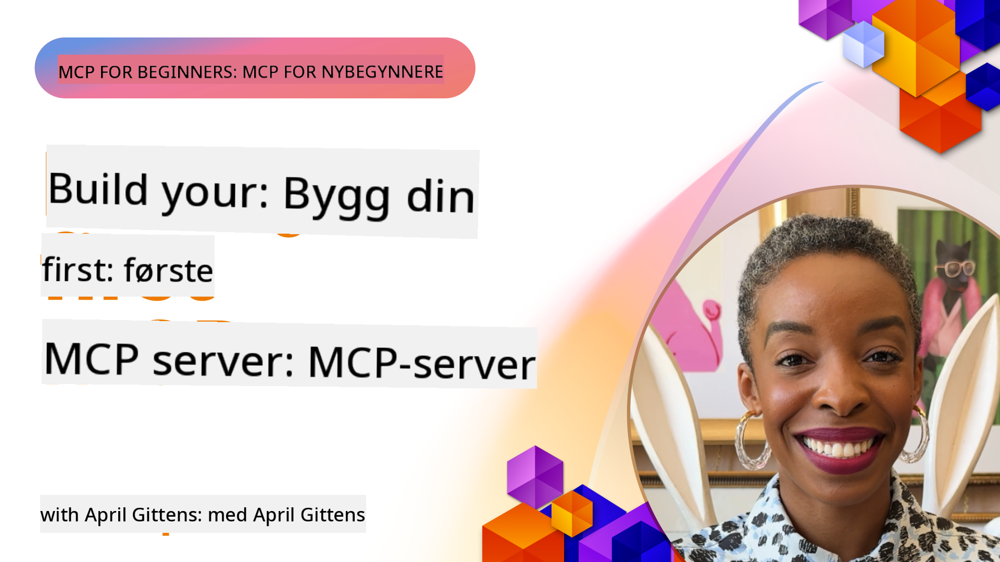

<!--
CO_OP_TRANSLATOR_METADATA:
{
  "original_hash": "1197b6dbde36773e04a5ae826557fdb9",
  "translation_date": "2025-08-26T17:53:58+00:00",
  "source_file": "03-GettingStarted/README.md",
  "language_code": "no"
}
-->
## Komme i gang  

_(Klikk på bildet over for å se videoen til denne leksjonen)_

Denne delen består av flere leksjoner:

- **1 Din første server**, i denne første leksjonen vil du lære hvordan du oppretter din første server og inspiserer den med inspeksjonsverktøyet, en verdifull måte å teste og feilsøke serveren din på, [til leksjonen](01-first-server/README.md)

- **2 Klient**, i denne leksjonen vil du lære hvordan du skriver en klient som kan koble seg til serveren din, [til leksjonen](02-client/README.md)

- **3 Klient med LLM**, en enda bedre måte å skrive en klient på er ved å legge til en LLM slik at den kan "forhandle" med serveren din om hva som skal gjøres, [til leksjonen](03-llm-client/README.md)

- **4 Bruke en server i GitHub Copilot Agent-modus i Visual Studio Code**. Her ser vi på hvordan vi kan kjøre vår MCP-server fra Visual Studio Code, [til leksjonen](04-vscode/README.md)

- **5 stdio Transport Server** stdio transport er den anbefalte standarden for MCP-kommunikasjon mellom server og klient i den nåværende spesifikasjonen, og gir sikker kommunikasjon basert på underprosesser [til leksjonen](05-stdio-server/README.md)

- **6 HTTP-strømming med MCP (Streamable HTTP)**. Lær om moderne HTTP-strømming, fremdriftsvarsler, og hvordan du implementerer skalerbare, sanntids MCP-servere og -klienter ved hjelp av Streamable HTTP. [til leksjonen](06-http-streaming/README.md)

- **7 Bruke AI Toolkit for VSCode** for å konsumere og teste MCP-klienter og -servere [til leksjonen](07-aitk/README.md)

- **8 Testing**. Her vil vi fokusere spesielt på hvordan vi kan teste serveren og klienten vår på ulike måter, [til leksjonen](08-testing/README.md)

- **9 Distribusjon**. Dette kapittelet ser på ulike måter å distribuere MCP-løsningene dine på, [til leksjonen](09-deployment/README.md)

Model Context Protocol (MCP) er en åpen protokoll som standardiserer hvordan applikasjoner gir kontekst til LLM-er. Tenk på MCP som en USB-C-port for AI-applikasjoner – det gir en standardisert måte å koble AI-modeller til ulike datakilder og verktøy.

## Læringsmål

Ved slutten av denne leksjonen vil du kunne:

- Sette opp utviklingsmiljøer for MCP i C#, Java, Python, TypeScript og JavaScript
- Bygge og distribuere grunnleggende MCP-servere med tilpassede funksjoner (ressurser, oppfordringer og verktøy)
- Lage vertsapplikasjoner som kobler seg til MCP-servere
- Teste og feilsøke MCP-implementeringer
- Forstå vanlige oppsettsutfordringer og deres løsninger
- Koble MCP-implementeringene dine til populære LLM-tjenester

## Sette opp MCP-miljøet ditt

Før du begynner å jobbe med MCP, er det viktig å forberede utviklingsmiljøet ditt og forstå den grunnleggende arbeidsflyten. Denne delen vil veilede deg gjennom de innledende oppsettsstegene for å sikre en smidig start med MCP.

### Forutsetninger

Før du dykker inn i MCP-utvikling, sørg for at du har:

- **Utviklingsmiljø**: For det valgte språket ditt (C#, Java, Python, TypeScript eller JavaScript)
- **IDE/Editor**: Visual Studio, Visual Studio Code, IntelliJ, Eclipse, PyCharm eller en hvilken som helst moderne kodeeditor
- **Pakkehåndterere**: NuGet, Maven/Gradle, pip eller npm/yarn
- **API-nøkler**: For eventuelle AI-tjenester du planlegger å bruke i vertsapplikasjonene dine

### Offisielle SDK-er

I de kommende kapitlene vil du se løsninger bygget med Python, TypeScript, Java og .NET. Her er alle de offisielt støttede SDK-ene.

MCP tilbyr offisielle SDK-er for flere språk:
- [C# SDK](https://github.com/modelcontextprotocol/csharp-sdk) - Vedlikeholdt i samarbeid med Microsoft
- [Java SDK](https://github.com/modelcontextprotocol/java-sdk) - Vedlikeholdt i samarbeid med Spring AI
- [TypeScript SDK](https://github.com/modelcontextprotocol/typescript-sdk) - Den offisielle TypeScript-implementasjonen
- [Python SDK](https://github.com/modelcontextprotocol/python-sdk) - Den offisielle Python-implementasjonen
- [Kotlin SDK](https://github.com/modelcontextprotocol/kotlin-sdk) - Den offisielle Kotlin-implementasjonen
- [Swift SDK](https://github.com/modelcontextprotocol/swift-sdk) - Vedlikeholdt i samarbeid med Loopwork AI
- [Rust SDK](https://github.com/modelcontextprotocol/rust-sdk) - Den offisielle Rust-implementasjonen

## Viktige punkter

- Å sette opp et MCP-utviklingsmiljø er enkelt med språkspesifikke SDK-er
- Å bygge MCP-servere innebærer å lage og registrere verktøy med klare skjemaer
- MCP-klienter kobler seg til servere og modeller for å utnytte utvidede funksjoner
- Testing og feilsøking er essensielt for pålitelige MCP-implementeringer
- Distribusjonsalternativer spenner fra lokal utvikling til skybaserte løsninger

## Øving

Vi har et sett med eksempler som utfyller øvelsene du vil se i alle kapitlene i denne delen. I tillegg har hvert kapittel også sine egne øvelser og oppgaver.

- [Java Kalkulator](./samples/java/calculator/README.md)
- [.Net Kalkulator](../../../03-GettingStarted/samples/csharp)
- [JavaScript Kalkulator](./samples/javascript/README.md)
- [TypeScript Kalkulator](./samples/typescript/README.md)
- [Python Kalkulator](../../../03-GettingStarted/samples/python)

## Tilleggsressurser

- [Bygg agenter ved hjelp av Model Context Protocol på Azure](https://learn.microsoft.com/azure/developer/ai/intro-agents-mcp)
- [Fjern-MCP med Azure Container Apps (Node.js/TypeScript/JavaScript)](https://learn.microsoft.com/samples/azure-samples/mcp-container-ts/mcp-container-ts/)
- [.NET OpenAI MCP Agent](https://learn.microsoft.com/samples/azure-samples/openai-mcp-agent-dotnet/openai-mcp-agent-dotnet/)

## Hva nå

Neste: [Opprette din første MCP-server](01-first-server/README.md)

---

**Ansvarsfraskrivelse**:  
Dette dokumentet er oversatt ved hjelp av AI-oversettelsestjenesten [Co-op Translator](https://github.com/Azure/co-op-translator). Selv om vi streber etter nøyaktighet, vær oppmerksom på at automatiserte oversettelser kan inneholde feil eller unøyaktigheter. Det originale dokumentet på sitt opprinnelige språk bør anses som den autoritative kilden. For kritisk informasjon anbefales profesjonell menneskelig oversettelse. Vi er ikke ansvarlige for misforståelser eller feiltolkninger som oppstår ved bruk av denne oversettelsen.