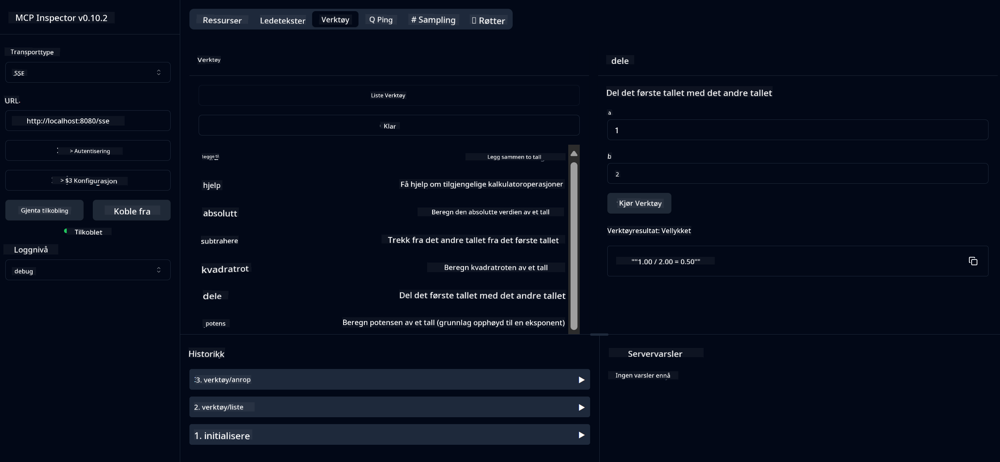

<!--
CO_OP_TRANSLATOR_METADATA:
{
  "original_hash": "13231e9951b68efd9df8c56bd5cdb27e",
  "translation_date": "2025-05-17T13:13:01+00:00",
  "source_file": "03-GettingStarted/samples/java/calculator/README.md",
  "language_code": "no"
}
-->
# Grunnleggende Kalkulator MCP-tjeneste

Denne tjenesten tilbyr grunnleggende kalkulatoroperasjoner gjennom Model Context Protocol (MCP) ved bruk av Spring Boot med WebFlux transport. Den er designet som et enkelt eksempel for nybegynnere som lærer om MCP-implementasjoner.

For mer informasjon, se [MCP Server Boot Starter](https://docs.spring.io/spring-ai/reference/api/mcp/mcp-server-boot-starter-docs.html) referansedokumentasjon.

## Oversikt

Tjenesten viser:
- Støtte for SSE (Server-Sent Events)
- Automatisk verktøyregistrering ved bruk av Spring AI's `@Tool`-annotasjon
- Grunnleggende kalkulatorfunksjoner:
  - Addisjon, subtraksjon, multiplikasjon, divisjon
  - Potensberegning og kvadratrot
  - Modulus (rest) og absoluttverdi
  - Hjelpefunksjon for operasjonsbeskrivelser

## Funksjoner

Denne kalkulatortjenesten tilbyr følgende funksjonaliteter:

1. **Grunnleggende Aritmetiske Operasjoner**:
   - Addisjon av to tall
   - Subtraksjon av ett tall fra et annet
   - Multiplikasjon av to tall
   - Divisjon av ett tall med et annet (med sjekk for null)

2. **Avanserte Operasjoner**:
   - Potensberegning (heve en base til en eksponent)
   - Kvadratrotberegning (med sjekk for negative tall)
   - Modulus (rest) beregning
   - Absoluttverdiberegning

3. **Hjelpesystem**:
   - Innebygd hjelpefunksjon som forklarer alle tilgjengelige operasjoner

## Bruke Tjenesten

Tjenesten eksponerer følgende API-endepunkter gjennom MCP-protokollen:

- `add(a, b)`: Legg sammen to tall
- `subtract(a, b)`: Trekk det andre tallet fra det første
- `multiply(a, b)`: Multipliser to tall
- `divide(a, b)`: Del det første tallet med det andre (med sjekk for null)
- `power(base, exponent)`: Beregn potensen av et tall
- `squareRoot(number)`: Beregn kvadratroten (med sjekk for negative tall)
- `modulus(a, b)`: Beregn resten ved divisjon
- `absolute(number)`: Beregn absoluttverdien
- `help()`: Få informasjon om tilgjengelige operasjoner

## Testklient

En enkel testklient er inkludert i `com.microsoft.mcp.sample.client`-pakken. `SampleCalculatorClient`-klassen demonstrerer de tilgjengelige operasjonene i kalkulatortjenesten.

## Bruke LangChain4j-klienten

Prosjektet inkluderer en LangChain4j-eksempelklient i `com.microsoft.mcp.sample.client.LangChain4jClient` som demonstrerer hvordan man integrerer kalkulatortjenesten med LangChain4j og GitHub-modeller:

### Forutsetninger

1. **GitHub Token Oppsett**:
   
   For å bruke GitHubs AI-modeller (som phi-4), trenger du en GitHub personlig tilgangstoken:

   a. Gå til innstillingene for GitHub-kontoen din: https://github.com/settings/tokens
   
   b. Klikk "Generate new token" → "Generate new token (classic)"
   
   c. Gi tokenet ditt et beskrivende navn
   
   d. Velg følgende omfang:
      - `repo` (Full kontroll over private repositorier)
      - `read:org` (Les org- og teammedlemskap, les org-prosjekter)
      - `gist` (Opprett gists)
      - `user:email` (Tilgang til brukerens e-postadresser (kun lesing))
   
   e. Klikk "Generate token" og kopier ditt nye token
   
   f. Sett det som en miljøvariabel:
      
      På Windows:
      ```
      set GITHUB_TOKEN=your-github-token
      ```
      
      På macOS/Linux:
      ```bash
      export GITHUB_TOKEN=your-github-token
      ```

   g. For vedvarende oppsett, legg det til dine miljøvariabler gjennom systeminnstillinger

2. Legg til LangChain4j GitHub-avhengighet til prosjektet ditt (allerede inkludert i pom.xml):
   ```xml
   <dependency>
       <groupId>dev.langchain4j</groupId>
       <artifactId>langchain4j-github</artifactId>
       <version>${langchain4j.version}</version>
   </dependency>
   ```

3. Sørg for at kalkulatorserveren kjører på `localhost:8080`

### Kjøre LangChain4j-klienten

Dette eksempelet demonstrerer:
- Tilkobling til kalkulator MCP-serveren via SSE transport
- Bruk av LangChain4j for å lage en chatbot som utnytter kalkulatoroperasjoner
- Integrering med GitHub AI-modeller (nå ved bruk av phi-4-modellen)

Klienten sender følgende eksemplariske forespørsler for å demonstrere funksjonalitet:
1. Beregne summen av to tall
2. Finne kvadratroten av et tall
3. Få hjelpeinformasjon om tilgjengelige kalkulatoroperasjoner

Kjør eksempelet og sjekk konsollutgangen for å se hvordan AI-modellen bruker kalkulatorverktøyene for å svare på forespørsler.

### GitHub Modellkonfigurasjon

LangChain4j-klienten er konfigurert til å bruke GitHubs phi-4-modell med følgende innstillinger:

```java
ChatLanguageModel model = GitHubChatModel.builder()
    .apiKey(System.getenv("GITHUB_TOKEN"))
    .timeout(Duration.ofSeconds(60))
    .modelName("phi-4")
    .logRequests(true)
    .logResponses(true)
    .build();
```

For å bruke andre GitHub-modeller, endre bare `modelName`-parameteren til en annen støttet modell (f.eks. "claude-3-haiku-20240307", "llama-3-70b-8192", etc.).

## Avhengigheter

Prosjektet krever følgende nøkkelavhengigheter:

```xml
<!-- For MCP Server -->
<dependency>
    <groupId>org.springframework.ai</groupId>
    <artifactId>spring-ai-starter-mcp-server-webflux</artifactId>
</dependency>

<!-- For LangChain4j integration -->
<dependency>
    <groupId>dev.langchain4j</groupId>
    <artifactId>langchain4j-mcp</artifactId>
    <version>${langchain4j.version}</version>
</dependency>

<!-- For GitHub models support -->
<dependency>
    <groupId>dev.langchain4j</groupId>
    <artifactId>langchain4j-github</artifactId>
    <version>${langchain4j.version}</version>
</dependency>
```

## Bygge Prosjektet

Bygg prosjektet ved bruk av Maven:
```bash
./mvnw clean install -DskipTests
```

## Kjøre Serveren

### Bruke Java

```bash
java -jar target/calculator-server-0.0.1-SNAPSHOT.jar
```

### Bruke MCP Inspector

MCP Inspector er et nyttig verktøy for å interagere med MCP-tjenester. For å bruke det med denne kalkulatortjenesten:

1. **Installer og kjør MCP Inspector** i et nytt terminalvindu:
   ```bash
   npx @modelcontextprotocol/inspector
   ```

2. **Tilgang til webgrensesnittet** ved å klikke på URL-en som vises av appen (typisk http://localhost:6274)

3. **Konfigurer tilkoblingen**:
   - Sett transporttypen til "SSE"
   - Sett URL-en til din kjørende servers SSE-endepunkt: `http://localhost:8080/sse`
   - Klikk "Connect"

4. **Bruk verktøyene**:
   - Klikk "List Tools" for å se tilgjengelige kalkulatoroperasjoner
   - Velg et verktøy og klikk "Run Tool" for å utføre en operasjon



### Bruke Docker

Prosjektet inkluderer en Dockerfile for containerisert distribusjon:

1. **Bygg Docker-bildet**:
   ```bash
   docker build -t calculator-mcp-service .
   ```

2. **Kjør Docker-containeren**:
   ```bash
   docker run -p 8080:8080 calculator-mcp-service
   ```

Dette vil:
- Bygge et multi-stage Docker-bilde med Maven 3.9.9 og Eclipse Temurin 24 JDK
- Lage et optimalisert containerbilde
- Eksponere tjenesten på port 8080
- Starte MCP-kalkulatortjenesten inne i containeren

Du kan få tilgang til tjenesten på `http://localhost:8080` når containeren kjører.

## Feilsøking

### Vanlige Problemer med GitHub Token

1. **Token Tillatelsesproblemer**: Hvis du får en 403 Forbidden-feil, sjekk at tokenet ditt har de riktige tillatelsene som beskrevet i forutsetningene.

2. **Token Ikke Funnet**: Hvis du får en "No API key found"-feil, sørg for at GITHUB_TOKEN-miljøvariabelen er riktig satt.

3. **Ratebegrensning**: GitHub API har ratebegrensninger. Hvis du støter på en ratebegrensningsfeil (statuskode 429), vent noen minutter før du prøver igjen.

4. **Token Utløpt**: GitHub-token kan utløpe. Hvis du mottar autentiseringsfeil etter en stund, generer et nytt token og oppdater miljøvariabelen din.

Hvis du trenger ytterligere assistanse, sjekk [LangChain4j-dokumentasjonen](https://github.com/langchain4j/langchain4j) eller [GitHub API-dokumentasjonen](https://docs.github.com/en/rest).

**Ansvarsfraskrivelse**:  
Dette dokumentet er oversatt ved hjelp av AI-oversettelsestjenesten [Co-op Translator](https://github.com/Azure/co-op-translator). Selv om vi etterstreber nøyaktighet, vennligst vær oppmerksom på at automatiserte oversettelser kan inneholde feil eller unøyaktigheter. Det originale dokumentet på dets opprinnelige språk bør betraktes som den autoritative kilden. For kritisk informasjon anbefales profesjonell menneskelig oversettelse. Vi er ikke ansvarlige for misforståelser eller feiltolkninger som oppstår fra bruken av denne oversettelsen.