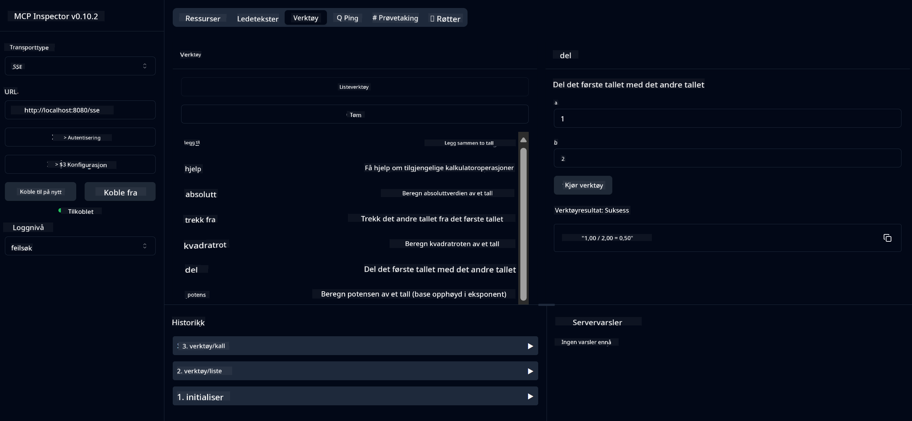

<!--
CO_OP_TRANSLATOR_METADATA:
{
  "original_hash": "13231e9951b68efd9df8c56bd5cdb27e",
  "translation_date": "2025-07-13T22:27:59+00:00",
  "source_file": "03-GettingStarted/samples/java/calculator/README.md",
  "language_code": "no"
}
-->
# Basic Calculator MCP Service

Denne tjenesten tilbyr grunnleggende kalkulatoroperasjoner gjennom Model Context Protocol (MCP) ved bruk av Spring Boot med WebFlux transport. Den er laget som et enkelt eksempel for nybegynnere som lærer om MCP-implementasjoner.

For mer informasjon, se referansedokumentasjonen for [MCP Server Boot Starter](https://docs.spring.io/spring-ai/reference/api/mcp/mcp-server-boot-starter-docs.html).

## Oversikt

Tjenesten viser:
- Støtte for SSE (Server-Sent Events)
- Automatisk verktøyregistrering ved bruk av Spring AI sin `@Tool`-annotasjon
- Grunnleggende kalkulatorfunksjoner:
  - Addisjon, subtraksjon, multiplikasjon, divisjon
  - Potensberegning og kvadratrot
  - Modulus (rest) og absoluttverdi
  - Hjelpefunksjon for beskrivelse av operasjoner

## Funksjoner

Denne kalkulatortjenesten tilbyr følgende muligheter:

1. **Grunnleggende aritmetiske operasjoner**:
   - Addisjon av to tall
   - Subtraksjon av ett tall fra et annet
   - Multiplikasjon av to tall
   - Divisjon av ett tall med et annet (med sjekk for null-divisjon)

2. **Avanserte operasjoner**:
   - Potensberegning (heve en base til en eksponent)
   - Kvadratrotberegning (med sjekk for negative tall)
   - Modulus (rest) beregning
   - Absoluttverdi beregning

3. **Hjelpesystem**:
   - Innebygd hjelpefunksjon som forklarer alle tilgjengelige operasjoner

## Bruke tjenesten

Tjenesten eksponerer følgende API-endepunkter gjennom MCP-protokollen:

- `add(a, b)`: Legg sammen to tall
- `subtract(a, b)`: Trekk det andre tallet fra det første
- `multiply(a, b)`: Multipliser to tall
- `divide(a, b)`: Del det første tallet med det andre (med null-sjekk)
- `power(base, exponent)`: Beregn potens av et tall
- `squareRoot(number)`: Beregn kvadratroten (med sjekk for negative tall)
- `modulus(a, b)`: Beregn resten ved divisjon
- `absolute(number)`: Beregn absoluttverdien
- `help()`: Få informasjon om tilgjengelige operasjoner

## Testklient

En enkel testklient er inkludert i pakken `com.microsoft.mcp.sample.client`. Klassen `SampleCalculatorClient` demonstrerer de tilgjengelige operasjonene i kalkulatortjenesten.

## Bruke LangChain4j-klienten

Prosjektet inkluderer et eksempel på LangChain4j-klient i `com.microsoft.mcp.sample.client.LangChain4jClient` som viser hvordan man integrerer kalkulatortjenesten med LangChain4j og GitHub-modeller:

### Forutsetninger

1. **Oppsett av GitHub-token**:
   
   For å bruke GitHubs AI-modeller (som phi-4), trenger du et personlig tilgangstoken fra GitHub:

   a. Gå til innstillingene for GitHub-kontoen din: https://github.com/settings/tokens
   
   b. Klikk "Generate new token" → "Generate new token (classic)"
   
   c. Gi tokenet et beskrivende navn
   
   d. Velg følgende tillatelser:
      - `repo` (Full kontroll over private repositorier)
      - `read:org` (Les organisasjon og teammedlemskap, les organisasjonsprosjekter)
      - `gist` (Opprett gists)
      - `user:email` (Tilgang til brukerens e-postadresser (kun lesing))
   
   e. Klikk "Generate token" og kopier det nye tokenet
   
   f. Sett det som en miljøvariabel:
      
      På Windows:
      ```
      set GITHUB_TOKEN=your-github-token
      ```
      
      På macOS/Linux:
      ```bash
      export GITHUB_TOKEN=your-github-token
      ```

   g. For permanent oppsett, legg det til miljøvariablene via systeminnstillinger

2. Legg til LangChain4j GitHub-avhengigheten i prosjektet (allerede inkludert i pom.xml):
   ```xml
   <dependency>
       <groupId>dev.langchain4j</groupId>
       <artifactId>langchain4j-github</artifactId>
       <version>${langchain4j.version}</version>
   </dependency>
   ```

3. Sørg for at kalkulatorserveren kjører på `localhost:8080`

### Kjøre LangChain4j-klienten

Dette eksempelet viser:
- Tilkobling til kalkulator MCP-server via SSE-transport
- Bruk av LangChain4j for å lage en chatbot som benytter kalkulatoroperasjoner
- Integrasjon med GitHub AI-modeller (nå med phi-4 modellen)

Klienten sender følgende eksempelforespørsler for å demonstrere funksjonaliteten:
1. Beregning av summen av to tall
2. Finne kvadratroten av et tall
3. Få hjelp med informasjon om tilgjengelige kalkulatoroperasjoner

Kjør eksempelet og sjekk konsollutskriften for å se hvordan AI-modellen bruker kalkulatorverktøyene til å svare på spørsmål.

### Konfigurasjon av GitHub-modell

LangChain4j-klienten er konfigurert til å bruke GitHubs phi-4-modell med følgende innstillinger:

```java
ChatLanguageModel model = GitHubChatModel.builder()
    .apiKey(System.getenv("GITHUB_TOKEN"))
    .timeout(Duration.ofSeconds(60))
    .modelName("phi-4")
    .logRequests(true)
    .logResponses(true)
    .build();
```

For å bruke andre GitHub-modeller, endre bare `modelName`-parameteren til en annen støttet modell (f.eks. "claude-3-haiku-20240307", "llama-3-70b-8192", osv.).

## Avhengigheter

Prosjektet krever følgende viktige avhengigheter:

```xml
<!-- For MCP Server -->
<dependency>
    <groupId>org.springframework.ai</groupId>
    <artifactId>spring-ai-starter-mcp-server-webflux</artifactId>
</dependency>

<!-- For LangChain4j integration -->
<dependency>
    <groupId>dev.langchain4j</groupId>
    <artifactId>langchain4j-mcp</artifactId>
    <version>${langchain4j.version}</version>
</dependency>

<!-- For GitHub models support -->
<dependency>
    <groupId>dev.langchain4j</groupId>
    <artifactId>langchain4j-github</artifactId>
    <version>${langchain4j.version}</version>
</dependency>
```

## Bygge prosjektet

Bygg prosjektet med Maven:
```bash
./mvnw clean install -DskipTests
```

## Kjøre serveren

### Bruke Java

```bash
java -jar target/calculator-server-0.0.1-SNAPSHOT.jar
```

### Bruke MCP Inspector

MCP Inspector er et nyttig verktøy for å samhandle med MCP-tjenester. For å bruke det med denne kalkulatortjenesten:

1. **Installer og kjør MCP Inspector** i et nytt terminalvindu:
   ```bash
   npx @modelcontextprotocol/inspector
   ```

2. **Åpne webgrensesnittet** ved å klikke på URL-en som vises i appen (vanligvis http://localhost:6274)

3. **Konfigurer tilkoblingen**:
   - Sett transporttypen til "SSE"
   - Sett URL til SSE-endepunktet på din kjørende server: `http://localhost:8080/sse`
   - Klikk "Connect"

4. **Bruk verktøyene**:
   - Klikk "List Tools" for å se tilgjengelige kalkulatoroperasjoner
   - Velg et verktøy og klikk "Run Tool" for å utføre en operasjon



### Bruke Docker

Prosjektet inkluderer en Dockerfile for containerisert distribusjon:

1. **Bygg Docker-imaget**:
   ```bash
   docker build -t calculator-mcp-service .
   ```

2. **Kjør Docker-containeren**:
   ```bash
   docker run -p 8080:8080 calculator-mcp-service
   ```

Dette vil:
- Bygge et multi-stage Docker-image med Maven 3.9.9 og Eclipse Temurin 24 JDK
- Lage et optimalisert container-image
- Eksponere tjenesten på port 8080
- Starte MCP kalkulatortjenesten inne i containeren

Du kan få tilgang til tjenesten på `http://localhost:8080` når containeren kjører.

## Feilsøking

### Vanlige problemer med GitHub-token

1. **Token-tillatelsesproblemer**: Hvis du får en 403 Forbidden-feil, sjekk at tokenet ditt har riktige tillatelser som beskrevet i forutsetningene.

2. **Token ikke funnet**: Hvis du får feilmeldingen "No API key found", sørg for at miljøvariabelen GITHUB_TOKEN er riktig satt.

3. **Begrensning av forespørsler**: GitHub API har begrensninger på antall forespørsler. Hvis du får en rate limit-feil (statuskode 429), vent noen minutter før du prøver igjen.

4. **Token-utløp**: GitHub-tokener kan utløpe. Hvis du får autentiseringsfeil etter en stund, generer et nytt token og oppdater miljøvariabelen.

Hvis du trenger mer hjelp, sjekk [LangChain4j-dokumentasjonen](https://github.com/langchain4j/langchain4j) eller [GitHub API-dokumentasjonen](https://docs.github.com/en/rest).

**Ansvarsfraskrivelse**:  
Dette dokumentet er oversatt ved hjelp av AI-oversettelsestjenesten [Co-op Translator](https://github.com/Azure/co-op-translator). Selv om vi streber etter nøyaktighet, vennligst vær oppmerksom på at automatiske oversettelser kan inneholde feil eller unøyaktigheter. Det opprinnelige dokumentet på originalspråket skal anses som den autoritative kilden. For kritisk informasjon anbefales profesjonell menneskelig oversettelse. Vi er ikke ansvarlige for eventuelle misforståelser eller feiltolkninger som oppstår ved bruk av denne oversettelsen.