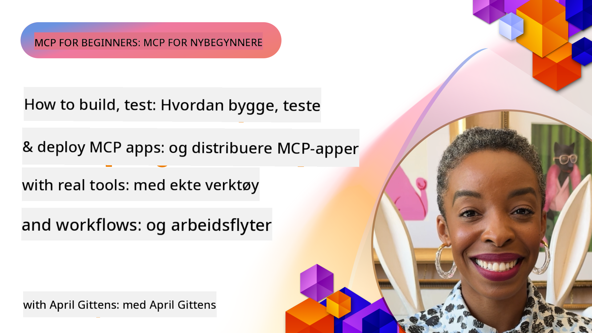

<!--
CO_OP_TRANSLATOR_METADATA:
{
  "original_hash": "83efa75a69bc831277263a6f1ae53669",
  "translation_date": "2025-08-18T15:36:11+00:00",
  "source_file": "04-PracticalImplementation/README.md",
  "language_code": "no"
}
-->
# Praktisk Implementering

[](https://youtu.be/vCN9-mKBDfQ)

_(Klikk på bildet over for å se videoen til denne leksjonen)_

Praktisk implementering er der kraften i Model Context Protocol (MCP) blir håndgripelig. Selv om det er viktig å forstå teorien og arkitekturen bak MCP, kommer den virkelige verdien frem når du bruker disse konseptene til å bygge, teste og distribuere løsninger som løser reelle problemer. Dette kapittelet bygger bro mellom konseptuell kunnskap og praktisk utvikling, og veileder deg gjennom prosessen med å bringe MCP-baserte applikasjoner til live.

Enten du utvikler intelligente assistenter, integrerer AI i forretningsprosesser, eller bygger skreddersydde verktøy for databehandling, gir MCP et fleksibelt fundament. Dets språkagnostiske design og offisielle SDK-er for populære programmeringsspråk gjør det tilgjengelig for et bredt spekter av utviklere. Ved å bruke disse SDK-ene kan du raskt prototype, iterere og skalere løsningene dine på tvers av ulike plattformer og miljøer.

I de følgende seksjonene finner du praktiske eksempler, eksempelkode og distribusjonsstrategier som viser hvordan du implementerer MCP i C#, Java med Spring, TypeScript, JavaScript og Python. Du vil også lære hvordan du feilsøker og tester MCP-servere, administrerer API-er og distribuerer løsninger til skyen ved hjelp av Azure. Disse praktiske ressursene er designet for å akselerere læringen din og hjelpe deg med å bygge robuste, produksjonsklare MCP-applikasjoner med selvtillit.

## Oversikt

Denne leksjonen fokuserer på praktiske aspekter ved MCP-implementering på tvers av flere programmeringsspråk. Vi skal utforske hvordan du bruker MCP SDK-er i C#, Java med Spring, TypeScript, JavaScript og Python for å bygge robuste applikasjoner, feilsøke og teste MCP-servere, og lage gjenbrukbare ressurser, oppfordringer og verktøy.

## Læringsmål

Ved slutten av denne leksjonen vil du kunne:

- Implementere MCP-løsninger ved hjelp av offisielle SDK-er i ulike programmeringsspråk
- Systematisk feilsøke og teste MCP-servere
- Lage og bruke serverfunksjoner (Ressurser, Oppfordringer og Verktøy)
- Designe effektive MCP-arbeidsflyter for komplekse oppgaver
- Optimalisere MCP-implementeringer for ytelse og pålitelighet

## Offisielle SDK-ressurser

Model Context Protocol tilbyr offisielle SDK-er for flere språk:

- [C# SDK](https://github.com/modelcontextprotocol/csharp-sdk)
- [Java med Spring SDK](https://github.com/modelcontextprotocol/java-sdk) **Merk:** krever avhengighet til [Project Reactor](https://projectreactor.io). (Se [diskusjonsinnlegg 246](https://github.com/orgs/modelcontextprotocol/discussions/246).)
- [TypeScript SDK](https://github.com/modelcontextprotocol/typescript-sdk)
- [Python SDK](https://github.com/modelcontextprotocol/python-sdk)
- [Kotlin SDK](https://github.com/modelcontextprotocol/kotlin-sdk)

## Arbeide med MCP SDK-er

Denne seksjonen gir praktiske eksempler på implementering av MCP på tvers av flere programmeringsspråk. Du finner eksempelkode i `samples`-katalogen organisert etter språk.

### Tilgjengelige Eksempler

Repositoryet inkluderer [eksempelimplementeringer](../../../04-PracticalImplementation/samples) i følgende språk:

- [C#](./samples/csharp/README.md)
- [Java med Spring](./samples/java/containerapp/README.md)
- [TypeScript](./samples/typescript/README.md)
- [JavaScript](./samples/javascript/README.md)
- [Python](./samples/python/README.md)

Hvert eksempel demonstrerer viktige MCP-konsepter og implementeringsmønstre for det spesifikke språket og økosystemet.

## Kjernefunksjoner for Server

MCP-servere kan implementere en hvilken som helst kombinasjon av disse funksjonene:

### Ressurser

Ressurser gir kontekst og data for brukeren eller AI-modellen:

- Dokumentarkiver
- Kunnskapsbaser
- Strukturerte datakilder
- Filsystemer

### Oppfordringer

Oppfordringer er malbaserte meldinger og arbeidsflyter for brukere:

- Forhåndsdefinerte samtalemaler
- Veiledede interaksjonsmønstre
- Spesialiserte dialogstrukturer

### Verktøy

Verktøy er funksjoner som AI-modellen kan utføre:

- Databehandlingsverktøy
- Eksterne API-integrasjoner
- Beregningskapasiteter
- Søkemuligheter

## Eksempelimplementeringer: C# Implementering

Det offisielle C# SDK-repositoryet inneholder flere eksempelimplementeringer som demonstrerer ulike aspekter av MCP:

- **Grunnleggende MCP-klient**: Enkelt eksempel som viser hvordan man oppretter en MCP-klient og kaller verktøy
- **Grunnleggende MCP-server**: Minimal serverimplementering med grunnleggende verktøyregistrering
- **Avansert MCP-server**: Fullverdig server med verktøyregistrering, autentisering og feilhåndtering
- **ASP.NET-integrasjon**: Eksempler som demonstrerer integrasjon med ASP.NET Core
- **Mønstre for verktøyimplementering**: Ulike mønstre for implementering av verktøy med ulik kompleksitet

C# MCP SDK er i forhåndsvisning, og API-er kan endres. Vi vil kontinuerlig oppdatere denne bloggen etter hvert som SDK-en utvikler seg.

### Nøkkelfunksjoner

- [C# MCP Nuget ModelContextProtocol](https://www.nuget.org/packages/ModelContextProtocol)
- Bygg din [første MCP-server](https://devblogs.microsoft.com/dotnet/build-a-model-context-protocol-mcp-server-in-csharp/).

For komplette C#-implementeringseksempler, besøk [det offisielle C# SDK-eksempelsrepositoryet](https://github.com/modelcontextprotocol/csharp-sdk)

## Eksempelimplementering: Java med Spring Implementering

Java med Spring SDK tilbyr robuste MCP-implementeringsalternativer med funksjoner på bedriftsnivå.

### Nøkkelfunksjoner

- Integrasjon med Spring Framework
- Sterk typesikkerhet
- Støtte for reaktiv programmering
- Omfattende feilhåndtering

For et komplett Java med Spring-implementeringseksempel, se [Java med Spring-eksempel](samples/java/containerapp/README.md) i eksempelkatalogen.

## Eksempelimplementering: JavaScript Implementering

JavaScript SDK gir en lett og fleksibel tilnærming til MCP-implementering.

### Nøkkelfunksjoner

- Støtte for Node.js og nettleser
- Promise-basert API
- Enkel integrasjon med Express og andre rammeverk
- WebSocket-støtte for strømming

For et komplett JavaScript-implementeringseksempel, se [JavaScript-eksempel](samples/javascript/README.md) i eksempelkatalogen.

## Eksempelimplementering: Python Implementering

Python SDK tilbyr en Pythonisk tilnærming til MCP-implementering med utmerket integrasjon med ML-rammeverk.

### Nøkkelfunksjoner

- Støtte for async/await med asyncio
- FastAPI-integrasjon
- Enkel verktøyregistrering
- Naturlig integrasjon med populære ML-biblioteker

For et komplett Python-implementeringseksempel, se [Python-eksempel](samples/python/README.md) i eksempelkatalogen.

## API-administrasjon

Azure API Management er et utmerket svar på hvordan vi kan sikre MCP-servere. Ideen er å plassere en Azure API Management-instans foran MCP-serveren din og la den håndtere funksjoner du sannsynligvis vil ha, som:

- hastighetsbegrensning
- tokenadministrasjon
- overvåking
- lastbalansering
- sikkerhet

### Azure Eksempel

Her er et Azure-eksempel som gjør akkurat dette, nemlig [opprette en MCP-server og sikre den med Azure API Management](https://github.com/Azure-Samples/remote-mcp-apim-functions-python).

Se hvordan autorisasjonsflyten skjer i bildet nedenfor:


I bildet ovenfor skjer følgende:

- Autentisering/autorisasjon skjer ved hjelp av Microsoft Entra.
- Azure API Management fungerer som en gateway og bruker policyer for å dirigere og administrere trafikk.
- Azure Monitor logger alle forespørsler for videre analyse.

#### Autorisasjonsflyt

La oss se nærmere på autorisasjonsflyten:


#### MCP-autorisasjonsspesifikasjon

Lær mer om [MCP-autorisasjonsspesifikasjonen](https://modelcontextprotocol.io/specification/2025-03-26/basic/authorization#2-10-third-party-authorization-flow)

## Distribuer Remote MCP-server til Azure

La oss se om vi kan distribuere eksempelet vi nevnte tidligere:

1. Klon repoet

    ```bash
    git clone https://github.com/Azure-Samples/remote-mcp-apim-functions-python.git
    cd remote-mcp-apim-functions-python
    ```

1. Registrer `Microsoft.App` ressursleverandør.

   - Hvis du bruker Azure CLI, kjør `az provider register --namespace Microsoft.App --wait`.
   - Hvis du bruker Azure PowerShell, kjør `Register-AzResourceProvider -ProviderNamespace Microsoft.App`. Deretter kjør `(Get-AzResourceProvider -ProviderNamespace Microsoft.App).RegistrationState` etter en stund for å sjekke om registreringen er fullført.

1. Kjør denne [azd](https://aka.ms/azd)-kommandoen for å klargjøre API-administrasjonstjenesten, funksjonsappen (med kode) og alle andre nødvendige Azure-ressurser

    ```shell
    azd up
    ```

    Denne kommandoen bør distribuere alle skyressurser på Azure

### Teste serveren din med MCP Inspector

1. I et **nytt terminalvindu**, installer og kjør MCP Inspector

    ```shell
    npx @modelcontextprotocol/inspector
    ```

    Du bør se et grensesnitt som ligner på:

    

1. CTRL-klikk for å laste MCP Inspector webapp fra URL-en som vises av appen (f.eks. [http://127.0.0.1:6274/#resources](http://127.0.0.1:6274/#resources))
1. Sett transporttypen til `SSE`
1. Sett URL-en til din kjørende API Management SSE-endepunkt som vises etter `azd up` og **Koble til**:

    ```shell
    https://<apim-servicename-from-azd-output>.azure-api.net/mcp/sse
    ```

1. **List Verktøy**. Klikk på et verktøy og **Kjør Verktøy**.  

Hvis alle trinnene har fungert, bør du nå være koblet til MCP-serveren og ha vært i stand til å kalle et verktøy.

## MCP-servere for Azure

[Remote-mcp-functions](https://github.com/Azure-Samples/remote-mcp-functions-dotnet): Dette settet med repositories er en hurtigstartmal for å bygge og distribuere tilpassede eksterne MCP (Model Context Protocol)-servere ved hjelp av Azure Functions med Python, C# .NET eller Node/TypeScript.

Eksemplene gir en komplett løsning som lar utviklere:

- Bygge og kjøre lokalt: Utvikle og feilsøke en MCP-server på en lokal maskin
- Distribuere til Azure: Enkelt distribuere til skyen med en enkel `azd up`-kommando
- Koble fra klienter: Koble til MCP-serveren fra ulike klienter, inkludert VS Codes Copilot-agentmodus og MCP Inspector-verktøyet

### Nøkkelfunksjoner

- Sikkerhet som standard: MCP-serveren er sikret ved hjelp av nøkler og HTTPS
- Autentiseringsalternativer: Støtter OAuth ved hjelp av innebygd autentisering og/eller API Management
- Nettverksisolasjon: Tillater nettverksisolasjon ved bruk av Azure Virtual Networks (VNET)
- Serverløs arkitektur: Utnytter Azure Functions for skalerbar, hendelsesdrevet utførelse
- Lokal utvikling: Omfattende støtte for lokal utvikling og feilsøking
- Enkel distribusjon: Strømlinjeformet distribusjonsprosess til Azure

Repositoryet inkluderer alle nødvendige konfigurasjonsfiler, kildekode og infrastrukturbeskrivelser for raskt å komme i gang med en produksjonsklar MCP-serverimplementering.

- [Azure Remote MCP Functions Python](https://github.com/Azure-Samples/remote-mcp-functions-python) - Eksempelimplementering av MCP ved bruk av Azure Functions med Python

- [Azure Remote MCP Functions .NET](https://github.com/Azure-Samples/remote-mcp-functions-dotnet) - Eksempelimplementering av MCP ved bruk av Azure Functions med C# .NET

- [Azure Remote MCP Functions Node/Typescript](https://github.com/Azure-Samples/remote-mcp-functions-typescript) - Eksempelimplementering av MCP ved bruk av Azure Functions med Node/TypeScript.

## Viktige Punkter

- MCP SDK-er gir språkspesifikke verktøy for å implementere robuste MCP-løsninger
- Feilsøkings- og testprosessen er avgjørende for pålitelige MCP-applikasjoner
- Gjenbrukbare oppfordringsmaler muliggjør konsistente AI-interaksjoner
- Velutformede arbeidsflyter kan orkestrere komplekse oppgaver ved bruk av flere verktøy
- Implementering av MCP-løsninger krever hensyn til sikkerhet, ytelse og feilhåndtering

## Oppgave

Design en praktisk MCP-arbeidsflyt som adresserer et reelt problem i ditt domene:

1. Identifiser 3-4 verktøy som vil være nyttige for å løse dette problemet
2. Lag et arbeidsflytdiagram som viser hvordan disse verktøyene samhandler
3. Implementer en grunnleggende versjon av ett av verktøyene ved hjelp av ditt foretrukne språk
4. Lag en oppfordringsmal som vil hjelpe modellen med å effektivt bruke verktøyet ditt

## Tilleggsressurser

---

Neste: [Avanserte Emner](../05-AdvancedTopics/README.md)

**Ansvarsfraskrivelse**:  
Dette dokumentet er oversatt ved hjelp av AI-oversettelsestjenesten [Co-op Translator](https://github.com/Azure/co-op-translator). Selv om vi tilstreber nøyaktighet, vær oppmerksom på at automatiserte oversettelser kan inneholde feil eller unøyaktigheter. Det originale dokumentet på sitt opprinnelige språk bør anses som den autoritative kilden. For kritisk informasjon anbefales profesjonell menneskelig oversettelse. Vi er ikke ansvarlige for misforståelser eller feiltolkninger som oppstår ved bruk av denne oversettelsen.