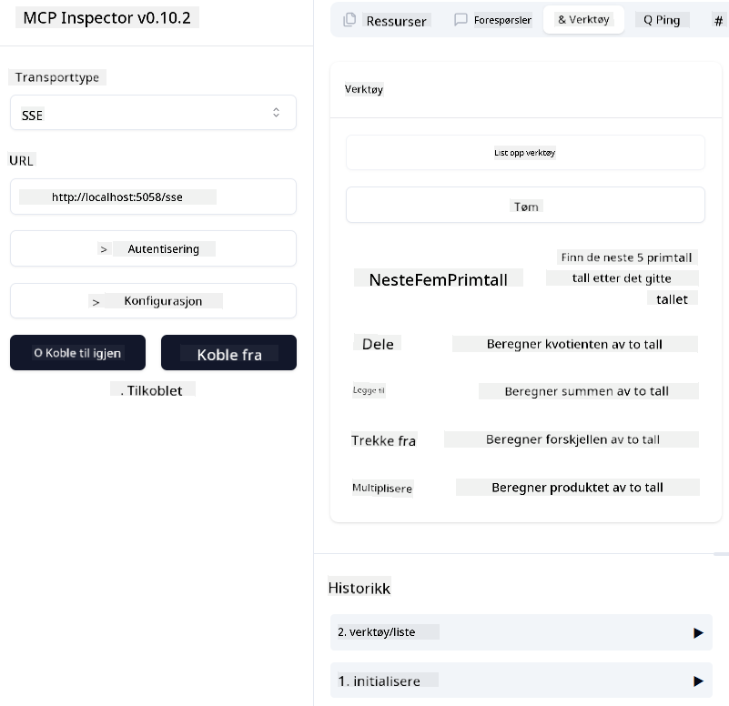
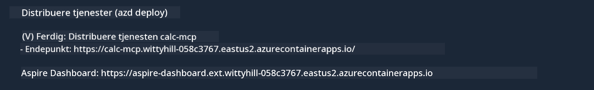

<!--
CO_OP_TRANSLATOR_METADATA:
{
  "original_hash": "5020a3e1a1c7f30c00f9e37f1fa208e3",
  "translation_date": "2025-05-17T14:09:37+00:00",
  "source_file": "04-PracticalImplementation/samples/csharp/README.md",
  "language_code": "no"
}
-->
# Sample

Eksemplet ovenfor viser hvordan du kan bruke et lokalt .NET-prosjekt med `sdio`-typen. Og hvordan du kan kjøre serveren lokalt i en container. Dette er en god løsning i mange situasjoner. Men det kan være nyttig å ha serveren kjørende eksternt, som i et sky-miljø. Det er her `http`-typen kommer inn.

Når du ser på løsningen i `04-PracticalImplementation`-mappen, kan det virke mye mer komplisert enn den forrige. Men i virkeligheten er det ikke det. Hvis du ser nøye på prosjektet `src/mcpserver/mcpserver.csproj`, vil du se at det stort sett er den samme koden som i det forrige eksemplet. Den eneste forskjellen er at vi bruker et annet bibliotek `ModelContextProtocol.AspNetCore` for å håndtere HTTP-forespørsler. Og vi endrer metoden `IsPrime` for å gjøre den privat, bare for å vise at du kan ha private metoder i koden din. Resten av koden er den samme som før.

De andre prosjektene er fra [.NET Aspire](https://learn.microsoft.com/dotnet/aspire/get-started/aspire-overview). Å ha .NET Aspire i løsningen vil forbedre utviklerens opplevelse mens de utvikler og tester og hjelpe med observabilitet. Det er ikke nødvendig for å kjøre serveren, men det er en god praksis å ha det i løsningen din.

## Start serveren lokalt

1. Fra VS Code (med C# DevKit-utvidelsen), åpne løsningen `04-PracticalImplementation\samples\csharp\src\Calculator-chap4.sln`.
2. Trykk `F5` for å starte serveren. Det bør starte en nettleser med .NET Aspire-dashbordet.

eller

1. Fra en terminal, naviger til mappen `04-PracticalImplementation\samples\csharp\src`
2. Utfør følgende kommando for å starte serveren:
   ```bash
    dotnet run --project .\AppHost
   ```

3. Fra Dashboardet, merk deg `http`-URL-en. Det bør være noe som `http://localhost:5058/`.

## Test `SSE` med ModelContext Protocol Inspector

Hvis du har Node.js 22.7.5 og høyere, kan du bruke ModelContext Protocol Inspector til å teste serveren din.

Start serveren og kjør følgende kommando i en terminal:

```bash
npx @modelcontextprotocol/inspector@latest
```



- Velg `SSE` as the Transport type. SSE stand for Server-Sent Events. 
- In the Url field, enter the URL of the server noted earlier,and append `/sse`. Det bør være `http` (ikke `https`) something like `http://localhost:5058/sse`.
- select the Connect button.

A nice thing about the Inspector is that it provide a nice visibility on what is happening.

- Try listing the availables tools
- Try some of them, it should works just like before.


## Test `SSE` with Github Copilot Chat in VS Code

To use the `SSE` transport with Github Copilot Chat, change the configuration of the `mcp-calc` server opprettet tidligere for å se slik ut:

```json
"mcp-calc": {
    "type": "sse",
    "url": "http://localhost:5058/sse"
}
```

Gjennomfør noen tester:
- Be om de 3 primtallene etter 6780. Legg merke til hvordan Copilot vil bruke de nye verktøyene `NextFivePrimeNumbers` og bare returnere de første 3 primtallene.
- Be om de 7 primtallene etter 111, for å se hva som skjer.

# Deployer serveren til Azure

La oss deployere serveren til Azure slik at flere kan bruke den.

Fra en terminal, naviger til mappen `04-PracticalImplementation\samples\csharp\src` og kjør følgende kommando:

```bash
azd init
```

Dette vil opprette noen filer lokalt for å lagre konfigurasjonen av Azure-ressurser, og din Infrastructure as Code (IaC).

Deretter, kjør følgende kommando for å deployere serveren til Azure:

```bash
azd up
```

Når deployeringen er ferdig, bør du se en melding som dette:



Naviger til Aspire-dashbordet og merk deg `HTTP`-URL-en for å bruke den i MCP Inspector og i Github Copilot Chat.

## Hva skjer videre?

Vi prøver forskjellige transporttyper, testverktøy og vi deployer også vår MCP-server til Azure. Men hva hvis serveren vår trenger tilgang til private ressurser? For eksempel, en database eller en privat API? I neste kapittel vil vi se hvordan vi kan forbedre sikkerheten til serveren vår.

I'm sorry, but it seems like there might be a typo in your request. If you meant to translate the text to Norwegian (abbreviated as "no" for the language code), here is the translation:

**Ansvarsfraskrivelse**:  
Dette dokumentet er oversatt ved hjelp av AI-oversettelsestjenesten [Co-op Translator](https://github.com/Azure/co-op-translator). Selv om vi streber etter nøyaktighet, vær oppmerksom på at automatiserte oversettelser kan inneholde feil eller unøyaktigheter. Det originale dokumentet på sitt opprinnelige språk bør betraktes som den autoritative kilden. For kritisk informasjon anbefales profesjonell menneskelig oversettelse. Vi er ikke ansvarlige for misforståelser eller feiltolkninger som oppstår ved bruk av denne oversettelsen.