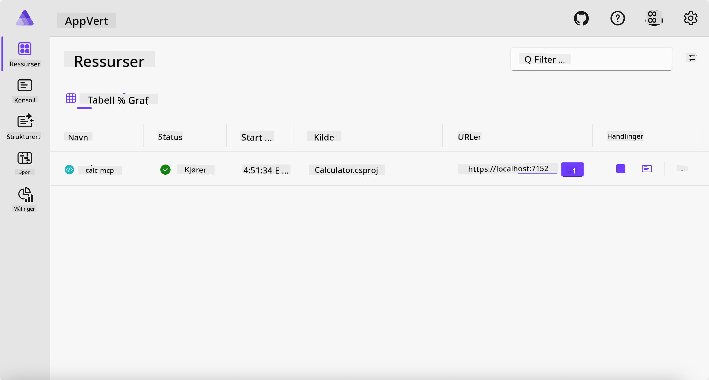
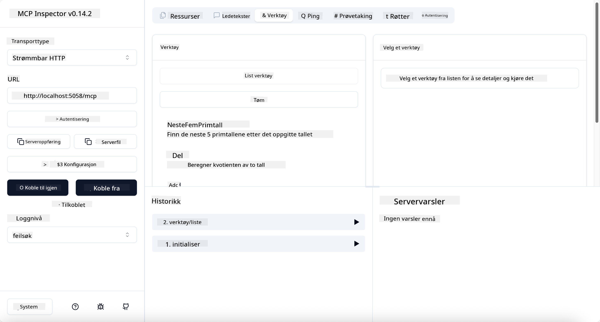
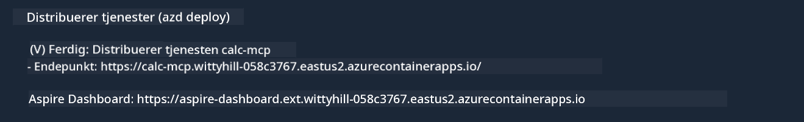

<!--
CO_OP_TRANSLATOR_METADATA:
{
  "original_hash": "0bc7bd48f55f1565f1d95ccb2c16f728",
  "translation_date": "2025-07-13T23:07:41+00:00",
  "source_file": "04-PracticalImplementation/samples/csharp/README.md",
  "language_code": "no"
}
-->
# Eksempel

Det forrige eksempelet viser hvordan man bruker et lokalt .NET-prosjekt med `stdio`-typen. Og hvordan man kjører serveren lokalt i en container. Dette er en god løsning i mange situasjoner. Men det kan være nyttig å ha serveren kjørende eksternt, for eksempel i et sky-miljø. Her kommer `http`-typen inn i bildet.

Hvis du ser på løsningen i `04-PracticalImplementation`-mappen, kan det virke mye mer komplisert enn det forrige eksempelet. Men i realiteten er det ikke det. Hvis du ser nøye på prosjektet `src/Calculator`, vil du se at det stort sett er samme kode som i det forrige eksempelet. Den eneste forskjellen er at vi bruker et annet bibliotek, `ModelContextProtocol.AspNetCore`, for å håndtere HTTP-forespørsler. Og vi endrer metoden `IsPrime` til å være privat, bare for å vise at du kan ha private metoder i koden din. Resten av koden er den samme som før.

De andre prosjektene er fra [.NET Aspire](https://learn.microsoft.com/dotnet/aspire/get-started/aspire-overview). Å ha .NET Aspire i løsningen vil forbedre utvikleropplevelsen under utvikling og testing, og hjelpe med observabilitet. Det er ikke nødvendig for å kjøre serveren, men det er en god praksis å ha det i løsningen din.

## Start serveren lokalt

1. Fra VS Code (med C# DevKit-utvidelsen), naviger til `04-PracticalImplementation/samples/csharp`-mappen.
1. Kjør følgende kommando for å starte serveren:

   ```bash
    dotnet watch run --project ./src/AppHost
   ```

1. Når en nettleser åpner .NET Aspire-dashboardet, legg merke til `http`-URL-en. Den bør være noe som `http://localhost:5058/`.

   

## Test Streamable HTTP med MCP Inspector

Hvis du har Node.js 22.7.5 eller nyere, kan du bruke MCP Inspector for å teste serveren din.

Start serveren og kjør følgende kommando i en terminal:

```bash
npx @modelcontextprotocol/inspector http://localhost:5058
```



- Velg `Streamable HTTP` som Transport-type.
- I Url-feltet skriver du inn URL-en til serveren du noterte tidligere, og legger til `/mcp`. Det skal være `http` (ikke `https`), noe som ligner på `http://localhost:5058/mcp`.
- Velg Connect-knappen.

En fin ting med Inspector er at den gir god oversikt over hva som skjer.

- Prøv å liste opp tilgjengelige verktøy
- Prøv noen av dem, det skal fungere som før.

## Test MCP Server med GitHub Copilot Chat i VS Code

For å bruke Streamable HTTP-transporten med GitHub Copilot Chat, endre konfigurasjonen av `calc-mcp`-serveren som ble opprettet tidligere til å se slik ut:

```jsonc
// .vscode/mcp.json
{
  "servers": {
    "calc-mcp": {
      "type": "http",
      "url": "http://localhost:5058/mcp"
    }
  }
}
```

Gjør noen tester:

- Be om "3 prime numbers after 6780". Legg merke til hvordan Copilot bruker de nye verktøyene `NextFivePrimeNumbers` og bare returnerer de første 3 primtallene.
- Be om "7 prime numbers after 111", for å se hva som skjer.
- Be om "John has 24 lollies and wants to distribute them all to his 3 kids. How many lollies does each kid have?", for å se hva som skjer.

## Distribuer serveren til Azure

La oss distribuere serveren til Azure slik at flere kan bruke den.

Fra en terminal, naviger til mappen `04-PracticalImplementation/samples/csharp` og kjør følgende kommando:

```bash
azd up
```

Når distribusjonen er ferdig, bør du se en melding som denne:



Ta tak i URL-en og bruk den i MCP Inspector og i GitHub Copilot Chat.

```jsonc
// .vscode/mcp.json
{
  "servers": {
    "calc-mcp": {
      "type": "http",
      "url": "https://calc-mcp.gentleriver-3977fbcf.australiaeast.azurecontainerapps.io/mcp"
    }
  }
}
```

## Hva nå?

Vi har prøvd forskjellige transporttyper og testverktøy. Vi har også distribuert MCP-serveren din til Azure. Men hva om serveren vår trenger tilgang til private ressurser? For eksempel en database eller en privat API? I neste kapittel skal vi se på hvordan vi kan forbedre sikkerheten til serveren vår.

**Ansvarsfraskrivelse**:  
Dette dokumentet er oversatt ved hjelp av AI-oversettelsestjenesten [Co-op Translator](https://github.com/Azure/co-op-translator). Selv om vi streber etter nøyaktighet, vennligst vær oppmerksom på at automatiske oversettelser kan inneholde feil eller unøyaktigheter. Det opprinnelige dokumentet på originalspråket skal anses som den autoritative kilden. For kritisk informasjon anbefales profesjonell menneskelig oversettelse. Vi er ikke ansvarlige for eventuelle misforståelser eller feiltolkninger som oppstår ved bruk av denne oversettelsen.