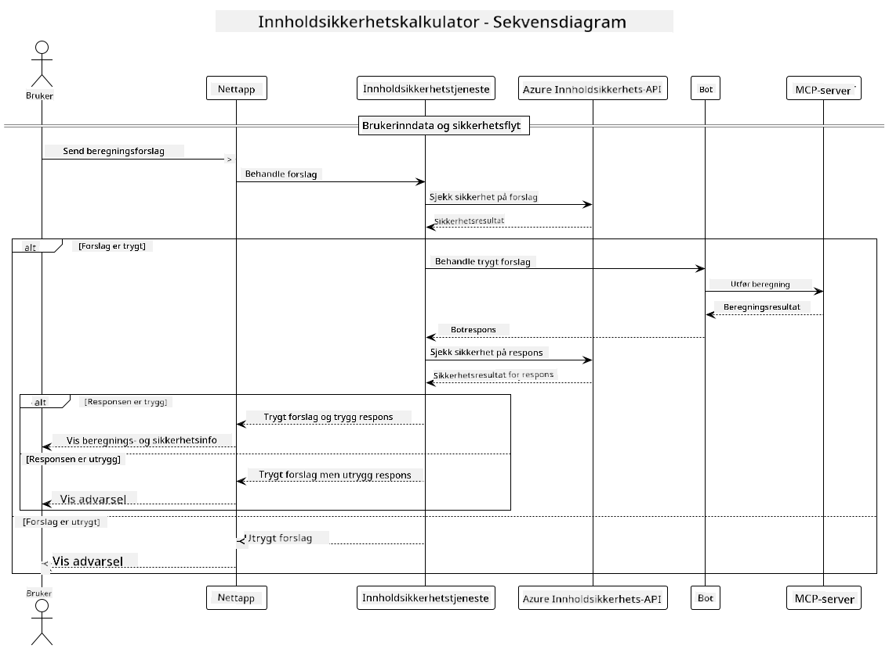

<!--
CO_OP_TRANSLATOR_METADATA:
{
  "original_hash": "e5ea5e7582f70008ea9bec3b3820f20a",
  "translation_date": "2025-05-17T14:28:01+00:00",
  "source_file": "04-PracticalImplementation/samples/java/containerapp/README.md",
  "language_code": "no"
}
-->
## Systemarkitektur

Dette prosjektet demonstrerer en nettapplikasjon som bruker innholdssikkerhetskontroll før brukerinstruksjoner sendes til en kalkulatortjeneste via Model Context Protocol (MCP).



### Hvordan Det Fungerer

1. **Brukerinndata**: Brukeren skriver inn en kalkulasjonsinstruksjon i webgrensesnittet.
2. **Innholdssikkerhetskontroll (Inndata)**: Instruksjonen analyseres av Azure Content Safety API.
3. **Sikkerhetsbeslutning (Inndata)**:
   - Hvis innholdet er trygt (alvorlighetsgrad < 2 i alle kategorier), går det videre til kalkulatoren.
   - Hvis innholdet er merket som potensielt skadelig, stopper prosessen og returnerer en advarsel.
4. **Kalkulatorintegrasjon**: Trygt innhold behandles av LangChain4j, som kommuniserer med MCP-kalkulatorserveren.
5. **Innholdssikkerhetskontroll (Utdata)**: Botens svar analyseres av Azure Content Safety API.
6. **Sikkerhetsbeslutning (Utdata)**:
   - Hvis botens svar er trygt, vises det til brukeren.
   - Hvis botens svar er merket som potensielt skadelig, erstattes det med en advarsel.
7. **Respons**: Resultater (hvis trygge) vises til brukeren sammen med begge sikkerhetsanalyser.

## Bruk av Model Context Protocol (MCP) med Kalkulatortjenester

Dette prosjektet demonstrerer hvordan man bruker Model Context Protocol (MCP) for å kalle kalkulator MCP-tjenester fra LangChain4j. Implementeringen bruker en lokal MCP-server som kjører på port 8080 for å tilby kalkulatoroperasjoner.

### Oppsett av Azure Content Safety Service

Før du bruker innholdssikkerhetsfunksjonene, må du opprette en Azure Content Safety-tjenesteressurs:

1. Logg inn på [Azure Portal](https://portal.azure.com)
2. Klikk "Opprett en ressurs" og søk etter "Content Safety"
3. Velg "Content Safety" og klikk "Opprett"
4. Skriv inn et unikt navn for ressursen din
5. Velg abonnementet og ressursgruppen din (eller opprett en ny)
6. Velg en støttet region (sjekk [Region tilgjengelighet](https://azure.microsoft.com/en-us/global-infrastructure/services/?products=cognitive-services) for detaljer)
7. Velg et passende prising nivå
8. Klikk "Opprett" for å distribuere ressursen
9. Når distribusjonen er fullført, klikk "Gå til ressurs"
10. I venstre panel, under "Ressursadministrasjon", velg "Nøkler og Endepunkt"
11. Kopier en av nøklene og endepunkt-URLen for bruk i neste steg

### Konfigurering av Miljøvariabler

Sett `GITHUB_TOKEN` miljøvariabelen for GitHub-modeller autentisering:
```sh
export GITHUB_TOKEN=<your_github_token>
```

For innholdssikkerhetsfunksjoner, sett:
```sh
export CONTENT_SAFETY_ENDPOINT=<your_content_safety_endpoint>
export CONTENT_SAFETY_KEY=<your_content_safety_key>
```

Disse miljøvariablene brukes av applikasjonen for å autentisere med Azure Content Safety-tjenesten. Hvis disse variablene ikke er satt, vil applikasjonen bruke plassholdere for demonstrasjonsformål, men innholdssikkerhetsfunksjonene vil ikke fungere riktig.

### Starte Kalkulator MCP-serveren

Før du kjører klienten, må du starte kalkulator MCP-serveren i SSE-modus på localhost:8080.

## Prosjektbeskrivelse

Dette prosjektet demonstrerer integrasjonen av Model Context Protocol (MCP) med LangChain4j for å kalle kalkulatortjenester. Nøkkelfunksjoner inkluderer:

- Bruk av MCP for å koble til en kalkulatortjeneste for grunnleggende matematiske operasjoner
- Dobbeltlags innholdssikkerhetskontroll på både brukerinstruksjoner og botsvar
- Integrasjon med GitHub's gpt-4.1-nano-modell via LangChain4j
- Bruk av Server-Sent Events (SSE) for MCP transport

## Innholdssikkerhetsintegrasjon

Prosjektet inkluderer omfattende innholdssikkerhetsfunksjoner for å sikre at både brukerinnspill og systemresponser er fri for skadelig innhold:

1. **Inndatakontroll**: Alle brukerinstruksjoner analyseres for skadelige innholdskategorier som hatprat, vold, selvskading og seksuelt innhold før behandling.

2. **Utdata kontroll**: Selv når du bruker potensielt usensurerte modeller, sjekker systemet alle genererte svar gjennom de samme innholdssikkerhetsfiltrene før de vises til brukeren.

Denne dobbeltlags tilnærmingen sikrer at systemet forblir trygt uavhengig av hvilken AI-modell som brukes, og beskytter brukere mot både skadelige innspill og potensielt problematiske AI-genererte utdata.

## Webklient

Applikasjonen inkluderer et brukervennlig webgrensesnitt som lar brukere samhandle med Content Safety Calculator-systemet:

### Webgrensesnittfunksjoner

- Enkel, intuitiv form for innskriving av kalkulasjonsinstruksjoner
- Dobbeltlags innholdssikkerhetsvalidering (inn- og utdata)
- Sanntids tilbakemelding på instruksjon og respons sikkerhet
- Fargekodede sikkerhetsindikatorer for enkel tolkning
- Rent, responsivt design som fungerer på ulike enheter
- Eksempel på trygge instruksjoner for å veilede brukere

### Bruk av Webklienten

1. Start applikasjonen:
   ```sh
   mvn spring-boot:run
   ```

2. Åpne nettleseren din og naviger til `http://localhost:8087`

3. Skriv inn en kalkulasjonsinstruksjon i det angitte tekstområdet (f.eks. "Beregn summen av 24.5 og 17.3")

4. Klikk "Send" for å behandle forespørselen din

5. Se resultatene, som vil inkludere:
   - Innholdssikkerhetsanalyse av instruksjonen din
   - Det beregnede resultatet (hvis instruksjonen var trygg)
   - Innholdssikkerhetsanalyse av botens svar
   - Eventuelle sikkerhetsadvarsler hvis enten inn- eller utdata ble merket

Webklienten håndterer automatisk begge innholdssikkerhetsverifiseringsprosesser, og sikrer at alle interaksjoner er trygge og passende uavhengig av hvilken AI-modell som brukes.

Sure, here's the translation to Norwegian:

**Ansvarsfraskrivelse**: 
Dette dokumentet er oversatt ved hjelp av AI-oversettelsestjenesten [Co-op Translator](https://github.com/Azure/co-op-translator). Selv om vi streber etter nøyaktighet, vær oppmerksom på at automatiserte oversettelser kan inneholde feil eller unøyaktigheter. Det originale dokumentet på dets opprinnelige språk bør betraktes som den autoritative kilden. For kritisk informasjon anbefales profesjonell menneskelig oversettelse. Vi er ikke ansvarlige for misforståelser eller feiltolkninger som oppstår fra bruken av denne oversettelsen.