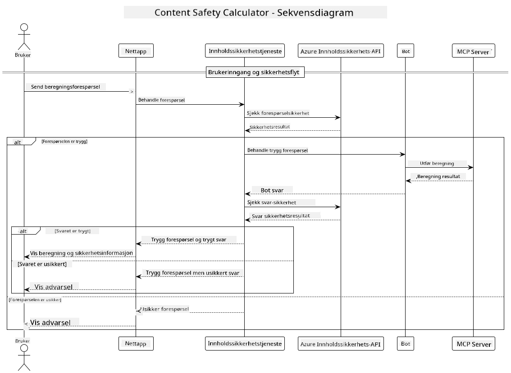

<!--
CO_OP_TRANSLATOR_METADATA:
{
  "original_hash": "e5ea5e7582f70008ea9bec3b3820f20a",
  "translation_date": "2025-07-13T23:17:20+00:00",
  "source_file": "04-PracticalImplementation/samples/java/containerapp/README.md",
  "language_code": "no"
}
-->
## Systemarkitektur

Dette prosjektet viser en webapplikasjon som bruker innholdssikkerhetssjekk før brukerforespørsler sendes til en kalkulatortjeneste via Model Context Protocol (MCP).



### Slik fungerer det

1. **Brukerinput**: Brukeren skriver inn en beregningsforespørsel i webgrensesnittet  
2. **Innholdssikkerhetssjekk (Input)**: Forespørselen analyseres av Azure Content Safety API  
3. **Sikkerhetsvurdering (Input)**:  
   - Hvis innholdet er trygt (alvorlighetsgrad < 2 i alle kategorier), går det videre til kalkulatoren  
   - Hvis innholdet er merket som potensielt skadelig, stoppes prosessen og en advarsel returneres  
4. **Kalkulatorintegrasjon**: Trygt innhold behandles av LangChain4j, som kommuniserer med MCP kalkulatorserver  
5. **Innholdssikkerhetssjekk (Output)**: Botens svar analyseres av Azure Content Safety API  
6. **Sikkerhetsvurdering (Output)**:  
   - Hvis botsvaret er trygt, vises det til brukeren  
   - Hvis botsvaret er merket som potensielt skadelig, erstattes det med en advarsel  
7. **Respons**: Resultatene (hvis trygge) vises til brukeren sammen med begge sikkerhetsanalyser

## Bruke Model Context Protocol (MCP) med kalkulatortjenester

Dette prosjektet viser hvordan man bruker Model Context Protocol (MCP) for å kalle kalkulator-MCP-tjenester fra LangChain4j. Implementeringen bruker en lokal MCP-server som kjører på port 8080 for å tilby kalkulatoroperasjoner.

### Sette opp Azure Content Safety Service

Før du bruker innholdssikkerhetsfunksjonene, må du opprette en Azure Content Safety-tjenesteressurs:

1. Logg inn på [Azure Portal](https://portal.azure.com)  
2. Klikk på "Create a resource" og søk etter "Content Safety"  
3. Velg "Content Safety" og klikk "Create"  
4. Skriv inn et unikt navn for ressursen din  
5. Velg abonnement og ressursgruppe (eller opprett en ny)  
6. Velg en støttet region (sjekk [Region availability](https://azure.microsoft.com/en-us/global-infrastructure/services/?products=cognitive-services) for detaljer)  
7. Velg en passende prisplan  
8. Klikk "Create" for å opprette ressursen  
9. Når distribusjonen er fullført, klikk "Go to resource"  
10. I venstre panel, under "Resource Management", velg "Keys and Endpoint"  
11. Kopier en av nøklene og endepunkt-URL-en for bruk i neste steg

### Konfigurere miljøvariabler

Sett miljøvariabelen `GITHUB_TOKEN` for autentisering av GitHub-modeller:  
```sh
export GITHUB_TOKEN=<your_github_token>
```

For innholdssikkerhetsfunksjoner, sett:  
```sh
export CONTENT_SAFETY_ENDPOINT=<your_content_safety_endpoint>
export CONTENT_SAFETY_KEY=<your_content_safety_key>
```

Disse miljøvariablene brukes av applikasjonen for å autentisere mot Azure Content Safety-tjenesten. Hvis disse variablene ikke er satt, vil applikasjonen bruke plassholderverdier for demonstrasjonsformål, men innholdssikkerhetsfunksjonene vil ikke fungere som de skal.

### Starte Calculator MCP Server

Før du kjører klienten, må du starte kalkulator MCP-serveren i SSE-modus på localhost:8080.

## Prosjektbeskrivelse

Dette prosjektet demonstrerer integrasjonen av Model Context Protocol (MCP) med LangChain4j for å kalle kalkulatortjenester. Hovedfunksjoner inkluderer:

- Bruke MCP for å koble til en kalkulatortjeneste for grunnleggende matematiske operasjoner  
- Dobbel lag med innholdssikkerhetssjekk på både brukerforespørsler og botsvar  
- Integrasjon med GitHubs gpt-4.1-nano-modell via LangChain4j  
- Bruke Server-Sent Events (SSE) for MCP-transport

## Innholdssikkerhetsintegrasjon

Prosjektet inkluderer omfattende innholdssikkerhetsfunksjoner for å sikre at både brukerinput og systemets svar er fri for skadelig innhold:

1. **Input-sjekk**: Alle brukerforespørsler analyseres for skadelige innholdskategorier som hatprat, vold, selvskading og seksuelt innhold før behandling.  

2. **Output-sjekk**: Selv når man bruker potensielt usensurerte modeller, sjekker systemet alle genererte svar gjennom de samme innholdssikkerhetsfiltrene før de vises til brukeren.

Denne to-lags tilnærmingen sikrer at systemet forblir trygt uansett hvilken AI-modell som brukes, og beskytter brukerne mot både skadelig input og potensielt problematiske AI-genererte svar.

## Webklient

Applikasjonen inkluderer et brukervennlig webgrensesnitt som lar brukere samhandle med Content Safety Calculator-systemet:

### Funksjoner i webgrensesnittet

- Enkelt og intuitivt skjema for å skrive inn beregningsforespørsler  
- Dobbel lag med innholdssikkerhetsvalidering (input og output)  
- Tilbakemelding i sanntid om sikkerheten til forespørsel og svar  
- Fargekodede sikkerhetsindikatorer for enkel tolkning  
- Rent, responsivt design som fungerer på ulike enheter  
- Eksempler på trygge forespørsler for å veilede brukerne

### Bruke webklienten

1. Start applikasjonen:  
   ```sh
   mvn spring-boot:run
   ```

2. Åpne nettleseren og gå til `http://localhost:8087`

3. Skriv inn en beregningsforespørsel i tekstfeltet (f.eks. "Calculate the sum of 24.5 and 17.3")

4. Klikk "Submit" for å sende forespørselen

5. Se resultatene, som vil inkludere:  
   - Innholdssikkerhetsanalyse av forespørselen din  
   - Det beregnede resultatet (hvis forespørselen var trygg)  
   - Innholdssikkerhetsanalyse av botsvaret  
   - Eventuelle sikkerhetsadvarsler hvis enten input eller output ble merket

Webklienten håndterer automatisk begge innholdssikkerhetskontrollene, og sikrer at alle interaksjoner er trygge og passende uansett hvilken AI-modell som brukes.

**Ansvarsfraskrivelse**:  
Dette dokumentet er oversatt ved hjelp av AI-oversettelsestjenesten [Co-op Translator](https://github.com/Azure/co-op-translator). Selv om vi streber etter nøyaktighet, vennligst vær oppmerksom på at automatiske oversettelser kan inneholde feil eller unøyaktigheter. Det opprinnelige dokumentet på originalspråket skal anses som den autoritative kilden. For kritisk informasjon anbefales profesjonell menneskelig oversettelse. Vi er ikke ansvarlige for eventuelle misforståelser eller feiltolkninger som oppstår ved bruk av denne oversettelsen.